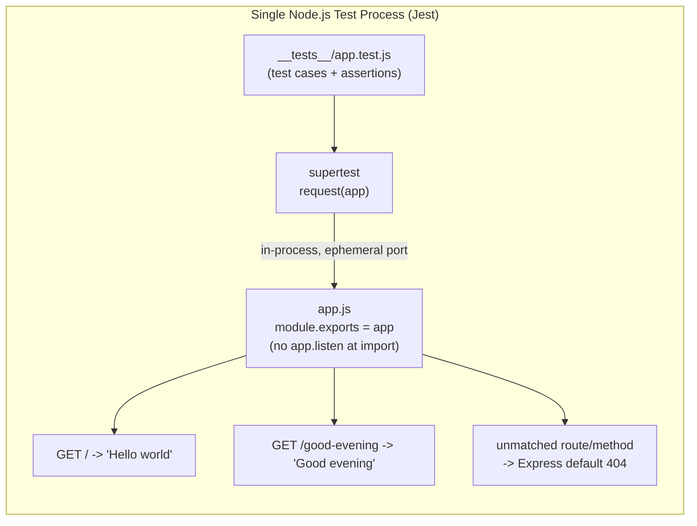

# Technical Specification

# 0. Agent Action Plan

## 0.1 Intent Clarification

This Agent Action Plan is authored under the **ADD TESTING** flavor: it is the definitive interpretation of the user's request *expressed as a testing mandate*. It defines the unit and integration tests required to validate the Express.js migration and the two endpoints that the feature implementation will introduce.

The verbatim user request is preserved below as the authoritative statement of intent:

> add feature to a existing product
>
> this is a tutorial of node js server hosting one endpoint that returns the response "Hello world". Could you add expressjs into the project and add another endpoint that return the reponse of "Good evening"?

A single discovery governs the entire plan. The repository (`Artifact6`, remote `github.com/Blitzy-Multi/Artifact6`) is currently a **greenfield placeholder**: its only tracked file is `README.md` (11 bytes, content `# Artifact6`) on a single commit (`7207605`, "Initial commit"), with no subdirectories. There is no `package.json`, no server source, no Express, and—critically for this section—no test runner, no test configuration, and no test files. The "existing" Node.js server described by the user is therefore the user's *mental model*; the server, the Express framework, and the test suite will all be created net-new. As a direct consequence, **every test artifact in this plan is a CREATE operation**, and the Hello-world test functions as a regression guard authored from scratch rather than a modification of an existing test.

### 0.1.1 Core Testing Objective

Based on the provided requirements, the Blitzy platform understands that the testing objective is to **establish, from an empty repository, an automated test suite that proves the Express.js server returns the correct HTTP response for each of its two endpoints**, validates Express routing and content negotiation, and guards the original behavior against regression introduced by the migration to Express.

- Request categorization: **[Add new tests]** as the primary category, combined with **[Improve/establish coverage]**. The request is explicitly **not** *[Update existing tests]* or *[Fix broken tests]*, because the repository contains zero pre-existing tests, test runners, or configuration to update or repair.

Each testing requirement is restated below with enhanced clarity:

- **R1 — Original endpoint regression.** A `GET` request to the original route must return HTTP `200` with the response body exactly equal to `Hello world`. Because the framework changes from a bare Node HTTP server to Express, this test is a *regression guard* that confirms the original tutorial behavior survives the migration.
- **R2 — New endpoint coverage.** A `GET` request to the newly added route must return HTTP `200` with the response body exactly equal to `Good evening`.
- **R3 — Express wiring and testability.** The application must be constructed with Express (`const app = express()`), and the application module must **export the `app` instance without invoking `app.listen()` at import time**, so the test suite can drive the app in-process (no real network port).

Implicit testing needs surfaced by the platform (not stated by the user but required for a correct, durable suite):

- HTTP status-code assertions (`200`) for both endpoints.
- **Exact** response-body equality (not substring/`contains`) for `Hello world` and `Good evening`, including the absence of trailing whitespace or newlines.
- Content-Type assertion: Express's `res.send(String)` defaults to `text/html; charset=utf-8`; the suite asserts this content type.
- Unknown-route handling: a request to an undefined path returns Express's default `404`.
- HTTP-method handling: a non-`GET` request (e.g., `POST`) to a `GET`-only route returns `404` (Express's default when no route/method matches).
- Test isolation and determinism: no fixed-port binding, every test independent and safe to run in parallel.

User examples preserved exactly (the suite will assert these byte-for-byte): `Hello world` and `Good evening`.

### 0.1.2 Special Instructions and Constraints

- **Tutorial simplicity.** The user frames the project as a tutorial; the test design favors the simplest beginner-friendly stack and conventional layout over advanced tooling.
- **No mandated framework.** The user did not name a test framework, mocking library, or assertion style; the platform therefore selects a standard, well-supported stack (see Section 0.2) and documents the rationale.
- **Minimal-change principle (testing scope).** This section's work touches only test files and test-related configuration. Application source files (`app.js`, `server.js`) are produced by the feature implementation; the single exception is the *testability coordination requirement* (R3) that the app module export the Express app.
- **Preserve user examples verbatim.** The response strings `Hello world` and `Good evening` are treated as fixed expected values and asserted exactly.
- **No user-specified rules.** The project rules list is empty (`[]`); there are no rule-mandated migration scripts, configuration files, or fixtures to fold into scope.
- **Web-search requirement.** Because no dependency manifest exists in-repo, current stable versions of the runtime and the testing stack must be verified via web search before pinning them (performed in Section 0.2 / 0.3).

### 0.1.3 Technical Interpretation

These testing requirements translate to the following technical test implementation strategy:

- To verify the original endpoint (R1), we will **CREATE** `__tests__/app.test.js` containing a Supertest case asserting that `GET /` returns `200` and a body equal to `Hello world`.
- To verify the new endpoint (R2), we will **CREATE** an additional Supertest case in the same file asserting that `GET /good-evening` returns `200` and a body equal to `Good evening`.
- To exercise routing/error behavior, we will **CREATE** edge-case cases asserting `404` for an unknown path and `404` for a wrong HTTP method.
- To make the suite runnable, we will **UPDATE** `package.json` (the manifest the feature implementation creates) by adding the `jest` and `supertest` devDependencies, `test`/`test:coverage` scripts, and a Jest configuration block.
- To keep the working tree clean, we will **CREATE** a `.gitignore` excluding `node_modules/` and `coverage/`.

### 0.1.4 Coverage Requirements Interpretation

- **Explicit coverage targets:** none provided by the user.
- **Implicit coverage expectations:** derived from (a) industry baseline for Node.js services (an 80% floor is the conventional minimum), (b) the absence of any existing coverage pattern to inherit (greenfield), and (c) critical-path analysis—the application's entire behavior is two route handlers plus the default 404 path, a surface small enough to cover almost completely.

To achieve comprehensive testing, coverage should include both route handlers (the `Hello world` and `Good evening` responses), the framework's unmatched-route branch (404), and response content negotiation (status + body + content type). Given the tiny surface, the suite is expected to reach approximately **100% of statements, functions, and lines** for the application module, with the enforced gate set as a *floor* of 80% that is intended to rise monotonically as the codebase grows.

## 0.2 Test Discovery and Analysis

Because the user's description is necessarily vague about the project's current state (it presupposes a server that is not yet committed), the platform conducted a full repository analysis to ground the test plan in verified facts rather than assumptions.

### 0.2.1 Existing Test Infrastructure Assessment

Repository analysis reveals **no testing setup of any kind and no existing coverage**. The repository is a freshly initialized placeholder, so there is no framework, runner, configuration, or test file to inventory.

| Test Infrastructure Element | Discovered State | Evidence |
|---|---|---|
| Testing framework | None declared | No `package.json`; Section 3.3.1 confirms "Testing framework: None declared" |
| Test runner configuration | Absent | `jest.config.*`, `pytest.ini`, `vitest.config.*` all absent (Section 3.3.2) |
| Coverage tooling | Absent | Zero dependencies across all package managers (Section 3.4) |
| Mock/stub libraries | Absent | No dependency manifest committed (Section 3.4) |
| Test data fixtures/factories | Absent | No `tests/`, `__tests__/`, `spec/`, or fixture directories exist |
| Existing test files (`*test*`, `*spec*`, `*_test.*`) | None found | Root contains only `README.md`; no subdirectories |

- Current testing framework: **None** (version: N/A).
- Test runner configuration location: **None present.**
- Coverage tools in use: **None present.**
- Mock/stub libraries detected: **None present.**
- Test data fixtures or factories present: **None present.**

The practical implication is that this plan does not extend or conform to an existing convention; instead it **establishes** the testing baseline. The platform anchors the new conventions to the Node.js layout endorsed in the Technical Specification's deferred testing guidance (Section 6.6.8.1: a `__tests__/` directory and `*.test.*` file naming for Node.js), and to the framework families that the same specification names for the relevant test layers (Jest/Vitest/Mocha for unit testing and **Supertest** for Node HTTP/integration testing, per Sections 6.6.2.1 and 6.6.3.2).

### 0.2.2 Web Search Research Conducted

Because no manifest pins any version, the platform performed web research to select a current, mutually compatible stack and to validate testing patterns. Research focus areas and findings:

- **Best practices for Express testing patterns.** The community-standard approach for testing an Express application is HTTP-level testing with Supertest, driving the exported `app` object in-process. Supertest accepts the Express app (or an `http.Server`); when the server is not already listening, Supertest binds an *ephemeral* port automatically, so tests need not manage ports. This directly satisfies requirement R3 and the test-isolation need.
- **Recommended mocking strategy.** None required. The two endpoints return static strings and call no database, file system, or external service (the Technical Specification confirms zero third-party integrations in Section 3.5.1), so there is nothing to mock or stub.
- **Test organization conventions for Node.js/JavaScript.** A `__tests__/` directory with `*.test.js` files is the idiomatic Jest layout and matches Jest's default test-matching globs; this aligns with the repository-endorsed convention noted above.
- **Common pitfalls to avoid.** Avoid calling `app.listen()` inside the module under test (it causes dangling open handles and port conflicts under a test runner); avoid asserting response bodies with loose substring matching; and avoid invoking Jest in interactive watch mode in CI (use `--ci`).

Version research (verified against the npm registry and official release channels, current as of the planning date) is consolidated in Section 0.3.2; the selected stack is **Jest** (test framework, assertions, mocking, and coverage in one package) paired with **Supertest** (HTTP assertions), running on the **Node.js 24 Active LTS** runtime, exercising an **Express 5** application.

## 0.3 Testing Scope Analysis

This section identifies precisely what will be tested and pins the versions of the stack that will run those tests.

### 0.3.1 Test Target Identification

The primary code under test is the Express application that the feature implementation will create. The platform plans against the conventional Node/Express tutorial layout described below; the test paths must ultimately match whatever names the implementation registers.

- **Primary module under test — the Express app.** Conventionally `app.js`, which builds `const app = express()`, registers the two routes, and exports the app (`module.exports = app`). This module requires both unit-style and HTTP-integration coverage.
- **Functions/handlers and their required test categories:**
  - Original route handler (`GET /` → `Hello world`): happy-path + content-type assertion (regression coverage).
  - New route handler (`GET /good-evening` → `Good evening`): happy-path + content-type assertion.
  - Framework default handling: unknown-route 404 (edge) and wrong-method 404 (edge).
- **Server bootstrap (conventionally `server.js`/`index.js`).** Calls `app.listen(PORT)`. This file is intentionally **not** unit-tested—binding a real listening socket is excluded from the unit/coverage surface—because all behavior is verified through the exported app.

> Note on route paths: the user did not specify URLs. The plan assumes `GET /` for `Hello world` (the canonical tutorial root) and `GET /good-evening` for `Good evening`. The new endpoint's path is the single open variable and must be reconciled with the route the implementation registers; the test assertions reference this path and will be aligned accordingly.

Existing test file mapping (the table is intentionally empty because the repository contains no source or test files):

| Source File | Existing Test File | Test Categories Present |
|---|---|---|
| (none committed) | (none committed) | (none — greenfield repository) |

Dependencies requiring mocking:

- External services to mock: **none** (no third-party integrations — Section 3.5.1).
- Database interactions to stub: **none** (no data layer — Section 6.2).
- File system operations to virtualize: **none** (endpoints return static strings).

### 0.3.2 Version Compatibility Research

The platform used web search to verify current stable versions and confirm mutual compatibility. Based on the current Node.js Active LTS line (**Node.js 24**), the recommended testing stack is:

| Component | Package | Version | Rationale / Compatibility Note |
|---|---|---|---|
| Runtime | Node.js | 24.x (Active LTS) | Current Active LTS; recommended for stability. Satisfies the Node 18+ floor required by Express 5, Jest 30, and Supertest 7. |
| Web framework (system under test) | `express` | ^5.2.1 | Latest stable; the Express Technical Committee's production-recommended release. Requires Node.js 18+. |
| Test framework + assertions + mocking + coverage | `jest` | ^30.4.2 | Latest stable; single dependency providing the runner, `expect` assertions, mocking, and Istanbul/V8 coverage. |
| HTTP integration assertions | `supertest` | ^7.2.2 | Latest stable; drives the in-process Express app and auto-binds an ephemeral port, eliminating port management. |

- **Assertion library:** provided by Jest's built-in `expect` (no separate library needed).
- **Mocking library:** provided by Jest's built-in mocking (and, in practice, unused here—nothing to mock).
- **Coverage tool:** provided by Jest's built-in coverage (`--coverage`).

Version conflicts to resolve: **none.** Express 5.2.1, Jest 30.4.2, and Supertest 7.2.2 all support Node.js 18+, so the Node.js 24 LTS runtime satisfies every constraint simultaneously.

An alternative, equally valid stack is **Mocha + Chai + Supertest** with `c8`/`nyc` for coverage, or the Node.js built-in `node:test` runner with Supertest. The platform selects **Jest + Supertest** as the primary stack because it is all-in-one, beginner-friendly for the tutorial context, and consistent with the framework families named in the Technical Specification (Sections 6.6.3.2 and 6.6.8.2).

## 0.4 Test Implementation Design

This section defines the test strategy, the per-component test blueprints, and the (minimal) test data design.

### 0.4.1 Test Strategy Selection

The strategy is deliberately layered but lean, matching the two-endpoint surface:

- **Integration tests (primary):** HTTP-level tests via Supertest that import the exported Express `app` and issue real requests against it in-process. These exercise routing, the handler, and the response together and are the highest-value tests for this application.
- **Unit tests:** the route handlers are trivial (`res.send(<string>)`); for a tutorial they are best validated through the Supertest HTTP layer rather than as isolated functions. Direct unit tests would add little value and are not warranted.
- **Edge-case tests:** an unknown route returns `404`; a wrong HTTP method on a `GET` route returns `404`.
- **Error-handling tests:** the framework's default `404` path is asserted. No custom error middleware is specified, so no additional error-handler coverage is required.

The in-process test architecture is shown below.



### 0.4.2 Test Case Blueprint

The following blueprints enumerate the cases the suite will implement. Each endpoint case asserts status, exact body, and content type.

```
Component: Original Endpoint  (GET / -> "Hello world")
Test Categories:
- Happy path: responds 200; body === "Hello world" (exact); Content-Type matches text/html; charset=utf-8
- Edge cases: canonical root path resolves correctly
- Error cases: n/a for this route
- Regression intent: confirms behavior survives the migration to Express

Component: New Endpoint  (GET /good-evening -> "Good evening")
Test Categories:
- Happy path: responds 200; body === "Good evening" (exact, no trailing whitespace/newline); Content-Type matches text/html
- Edge cases: exact-string equality (guards against accidental punctuation/casing drift)
- Error cases: n/a for this route

Component: Routing / Error Behavior  (Express app)
Test Categories:
- Edge cases: GET /does-not-exist -> 404 ; POST / -> 404 (no matching route+method)
- Error cases: Express default 404 handler returns a 404 status
- Optional: HEAD / -> 200 (Express auto-HEAD for GET routes)

Contract (testability): app module exports the Express instance WITHOUT calling listen();
the server bootstrap calls listen() separately. Verified implicitly: Supertest can import
and drive `app` with no open-handle leaks.
```

A representative (illustrative, 2–3 line) Supertest case for the new endpoint:

```javascript
const request = require('supertest');
const app = require('../app');
test('GET /good-evening returns "Good evening"', () =>
  request(app).get('/good-evening').expect(200).expect('Good evening'));
```

### 0.4.3 Existing Test Extension Strategy

**Not applicable.** There are no existing tests to extend, refactor, or repair—the repository is greenfield.

- Tests to extend: none.
- Tests to refactor: none.
- Tests to fix: none.

All test files in this plan are net-new `CREATE` operations. The only conceptual modification is to `package.json` (adding test devDependencies, scripts, and Jest configuration), and that manifest is itself created by the feature implementation.

### 0.4.4 Test Data and Fixtures Design

The test data footprint is intentionally empty:

- **Required test data structures:** none—both endpoints return static literal strings and accept no parameters or request bodies.
- **Fixture organization strategy:** no fixtures required; expected values (`Hello world`, `Good evening`) are inlined as assertion literals.
- **Mock object specifications:** none—there are no external dependencies (no database, no third-party services per Section 3.5.1, no file system access).
- **Test database/state management:** none—the endpoints are stateless; every test is independent, requires no setup/teardown beyond importing the app, and is safe to execute in parallel.

## 0.5 Test File Transformation Mapping

This section maps every file the testing effort creates or modifies. The target file is listed first in each row. Transformation modes: **CREATE** (new file), **UPDATE** (modify existing), **DELETE** (remove obsolete), **REFERENCE** (use as a pattern example).

### 0.5.1 File-by-File Test Plan

| Target Test File | Transformation | Source File/Test | Purpose/Changes |
|---|---|---|---|
| `__tests__/app.test.js` | CREATE | `app.js` (Express app, created by feature implementation) | Primary deliverable: Supertest cases for `GET /` → `Hello world`, `GET /good-evening` → `Good evening`, plus `404` unknown-route, `404` wrong-method, and content-type assertions |
| `package.json` | UPDATE | `package.json` (created by feature implementation) | Add `jest` + `supertest` devDependencies; add `test` and `test:coverage` scripts; add a `jest` configuration block (coverage settings) |
| `jest.config.js` | CREATE (optional) | (none) | Alternative home for Jest configuration if the `package.json` `jest` block is not used; choose exactly one of the two locations |
| `.gitignore` | CREATE | (none) | Exclude `node_modules/` and `coverage/` from version control (test-artifact hygiene) |
| `TESTING.md` | CREATE (optional) | (none) | Document framework choice, test layout, and run commands per the Technical Specification's first-test-commit guidance (Section 6.6.8.3) |

- There are **no DELETE** entries—the greenfield repository contains nothing to remove.
- There are **no REFERENCE** entries—no existing tests or fixtures exist to emulate.
- There are **no existing test files to UPDATE**—the only `UPDATE` is to the project manifest.
- Wildcard generalization: all new test files match `__tests__/**/*.test.js`. For this scope the canonical file is `__tests__/app.test.js`; an equivalent layout is `test/app.test.js` or a co-located `app.test.js`. The plan commits to `__tests__/app.test.js`.

### 0.5.2 New Test Files Detail

- `__tests__/app.test.js` — integration/HTTP coverage for the entire application surface.
  - Test categories: happy path (both endpoints), edge cases (unknown route, wrong method), error case (default 404).
  - Mock dependencies: none.
  - Assertions focus: HTTP status (`200`/`404`), **exact** response body equality (`Hello world`, `Good evening`), and `Content-Type` (`text/html; charset=utf-8`).

No separate integration or fixture files are required: a single test file fully covers the two-endpoint surface, and there is no test data to externalize.

### 0.5.3 Test Files to Modify Detail

**Not applicable.** No pre-existing test files exist, so there are no test files to modify. The only existing-file modification is the project manifest, covered in Section 0.5.4.

### 0.5.4 Test Configuration Updates

- `package.json` — add the test toolchain and how to run it:
  - `devDependencies`: `jest` (`^30.4.2`), `supertest` (`^7.2.2`).
  - `scripts`: `"test": "jest"` and `"test:coverage": "jest --coverage"`.
  - `jest` block: `testEnvironment: "node"`, `collectCoverageFrom: ["app.js"]`, and a `coverageThreshold` floor (see Section 0.7).
- `jest.config.js` (optional) — identical configuration in a standalone file as an alternative to the `package.json` block.
- `.gitignore` — ignore `node_modules/` and the generated `coverage/` directory.
- Coverage configuration — thresholds and the `collectCoverageFrom` inclusion list are defined alongside the Jest configuration; the coverage report destination is the default `coverage/` directory.

A representative Jest configuration block (illustrative):

```javascript
// package.json -> "jest"
{ "testEnvironment": "node",
  "collectCoverageFrom": ["app.js"],
  "coverageThreshold": { "global": { "statements": 80, "branches": 80, "functions": 80, "lines": 80 } } }
```

### 0.5.5 Cross-File Test Dependencies

- Shared fixtures: none.
- Mock objects: none.
- Test utilities/helpers: none required; the suite imports `supertest` and the application module directly.
- Import updates required across test files: none beyond the new test file's own imports—`require('supertest')` and `require('../app')`. There is no pre-existing code whose imports need transformation.
- Coordination dependency (cross-cutting): the application module produced by the feature implementation must export the Express `app` (and must not call `app.listen()` at import time) so that `__tests__/app.test.js` can drive it in-process. This is the single hard dependency the test suite places on the implementation.

## 0.6 Dependency Inventory

This section lists the dependency changes required by the testing effort. Because the repository currently declares **zero** dependencies, every entry below is an addition; there are no pre-existing packages to update or remove.

### 0.6.1 Testing Dependencies

The testing scope adds two development dependencies. Versions are the current stable releases verified against the npm registry as of the planning date (no placeholder versions).

| Registry | Package Name | Version | Purpose |
|---|---|---|---|
| npm | jest | ^30.4.2 | Test framework: runner, `expect` assertions, mocking, and built-in coverage |
| npm | supertest | ^7.2.2 | HTTP assertions driving the in-process Express app (auto ephemeral port) |

For context, the System Under Test introduces one runtime dependency, created by the feature implementation rather than by the testing scope:

| Registry | Package Name | Version | Purpose |
|---|---|---|---|
| npm | express | ^5.2.1 | Web framework that hosts the two endpoints (the subject of the tests) |

- No assertion library, mocking library, or coverage tool is added separately—Jest provides all three.
- No TypeScript type packages (`@types/*`) are required; the project is plain JavaScript.

### 0.6.2 Import Updates

**Not applicable.** The repository contains no existing source or test files, so there are no imports to transform. The only imports introduced are those inside the new test file:

- `const request = require('supertest');`
- `const app = require('../app');`

No import-rewrite rules (old → new path migrations) apply to this greenfield scope.

## 0.7 Coverage and Quality Targets

This section defines the coverage targets and the quality bar the suite must meet.

### 0.7.1 Coverage Metrics

- **Current coverage:** 0% — there are no tests (and currently no source) in the repository.
- **Target coverage:** an enforced **floor of 80%** for statements, branches, functions, and lines on the application module, consistent with the industry baseline and with the Technical Specification's "coverage floor, not ceiling" guidance (Section 6.6.8.3). Because the surface is only two route handlers plus the default 404 path, the suite is expected to achieve approximately **100% statements/functions/lines** in practice; the 80% gate is a conservative minimum intended to rise as the codebase grows.

Coverage gaps to address (relative to the to-be-created code):

| Component | Current | Target | Focus Areas |
|---|---|---|---|
| `app.js` (routes + framework wiring) | 0% | ~100% (≥80% gate) | Both handlers, the unmatched-route/404 branch, content negotiation |
| `server.js` (bootstrap `app.listen`) | 0% | excluded | Intentionally excluded from coverage; binding a real port is not unit-tested |

- Per-file coverage target: coverage is collected from `app.js` (`collectCoverageFrom: ["app.js"]`); the listener bootstrap is excluded so the metric reflects testable application logic rather than process startup.

### 0.7.2 Test Quality Criteria

- **Assertion density:** each endpoint case makes at least three assertions—status code, exact response body, and content type.
- **Test isolation:** tests share no mutable state, pass in any order, and are safe to run in parallel.
- **No real network binding:** requests are issued via `request(app)` so Supertest uses an ephemeral port; the suite never opens a fixed listening socket and leaves no dangling handles.
- **Performance:** the full suite performs no I/O and is expected to complete in well under one second.
- **Maintainability and conventions:** files follow `*.test.js` naming under `__tests__/` (Section 6.6.8.1); expected strings are inlined as readable literals; test descriptions name the route and expected response.
- **Determinism:** results depend only on the app's static responses—no time, randomness, network, or environment coupling.

## 0.8 Scope Boundaries

This section draws the precise boundary between what the testing effort will and will not touch.

### 0.8.1 Exhaustively In Scope

- New test files:
  - `__tests__/app.test.js` (the endpoint and routing/error tests)
  - `__tests__/**/*.test.js` (any additional test files added under this convention)
- Test configuration:
  - `package.json` (test devDependencies, `test`/`test:coverage` scripts, and the `jest` block)
  - `jest.config.js` (optional alternative location for Jest configuration)
  - `.gitignore` (ignore `node_modules/` and `coverage/`)
- Test documentation (optional):
  - `TESTING.md` (framework choice, layout, and run instructions)

### 0.8.2 Explicitly Out of Scope

- **Source-code creation/modification** of `app.js` and `server.js`—these are the responsibility of the feature implementation. The **sole exception** is the testability coordination requirement that the application module export the Express `app` without calling `app.listen()` at import time.
- **Feature work beyond the two endpoints**—no additional routes, middleware, or behavior is added under the testing scope.
- **Performance/load testing**—no performance KPIs are declared (Sections 1.2.3.3 and 5.5.5), so no k6/Gatling/JMeter scripts are in scope.
- **End-to-end/browser testing**—there is no UI; no Playwright/Cypress/Selenium suites are in scope.
- **Security scanning**—no SAST/DAST/SCA tooling is introduced under this task.
- **CI/CD pipeline creation**—no pipeline exists (Section 3.7.5) and none is requested; wiring the suite into CI is a separate, future activity.
- **Authentication, database, and external-service tests**—none of these exist in the system (Section 3.5.1), so there is nothing to cover.
- **Refactoring or optimization** unrelated to making the two endpoints testable.

## 0.9 Execution Parameters

This section records the exact commands and environment used to run and measure the suite.

### 0.9.1 Testing-Specific Instructions

- **Install dependencies (after `package.json` exists):**

```bash
npm install
```

- **Run the test suite:** `npm test` (resolves to `jest`). In CI/non-interactive contexts, disable watch mode and use the CI flag:

```bash
CI=true npm test -- --ci
```

- **Coverage measurement:**

```bash
npm run test:coverage    # resolves to: jest --coverage
```

- **Single-test execution patterns:**

```bash
npx jest __tests__/app.test.js        # one file
npx jest -t "Good evening"            # one test by name
```

- **Watch mode (local development only — never in CI):**

```bash
npx jest --watch
```

- **Repository test patterns to follow:** test files live under `__tests__/` and are named `*.test.js`; each test asserts status, exact body, and content type; requests are issued against the imported app via `request(app)`.
- **Excluded test categories (per scope):** performance/load, end-to-end/browser, and security-scanning tests are not executed under this task.
- **Environment setup requirements:** Node.js 24 (Active LTS); no environment variables and no fixed `PORT` are required because Supertest binds an ephemeral port when driving the in-process app.

## 0.10 Special Instructions for Testing

The user provided **no explicit testing directives** (and the project rules list is empty). The instructions below are therefore the testing principles the Blitzy platform adopts from the tutorial framing and the add-feature context; each is labeled by origin.

- **Minimal-change principle (platform-adopted).** Modify only test files and test-related configuration (`__tests__/`, `package.json` test portions, `jest.config.js`, `.gitignore`, optional `TESTING.md`).
- **Do not modify source code unless required for testability (platform-adopted).** The single necessary accommodation is that the application module must export the Express `app` and must not call `app.listen()` at import time; no other source change is requested by the testing scope.
- **Preserve the user's exact response strings (user-specified).** Assertions use `Hello world` and `Good evening` exactly as written, with no paraphrasing, casing, or punctuation drift.
- **Establish (rather than follow) test conventions (platform-adopted).** No in-repo test pattern exists; the suite adopts the idiomatic Node.js layout `__tests__/*.test.js` endorsed in Technical Specification Section 6.6.8.1.
- **Use the selected mocking-free approach (platform-adopted).** There are no external dependencies to mock; tests assert real HTTP behavior of the in-process app via Supertest.
- **Maintain test isolation and parallel-safety (platform-adopted).** Every test runs independently, in any order, with no shared state and no fixed port.
- **Match a clean, beginner-friendly style (platform-adopted).** Consistent with the tutorial intent, tests are concise and readable, with descriptive names that state the route and expected response.
- **Reconcile the new endpoint's path (platform flag).** The plan assumes `GET /good-evening`; if the feature implementation registers a different path, the corresponding test assertion is aligned to it without changing any other aspect of the suite.

