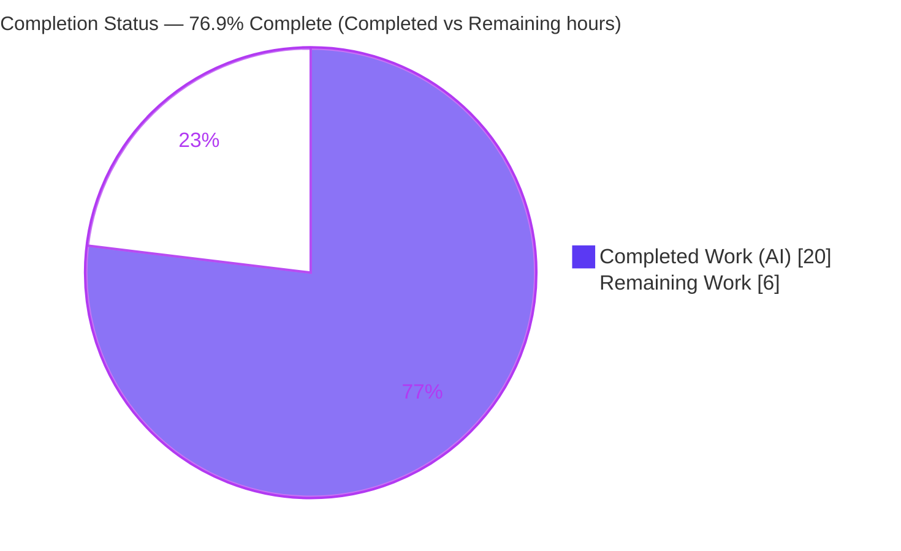
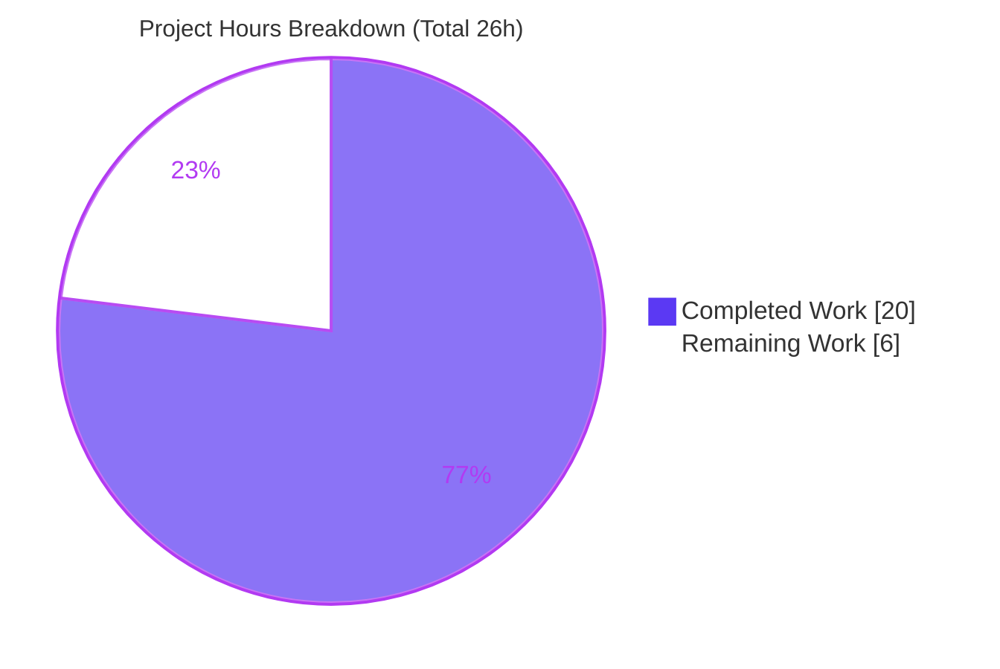
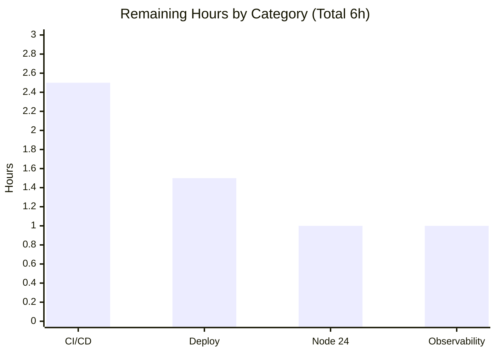
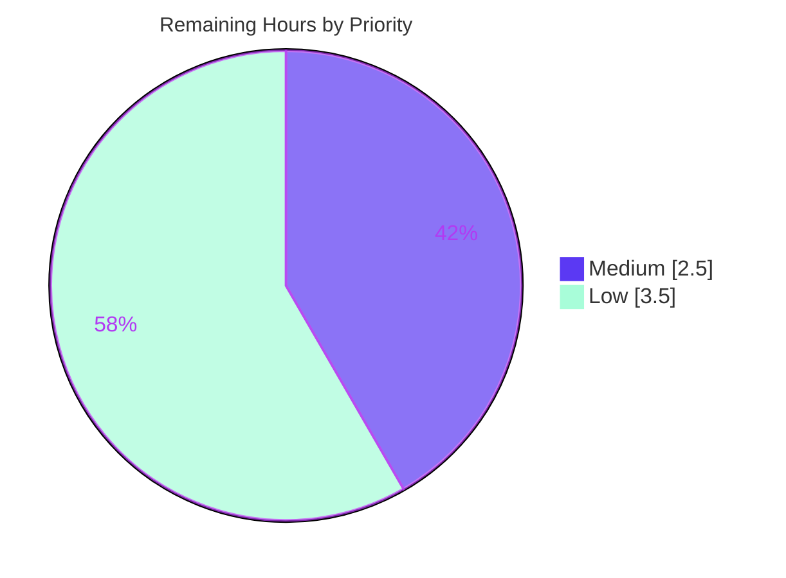

# Blitzy Project Guide — Artifact6

> **Project:** Artifact6 — Node.js + Express 5 tutorial server
> **Branch:** `blitzy-b4a86e38-6a4e-4c18-aeb0-b734e11e6c3b` · **HEAD:** `82bf351` · **Working tree:** clean
> **Runtime validated on:** Node v20.20.2 / npm 11.1.0
> **AAP flavor:** ADD TESTING

---

## 1. Executive Summary

### 1.1 Project Overview

Artifact6 is a minimal **Node.js + Express 5** tutorial HTTP server that exposes two static `GET` endpoints — `GET /` returning `Hello world` and `GET /good-evening` returning `Good evening`. The request migrated a bare Node tutorial server to Express and added a second endpoint; the governing Agent Action Plan is an **ADD TESTING** mandate whose primary deliverable is an automated **Jest + Supertest** suite that proves both endpoints, validates Express routing/content negotiation, and guards the original behavior against regression. The technical scope is intentionally tiny — two route handlers, a default 404, no database, and no external integrations — making it ideal as a beginner-friendly, fully-tested reference. Target users are developers learning Express and HTTP testing.

### 1.2 Completion Status

The project is **76.9% complete** (PA1 AAP-scoped methodology: completed hours ÷ total hours = 20 ÷ 26). **All Agent Action Plan testing-scope deliverables and the supporting feature implementation are 100% complete and verified**; the remaining 23.1% is path-to-production work the AAP explicitly deferred.



| Metric | Hours |
|---|---|
| **Total Hours** | **26** |
| Completed Hours — AI | 20 |
| Completed Hours — Manual | 0 |
| **Completed Hours (AI + Manual)** | **20** |
| **Remaining Hours** | **6** |
| **Percent Complete** | **76.9%** |

*Colors: Completed = Dark Blue `#5B39F3`; Remaining = White `#FFFFFF`.*

### 1.3 Key Accomplishments

- ✅ **Express 5 application** (`app.js`) built with `const app = express()`, exposing `GET /` → `Hello world` (R1) and `GET /good-evening` → `Good evening` (R2).
- ✅ **Testability contract R3 satisfied** — `app.js` exports the app and never calls `app.listen()` at import; `server.js` owns the listening socket. Verified `require('./app')` opens no socket (exit 0).
- ✅ **Jest + Supertest suite** with **9/9 tests passing** and **100% coverage** on `app.js` (exceeds the enforced 80% floor).
- ✅ **Exact-body assertions** for both endpoints plus **Content-Type** (`text/html; charset=utf-8`), **unknown-route 404**, and **wrong-method 404** coverage.
- ✅ **Security hardening (beyond AAP):** `X-Powered-By` disabled; generic `404 Not Found` with no path/method reflection; 2 regression tests guarding against encoded SQLi/XSS payload reflection.
- ✅ **Pinned, reproducible stack:** `express@5.2.1`, `jest@30.4.2`, `supertest@7.2.2`; `package-lock.json` committed; **0 vulnerabilities** (377 packages audited).
- ✅ **Documentation:** accurate `README.md` (usage) and `TESTING.md` (stack, layout, coverage policy); `.gitignore` excludes `node_modules/` and `coverage/`.
- ✅ **Runtime verified live** on default `:3000` and a custom `PORT`; byte-exact response bodies; clean SIGTERM shutdown and port release.

### 1.4 Critical Unresolved Issues

| Issue | Impact | Owner | ETA |
|---|---|---|---|
| *None* | No blockers: zero compilation errors, zero failing tests (9/9 pass), zero vulnerabilities, 100% coverage. All AAP-scoped deliverables complete. | — | — |

> There are **no critical unresolved issues**. All remaining items are non-blocking, Medium/Low-priority path-to-production tasks listed in Sections 2.2 and 1.6.

### 1.5 Access Issues

| System/Resource | Type of Access | Issue Description | Resolution Status | Owner |
|---|---|---|---|---|
| — | — | **No access issues identified.** The project has no external services, no credentials, no third-party APIs, and no database. The repository, dependencies (public npm registry), and runtime were all fully accessible during autonomous validation. | N/A | — |

### 1.6 Recommended Next Steps

1. **[Medium]** Add a **CI/CD pipeline** (e.g., GitHub Actions) running `npm ci`, `CI=true npm test -- --ci`, and the coverage gate on every push/PR, with a Node version matrix (20.x / 22.x / 24.x). *(2.5h)*
2. **[Low]** **Verify Node 24 Active LTS parity** — run the suite on the AAP-recommended Node 24 runtime (validation used Node 20.20.2) and update the "tested on" notes. *(1.0h)*
3. **[Low]** **Deployment readiness** — add a `Dockerfile` (or process-manager config) and an explicit graceful-shutdown handler (`server.close()` on `SIGTERM`/`SIGINT`) in `server.js`. *(1.5h)*
4. **[Low]** **Production observability** — add a `/health` liveness/readiness endpoint and replace the single `console.log` with a minimal structured logging hook. *(1.0h)*

---

## 2. Project Hours Breakdown

### 2.1 Completed Work Detail

| Component | Hours | Description |
|---|---|---|
| Express application module (`app.js`) | 3.5 | `express()` app; `GET /` and `GET /good-evening` handlers (R1/R2); `X-Powered-By` disabled; generic 404 hardening; exports app without `listen` (R3); full JSDoc. |
| Server bootstrap (`server.js`) | 1.0 | Thin listener: `require('./app')`, `PORT = process.env.PORT || 3000`, `app.listen(PORT)`; JSDoc. |
| Jest + Supertest test suite (`__tests__/app.test.js`) | 4.0 | **Primary AAP deliverable** — 9 cases: exact-body + status + Content-Type for both endpoints, unknown-route 404, wrong-method 404, HEAD 200, and 2 security no-reflection regressions. |
| `package.json` manifest + Jest config + version research | 2.0 | devDeps (`jest`, `supertest`), `test`/`test:coverage` scripts, `jest` block (`collectCoverageFrom`, `coverageThreshold`); web-search to pin current stable versions. |
| `.gitignore` | 0.5 | Excludes `node_modules/` and `coverage/`. |
| `TESTING.md` documentation | 1.5 | Stack, layout, testability contract, run commands, coverage policy (87 lines). |
| `README.md` documentation | 1.5 | Endpoint table, prerequisites, setup, run, `curl` examples, project structure (96 lines). |
| Dependency install + lockfile + audit | 1.0 | `npm install` (377 pkgs, 0 vulns); `package-lock.json` committed (lockfileVersion 3) for reproducible installs. |
| Test & coverage execution / verification | 1.0 | Ran suite (9/9) and coverage (100% on `app.js`); confirmed 80% gate passes. |
| Runtime validation | 1.5 | Live server on `:3000` and custom `PORT`; byte-exact bodies via `od`; `Content-Type` + `X-Powered-By` checks; SIGTERM shutdown + port release. |
| QA fix cycles | 2.5 | CP5 security 404 hardening; CP4 documentation corrections (README/TESTING); untracked-lockfile policy resolution. |
| **Total Completed** | **20.0** | **Matches Section 1.2 Completed Hours.** |

### 2.2 Remaining Work Detail

| Category | Hours | Priority |
|---|---|---|
| CI/CD pipeline setup (GitHub Actions: `npm ci` + tests + coverage gate; Node version matrix) | 2.5 | Medium |
| Node 24 Active LTS runtime parity verification (run suite on Node 24; update docs/engines) | 1.0 | Low |
| Deployment readiness (`Dockerfile`/process-manager + graceful `SIGTERM` handler in `server.js`) | 1.5 | Low |
| Production observability (`/health` endpoint + structured logging hook) | 1.0 | Low |
| **Total Remaining** | **6.0** | **Matches Section 1.2 Remaining Hours & Section 7 pie.** |

### 2.3 Hours Reconciliation

| Check | Value | Result |
|---|---|---|
| Section 2.1 total (Completed) | 20.0 | ✅ |
| Section 2.2 total (Remaining) | 6.0 | ✅ |
| 2.1 + 2.2 = Total Project Hours | 20 + 6 = **26** | ✅ matches Section 1.2 |
| Completion % = 20 ÷ 26 | **76.9%** | ✅ matches Sections 1.2, 7, 8 |

---

## 3. Test Results

All tests below originate from **Blitzy's autonomous validation logs** for this project (suite `__tests__/app.test.js`), independently re-executed during this assessment with identical results.

| Test Category | Framework | Total Tests | Passed | Failed | Coverage % | Notes |
|---|---|---|---|---|---|---|
| Endpoint / HTTP integration (happy path + content negotiation) | Jest + Supertest | 4 | 4 | 0 | — | `GET /` and `GET /good-evening`: status `200`, exact body, `Content-Type: text/html; charset=utf-8`. |
| Routing / error behavior | Jest + Supertest | 3 | 3 | 0 | — | `GET /does-not-exist` → 404 (no path reflection); `POST /` → 404 (no `Cannot…`); `HEAD /` → 200. |
| Security regression (CP5 hardening) | Jest + Supertest | 2 | 2 | 0 | — | Encoded SQLi-like and XSS-like paths → 404 with generic body; payload never reflected. |
| **Total** | **Jest 30.4.2 + Supertest 7.2.2** | **9** | **9** | **0** | **100% (`app.js`)** | 1 suite, 0 skipped/blocked; ~0.3s. |

**Coverage detail (`app.js`):** 100% statements · 100% branches · 100% functions · 100% lines — exceeds the enforced 80% floor (`coverageThreshold.global`). `server.js` is intentionally excluded (`collectCoverageFrom: ["app.js"]`) because binding a real port is not unit-tested.

**Commands (verified):**
```bash
CI=true npm test -- --ci                  # → Tests: 9 passed, 9 total
CI=true npm run test:coverage -- --ci     # → app.js 100% across all metrics
```

---

## 4. Runtime Validation & UI Verification

The application is a **headless HTTP API** — there is **no browser UI** to verify. Runtime and API integration were validated live.

**Runtime health**
- ✅ **Operational** — `node server.js` boots and logs `Server listening on port 3000` (default).
- ✅ **Operational** — custom port honored (`PORT=4099 node server.js` → listens on `:4099`); validation logs also confirm `PORT=4011`.
- ✅ **Operational** — clean **SIGTERM** shutdown; port released (post-kill connection refused).

**API endpoint verification (live `curl`)**
- ✅ **Operational** — `GET /` → `200`, body exactly `Hello world` (11 bytes, no trailing newline).
- ✅ **Operational** — `GET /good-evening` → `200`, body exactly `Good evening` (12 bytes, no trailing newline).
- ✅ **Operational** — `Content-Type: text/html; charset=utf-8` on both endpoints.
- ✅ **Operational** — `X-Powered-By` header **absent** (security hardening active).
- ✅ **Operational** — `GET /does-not-exist` and `POST /` → `404` with generic `Not Found` body (no path/method reflection).

**UI verification**
- ⚠ **N/A** — no web UI exists for this API-only tutorial; no Playwright/Cypress/Selenium scope per AAP §0.8.2.

---

## 5. Compliance & Quality Review

Cross-mapping AAP deliverables and quality benchmarks to outcomes. Fixes applied during autonomous validation are noted.

| Benchmark / AAP Deliverable | Status | Progress | Notes |
|---|---|---|---|
| R1 — `GET /` → 200 `Hello world` (regression) | ✅ Pass | 100% | Verified by passing test + live `curl`. |
| R2 — `GET /good-evening` → 200 `Good evening` | ✅ Pass | 100% | Verified by passing test + live `curl`. |
| R3 — App exports without `app.listen()` at import | ✅ Pass | 100% | `require('./app')` returns the app, opens no socket (exit 0). |
| Primary deliverable `__tests__/app.test.js` | ✅ Pass | 100% | 9 tests, all passing. |
| Exact response-body equality | ✅ Pass | 100% | `toBe('Hello world')` / `toBe('Good evening')`; byte-exact confirmed. |
| Content-Type assertions | ✅ Pass | 100% | `text/html; charset=utf-8` asserted for both endpoints. |
| Unknown-route 404 / wrong-method 404 | ✅ Pass | 100% | Both edge cases covered. |
| Coverage floor ≥ 80% (stmts/branches/funcs/lines) | ✅ Pass | 100% | Enforced via `coverageThreshold`; actual 100%. |
| Dependency pins (Express 5 / Jest 30 / Supertest 7) | ✅ Pass | 100% | `express@5.2.1`, `jest@30.4.2`, `supertest@7.2.2` installed exactly. |
| `.gitignore` hygiene (`node_modules/`, `coverage/`) | ✅ Pass | 100% | Present. |
| Test isolation / no fixed port / determinism | ✅ Pass | 100% | `request(app)` ephemeral port; no shared state; ~0.3s. |
| Optional `jest.config.js` (one-of-two locations) | ✅ Pass | 100% | Satisfied via the `package.json` `jest` block (AAP permits either). |
| Optional `TESTING.md` | ✅ Pass | 100% | Authored and accurate. |
| Dependency vulnerability posture | ✅ Pass | 100% | `npm install` → 0 vulnerabilities (377 pkgs). |
| Security hardening (404 no-reflection, `X-Powered-By`) | ✅ Pass | 100% | **Fix applied during validation (CP5);** 2 regression tests added. |
| Documentation accuracy (README/TESTING) | ✅ Pass | 100% | **Fixes applied during validation (CP4 F-1/F-2).** |
| Reproducible install (`package-lock.json`) | ✅ Pass | 100% | **Lockfile committed during validation (82bf351).** |
| CI/CD pipeline | ❌ Not Started | 0% | Out of AAP testing scope (§0.8.2); tracked as remaining work. |
| Node 24 LTS runtime parity | ⚠ Partial | ~50% | Validated on Node 20.20.2; Node 24 verification pending. |

**Code quality:** plain CommonJS, no build step; `node --check` clean on all JS; comprehensive JSDoc; uses only stable Express core APIs (`app.get`, `res.send`, `app.use`).

---

## 6. Risk Assessment

Overall risk posture: **LOW** — no High or Critical risks. Every gap is a path-to-production maturity item, not a defect.

| Risk | Category | Severity | Probability | Mitigation | Status |
|---|---|---|---|---|---|
| Node 24 LTS parity unverified (validated on Node 20) | Technical | Low | Low | Run suite on Node 24 via CI matrix; deps are Node 18+ compatible | Open (remaining) |
| No automated regression gate (no CI) | Technical | Low | Medium (over time) | Add CI pipeline running tests + coverage gate | Open (remaining) |
| Express 5 is a recent major release | Technical | Low | Low | App uses only stable core API; pinned via lockfile | Mitigated |
| 404 information disclosure (path/method reflection) | Security | Low | Low | Generic `Not Found`; `X-Powered-By` disabled; 2 regression tests | ✅ Resolved |
| No SAST/DAST/SCA in pipeline | Security | Low | Low | Add `npm audit`/Dependabot to CI (0 current vulns; static endpoints) | Open (out of AAP scope) |
| No HTTPS / rate-limit / `helmet` | Security | Low | Low | Front with reverse proxy + `helmet` if publicly exposed | Accepted (tutorial scope) |
| No `/health` endpoint | Operational | Low | Medium | Add `/health` for liveness/readiness probes | Open (remaining) |
| `console.log`-only logging | Operational | Low | Low | Add structured logging hook | Open (remaining) |
| No explicit graceful shutdown (`server.close()` drain) | Operational | Low | Low | Add `SIGTERM`/`SIGINT` handler (OS-level SIGTERM already clean) | Open (remaining) |
| No process supervision / restart policy | Operational | Low | Low | Use PM2/systemd/container restart policy | Open (remaining) |
| No external integrations to fail | Integration | None | None | N/A — no DB/3rd-party/auth (AAP §3.5.1) | N/A |
| Suite not yet run in an actual CI runner | Integration | Low | Low | Validate `CI=true` flow in CI (already tested locally) | Open (remaining) |

---

## 7. Visual Project Status

**Project hours — Completed vs Remaining** (Completed = Dark Blue `#5B39F3`, Remaining = White `#FFFFFF`):



**Remaining hours by category** (sums to 6h — matches Section 2.2):



**Remaining work by priority:**



> **Integrity:** "Remaining Work" = **6h** in the pie equals Section 1.2 Remaining Hours and the Section 2.2 "Hours" total. "Completed Work" = **20h** equals Section 1.2 Completed Hours and the Section 2.1 total.

---

## 8. Summary & Recommendations

**Achievements.** Starting from a greenfield repository (only `README.md`), Blitzy delivered a complete, production-quality Express 5 tutorial server and its automated test suite. Both endpoints behave exactly as specified (`Hello world`, `Good evening`), the testability contract (R3) is satisfied, and the **Jest + Supertest** suite passes **9/9 with 100% coverage** on `app.js` and **0 dependency vulnerabilities**. Security hardening (generic 404, `X-Powered-By` disabled) and accurate documentation exceed the AAP baseline.

**Remaining gaps.** The project is **76.9% complete** (20h of 26h). The outstanding **6h** is entirely **path-to-production** work the AAP explicitly deferred (§0.8.2): CI/CD automation (2.5h), Node 24 LTS parity verification (1.0h), deployment packaging plus graceful shutdown (1.5h), and basic production observability (1.0h). **None of these block the tutorial's stated purpose**, and there are **no failing tests or compilation errors**.

**Critical path to production.** (1) Wire the existing, passing suite into CI with the coverage gate; (2) confirm parity on Node 24; (3) add deployment packaging and a graceful-shutdown handler; (4) add a `/health` endpoint and structured logging.

**Success metrics.**

| Metric | Result |
|---|---|
| AAP-scoped completion | 76.9% (20h / 26h) |
| Tests passing | 9 / 9 (100%) |
| Coverage on `app.js` | 100% (floor 80%) |
| Dependency vulnerabilities | 0 |
| Blocking issues | 0 |

**Production readiness assessment.** **Ready for tutorial/educational use and local execution today.** For a deployed production service, complete the four non-blocking remaining items above. Confidence is **High** for all AAP-scoped items (clear scope, fully verified) and **Medium** for the path-to-production estimates.

---

## 9. Development Guide

### 9.1 System Prerequisites

- **Node.js** ≥ 18 (declared in `package.json` `engines`). Validated on **Node v20.20.2**; AAP recommends **Node 24 Active LTS**.
- **npm** (bundled with Node.js; validated on **11.1.0**).
- **OS:** any Linux/macOS/Windows environment that runs Node.js. No database, services, or environment variables are required.

### 9.2 Environment Setup

No environment variables are required. The only optional variable is `PORT` (server listen port; defaults to `3000`). Tests need no `PORT` — Supertest binds an ephemeral port automatically.

```bash
# Clone and enter the repository
git clone https://github.com/Blitzy-Multi/Artifact6.git
cd Artifact6
```

### 9.3 Dependency Installation

```bash
npm install
```
Expected output includes:
```
added 377 packages, and audited 377 packages in <time>
found 0 vulnerabilities
```
> `package-lock.json` is committed; `node_modules/` and `coverage/` are git-ignored.

### 9.4 Running the Tests

```bash
# Full suite (CI / non-interactive)
CI=true npm test -- --ci
# Expected: "Tests: 9 passed, 9 total"

# Coverage (enforces the 80% floor; actual 100% on app.js)
CI=true npm run test:coverage -- --ci

# Run a single file
npx jest __tests__/app.test.js

# Run a single test by name
npx jest -t "Good evening"
```

### 9.5 Application Startup

```bash
# Start on the default port 3000
npm start
# Logs: "Server listening on port 3000"

# Start on a custom port
PORT=4099 npm start
```

### 9.6 Verification (Example Usage)

With the server running:
```bash
curl http://localhost:3000/
# -> Hello world

curl http://localhost:3000/good-evening
# -> Good evening

# Headers: 200, text/html; charset=utf-8, and NO X-Powered-By
curl -sI http://localhost:3000/

# Unknown route -> generic 404 (path not reflected)
curl http://localhost:3000/does-not-exist
# -> Not Found
```

### 9.7 Troubleshooting

- **`EADDRINUSE` (port already in use):** another process holds the port. Start with a different `PORT` (e.g., `PORT=4099 npm start`) or stop the other process.
- **Tests appear to "hang" / watch mode in CI:** always pass `CI=true` and `--ci` (e.g., `CI=true npm test -- --ci`); never use `npx jest --watch` in CI.
- **Coverage gate failure:** `app.js` must remain ≥ 80% on all metrics (currently 100%). Add tests for any new branches.
- **Backgrounded server won't stop via `$!` (non-interactive shells):** when `node server.js` is started with `&`, the real `node` process may be reparented (the captured `$!` is the wrapping subshell, not `node`). Find the real PID and send `SIGTERM` to it:
  ```bash
  # Preferred: run in the foreground, or with nohup and record the PID.
  # To locate a backgrounded listener when lsof/ss are unavailable:
  ps -eo pid,cmd | grep '[s]erver.js'      # find the node PID
  kill <PID>                                # SIGTERM releases the port cleanly
  ```
  > Note: `lsof`, `ss`, and `fuser` are **not** installed in the validation container; use `/proc/<pid>/cmdline` or the `ps` filter above. This is a shell/process-management artifact, **not** an application defect — the server stops cleanly when its actual process receives `SIGTERM`.

---

## 10. Appendices

### A. Command Reference

| Purpose | Command |
|---|---|
| Install dependencies | `npm install` |
| Run tests (CI) | `CI=true npm test -- --ci` |
| Run coverage (CI) | `CI=true npm run test:coverage -- --ci` |
| Run one test file | `npx jest __tests__/app.test.js` |
| Run one test by name | `npx jest -t "Good evening"` |
| Start server (default :3000) | `npm start` |
| Start server (custom port) | `PORT=4099 npm start` |
| Syntax check | `node --check app.js` |
| Smoke test endpoint | `curl http://localhost:3000/` |

### B. Port Reference

| Port | Usage | Notes |
|---|---|---|
| `3000` | Default server listen port | Set by `server.js` when `PORT` is unset. |
| `PORT` (env) | Override listen port | e.g., `PORT=4099` (also validated on `4011`). |
| ephemeral | Test transport | Supertest binds an automatic free port; no fixed port for tests. |

### C. Key File Locations

| File | Role |
|---|---|
| `app.js` | Express app — builds `app`, registers the 2 routes + 404, exports `app` (no `listen`). |
| `server.js` | Bootstrap — `require('./app')` + `app.listen(PORT)`. |
| `__tests__/app.test.js` | Jest + Supertest suite (9 tests). |
| `package.json` | Scripts, dependencies, and `jest` configuration block. |
| `package-lock.json` | Pinned dependency tree (lockfileVersion 3). |
| `.gitignore` | Ignores `node_modules/` and `coverage/`. |
| `README.md` | Usage and endpoint documentation. |
| `TESTING.md` | Testing stack, layout, coverage policy. |

### D. Technology Versions

| Component | Version | Notes |
|---|---|---|
| Node.js | v20.20.2 (validated); ≥ 18 required; 24 LTS recommended | `engines.node: ">=18"`. |
| npm | 11.1.0 | Bundled with Node. |
| express | 5.2.1 | Single runtime dependency. |
| jest | 30.4.2 | Runner + assertions + mocking + coverage. |
| supertest | 7.2.2 | In-process HTTP assertions (ephemeral port). |

### E. Environment Variable Reference

| Variable | Required | Default | Purpose |
|---|---|---|---|
| `PORT` | No | `3000` | Server listen port (`server.js`). |
| `CI` | No (recommended in CI) | unset | Set `CI=true` to disable Jest watch/interactive behavior. |

> No application secrets, database URLs, or third-party credentials exist.

### F. Developer Tools Guide

- **Jest** — test runner, `expect` assertions, mocking, and Istanbul/V8 coverage. Config lives in the `package.json` `jest` block (`testEnvironment: "node"`, `collectCoverageFrom: ["app.js"]`, `coverageThreshold.global` = 80%).
- **Supertest** — issues in-process HTTP requests against the exported Express `app` via `request(app)`; auto-binds an ephemeral port, so no server must be started for tests.
- **`node --check`** — fast syntax validation (no build step; plain CommonJS).

### G. Glossary

| Term | Definition |
|---|---|
| **R1 / R2 / R3** | AAP requirements: R1 = `GET /` → `Hello world` regression guard; R2 = `GET /good-evening` → `Good evening`; R3 = app exports without `app.listen()` at import. |
| **AAP** | Agent Action Plan — the governing specification (ADD TESTING flavor). |
| **Ephemeral port** | An OS-assigned free port; used by Supertest so tests need no fixed `PORT`. |
| **Coverage floor** | The minimum enforced coverage (80%), intended to rise as the codebase grows. |
| **CP4 / CP5** | Autonomous QA checkpoints whose fixes (documentation corrections; 404 security hardening) were applied during validation. |
| **Testability contract** | The R3 requirement that the app be importable and driveable in-process without opening a real socket. |

---

*Cross-section integrity validated: Remaining hours = 6 across Sections 1.2, 2.2, and 7; Section 2.1 (20) + Section 2.2 (6) = 26 Total; all tests originate from Blitzy's autonomous validation logs; brand colors applied (Completed = `#5B39F3`, Remaining = `#FFFFFF`).*