# Technical Specification

# 1. Introduction

## 1.1 EXECUTIVE SUMMARY

### 1.1.1 Project Overview

This Technical Specification documents the project identified as **Artifact6**, hosted at `github.com/Blitzy-Multi/Artifact6`. At the time of this specification's authoring, the repository exists in a freshly initialized state. The repository's working tree contains exactly one tracked file — `README.md` — whose entire content is the single Markdown heading `# Artifact6` (totaling 11 bytes). No source code, configuration manifests, dependency declarations, schema definitions, infrastructure-as-code artifacts, tests, or descriptive documentation are present in the repository.

Because the repository is empty of substantive engineering artifacts, this Introduction can only authoritatively document the project's **identity** and **current state**. The customary Introduction sub-topics — business problem, stakeholder model, value proposition, system capabilities, integration landscape, and scope boundaries — have no supporting evidence in the codebase and are therefore explicitly marked as **undetermined** throughout this section. This section is intended to be revised once the repository is populated with implementation artifacts, requirements documentation, or design materials that establish the project's substantive direction.

### 1.1.2 Core Business Problem

| Aspect | Status | Evidence Source |
|---|---|---|
| Business problem statement | Not defined in repository | No README body, no requirements docs, no design notes |
| Target domain | Not defined in repository | No code, configuration, or schema indicates a domain |
| Problem scope | Not defined in repository | No issue tracker artifacts or epics committed to the repo |

The repository does not contain any narrative, requirements document, design note, or code that would identify the business problem being solved. Any statement on this topic would constitute speculation rather than documentation and has therefore been omitted in accordance with the factual-accuracy requirements governing this specification.

### 1.1.3 Key Stakeholders and Users

| Stakeholder Category | Identified Parties | Evidence Source |
|---|---|---|
| Repository owner / organization | `Blitzy-Multi` | Git remote URL `github.com/Blitzy-Multi/Artifact6` |
| Initial committer | `Blitzy-Multi <mmwforfinance@gmail.com>` | Sole commit `7207605` ("Initial commit", 2026-06-01) |
| Business stakeholders | Not defined in repository | No stakeholder register, CODEOWNERS, or governance file exists |
| End users / personas | Not defined in repository | No user-research artifacts, personas, or UX documentation exists |

The repository's Git metadata establishes only the hosting organization and the single committer responsible for initializing the project. No stakeholder register, user persona documentation, or governance file (e.g., `CODEOWNERS`, `MAINTAINERS`, `GOVERNANCE.md`) has been committed, and no broader stakeholder or user-group description is derivable from repository evidence.

### 1.1.4 Expected Business Impact and Value Proposition

The expected business impact and value proposition are not documented in the repository. No vision statement, OKRs, ROI projections, market analysis, or product brief has been committed. This Technical Specification therefore makes no claim about anticipated outcomes for Artifact6, and any such claim should be added in a subsequent revision once authoritative product materials are introduced into the repository or provided as user context.

## 1.2 SYSTEM OVERVIEW

### 1.2.1 Project Context

#### 1.2.1.1 Business Context and Market Positioning

No business-context or market-positioning artifacts are present in the repository. There is no `docs/` directory, no `product/` directory, no `ARCHITECTURE.md`, no `VISION.md`, and no README body to establish the project's market intent. Consequently, the business context and market positioning of Artifact6 cannot be characterized from repository evidence and are deferred to a future revision of this specification.

#### 1.2.1.2 Current System Limitations and Legacy Considerations

No references to a legacy system, predecessor product, or upgrade path are present in the repository. The repository's sole commit (`7207605 Initial commit`, 2026-06-01) introduces only `README.md`; no migration plan, legacy schema, deprecation notice, or compatibility matrix is committed. Whether Artifact6 is a greenfield project, a replacement for an existing system, or an upgrade of a prior version is therefore not determinable from repository evidence.

#### 1.2.1.3 Enterprise Landscape Integration

| Integration Concern | Documented? | Notes |
|---|---|---|
| Upstream system integrations | No | No client SDKs, API contracts, or interface definitions present |
| Downstream system integrations | No | No webhook handlers, message-queue configs, or event schemas present |
| Authentication / identity providers | No | No auth configuration, OIDC settings, or identity-provider references |
| Data-platform integration | No | No database connectors, ETL configs, or data-catalog references |

No integration artifacts have been committed to the repository. The Artifact6 project's relationship to any broader enterprise landscape is undefined in the codebase.

### 1.2.2 High-Level Description

#### 1.2.2.1 Primary System Capabilities

The repository contains no executable code, no API definitions, no UI assets, no data-processing logic, and no service definitions. There are therefore no implemented or declared system capabilities that can be documented at this time. The list of primary system capabilities is **empty** as of the current repository state.

#### 1.2.2.2 Major System Components

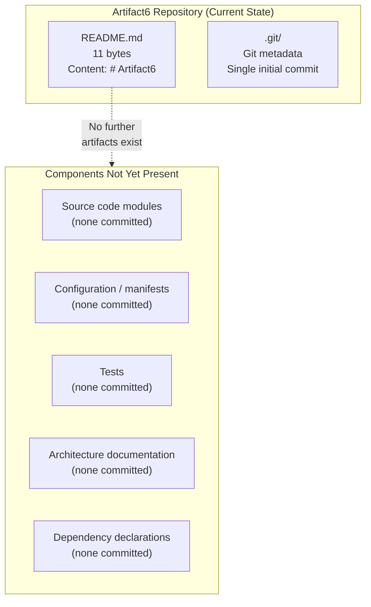
```mermaid
graph TB
    subgraph Repository["Artifact6 Repository (Current State)"]
        README["README.md<br/>11 bytes<br/>Content: # Artifact6"]
        GitMeta[".git/<br/>Git metadata<br/>Single initial commit"]
    end

    subgraph Undefined["Components Not Yet Present"]
        SRC["Source code modules<br/>(none committed)"]
        CFG["Configuration / manifests<br/>(none committed)"]
        TST["Tests<br/>(none committed)"]
        DOC["Architecture documentation<br/>(none committed)"]
        DEP["Dependency declarations<br/>(none committed)"]
    end

    README -.->|"No further<br/>artifacts exist"| Undefined
```

The diagram above reflects the verified repository inventory: a single tracked file (`README.md`) alongside Git metadata, with no source modules, configuration, tests, dependency manifests, or architecture documentation committed. No "major system components" exist to enumerate in this revision of the specification.

#### 1.2.2.3 Core Technical Approach

No technology stack, programming language, runtime, framework, architectural pattern, or design paradigm is indicated by any artifact in the repository. The absence of a dependency manifest (no `package.json`, `pyproject.toml`, `go.mod`, `Cargo.toml`, `pom.xml`, `Gemfile`, or equivalent) means the technical approach is not even minimally constrained by committed evidence. The core technical approach for Artifact6 is therefore undetermined and must be established in subsequent work.

### 1.2.3 Success Criteria

#### 1.2.3.1 Measurable Objectives

No objectives — quantitative or qualitative — are documented in the repository. There is no `OBJECTIVES.md`, no `ROADMAP.md`, no milestone definition, and no README body describing what success looks like for Artifact6.

#### 1.2.3.2 Critical Success Factors

No critical success factors have been declared. The repository contains no risk register, no assumption log, no dependency map, and no stakeholder-acceptance criteria.

#### 1.2.3.3 Key Performance Indicators (KPIs)

| KPI Category | Defined? | Status |
|---|---|---|
| Functional KPIs | No | Not declared in repository |
| Performance KPIs (latency, throughput) | No | Not declared in repository |
| Reliability KPIs (uptime, error budget) | No | Not declared in repository |
| Adoption / usage KPIs | No | Not declared in repository |
| Business / financial KPIs | No | Not declared in repository |

No KPIs are defined anywhere in the repository. This subsection should be completed once the project's measurable outcomes are established in committed product or engineering documentation.

## 1.3 SCOPE

### 1.3.1 In-Scope Elements

#### 1.3.1.1 Core Features and Functionalities

No features, user workflows, integrations, or technical requirements have been declared as in scope. The repository contains no requirements document, feature backlog, or design specification from which an in-scope inventory could be derived.

| In-Scope Category | Items Declared | Source |
|---|---|---|
| Must-have capabilities | None | No requirements artifacts committed |
| Primary user workflows | None | No user-flow or process documentation committed |
| Essential integrations | None | No interface definitions or contracts committed |
| Key technical requirements | None | No NFR document, ADRs, or technical-design materials committed |

#### 1.3.1.2 Implementation Boundaries

| Boundary Dimension | Declared Boundary | Evidence Source |
|---|---|---|
| System boundary | Not declared | No context diagram, ADR, or design doc committed |
| User groups covered | Not declared | No persona or audience definition committed |
| Geographic / market coverage | Not declared | No localization, region, or market documentation committed |
| Data domains included | Not declared | No data dictionary, schema, or ER model committed |

Because no scope-defining artifacts exist in the repository, the implementation boundaries of Artifact6 are entirely undefined at this stage and cannot be authoritatively documented.

### 1.3.2 Out-of-Scope Elements

No explicit exclusions, future-phase deferrals, or unsupported use cases have been documented in the repository. Without an in-scope declaration, the corresponding out-of-scope boundary is correspondingly undefined.

| Out-of-Scope Category | Items Declared | Source |
|---|---|---|
| Excluded features / capabilities | None | No scope document committed |
| Future-phase considerations | None | No roadmap or phased plan committed |
| Integration points not covered | None | No integration matrix committed |
| Unsupported use cases | None | No use-case catalogue committed |

### 1.3.3 Repository State Disclosure

This subsection summarizes the verified facts that ground every claim in this Introduction. All statements above are derived exclusively from the inventory below; nothing has been inferred about purpose, scope, stakeholders, or capabilities beyond what these facts directly support.

#### 1.3.3.1 Verified Repository Facts

| Repository Fact | Value |
|---|---|
| Artifact name | `Artifact6` |
| Remote origin | `github.com/Blitzy-Multi/Artifact6` |
| Default branch | `main` |
| Tracked files | `README.md` (only) |
| README size | 11 bytes |
| README content | `# Artifact6` (single Markdown heading) |
| Total commits | 1 |
| Sole commit | `7207605db62e3243f097c7a231bd60a8333a2f52` — "Initial commit" |
| Initial commit date | 2026-06-01 |
| Initial committer | `Blitzy-Multi <mmwforfinance@gmail.com>` |
| Subdirectories | None (only `.git/` metadata exists) |

#### 1.3.3.2 Introduction Sub-Section Evidence Map

The table below records, for each Introduction sub-topic mandated by the section prompt, the evidence available in the repository to support documentation of that sub-topic. Every "None" entry indicates that authoritative content cannot be produced without additional inputs (product documentation, user context, or future code commits).

| Introduction Sub-Section | Evidence Available in Repository |
|---|---|
| Executive Summary | None — repository contains only a placeholder README heading |
| Project Context | None — no prior-system, market, or integration artifacts present |
| High-Level Description | None — no components, capabilities, or technical approach implemented |
| Success Criteria / KPIs | None — no objectives, success factors, or metrics defined |
| In-Scope Items | None — no features, workflows, or boundaries declared |
| Out-of-Scope Items | None — no exclusions or deferrals documented |

#### 1.3.3.3 Documentation Constraints and Forward Plan

This Technical Specification is being authored against an empty repository. The accuracy guarantees of the document depend on the principle that every claim must be supported by repository evidence; consequently, sections that would normally rely on requirements documents, design artifacts, or code structure (including the substantive content of this Introduction) are intentionally minimal. When any of the following events occur, this Introduction should be revised to incorporate the newly available evidence:

1. Source code, configuration, or dependency manifests are committed to the repository.
2. Product, requirements, or design documents (e.g., `docs/`, `ADRs/`, `RFCs/`) are added.
3. Authoritative user context (vision statement, stakeholder register, KPIs, scope boundaries) is supplied as input to the documentation process.
4. Governance or ownership artifacts (`CODEOWNERS`, `MAINTAINERS`, `GOVERNANCE.md`) are committed.

Until one or more of these conditions is met, the project's purpose, scope, stakeholder model, success criteria, and architectural direction remain undetermined from the perspective of this specification.

#### References

**Files Examined**
- `README.md` — The repository's only tracked file (11 bytes). Provides the artifact name `Artifact6` via its single Markdown heading; contains no other content. Used to establish the project identifier and to confirm the absence of any descriptive project documentation.

**Folders Explored**
- `/` (repository root) — Contains exactly one tracked child (`README.md`) plus the `.git/` metadata directory. No subdirectories with source content exist; the working tree terminates at depth 1. Used to confirm the absence of source code, configuration, documentation, and test directories.

**Repository Metadata Inspected**
- Git remote configuration — Established the canonical project URL `github.com/Blitzy-Multi/Artifact6` and the owning organization `Blitzy-Multi`.
- Git commit history — Confirmed a single commit (`7207605`, "Initial commit", 2026-06-01) introducing only `README.md`, establishing the repository's freshly-initialized state.
- Git tracked-files listing (`git ls-files`) — Confirmed `README.md` as the sole tracked file in the repository.

**Cross-Referenced Technical Specification Sections**
- None. The list of available technical-specification sections supplied for cross-reference was empty, so no other sections of this specification were retrieved or referenced.

# 2. Product Requirements

## 2.1 SECTION OVERVIEW

### 2.1.1 Repository State Acknowledgment

This Product Requirements section documents the discrete, testable features of the **Artifact6** project. Consistent with the verified findings in Sections 1.1, 1.2, and 1.3, the repository at `github.com/Blitzy-Multi/Artifact6` currently exists in a freshly-initialized state containing only `README.md` (11 bytes, content `# Artifact6`) and `.git/` metadata. No source code, requirements document, feature backlog, user story catalogue, design specification, API contract, schema definition, or dependency manifest has been committed.

The section prompt for Product Requirements explicitly instructs the author to *"Only include sections and items that are actually relevant to this system, based on your analysis of its requirements"* and *"Don't add any features of your own, or any items that aren't clearly applicable."* Because zero substantive product artifacts exist, this section honestly documents the absence of features rather than fabricating speculative content. Every standard Product Requirements sub-element below is presented with an evidence map confirming the lack of supporting material.

### 2.1.2 Documentation Approach

This section mirrors the evidence-based methodology established in Section 1.3.3.2 (Introduction Sub-Section Evidence Map). For each prompt-mandated sub-section — Feature Catalog, Functional Requirements Table, Feature Relationships, and Implementation Considerations — the documentation:

1. Restates the prompt requirement.
2. Provides an evidence map showing the absence of supporting repository artifacts.
3. Declares the sub-section as non-populatable in the current repository state.
4. Identifies the artifacts that would be required to populate the sub-section in a future revision.

### 2.1.3 Cross-References to Prior Sections

| Prior Section | Relevant Finding | Implication for Product Requirements |
|---|---|---|
| 1.1.2 Core Business Problem | Business problem statement not defined | No product purpose to derive features from |
| 1.1.3 Key Stakeholders and Users | No personas, no end-users defined | No user benefits to articulate |
| 1.2.2.1 Primary System Capabilities | Capability list is empty | No features to enumerate |
| 1.2.3.3 Key Performance Indicators | No KPIs declared | No acceptance criteria or NFRs available |
| 1.3.1.1 Core Features and Functionalities | Zero in-scope items | No requirements to document |
| 1.3.1.2 Implementation Boundaries | All boundaries undeclared | No technical constraints to specify |

---

## 2.2 FEATURE CATALOG

### 2.2.1 Catalog Population Status

The Feature Catalog specified by the section prompt requires, for each feature, the documentation of metadata (Unique ID, Name, Category, Priority, Status), description (Overview, Business Value, User Benefits, Technical Context), and dependencies (Prerequisite Features, System Dependencies, External Dependencies, Integration Requirements).

**The Feature Catalog is empty.** No features have been declared, designed, or implemented in the Artifact6 repository. The single tracked file (`README.md`) contains only the project's name as a Markdown heading and offers no descriptive content from which features could be derived.

### 2.2.2 Feature Metadata Evidence Map

| Required Metadata Element | Evidence in Repository | Documentable? |
|---|---|---|
| Unique ID (format: F-XXX) | No features exist to assign identifiers | No |
| Feature Name | No features named in any artifact | No |
| Feature Category | No categorization scheme exists | No |
| Priority Level (Critical/High/Medium/Low) | No prioritization performed | No |
| Status (Proposed/Approved/In Development/Completed) | No feature lifecycle artifacts | No |

### 2.2.3 Feature Description Evidence Map

| Required Description Element | Evidence in Repository | Documentable? |
|---|---|---|
| Overview | No product brief, vision, or scope document | No |
| Business Value | No value proposition documented (per Section 1.1.4) | No |
| User Benefits | No personas or user benefits articulated (per Section 1.1.3) | No |
| Technical Context | No technology stack or architecture declared (per Section 1.2.2.3) | No |

### 2.2.4 Feature Dependencies Evidence Map

| Required Dependency Element | Evidence in Repository | Documentable? |
|---|---|---|
| Prerequisite Features | No features exist; no prerequisites can be mapped | No |
| System Dependencies | No dependency manifest of any kind committed | No |
| External Dependencies | No third-party services, APIs, or libraries referenced | No |
| Integration Requirements | No integration definitions (per Section 1.2.1.3) | No |

### 2.2.5 Required Inputs to Populate the Feature Catalog

Substantive feature documentation will become possible once one or more of the following are introduced into the repository or supplied as authoritative user context:

- A product brief or vision document identifying the problem domain and target users.
- A requirements specification (e.g., `REQUIREMENTS.md`, PRD, or BRD).
- Source code artifacts implementing specific capabilities.
- API contracts (OpenAPI, GraphQL schemas, RPC IDLs) defining inputs and outputs.
- A feature backlog with prioritized user stories.
- ADRs or design documents establishing technical context.

---

## 2.3 FUNCTIONAL REQUIREMENTS TABLE

### 2.3.1 Requirements Table Population Status

The Functional Requirements Table specified by the section prompt requires, for each feature, the documentation of requirement details (ID `F-XXX-RQ-YYY`, Description, Acceptance Criteria, Priority, Complexity), technical specifications (Input Parameters, Output/Response, Performance Criteria, Data Requirements), and validation rules (Business Rules, Data Validation, Security Requirements, Compliance Requirements).

**No Functional Requirements can be enumerated.** Functional requirements derive from features; with the Feature Catalog (Section 2.2) confirmed empty, there are no features against which requirement identifiers, acceptance criteria, or complexity estimates can be authored. Fabricating requirements without underlying features would directly violate the section prompt's guidance against adding items "of your own."

### 2.3.2 Requirement Details Evidence Map

| Required Detail Element | Evidence in Repository | Documentable? |
|---|---|---|
| Requirement ID (F-XXX-RQ-YYY) | No features exist; no requirement IDs definable | No |
| Description | No requirement narratives committed | No |
| Acceptance Criteria | No Given-When-Then or test specifications | No |
| Priority (Must-Have/Should-Have/Could-Have) | No MoSCoW or equivalent prioritization performed | No |
| Complexity (High/Medium/Low) | No estimation or sizing artifacts present | No |

### 2.3.3 Technical Specification Evidence Map

| Required Specification Element | Evidence in Repository | Documentable? |
|---|---|---|
| Input Parameters | No function signatures, API contracts, or form schemas | No |
| Output/Response | No response schemas, return types, or contracts | No |
| Performance Criteria | No NFRs, SLAs, or KPIs (per Section 1.2.3.3) | No |
| Data Requirements | No data dictionary, schema, or ER model committed | No |

### 2.3.4 Validation Rules Evidence Map

| Required Validation Element | Evidence in Repository | Documentable? |
|---|---|---|
| Business Rules | No business logic implemented or specified | No |
| Data Validation | No validation schemas (JSON Schema, Joi, Pydantic, etc.) | No |
| Security Requirements | No threat model, security policy, or auth configuration | No |
| Compliance Requirements | No regulatory references (GDPR, HIPAA, SOC 2, PCI, etc.) | No |

### 2.3.5 Required Inputs to Populate the Requirements Table

Functional requirements documentation will become possible once the following artifacts are committed:

- Feature definitions (Section 2.2 prerequisite).
- API specifications detailing input parameters and response shapes.
- Acceptance test files (e.g., `*.feature`, `*.spec.ts`, `*_test.py`) declaring testable criteria.
- Data schemas establishing validation contracts.
- A non-functional requirements (NFR) document specifying performance, security, and compliance targets.

---

## 2.4 FEATURE RELATIONSHIPS

### 2.4.1 Relationship Map Population Status

The Feature Relationships sub-section specified by the section prompt requires documentation of a feature dependencies map, integration points, shared components, and common services. The prompt further instructs: *"Only document feature relationships that are clearly evident in the requirements or source code. Don't imagine any feature relationships of your own."*

**No feature relationships exist to document.** This finding is a direct consequence of the empty Feature Catalog (Section 2.2). Relationships are edges in a graph whose vertices are features; with zero vertices, no edges can exist.

### 2.4.2 Relationship Element Evidence Map

| Required Relationship Element | Evidence in Repository | Documentable? |
|---|---|---|
| Feature dependencies map | No features to interconnect | No |
| Integration points | No integrations declared (per Section 1.2.1.3) | No |
| Shared components | No components implemented (per Section 1.2.2.2) | No |
| Common services | No services defined or implemented | No |

### 2.4.3 Current Component Topology

For completeness, the diagram below restates the current repository topology established in Section 1.2.2.2. It depicts the entirety of the system's tracked artifacts and illustrates why no inter-feature relationships can exist at this time.

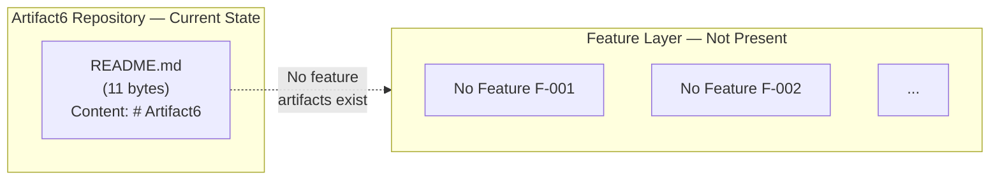
```mermaid
graph LR
    subgraph Current["Artifact6 Repository — Current State"]
        README["README.md<br/>(11 bytes)<br/>Content: # Artifact6"]
    end

    subgraph Absent["Feature Layer — Not Present"]
        F1["No Feature F-001"]
        F2["No Feature F-002"]
        FN["..."]
    end

    README -.->|"No feature<br/>artifacts exist"| Absent
```

The dashed edge denotes the absence of any path from the repository's sole content to a feature layer. Because the feature layer is empty, no dependency map, integration topology, shared-component diagram, or common-service inventory can be constructed.

### 2.4.4 Required Inputs to Document Feature Relationships

Relationship documentation becomes feasible once:

- At least two features are defined (Section 2.2 prerequisite).
- Module-import graphs, package manifests, or interface definitions reveal coupling.
- Integration contracts (events, message schemas, API calls) declare cross-feature interactions.
- Shared library code or common-service modules are committed.

---

## 2.5 IMPLEMENTATION CONSIDERATIONS

### 2.5.1 Considerations Population Status

The Implementation Considerations sub-section specified by the section prompt requires, for each feature, documentation of technical constraints, performance requirements, scalability considerations, security implications, and maintenance requirements.

**No implementation considerations can be authoritatively documented.** Implementation considerations attach to features and their underlying technical realization. With no features and no technology stack declared (per Section 1.2.2.3, which confirms the core technical approach is "undetermined"), there is no implementation surface against which constraints, performance targets, scalability strategies, security controls, or maintenance procedures can be specified.

### 2.5.2 Implementation Considerations Evidence Map

| Required Consideration Element | Evidence in Repository | Documentable? |
|---|---|---|
| Technical constraints | No tech stack declared (per Section 1.2.2.3) | No |
| Performance requirements | No performance KPIs declared (per Section 1.2.3.3) | No |
| Scalability considerations | No scale targets, capacity plans, or topology docs | No |
| Security implications | No threat model, security policy, or auth configuration | No |
| Maintenance requirements | No runbooks, SLOs, or operational documentation | No |

### 2.5.3 Required Inputs to Document Implementation Considerations

Implementation considerations documentation will become possible once the repository contains:

- A declared technology stack (via dependency manifests or ADRs).
- Infrastructure-as-code or deployment configuration revealing scalability targets.
- Performance budgets or SLO documents.
- A security policy, threat model, or `SECURITY.md`.
- Operational runbooks or `RUNBOOK.md` artifacts.
- A maintenance / on-call documentation set.

---

## 2.6 TRACEABILITY MATRIX

### 2.6.1 Traceability Matrix Population Status

A traceability matrix typically links requirements to their originating business objectives, design artifacts, implementation modules, and verification tests. Construction of such a matrix presupposes the existence of requirements and corresponding implementation artifacts.

**The traceability matrix is empty.** With no business objectives (per Section 1.2.3.1), no requirements (Section 2.3), no implementation modules (per Section 1.2.2.2), and no tests committed, every column of a traceability matrix would be empty, and no rows can be constructed.

### 2.6.2 Traceability Dimension Evidence Map

| Traceability Dimension | Evidence Present | Documentable? |
|---|---|---|
| Business Objective → Feature | No objectives, no features | No |
| Feature → Functional Requirement | No features, no requirements | No |
| Requirement → Design Element | No design artifacts | No |
| Requirement → Source Module | No source code committed | No |
| Requirement → Test Case | No test artifacts committed | No |

### 2.6.3 Forward Plan for Traceability

A populated traceability matrix should be established once the upstream artifacts (objectives, features, requirements, design, code, tests) exist. The matrix should be updated incrementally with each feature increment so that traceability is preserved continuously rather than retrofitted.

---

## 2.7 DOCUMENTATION CONSTRAINTS AND ASSUMPTIONS

### 2.7.1 Documentation Constraints

This section operates under the following constraints, which are identical in spirit to those declared in Section 1.3.3.3:

1. **Evidence-only documentation.** Every claim about features, requirements, relationships, or implementation must be grounded in repository evidence or authoritative user context. Speculation about "typical" features for a project named Artifact6 is explicitly disallowed.
2. **Section-prompt fidelity.** The section prompt's directive to omit items that are "not clearly applicable" governs the scope of this section. With no applicable items, the section legitimately remains a documented inventory of absences.
3. **Consistency with Sections 1.1–1.3.** Findings in this section must align with — and not contradict — the verified evidence already recorded in the Executive Summary, System Overview, and Scope sections.

### 2.7.2 Assumptions

| Assumption ID | Assumption | Validity Condition |
|---|---|---|
| A-001 | The Git working tree as of commit `7207605` is the authoritative source of repository state | Holds until a subsequent commit changes the working tree |
| A-002 | No external requirements documents exist outside the repository that should govern this specification | Holds unless authoritative user context introduces such documents |
| A-003 | The empty state is intentional (project initialization phase) rather than an accidental data-loss event | Holds based on the single-commit, "Initial commit" history |

### 2.7.3 Section Versioning

| Version | Date | Repository Commit | Notable State |
|---|---|---|---|
| 1.0 | 2026-06-01 | `7207605` | Empty repository; section documents absence of features |

Subsequent versions of this section should be authored when material changes to the repository introduce features, requirements, design artifacts, or test cases.

---

## 2.8 FORWARD PLAN

### 2.8.1 Triggers for Section Revision

This Product Requirements section should be revised when any of the following events occur, which collectively represent the minimum conditions under which substantive content can be authored:

| Trigger Event | Resulting Section Revision |
|---|---|
| Product brief, PRD, or vision document committed | Populate Feature Catalog (Section 2.2) descriptions |
| Source code with discrete modules committed | Populate Feature Catalog metadata and dependencies |
| API specifications or schemas committed | Populate Functional Requirements Table (Section 2.3) |
| Test suites with acceptance criteria committed | Populate acceptance criteria in Section 2.3 |
| ADRs, design documents, or `ARCHITECTURE.md` committed | Populate Feature Relationships (Section 2.4) |
| NFR documents, SLOs, or security policy committed | Populate Implementation Considerations (Section 2.5) |
| Authoritative user context supplied with features/requirements | Populate all sub-sections as applicable |

### 2.8.2 Recommended Artifact Hierarchy

When the project transitions out of the placeholder phase, the following artifact hierarchy is suggested to support a fully populated Product Requirements section:

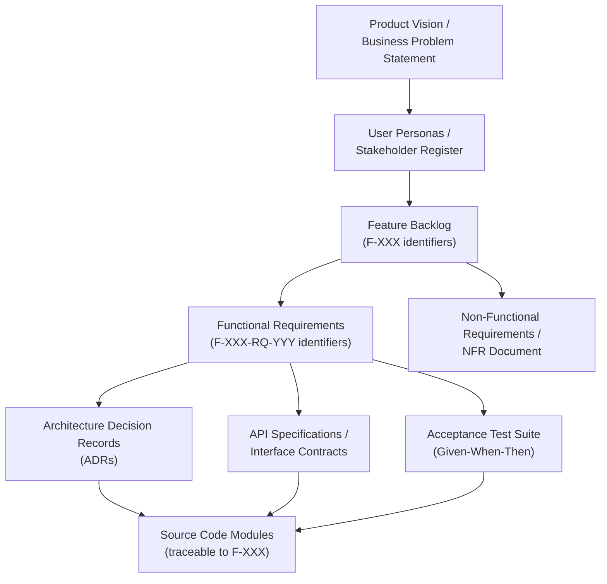
```mermaid
graph TB
    Vision["Product Vision /<br/>Business Problem Statement"]
    Personas["User Personas /<br/>Stakeholder Register"]
    Backlog["Feature Backlog<br/>(F-XXX identifiers)"]
    Reqs["Functional Requirements<br/>(F-XXX-RQ-YYY identifiers)"]
    NFR["Non-Functional Requirements /<br/>NFR Document"]
    ADR["Architecture Decision Records<br/>(ADRs)"]
    API["API Specifications /<br/>Interface Contracts"]
    Tests["Acceptance Test Suite<br/>(Given-When-Then)"]
    Code["Source Code Modules<br/>(traceable to F-XXX)"]

    Vision --> Personas
    Personas --> Backlog
    Backlog --> Reqs
    Backlog --> NFR
    Reqs --> ADR
    Reqs --> API
    Reqs --> Tests
    ADR --> Code
    API --> Code
    Tests --> Code
```

The hierarchy above establishes the chain of evidence required for a credible Product Requirements section: every requirement must trace upward to a feature, every feature to a stakeholder need, and every need to a stated business problem. The corresponding downward chain — from requirement to ADR, API contract, source code, and test — establishes the implementation and verification traceability that the Traceability Matrix (Section 2.6) is intended to capture.

### 2.8.3 Linkage to Subsequent Specification Sections

Once features exist, the following specification sections will need to be authored or revised in coordination with this section:

| Target Section (Forward Reference) | Coordination Required |
|---|---|
| System Architecture | Architecture must reflect components introduced by features |
| Data Model & Schema | Data requirements (Section 2.3.3) drive schema design |
| API Specifications | Input/Output parameters in Section 2.3.3 align with API contracts |
| Security Architecture | Security requirements (Section 2.3.4) drive security controls |
| Performance & Scalability | Implementation considerations (Section 2.5) shape NFR strategy |
| Test Strategy | Acceptance criteria in Section 2.3.2 inform test design |
| Operations & Maintenance | Maintenance requirements (Section 2.5.2) drive runbooks |

---

## 2.9 SECTION SUMMARY

The Product Requirements section for **Artifact6** documents an empty product surface. With the repository containing only a placeholder `README.md` and no source code, requirements documentation, design artifacts, or test artifacts, there are no features, functional requirements, feature relationships, implementation considerations, or traceability links that can be honestly authored from repository evidence. This section's structure faithfully follows the prompt template while populating it with evidence maps that reveal the absence of supporting material in every required sub-element. The forward plan (Section 2.8) identifies the precise artifacts that must be introduced to enable substantive Product Requirements documentation in subsequent revisions.

---

#### References

**Files Examined**
- `README.md` — The repository's only tracked file (11 bytes), content `# Artifact6`. Confirmed that no features, requirements, user stories, acceptance criteria, or descriptive product content exist in the repository.

**Folders Explored**
- `/` (repository root) — Contains exactly one tracked child (`README.md`) and the `.git/` metadata directory. Confirmed the absence of `docs/`, `requirements/`, `src/`, `tests/`, `api/`, `schemas/`, `adr/`, or any other directory that would host product-requirements artifacts.

**Search Operations Performed**
- Semantic searches for "requirements specification features functionality", "source code implementation application", "user stories acceptance criteria product features", "API endpoint service authentication database", "source code modules packages", "documentation specifications requirements", "README documentation", "all folders in repository", and "Artifact6 project schema configuration" — all returned empty results, confirming no requirements-related content exists.

**Cross-Referenced Technical Specification Sections**
- `1.1 EXECUTIVE SUMMARY` — Confirmed undefined business problem (Section 1.1.2), undefined stakeholders and end-users (Section 1.1.3), and undocumented value proposition (Section 1.1.4). These findings establish that no upstream context exists from which to derive features.
- `1.2 SYSTEM OVERVIEW` — Confirmed empty Primary System Capabilities list (Section 1.2.2.1), no Major System Components beyond README and git metadata (Section 1.2.2.2), undetermined Core Technical Approach (Section 1.2.2.3), no Enterprise Landscape integrations (Section 1.2.1.3), and no declared KPIs across all categories (Section 1.2.3.3). These findings establish the absence of technical context for any feature.
- `1.3 SCOPE` — Confirmed no in-scope capabilities, workflows, integrations, or technical requirements (Section 1.3.1.1), no implementation boundaries (Section 1.3.1.2), and no out-of-scope declarations (Section 1.3.2). The Introduction Sub-Section Evidence Map (Section 1.3.3.2) establishes the canonical pattern of evidence-based "None" entries that this section follows. The Verified Repository Facts table (Section 1.3.3.1) provides the authoritative inventory grounding all claims in this section.

**Repository Metadata Inspected** (per Section 1.3.3.1)
- Artifact name: `Artifact6`
- Remote origin: `github.com/Blitzy-Multi/Artifact6`
- Default branch: `main`
- Sole commit: `7207605db62e3243f097c7a231bd60a8333a2f52` ("Initial commit", 2026-06-01)
- Initial committer: `Blitzy-Multi <mmwforfinance@gmail.com>`

# 3. Technology Stack

## 3.1 SECTION POPULATION STATUS

### 3.1.1 Authoritative State Declaration

The Technology Stack section, as mandated by the section prompt, requires documentation of programming languages, frameworks and libraries, open-source dependencies, third-party services, databases and storage, and development/deployment tooling — including version numbers, justifications, compatibility requirements, and security implications for each technology selected.

**No technology stack can be authoritatively documented for Artifact6 from repository evidence.** As established in Section 1.2.2.3 ("Core Technical Approach"), no technology stack, programming language, runtime, framework, architectural pattern, or design paradigm is indicated by any artifact in the repository, and the core technical approach for Artifact6 is therefore undetermined and must be established in subsequent work. Section 2.5.2 ("Implementation Considerations Evidence Map") further confirms "No tech stack declared (per Section 1.2.2.3)" as the evidence basis for the absence of technical constraints.

The repository's sole tracked file is `README.md` (11 bytes, containing only the single Markdown heading `# Artifact6`), introduced by the single commit `7207605` ("Initial commit", 2026-06-01). No dependency manifest, configuration file, source code module, infrastructure-as-code artifact, or build/deployment configuration of any kind has been committed.

### 3.1.2 Section-Prompt Fidelity Constraint

The governing section prompt explicitly directs: *"Only include sections and items that are actually relevant to this system, based on your analysis of its requirements. Don't add any items that aren't clearly applicable."* In conjunction with the evidence-only documentation constraint articulated in Section 2.7.1 — which prohibits speculation about "typical" features or technologies — this section legitimately documents the **inventory of absences** for each technology category rather than fabricating selections.

The "Default Technology Stack" provided in the section prompt (AWS / Docker / Terraform / GitHub Actions / Python / Flask / Auth0 / MongoDB / Langchain / React / TypeScript / TailwindCSS / React-Native / Swift / Kotlin / Objective-C / ElectronJS) is **not** present, referenced, configured, or implied anywhere in the repository. It is reproduced in Section 3.9 as a **candidate stack for future adoption**, with explicit disclosure that zero repository evidence supports any of these choices at this time.

### 3.1.3 Repository State Snapshot

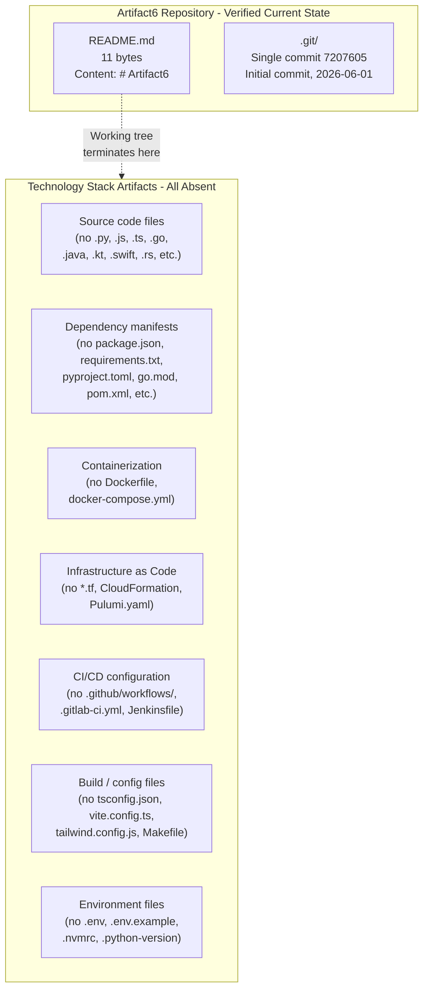
```mermaid
graph TB
    subgraph CurrentState["Artifact6 Repository - Verified Current State"]
        README["README.md<br/>11 bytes<br/>Content: # Artifact6"]
        GitMeta[".git/<br/>Single commit 7207605<br/>Initial commit, 2026-06-01"]
    end

    subgraph AbsentTechArtifacts["Technology Stack Artifacts - All Absent"]
        Lang["Source code files<br/>(no .py, .js, .ts, .go,<br/>.java, .kt, .swift, .rs, etc.)"]
        Manifest["Dependency manifests<br/>(no package.json, requirements.txt,<br/>pyproject.toml, go.mod, pom.xml, etc.)"]
        Container["Containerization<br/>(no Dockerfile,<br/>docker-compose.yml)"]
        IaC["Infrastructure as Code<br/>(no *.tf, CloudFormation,<br/>Pulumi.yaml)"]
        CICD["CI/CD configuration<br/>(no .github/workflows/,<br/>.gitlab-ci.yml, Jenkinsfile)"]
        ConfigFiles["Build / config files<br/>(no tsconfig.json, vite.config.ts,<br/>tailwind.config.js, Makefile)"]
        EnvFiles["Environment files<br/>(no .env, .env.example,<br/>.nvmrc, .python-version)"]
    end

    README -.->|"Working tree<br/>terminates here"| AbsentTechArtifacts
```

The diagram reflects the verified repository inventory: a single 11-byte `README.md` alongside Git metadata, with every category of technology-stack indicator confirmed absent through explicit enumeration.

---

## 3.2 PROGRAMMING LANGUAGES

### 3.2.1 Languages Declared

| Platform / Component | Language Selected | Version | Evidence Source |
|---|---|---|---|
| Backend / server | None declared | N/A | No backend source files committed |
| Frontend / web | None declared | N/A | No frontend source files committed |
| Mobile / cross-platform | None declared | N/A | No mobile source files committed |
| Native applications | None declared | N/A | No native-platform source files committed |
| Infrastructure / scripts | None declared | N/A | No `.sh`, `.ps1`, `.py`, or IaC files committed |
| Build / tooling | None declared | N/A | No build manifests committed |

No programming language has been adopted, configured, or implied by any committed artifact. The repository contains zero source-code files in any language.

### 3.2.2 Language Evidence Map

The following file-extension and manifest searches were conducted to confirm the absence of language adoption:

| Language Family | Indicator Files Searched | Files Found |
|---|---|---|
| Python | `*.py`, `requirements.txt`, `pyproject.toml`, `Pipfile`, `setup.py`, `poetry.lock` | 0 |
| JavaScript / TypeScript | `*.js`, `*.ts`, `*.jsx`, `*.tsx`, `package.json`, `tsconfig.json`, `*.lock` | 0 |
| Go | `*.go`, `go.mod`, `go.sum` | 0 |
| Rust | `*.rs`, `Cargo.toml`, `Cargo.lock` | 0 |
| Java / Kotlin | `*.java`, `*.kt`, `pom.xml`, `build.gradle`, `build.gradle.kts` | 0 |
| Ruby | `*.rb`, `Gemfile`, `Gemfile.lock` | 0 |
| PHP | `*.php`, `composer.json`, `composer.lock` | 0 |
| .NET (C# / F# / VB) | `*.cs`, `*.fs`, `*.vb`, `*.csproj`, `*.sln`, `packages.config` | 0 |
| Swift / Objective-C | `*.swift`, `*.m`, `*.mm`, `Package.swift`, `Podfile` | 0 |
| Shell | `*.sh`, `*.bash`, `*.zsh` | 0 |

### 3.2.3 Required Inputs to Document Programming Languages

The Programming Languages subsection can be populated once any of the following are committed to the repository:

- One or more source-code files in a recognized language extension.
- A dependency manifest that implies a runtime (e.g., `package.json` → Node.js, `pyproject.toml` → Python, `go.mod` → Go).
- A language-version pin file (e.g., `.nvmrc`, `.python-version`, `.tool-versions`, `.ruby-version`).
- An Architecture Decision Record (ADR) declaring a language selection with stated rationale.

---

## 3.3 FRAMEWORKS & LIBRARIES

### 3.3.1 Frameworks Adopted

| Framework Category | Framework Selected | Version | Evidence Source |
|---|---|---|---|
| Backend web framework | None declared | N/A | No backend manifest or source committed |
| Frontend UI framework | None declared | N/A | No frontend manifest or source committed |
| Mobile framework | None declared | N/A | No mobile manifest or source committed |
| Testing framework | None declared | N/A | No test files or test-runner config committed |
| ORM / data-access framework | None declared | N/A | No ORM configuration or models committed |
| AI / ML framework | None declared | N/A | No ML library imports or model artifacts committed |
| CSS / styling framework | None declared | N/A | No `tailwind.config.js`, `*.scss`, or theme files committed |

No framework — web, mobile, testing, data, ML, or styling — has been adopted in the repository.

### 3.3.2 Framework Evidence Map

The following manifest and configuration files were sought to confirm the absence of framework selection:

| Framework Indicator | File / Pattern Searched | Result |
|---|---|---|
| Node.js framework declaration | `package.json` (dependencies block) | File absent |
| Python framework declaration | `requirements.txt` / `pyproject.toml` | Files absent |
| Go module dependencies | `go.mod` | File absent |
| Java/Kotlin framework declaration | `pom.xml` / `build.gradle*` | Files absent |
| Frontend build config | `vite.config.ts`, `webpack.config.js`, `next.config.js` | Files absent |
| CSS framework config | `tailwind.config.js`, `postcss.config.js` | Files absent |
| Test framework config | `jest.config.*`, `pytest.ini`, `vitest.config.*` | Files absent |
| TypeScript compiler config | `tsconfig.json`, `jsconfig.json` | Files absent |

### 3.3.3 Compatibility and Justification Status

With zero frameworks selected, no compatibility requirements between frameworks, no version constraints, and no justification rationales can be authoritatively documented. The factual-accuracy constraint declared in Section 2.7.1 prohibits the documentation of "typical" framework choices in the absence of evidence.

### 3.3.4 Required Inputs to Document Frameworks & Libraries

The Frameworks & Libraries subsection can be populated once the repository contains:

- A dependency manifest declaring framework packages with pinned versions.
- A lockfile (`package-lock.json`, `poetry.lock`, `Cargo.lock`, etc.) establishing the resolved version graph.
- An ADR documenting the framework selection rationale and compatibility considerations.
- Source files importing the framework, demonstrating actual usage.

---

## 3.4 OPEN SOURCE DEPENDENCIES

### 3.4.1 Dependencies Inventory

| Dependency Class | Packages Declared | Registry | Version Pin |
|---|---|---|---|
| Direct runtime dependencies | None | N/A | N/A |
| Direct development dependencies | None | N/A | N/A |
| Transitive dependencies | None | N/A | N/A |
| Peer dependencies | None | N/A | N/A |
| Optional dependencies | None | N/A | N/A |

No open-source package, library, or third-party module has been declared, pinned, or resolved in the repository.

### 3.4.2 Dependency Manifest Evidence Map

The following dependency-management artifacts were sought and confirmed absent:

| Package Manager / Registry | Manifest File | Lockfile | Status |
|---|---|---|---|
| npm (Node.js / npm registry) | `package.json` | `package-lock.json` | Both absent |
| Yarn (Node.js / npm registry) | `package.json` | `yarn.lock` | Both absent |
| pnpm (Node.js / npm registry) | `package.json` | `pnpm-lock.yaml` | Both absent |
| pip (Python / PyPI) | `requirements.txt` / `requirements-*.txt` | N/A | Absent |
| Poetry (Python / PyPI) | `pyproject.toml` | `poetry.lock` | Both absent |
| Pipenv (Python / PyPI) | `Pipfile` | `Pipfile.lock` | Both absent |
| Go modules (proxy.golang.org) | `go.mod` | `go.sum` | Both absent |
| Cargo (Rust / crates.io) | `Cargo.toml` | `Cargo.lock` | Both absent |
| Maven (Java / Maven Central) | `pom.xml` | N/A | Absent |
| Gradle (Java/Kotlin / various) | `build.gradle` / `build.gradle.kts` | `gradle.lockfile` | Both absent |
| Bundler (Ruby / RubyGems) | `Gemfile` | `Gemfile.lock` | Both absent |
| Composer (PHP / Packagist) | `composer.json` | `composer.lock` | Both absent |
| NuGet (.NET) | `*.csproj` / `packages.config` | `packages.lock.json` | All absent |
| Swift Package Manager | `Package.swift` | `Package.resolved` | Both absent |
| CocoaPods (iOS) | `Podfile` | `Podfile.lock` | Both absent |

### 3.4.3 License, Security, and Supply-Chain Posture

Because zero open-source dependencies have been declared, the following supply-chain concerns currently have a null surface area:

- **License compliance:** No license-bearing third-party code has been incorporated; no SPDX manifests, NOTICE files, or attribution documentation are needed at this time.
- **Vulnerability exposure:** No CVE surface exists from third-party packages; no SCA scanner configuration (e.g., Dependabot, Snyk, OWASP Dependency-Check) is committed.
- **Provenance / SBOM:** No Software Bill of Materials (CycloneDX, SPDX) can be generated; none has been committed.
- **Update cadence:** No `dependabot.yml`, `renovate.json`, or equivalent automated-update configuration exists.

### 3.4.4 Required Inputs to Document Open Source Dependencies

The Open Source Dependencies subsection can be populated once the repository contains:

- One or more dependency manifests with declared packages.
- Corresponding lockfile(s) establishing the resolved dependency graph.
- Optional but recommended: SBOM artifacts, SCA scanner configuration, automated-update configuration.

---

## 3.5 THIRD-PARTY SERVICES

### 3.5.1 External Service Integrations

| Service Category | Provider | Integration Type | Evidence Source |
|---|---|---|---|
| External REST / GraphQL APIs | None | N/A | No API client code, SDKs, or endpoint configurations committed |
| Authentication / identity provider | None | N/A | No auth config, OIDC settings, or identity-provider references committed |
| Payment / billing services | None | N/A | No payment-SDK references or webhook handlers committed |
| Email / messaging services | None | N/A | No SMTP, SendGrid, Twilio, or messaging-API configurations committed |
| Observability / monitoring | None | N/A | No APM agent config, log-aggregation config, or metrics exporters committed |
| Error tracking | None | N/A | No Sentry, Bugsnag, or Rollbar configuration committed |
| Analytics | None | N/A | No analytics-SDK or tracking-pixel code committed |
| Cloud provider | None | N/A | No AWS/GCP/Azure SDK references or service configurations committed |
| Feature flags / experimentation | None | N/A | No LaunchDarkly, Split, or Flagsmith configuration committed |
| CDN | None | N/A | No CDN configuration or asset-delivery setup committed |
| Search services | None | N/A | No Algolia, Elasticsearch, or OpenSearch client config committed |

No external service has been integrated, configured, or referenced in the repository. This finding aligns with Section 1.2.1.3 ("Enterprise Landscape Integration"), which confirmed "No client SDKs, API contracts, or interface definitions present" and "No auth configuration, OIDC settings, or identity-provider references."

### 3.5.2 Service Integration Evidence Map

The following indicator files and patterns were sought to confirm the absence of third-party service integration:

| Integration Surface | Indicator Searched | Status |
|---|---|---|
| HTTP client libraries | Source files importing `axios`, `requests`, `httpx`, `fetch`, etc. | No source files exist |
| OAuth / OIDC configuration | `.well-known/`, OAuth-client config files | Absent |
| Service credentials | `.env`, `.env.example`, secrets-manager references | Absent |
| API contract specifications | OpenAPI / Swagger / `openapi.yaml`, GraphQL schemas | Absent |
| SDK configuration | Cloud-provider SDK initialization files | Absent |
| Webhook endpoints | Webhook handler source files | Absent |
| Service-mesh configuration | Istio, Linkerd, Consul Connect manifests | Absent |

### 3.5.3 Authentication, Authorization, and Identity

No authentication service, identity provider, or authorization framework has been integrated. There is no:

- OAuth 2.0 / OIDC client configuration.
- JWT signing-key configuration or JWKS endpoint reference.
- SAML configuration.
- API-key management code.
- Role-based or attribute-based access-control policy file.
- Session-management code or session-store configuration.

### 3.5.4 Required Inputs to Document Third-Party Services

The Third-Party Services subsection can be populated once the repository contains:

- Service-client SDK references in committed source code.
- API contract specifications (OpenAPI, GraphQL SDL, gRPC `.proto` files).
- Configuration files declaring external endpoints, API keys (or references to secrets), and webhook URLs.
- ADRs documenting the rationale for each external-service selection.

---

## 3.6 DATABASES & STORAGE

### 3.6.1 Data Persistence Inventory

| Storage Category | Technology Selected | Version | Evidence Source |
|---|---|---|---|
| Primary relational database | None declared | N/A | No relational-DB driver, connection string, or schema committed |
| Primary document / NoSQL database | None declared | N/A | No document-DB driver or collection definitions committed |
| Key-value store | None declared | N/A | No KV-store client configuration committed |
| Cache layer | None declared | N/A | No cache client (Redis, Memcached) configuration committed |
| Message broker / queue | None declared | N/A | No broker client (Kafka, RabbitMQ, SQS) configuration committed |
| Search index | None declared | N/A | No search engine (Elasticsearch, OpenSearch) configuration committed |
| Object / blob storage | None declared | N/A | No object-store (S3, GCS, Azure Blob) client configuration committed |
| Time-series database | None declared | N/A | No TSDB (InfluxDB, TimescaleDB) configuration committed |
| Graph database | None declared | N/A | No graph-DB (Neo4j) configuration committed |
| Local / embedded storage | None declared | N/A | No SQLite, RocksDB, or LevelDB references committed |

No data-persistence layer has been adopted. This finding aligns with Section 1.2.1.3, which confirmed "No database connectors, ETL configs, or data-catalog references" exist in the repository.

### 3.6.2 Data-Layer Evidence Map

The following indicator files and patterns were sought to confirm the absence of database adoption:

| Data-Layer Indicator | Searched For | Status |
|---|---|---|
| ORM / ODM configuration | `prisma/schema.prisma`, `models.py` (Django/SQLAlchemy), `entities/*.ts` (TypeORM) | Absent |
| Database migration tooling | `migrations/`, `alembic.ini`, `knexfile.js`, Flyway / Liquibase configs | Absent |
| Schema files | `*.sql`, `schema.prisma`, GraphQL/Avro schemas | Absent |
| Connection-string configuration | `.env*`, `database.yml`, `config/database.*` | Absent |
| Container database services | `docker-compose.yml` services (e.g., `postgres`, `mongo`, `redis`) | Absent (no compose file) |
| Embedded-DB artifacts | `*.db`, `*.sqlite`, `*.sqlite3` | Absent |
| Cloud-DB IaC declarations | Terraform RDS/Aurora/DynamoDB resource blocks | Absent |

### 3.6.3 Data Persistence Strategy, Caching, and Storage Services

With no databases or storage services selected, the following strategic concerns currently have a null surface area:

- **Persistence strategy:** Transactional vs. eventually-consistent, OLTP vs. OLAP — undeclared.
- **Caching strategy:** Write-through, write-behind, cache-aside, TTL policies — undeclared.
- **Backup and recovery:** RPO/RTO targets, backup cadence, restore procedures — undeclared.
- **Data residency / sovereignty:** Region selection, encryption at rest, key-management — undeclared.
- **Schema evolution:** Migration framework, blue-green compatibility, schema-registry — undeclared.

### 3.6.4 Required Inputs to Document Databases & Storage

The Databases & Storage subsection can be populated once the repository contains:

- A database client or ORM dependency declared in a manifest.
- A schema file, migration directory, or model class definition.
- A connection configuration (with secrets externalized) or container-compose service definition.
- An ADR documenting the database selection, expected workload profile, and consistency model.

---

## 3.7 DEVELOPMENT & DEPLOYMENT

### 3.7.1 Development Tooling Inventory

| Tooling Category | Tool Selected | Version | Evidence Source |
|---|---|---|---|
| Version control | Git | (system-provided) | `.git/` metadata directory present |
| Code editor / IDE config | None declared | N/A | No `.editorconfig`, `.vscode/`, `.idea/` committed |
| Linting | None declared | N/A | No `.eslintrc*`, `ruff.toml`, `.rubocop.yml` committed |
| Code formatting | None declared | N/A | No `.prettierrc*`, `.black`, `.rustfmt.toml` committed |
| Pre-commit hooks | None declared | N/A | No `.pre-commit-config.yaml`, `husky/` config committed |
| Local task runner | None declared | N/A | No `Makefile`, `justfile`, `Taskfile.yml` committed |
| Language-version manager | None declared | N/A | No `.nvmrc`, `.python-version`, `.tool-versions` committed |
| Dev-container / Codespaces | None declared | N/A | No `.devcontainer/devcontainer.json` committed |

Git is the only confirmed development tool by virtue of the `.git/` metadata directory presence and the existence of commit `7207605`. No project-specific developer tooling has been committed.

### 3.7.2 Build System Inventory

| Build Concern | Tool Selected | Version | Evidence Source |
|---|---|---|---|
| Build orchestrator | None declared | N/A | No `Makefile`, `BUILD.bazel`, `nx.json`, `turbo.json` committed |
| JavaScript bundler | None declared | N/A | No `vite.config.*`, `webpack.config.*`, `rollup.config.*` committed |
| Java/Kotlin build tool | None declared | N/A | No `pom.xml`, `build.gradle*` committed |
| Python build backend | None declared | N/A | No `pyproject.toml` `[build-system]` section committed |
| Native compilation | None declared | N/A | No `Cargo.toml`, `CMakeLists.txt`, `Makefile`, `*.cabal` committed |
| Artifact publishing | None declared | N/A | No publish workflows or registry configuration committed |

### 3.7.3 Containerization and Orchestration

| Containerization Concern | Tool Selected | Version | Evidence Source |
|---|---|---|---|
| Container image build | None declared | N/A | No `Dockerfile`, `Dockerfile.*`, `Containerfile` committed |
| Multi-container local dev | None declared | N/A | No `docker-compose.yml`, `compose.yaml` committed |
| Container ignore rules | None declared | N/A | No `.dockerignore` committed |
| Kubernetes manifests | None declared | N/A | No `*.yaml` under `k8s/`, no `kustomization.yaml` committed |
| Helm charts | None declared | N/A | No `Chart.yaml`, `templates/` committed |
| Service-mesh configuration | None declared | N/A | No Istio/Linkerd manifests committed |

No containerization or orchestration artifact exists in the repository.

### 3.7.4 Infrastructure as Code

| IaC Concern | Tool Selected | Version | Evidence Source |
|---|---|---|---|
| Terraform | None declared | N/A | No `*.tf`, `*.tfvars`, `terraform.tfstate` committed |
| AWS CloudFormation | None declared | N/A | No CloudFormation templates committed |
| Pulumi | None declared | N/A | No `Pulumi.yaml`, `Pulumi.*.yaml` committed |
| AWS CDK / CDK for Terraform | None declared | N/A | No CDK projects committed |
| Ansible / Chef / Puppet | None declared | N/A | No playbooks, cookbooks, or manifests committed |

No infrastructure-as-code artifact exists in the repository.

### 3.7.5 CI/CD Configuration

| CI/CD Concern | Tool Selected | Version | Evidence Source |
|---|---|---|---|
| GitHub Actions | None declared | N/A | No `.github/workflows/*.yml` committed |
| GitLab CI | None declared | N/A | No `.gitlab-ci.yml` committed |
| Jenkins | None declared | N/A | No `Jenkinsfile` committed |
| CircleCI | None declared | N/A | No `.circleci/config.yml` committed |
| Azure Pipelines | None declared | N/A | No `azure-pipelines.yml` committed |
| Travis CI | None declared | N/A | No `.travis.yml` committed |
| Release automation | None declared | N/A | No `release-please.yml`, `semantic-release` config committed |

No CI/CD pipeline configuration exists in the repository. Builds, tests, security scans, and deployments are therefore unautomated as of commit `7207605`.

### 3.7.6 Required Inputs to Document Development & Deployment

The Development & Deployment subsection can be populated once the repository contains:

- Local-development tooling configuration (linter, formatter, editor config, language-version pin).
- A build manifest or task runner declaration (`Makefile`, `package.json` `scripts`, `pyproject.toml` `[tool.*]` blocks).
- A `Dockerfile` (and optionally `docker-compose.yml`) for containerized local development.
- IaC artifacts declaring the target cloud topology.
- At least one CI/CD pipeline definition (e.g., `.github/workflows/ci.yml`) implementing build, test, and security-scan stages.

---

## 3.8 INTEGRATED TECHNOLOGY EVIDENCE MAP

### 3.8.1 Cross-Subsection Status Matrix

The following matrix consolidates the evidence findings of Sections 3.2 through 3.7 and confirms the populatability of each Technology Stack subsection.

| Subsection | Evidence Available | Items Documentable | Versionable | Justifiable |
|---|---|---|---|---|
| 3.2 Programming Languages | None | 0 | No | No |
| 3.3 Frameworks & Libraries | None | 0 | No | No |
| 3.4 Open Source Dependencies | None | 0 | No | No |
| 3.5 Third-Party Services | None | 0 | No | No |
| 3.6 Databases & Storage | None | 0 | No | No |
| 3.7 Development & Deployment | Git (implicit) | 1 (Git only) | No (system-provided) | No |

### 3.8.2 Trigger-to-Subsection Mapping

The following mapping extends the trigger table in Section 2.8.1 to identify the specific repository events that would enable population of each Technology Stack subsection:

| Repository Event | Subsections Unlocked |
|---|---|
| Source files in any language committed | 3.2 |
| Dependency manifest committed (`package.json`, `pyproject.toml`, etc.) | 3.2, 3.3, 3.4 |
| Lockfile committed | 3.4 (resolved versions become declarable) |
| Service-client SDK references in source | 3.5 |
| API specifications / `openapi.yaml` committed | 3.5 |
| Auth configuration committed | 3.5 (auth subsection) |
| ORM models, migrations, or `schema.sql` committed | 3.6 |
| `docker-compose.yml` declaring DB services | 3.6 (local dev), 3.7 (containerization) |
| `Dockerfile` committed | 3.7 (containerization) |
| `*.tf` or equivalent IaC committed | 3.7 (IaC) |
| `.github/workflows/*.yml` committed | 3.7 (CI/CD) |
| ADR or `ARCHITECTURE.md` committed | All subsections (justification rationale) |

---

## 3.9 CANDIDATE TECHNOLOGY STACK (PROPOSED, NOT YET ADOPTED)

### 3.9.1 Provenance and Status Disclosure

The section prompt provides a **Default Technology Stack** intended as a recommendation for greenfield projects authored under this documentation framework. The default stack is reproduced verbatim below for forward-planning purposes only. **No element of this candidate stack has been adopted, declared, configured, or implied by any repository artifact.** Each entry is therefore listed without a version pin, without a justification grounded in repository evidence, and without integration requirements — because none can be authoritatively documented at this time.

Adoption of any element below requires (at minimum) a corresponding ADR committed to the repository and the relevant manifest / configuration file that implements the choice.

### 3.9.2 Proposed Core Infrastructure

| Layer | Candidate Technology | Repository Evidence of Adoption |
|---|---|---|
| Cloud platform | AWS | None |
| Containerization | Docker | None — no `Dockerfile` committed |
| Infrastructure as Code | Terraform | None — no `*.tf` files committed |
| CI/CD | GitHub Actions | None — no `.github/workflows/` committed |

### 3.9.3 Proposed Backend Stack

| Layer | Candidate Technology | Repository Evidence of Adoption |
|---|---|---|
| Primary language | Python | None — no `*.py` files or Python manifests committed |
| Web framework | Flask | None — no Flask dependency declared |
| Authentication | Auth0 | None — no Auth0 SDK or tenant configuration committed |
| Primary database | MongoDB | None — no MongoDB driver or connection-string config committed |
| AI framework | LangChain | None — no LangChain dependency or chain definitions committed |

### 3.9.4 Proposed Frontend Stack

| Layer | Candidate Technology | Repository Evidence of Adoption |
|---|---|---|
| Web framework | React with TypeScript | None — no React/TS dependencies or `*.tsx` files committed |
| CSS framework | TailwindCSS | None — no `tailwind.config.js` or PostCSS config committed |
| Mobile / cross-platform | React Native with TypeScript | None — no React Native dependencies committed |

### 3.9.5 Proposed Native Application Stack

| Platform | Candidate Technology | Repository Evidence of Adoption |
|---|---|---|
| iOS | Swift | None — no `*.swift` files or `Package.swift` committed |
| Android | Kotlin | None — no `*.kt` files or `build.gradle.kts` committed |
| macOS | Objective-C | None — no `*.m` / `*.mm` files committed |
| Desktop (cross-platform) | ElectronJS | None — no Electron dependency or `main.js` committed |

### 3.9.6 Caveats Governing the Candidate Stack

1. **No selections are final.** Each entry above is a recommendation provided by the documentation framework; the actual technology choices for Artifact6 must be established through engineering decisions captured in ADRs and implemented via committed artifacts.
2. **Compatibility unverified.** Compatibility considerations between candidate components (e.g., LangChain version compatibility with a chosen Python runtime; React-Native compatibility with a target mobile OS version) cannot be evaluated without concrete version pins, which do not exist.
3. **Version pins absent by design.** Per the factual-accuracy constraint in Section 2.7.1, no version numbers have been fabricated for any candidate component. Version pinning is deferred to the moment of actual adoption via a dependency manifest.
4. **Justifications deferred.** The selection criteria for each candidate component cannot be retroactively justified against repository evidence because no implementation surface exists against which to measure tradeoffs (performance, scalability, developer ergonomics, ecosystem maturity, etc.). Justification documentation should be produced as part of each ADR authored at the time of adoption.

---

## 3.10 SECURITY IMPLICATIONS OF (NON-)SELECTIONS

### 3.10.1 Present-State Security Surface

The section prompt directs documentation of security implications for the chosen technologies. With zero technology selections committed to the repository, the assessable security surface is null:

| Security Concern | Assessable from Current State? | Reasoning |
|---|---|---|
| Dependency vulnerabilities (CVE exposure) | No | No dependencies declared |
| Authentication / authorization weaknesses | No | No auth implementation exists |
| Data-at-rest encryption | No | No data store configured |
| Data-in-transit encryption | No | No network services exposed |
| Secrets management | No | No secrets, `.env*`, or secrets-manager refs committed |
| Container image provenance | No | No images built |
| IaC drift / misconfiguration | No | No IaC committed |
| CI/CD pipeline security | No | No pipelines defined |
| SBOM / supply-chain attestation | No | No build artifacts produced |
| Threat model | No | No `SECURITY.md` or threat model committed |

### 3.10.2 Security Posture for Candidate Selections

Were the candidate stack in Section 3.9 to be adopted, the following security concerns would become applicable and would require explicit documentation. These are noted here as forward-looking placeholders only:

- **Auth0 integration:** Tenant configuration, RBAC role mapping, JWT validation, token-rotation policy, callback URL allow-listing.
- **MongoDB:** Authentication mechanism (SCRAM, X.509), TLS for in-transit encryption, field-level encryption for sensitive data, network-level isolation (VPC peering or private endpoints).
- **AWS:** IAM least-privilege roles, S3 bucket policy and public-access blocks, KMS key management, Security Groups / NACLs, GuardDuty / Security Hub enablement.
- **Docker / container images:** Base-image vulnerability scanning, non-root container users, image signing (cosign / Notary).
- **Terraform:** State-file encryption and access control (e.g., S3 + DynamoDB backend with KMS), policy-as-code enforcement (OPA / Sentinel).
- **GitHub Actions:** OIDC federation to cloud providers (eliminating long-lived credentials), `permissions:` scoping per workflow, pinning of third-party actions to commit SHAs.
- **LangChain:** Prompt-injection mitigation, model-provider API-key isolation, output validation for downstream tool calls.
- **React / React-Native:** Content Security Policy (CSP) headers, dependency-scanning for npm advisories, deep-link validation on mobile.

Adoption of any candidate component should be paired with the corresponding security-controls documentation in a future revision of this section, cross-referenced with the Security Architecture and Implementation Considerations sections.

---

## 3.11 FORWARD PLAN FOR THIS SECTION

### 3.11.1 Section Revision Triggers

This Technology Stack section should be revised when any of the following repository events occur:

| Trigger Event | Resulting Subsection Revision |
|---|---|
| First source-code file committed in a recognized language | 3.2 Programming Languages |
| Dependency manifest committed | 3.2, 3.3, 3.4 |
| Lockfile committed | 3.4 (resolved versions) |
| `Dockerfile` and/or `docker-compose.yml` committed | 3.7.3 Containerization |
| IaC artifacts (e.g., `*.tf`) committed | 3.7.4 Infrastructure as Code |
| CI/CD workflow files committed | 3.7.5 CI/CD |
| Database driver / ORM / migrations committed | 3.6 Databases & Storage |
| External-service SDK references committed | 3.5 Third-Party Services |
| ADR or `ARCHITECTURE.md` committed declaring a technology choice | All subsections (justification content) |
| Authoritative user context supplied with concrete tech-stack decisions | All subsections, with explicit cross-reference to the authoritative source |

### 3.11.2 Documentation Consistency Commitments

When this section is next revised, the author should:

1. **Replace the empty-state evidence maps** with populated tables containing real versions, registries, and justifications.
2. **Maintain alignment with Section 1.2.2.3,** which must concurrently be updated to remove the "undetermined" characterization of the core technical approach.
3. **Trigger revision of Section 2.5 (Implementation Considerations)** so that technical constraints, performance requirements, scalability considerations, and security implications can be documented against the now-known technology surface.
4. **Trigger revision of Section 1.2.1.3 (Enterprise Landscape Integration)** so that upstream/downstream integrations and identity-provider choices are no longer marked "Not documented."
5. **Produce or update SBOM, SCA, and threat-model artifacts** to maintain supply-chain hygiene and security posture documentation.

### 3.11.3 Section Versioning

| Version | Date | Repository Commit | Notable State |
|---|---|---|---|
| 1.0 | 2026-06-01 | `7207605` | Empty repository; section documents absence of technology selections and reproduces the candidate stack as a non-binding recommendation |

---

## 3.12 REFERENCES

### 3.12.1 Files Examined

- `README.md` — The repository's only tracked file (11 bytes, content: `# Artifact6`). Used to confirm the absence of any technology references, dependency declarations, or configuration directives in the sole committed file.

### 3.12.2 Folders Explored

- `/` (repository root) — Contains exactly one tracked child (`README.md`) plus `.git/` metadata. Used to confirm the absence of `src/`, `lib/`, `app/`, `frontend/`, `backend/`, `infra/`, `.github/`, `docs/`, and all other directories that would typically host technology-stack artifacts.

### 3.12.3 Repository-Wide Searches Conducted

- File-pattern searches for dependency manifests across all major language ecosystems (npm, pip, Poetry, Pipenv, Go modules, Cargo, Maven, Gradle, Bundler, Composer, NuGet, Swift PM, CocoaPods) — all returned zero results.
- File-pattern searches for containerization artifacts (`Dockerfile`, `docker-compose.yml`, `.dockerignore`, Kubernetes manifests, Helm charts) — all returned zero results.
- File-pattern searches for infrastructure-as-code artifacts (`*.tf`, `*.tfvars`, CloudFormation templates, `Pulumi.yaml`, Ansible playbooks) — all returned zero results.
- File-pattern searches for CI/CD configuration (`.github/workflows/`, `.gitlab-ci.yml`, `Jenkinsfile`, `.circleci/config.yml`, `azure-pipelines.yml`, `.travis.yml`) — all returned zero results.
- File-pattern searches for source-code files in 10+ language extensions (`*.py`, `*.js`, `*.ts`, `*.go`, `*.rs`, `*.java`, `*.kt`, `*.swift`, `*.rb`, `*.php`, `*.cs`) — all returned zero results.
- File-pattern searches for configuration / environment files (`.env*`, `tsconfig.json`, `tailwind.config.js`, `.eslintrc*`, `.prettierrc*`, `Makefile`, `.nvmrc`, `.python-version`) — all returned zero results.

### 3.12.4 Cross-Referenced Technical Specification Sections

- **Section 1.1 (Executive Summary)** — Established that the repository is in a freshly-initialized state with no source code, configuration, dependency declarations, schemas, IaC, tests, or documentation beyond the placeholder README.
- **Section 1.2 (System Overview)**, specifically subsection 1.2.2.3 — Provides the authoritative finding that "no technology stack, programming language, runtime, framework, architectural pattern, or design paradigm is indicated by any artifact in the repository" and that the core technical approach is "undetermined." Also subsection 1.2.1.3, which established that no integration, authentication, or data-platform artifacts are present.
- **Section 1.3 (Scope)** — Provided the verified repository facts (sole `README.md` file, 11 bytes, single commit `7207605`) and established the evidence-map methodology used throughout the present section.
- **Section 2.5 (Implementation Considerations)** — Cross-references Section 1.2.2.3 to confirm that no implementation considerations can be specified without a technology stack; the present section completes the dependency cycle by confirming that no technology stack exists from which to derive such considerations.
- **Section 2.7 (Documentation Constraints and Assumptions)** — Provided the evidence-only documentation constraint and the section-prompt-fidelity constraint that govern the present section's treatment of the candidate stack.
- **Section 2.8 (Forward Plan)** — Identified that committing source code with discrete modules is a prerequisite trigger for populating dependency-related documentation; the present section extends this with subsection-specific triggers in Section 3.8.2 and 3.11.1.

# 4. Process Flowchart

## 4.1 SECTION POPULATION STATUS

### 4.1.1 Authoritative State Declaration

The Process Flowchart section, as mandated by the section prompt, requires documentation of system workflows (core business processes and integration workflows), flowchart requirements (per-workflow elements and validation rules), technical implementation (state management and error handling), and a set of five required Mermaid.js diagrams (high-level system workflow, detailed per-feature flows, error handling flowcharts, integration sequence diagrams, and state transition diagrams).

**No process flowcharts can be authoritatively documented for Artifact6 from repository evidence.** This finding is a direct consequence of the cumulative findings established in Sections 1.1 through 3.12:

- **No business problem or capabilities exist** to generate business processes (per Section 1.2.2.1, which confirms "The list of primary system capabilities is **empty**").
- **No system components exist** beyond `README.md` (11 bytes) and `.git/` metadata (per Section 1.2.2.2), eliminating any inter-component interactions that could form workflows.
- **No features exist** in the Feature Catalog (per Section 2.2.1, which confirms "The Feature Catalog is empty"), and therefore no feature-driven process flows.
- **No integrations exist** (per Section 1.2.1.3 and Section 3.5.1, which confirm zero external service integrations).
- **No data persistence or messaging infrastructure exists** (per Section 3.6.1, which confirms all storage categories are "None declared").
- **No business logic, validation rules, authorization checkpoints, or compliance controls exist** (per Section 2.3.4, which confirms all validation-rule categories as "No").
- **No KPIs, SLAs, or timing constraints exist** to inform flowchart timing annotations (per Section 1.2.3.3, which confirms all KPI categories are "Not declared in repository").

The repository's sole tracked file is `README.md` (11 bytes, containing only the single Markdown heading `# Artifact6`), introduced by the single commit `7207605` ("Initial commit", 2026-06-01). No source code, no API contracts, no event schemas, no state machine definitions, no validation logic, no retry/fallback configurations, and no operational runbooks of any kind have been committed.

### 4.1.2 Section-Prompt Fidelity Constraint

The governing section prompt provides the directive to use proper Mermaid.js flowchart syntax with clear labels, swim lanes for different actors/systems, decision points, and timing constraints "where applicable." In conjunction with the evidence-only documentation constraint articulated in Section 2.7.1 — which prohibits speculation about "typical" features or workflows — and with the section-prompt fidelity constraint from Section 3.1.2 — which mandates omission of items "not clearly applicable" — this section legitimately documents the **inventory of absences** for each required flowchart element rather than fabricating workflows.

Specifically, this section does **not**:

- Invent user journeys, personas, or interaction sequences for a project whose target users and scope are undefined (per Section 1.3.1.2).
- Hypothesize API call sequences or integration handshakes against systems that have no committed clients or contracts (per Section 3.5.2).
- Assert state transitions for entities that do not exist in any committed domain model (per Section 3.6.2).
- Propose retry policies, circuit-breaker thresholds, fallback strategies, or SLA timings without committed reliability engineering artifacts.
- Diagram error-handling decision trees for an exception taxonomy that has not been defined.

### 4.1.3 Repository State Snapshot

The diagram below restates the verified repository inventory (consistent with the precedent established in Sections 1.2.2.2, 2.4.3, and 3.1.3) and overlays the categories of process-flowchart artifacts that are confirmed absent. Together, these provide the visual basis for the evidence-map tables that follow.

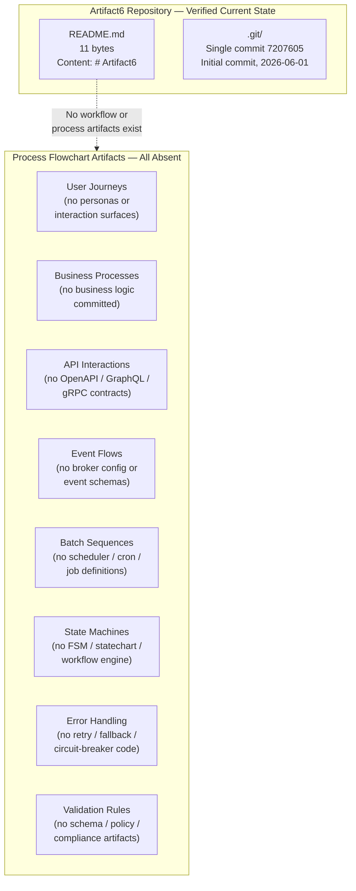
```mermaid
graph TB
    subgraph Current["Artifact6 Repository — Verified Current State"]
        README["README.md<br/>11 bytes<br/>Content: # Artifact6"]
        GitMeta[".git/<br/>Single commit 7207605<br/>Initial commit, 2026-06-01"]
    end

    subgraph AbsentWorkflowArtifacts["Process Flowchart Artifacts — All Absent"]
        UJ["User Journeys<br/>(no personas or<br/>interaction surfaces)"]
        BP["Business Processes<br/>(no business logic<br/>committed)"]
        API["API Interactions<br/>(no OpenAPI / GraphQL /<br/>gRPC contracts)"]
        EVT["Event Flows<br/>(no broker config or<br/>event schemas)"]
        BATCH["Batch Sequences<br/>(no scheduler / cron /<br/>job definitions)"]
        STATE["State Machines<br/>(no FSM / statechart /<br/>workflow engine)"]
        ERR["Error Handling<br/>(no retry / fallback /<br/>circuit-breaker code)"]
        VAL["Validation Rules<br/>(no schema / policy /<br/>compliance artifacts)"]
    end

    README -.->|"No workflow or<br/>process artifacts exist"| AbsentWorkflowArtifacts
```

The dashed edge denotes the absence of any path from the repository's sole content to a process-flowchart layer. Because every category of process-flowchart artifact is empty, no concrete flowchart, sequence diagram, or state diagram can be constructed in this revision.

---

## 4.2 SYSTEM WORKFLOWS EVIDENCE MAP

### 4.2.1 Core Business Processes Evidence Map

The section prompt requires documentation of end-to-end user journeys, system interactions, decision points, and error handling paths for core business processes. The following table records, for each required element, the evidence available in the repository.

| Required Workflow Element | Evidence in Repository | Documentable? |
|---|---|---|
| End-to-end user journeys | No user personas or stakeholder register (per Section 1.1, established in 1.3.3.2); no UX documentation, wireframes, or user-flow diagrams; no source code implementing UI or CLI surfaces | No |
| System interactions | No system components beyond `README.md` and `.git/` metadata (per Section 1.2.2.2); no inter-module or inter-service communication paths committed | No |
| Decision points | No business logic implemented (per Section 2.3.4); no conditional branches exist in any committed source — no source code exists | No |
| Error handling paths | No exception types, error taxonomies, recovery flows, or error-handling middleware committed; no error-tracking integration (per Section 3.5.1) | No |

Because no core business process can be enumerated, no end-to-end user journey diagrams, system-interaction sequence diagrams, decision flowcharts, or error-recovery diagrams can be authored against repository evidence.

### 4.2.2 Integration Workflows Evidence Map

The section prompt requires documentation of data flow between systems, API interactions, event processing flows, and batch processing sequences. The following table records the evidence available for each.

| Required Integration Element | Evidence in Repository | Documentable? |
|---|---|---|
| Data flow between systems | No data stores configured (per Section 3.6.1, which confirms "None declared" across all storage categories); no ETL configs or data-pipeline definitions committed | No |
| API interactions | No API client SDKs, server-side endpoint handlers, or contract specifications (OpenAPI, GraphQL SDL, gRPC `.proto`) committed (per Section 3.5.2) | No |
| Event processing flows | No message broker clients (Kafka, RabbitMQ, SQS) committed (per Section 3.6.1); no event schemas, topic definitions, consumer groups, or stream processors | No |
| Batch processing sequences | No scheduler configuration (cron, Airflow, Prefect, Dagster); no batch-job definitions or job-runner manifests; no CI/CD batch tasks (per Section 3.7.5) | No |

Because no integration surface exists, no data-flow diagrams, API sequence diagrams, event-stream topology diagrams, or batch-orchestration diagrams can be authored.

---

## 4.3 FLOWCHART REQUIREMENTS EVIDENCE MAP

### 4.3.1 Per-Workflow Elements Evidence Map

The section prompt requires that each major workflow include start and end points, process steps, decision diamonds, system boundaries, user touchpoints, error states and recovery paths, and timing/SLA considerations. The following table records the evidence available for each element category.

| Required Per-Workflow Element | Evidence in Repository | Documentable? |
|---|---|---|
| Start and end points | No workflows exist to bracket with start/end nodes | No |
| Process steps | No process implementations committed; no functional decomposition (per Section 2.3) | No |
| Decision diamonds | No conditional business logic exists; no policy or rules engine committed | No |
| System boundaries | No system boundary declared (per Section 1.3.1.2, which marks "System boundary: Not declared"); no context diagram or C4-model documentation committed | No |
| User touchpoints | No UI assets, web endpoints, CLI commands, or interaction surfaces committed; no user personas (per Section 1.3.3.2) | No |
| Error states and recovery paths | No state machines, error taxonomies, or recovery procedures committed; no runbooks or incident playbooks | No |
| Timing and SLA considerations | No NFRs, SLAs, error budgets, or latency targets declared (per Section 1.2.3.3, which confirms all KPI categories as "Not declared in repository") | No |

### 4.3.2 Validation Rules Evidence Map

The section prompt requires documentation of business rules at each step, data validation requirements, authorization checkpoints, and regulatory compliance checks. The following table records the evidence available for each.

| Required Validation Element | Evidence in Repository | Documentable? |
|---|---|---|
| Business rules at each step | No business logic implemented or specified (per Section 2.3.4, which marks "Business Rules: No"); no decision tables, policy files, or rules-engine artifacts committed | No |
| Data validation requirements | No validation schemas (JSON Schema, Joi, Pydantic, Zod, ajv, class-validator, etc.) committed (per Section 2.3.4); no input-parameter contracts (per Section 2.3.3) | No |
| Authorization checkpoints | No authentication implementation (per Section 3.5.3); no RBAC/ABAC policy files; no middleware, decorators, or guards enforcing access control | No |
| Regulatory compliance checks | No regulatory references (GDPR, HIPAA, SOC 2, PCI DSS, ISO 27001, FedRAMP, etc.) committed (per Section 2.3.4); no compliance-control matrices or audit-evidence artifacts | No |

Because no validation logic exists at the implementation, schema, policy, or compliance-mapping level, no validation-gated workflow diagrams can be authored.

---

## 4.4 TECHNICAL IMPLEMENTATION EVIDENCE MAP

### 4.4.1 State Management Evidence Map

The section prompt requires documentation of state transitions, data persistence points, caching requirements, and transaction boundaries. The following table records the evidence available for each.

| Required State-Management Element | Evidence in Repository | Documentable? |
|---|---|---|
| State transitions | No state machines, finite-state-machine (FSM) definitions, statecharts (e.g., XState), or workflow engines (Temporal, Cadence, Airflow) committed | No |
| Data persistence points | No data stores configured (per Section 3.6.1); no ORM models, schema files, or migration directories (per Section 3.6.2); no transactional code paths | No |
| Caching requirements | No cache client configurations (Redis, Memcached, in-process LRU) committed (per Section 3.6.1); caching strategy explicitly "undeclared" (per Section 3.6.3) | No |
| Transaction boundaries | No transactional code (BEGIN/COMMIT/ROLLBACK), distributed-transaction coordinators, or saga orchestrators committed; persistence strategy "undeclared" (per Section 3.6.3) | No |

Because no state-bearing entities exist, no state transition diagrams, persistence-point overlays, cache-flow diagrams, or transaction-boundary annotations can be authored.

### 4.4.2 Error Handling Evidence Map

The section prompt requires documentation of retry mechanisms, fallback processes, error notification flows, and recovery procedures. The following table records the evidence available for each.

| Required Error-Handling Element | Evidence in Repository | Documentable? |
|---|---|---|
| Retry mechanisms | No retry libraries (Tenacity, Polly, retry, backoff, resilience4j) or retry-policy configurations committed; no exponential-backoff or jitter implementations | No |
| Fallback processes | No fallback handlers, circuit breakers (Hystrix, resilience4j), bulkheads, or graceful-degradation strategies committed | No |
| Error notification flows | No alerting configuration (PagerDuty, Opsgenie, Slack webhooks); no error-tracking integration (Sentry, Bugsnag, Rollbar) committed (per Section 3.5.1) | No |
| Recovery procedures | No runbooks, disaster-recovery plans, or incident response playbooks committed; no RPO/RTO targets (per Section 3.6.3); no backup procedures declared | No |

Because no error-handling surface exists at the code, configuration, or operational-documentation level, no retry-flow diagrams, fallback decision trees, notification-pipeline diagrams, or recovery-procedure flowcharts can be authored.

---

## 4.5 REQUIRED DIAGRAMS STATUS

### 4.5.1 Required Diagram Inventory

The section prompt mandates the generation of five distinct Mermaid.js diagram categories. The table below records each required diagram, the subject matter it would depict, and the producibility status given the verified repository state.

| Required Diagram | Subject Matter Required | Producibility Status |
|---|---|---|
| High-level system workflow | End-to-end workflow across system components | **Not producible** — no system components exist beyond `README.md` and `.git/` (per Section 1.2.2.2); no workflow surface |
| Detailed process flows for each core feature | Per-feature step-by-step process diagrams | **Not producible** — Feature Catalog is empty (per Section 2.2.1); no features to diagram |
| Error handling flowcharts | Exception detection, classification, recovery paths | **Not producible** — no error taxonomy, exception hierarchy, or recovery logic committed (per Section 4.4.2 above) |
| Integration sequence diagrams | Cross-system message exchanges over time | **Not producible** — no integrations exist (per Section 1.2.1.3 and Section 3.5.1); no contracts or clients committed |
| State transition diagrams | Entity lifecycle and state-change rules | **Not producible** — no state-bearing entities, FSMs, or domain models committed (per Section 4.4.1 above) |

### 4.5.2 Diagram Producibility Status

The only Mermaid diagram that can be honestly authored at this time is the **Repository State Snapshot** (Section 4.1.3), which is a structural inventory of the repository's current contents alongside an explicit enumeration of absent process-flowchart artifacts. This diagram intentionally mirrors the precedent established in Sections 1.2.2.2, 2.4.3, and 3.1.3 and does not depict any workflow, sequence, or state transition.

No other diagram in the required inventory can be produced without fabricating content that has no repository evidence — an action explicitly prohibited by the evidence-only constraint (Section 2.7.1) and the section-prompt fidelity constraint (Section 3.1.2).

---

## 4.6 CROSS-REFERENCES TO PRIOR SECTIONS

The findings in this section derive from — and remain consistent with — verified evidence already recorded in prior sections of this Technical Specification. The table below maps the absences documented in Section 4 to their authoritative source sections.

| Section 4 Subsection | Authoritative Prior-Section Finding |
|---|---|
| 4.2.1 Core Business Processes | Section 1.1 (Executive Summary) — empty repository state; Section 1.2.2.1 — "primary system capabilities is **empty**"; Section 1.3.1.1 — "None" across must-have capabilities and primary user workflows |
| 4.2.2 Integration Workflows | Section 1.2.1.3 — "No client SDKs, API contracts, or interface definitions present"; Section 3.5.1 — all third-party service categories "None"; Section 3.6.1 — no message broker, no event store |
| 4.3.1 Per-Workflow Elements | Section 1.3.1.2 — "System boundary: Not declared"; Section 1.2.3.3 — all KPI categories "Not declared in repository"; Section 2.3.3 — no input parameters, output shapes, performance criteria, or data requirements |
| 4.3.2 Validation Rules | Section 2.3.4 — all validation-rule categories ("Business Rules", "Data Validation", "Security Requirements", "Compliance Requirements") marked "No" |
| 4.4.1 State Management | Section 3.6.1 — all data-persistence categories "None declared"; Section 3.6.3 — "Persistence strategy", "Caching strategy", and "Schema evolution" all "undeclared" |
| 4.4.2 Error Handling | Section 3.5.1 — "Error tracking" and "Observability / monitoring" both "None"; Section 3.6.3 — "Backup and recovery: RPO/RTO targets, backup cadence, restore procedures — undeclared" |
| 4.5.1 Required Diagram Inventory | Section 1.2.2.2 — only `README.md` + `.git/`; Section 2.2.1 — "The Feature Catalog is empty"; Section 2.4.1 — "No feature relationships exist to document" |

This cross-reference table establishes that Section 4's documented absences are not novel claims but rather direct logical consequences of evidence already accepted in prior sections of this specification.

---

## 4.7 REQUIRED INPUTS TO POPULATE PROCESS FLOWCHARTS

### 4.7.1 Artifact-to-Subsection Mapping

Substantive process flowchart documentation will become possible once one or more of the following artifacts are committed to the repository or supplied as authoritative user context. The mapping below indicates which subsection of Section 4 each artifact category would unlock.

| Artifact Required | Section 4 Content Unlocked |
|---|---|
| Source code modules implementing discrete business operations | 4.2.1 Core Business Processes; 4.5.1 High-level system workflow |
| Product brief / PRD identifying user personas and journeys | 4.2.1 End-to-end user journeys; 4.3.1 User touchpoints |
| API specifications (OpenAPI, GraphQL SDL, gRPC `.proto`) | 4.2.2 API Interactions; 4.5.1 Integration sequence diagrams |
| Event schemas, message-broker configurations (Kafka topics, RabbitMQ exchanges, SQS queues) | 4.2.2 Event Processing Flows |
| Scheduler / cron / batch-job definitions (Airflow DAGs, Prefect flows, K8s CronJobs) | 4.2.2 Batch Processing Sequences |
| Validation schemas (JSON Schema, Joi, Pydantic, Zod, class-validator) | 4.3.2 Data Validation Requirements |
| Authentication/authorization implementation (RBAC/ABAC policies, OIDC config, middleware) | 4.3.2 Authorization Checkpoints |
| Compliance documentation (GDPR / HIPAA / SOC 2 / PCI control mappings) | 4.3.2 Regulatory Compliance Checks |
| State machine definitions (XState charts, Temporal/Cadence workflows, statecharts) | 4.4.1 State Transitions; 4.5.1 State transition diagrams |
| Database schemas, ORM models, migration directories | 4.4.1 Data Persistence Points |
| Cache client configurations (Redis, Memcached, in-process cache definitions) | 4.4.1 Caching Requirements |
| Transaction-management code (DB sessions, distributed-tx coordinators, saga orchestrators) | 4.4.1 Transaction Boundaries |
| Retry-policy code or configuration (Tenacity, Polly, resilience4j, backoff libraries) | 4.4.2 Retry Mechanisms |
| Circuit-breaker, bulkhead, or fallback handler implementations | 4.4.2 Fallback Processes |
| Alerting and incident-notification configurations (PagerDuty, Opsgenie, Sentry, Slack webhooks) | 4.4.2 Error Notification Flows |
| Runbooks, disaster-recovery plans, RPO/RTO declarations | 4.4.2 Recovery Procedures |
| Non-functional requirements documents with SLAs, latency targets, throughput targets | 4.3.1 Timing and SLA Considerations |
| Architecture Decision Records documenting workflow design choices | All subsections (justification and rationale content) |

### 4.7.2 Recommended Artifact Hierarchy for Workflow Documentation

When the project transitions out of the placeholder phase, the following dependency hierarchy is recommended to support a fully populated Process Flowchart section. Each downstream artifact relies on its upstream predecessors for context and traceability.

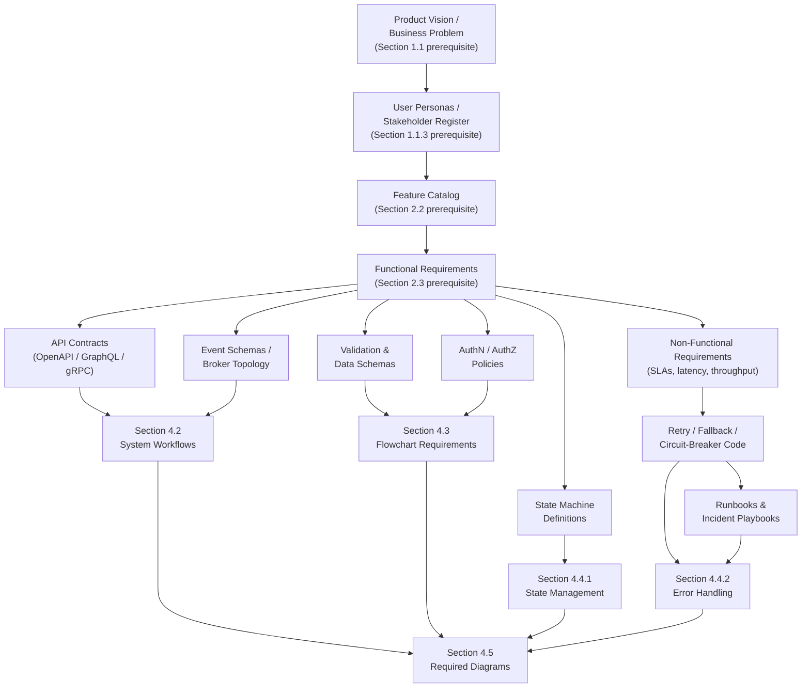
```mermaid
graph TB
    Vision["Product Vision /<br/>Business Problem<br/>(Section 1.1 prerequisite)"]
    Personas["User Personas /<br/>Stakeholder Register<br/>(Section 1.1.3 prerequisite)"]
    Features["Feature Catalog<br/>(Section 2.2 prerequisite)"]
    Reqs["Functional Requirements<br/>(Section 2.3 prerequisite)"]
    NFR["Non-Functional Requirements<br/>(SLAs, latency, throughput)"]
    APIs["API Contracts<br/>(OpenAPI / GraphQL / gRPC)"]
    Schemas["Validation &<br/>Data Schemas"]
    Events["Event Schemas /<br/>Broker Topology"]
    StateModels["State Machine<br/>Definitions"]
    AuthZ["AuthN / AuthZ<br/>Policies"]
    Reliability["Retry / Fallback /<br/>Circuit-Breaker Code"]
    Runbooks["Runbooks &<br/>Incident Playbooks"]
    Workflows["Section 4.2<br/>System Workflows"]
    Validation["Section 4.3<br/>Flowchart Requirements"]
    StateMgmt["Section 4.4.1<br/>State Management"]
    ErrHandling["Section 4.4.2<br/>Error Handling"]
    Diagrams["Section 4.5<br/>Required Diagrams"]

    Vision --> Personas
    Personas --> Features
    Features --> Reqs
    Reqs --> APIs
    Reqs --> Schemas
    Reqs --> Events
    Reqs --> StateModels
    Reqs --> AuthZ
    Reqs --> NFR
    NFR --> Reliability
    Reliability --> Runbooks
    APIs --> Workflows
    Events --> Workflows
    Schemas --> Validation
    AuthZ --> Validation
    StateModels --> StateMgmt
    Reliability --> ErrHandling
    Runbooks --> ErrHandling
    Workflows --> Diagrams
    Validation --> Diagrams
    StateMgmt --> Diagrams
    ErrHandling --> Diagrams
```

The hierarchy makes explicit that workflow diagrams sit downstream of feature definitions, which themselves sit downstream of personas and vision. Authoring credible flowcharts requires that this entire upstream chain be populated; partial population permits only partial diagram authoring.

---

## 4.8 FORWARD PLAN

### 4.8.1 Section Revision Triggers

This Process Flowchart section should be revised when any of the following repository events occur. The trigger table below extends the patterns established in Sections 2.8.1 and 3.11.1.

| Trigger Event | Resulting Section Revision |
|---|---|
| First source-code module with control flow committed | 4.2.1 Core Business Processes (initial diagrammatic content) |
| First API contract (OpenAPI / GraphQL SDL / `.proto`) committed | 4.2.2 API Interactions; 4.5.1 Integration sequence diagrams |
| First event schema or broker configuration committed | 4.2.2 Event Processing Flows |
| First scheduler / batch-job definition committed | 4.2.2 Batch Processing Sequences |
| First validation schema or policy file committed | 4.3.2 Validation Rules |
| First authentication / authorization configuration committed | 4.3.2 Authorization Checkpoints |
| First compliance-control mapping committed | 4.3.2 Regulatory Compliance Checks |
| First state machine / workflow-engine definition committed | 4.4.1 State Transitions; 4.5.1 State transition diagrams |
| First database schema / ORM model / migration committed | 4.4.1 Data Persistence Points |
| First cache configuration committed | 4.4.1 Caching Requirements |
| First retry / circuit-breaker / fallback implementation committed | 4.4.2 Retry Mechanisms; Fallback Processes |
| First alerting / incident-notification configuration committed | 4.4.2 Error Notification Flows |
| First runbook or disaster-recovery plan committed | 4.4.2 Recovery Procedures |
| First NFR document with SLAs committed | 4.3.1 Timing and SLA Considerations |
| ADR or `ARCHITECTURE.md` committed declaring workflow design | All subsections (justification content) |
| Authoritative user context supplied with concrete workflow definitions | All subsections, with explicit cross-reference to the authoritative source |

### 4.8.2 Documentation Consistency Commitments

When this section is next revised, the author should:

1. **Replace the empty-state evidence maps** in Sections 4.2, 4.3, and 4.4 with populated diagrams and accompanying narrative descriptions of each diagram.
2. **Maintain alignment with Section 1.2.2.2** (Major System Components), which must concurrently be updated to enumerate the components participating in the documented workflows.
3. **Coordinate with Section 2.2** (Feature Catalog), so that each feature's process flow is cross-referenced via the feature's `F-XXX` identifier.
4. **Coordinate with Section 2.3** (Functional Requirements Table), so that decision diamonds in workflow diagrams reference the `F-XXX-RQ-YYY` identifiers driving each decision.
5. **Coordinate with Section 2.4** (Feature Relationships), so that integration sequence diagrams reflect the integration points declared in the Feature Relationships map.
6. **Coordinate with Section 2.6** (Traceability Matrix), so that each diagram is traceable to one or more requirements, ADRs, and test cases.
7. **Add swim lanes** to all multi-actor workflow diagrams, distinguishing user actions, system components, and external services, per the section prompt directive.
8. **Annotate timing constraints** on diagrams once SLAs or performance budgets are declared (per the Section 1.2.3.3 KPI dependency).
9. **Update Section 3.10** (Security Implications) cross-references for any authorization checkpoint flows documented herein.

### 4.8.3 Linkage to Subsequent Specification Sections

Process Flowchart documentation, once populated, will provide source material for downstream specification sections that have not yet been authored. The table below identifies those forward dependencies.

| Forward-Dependent Concern | Coordination Required |
|---|---|
| System Architecture | Architecture must reflect component participation in documented workflows |
| Data Model & Schema | Persistence points in Section 4.4.1 must align with schema designs |
| API Specifications | Integration sequence diagrams must align with API contracts |
| Security Architecture | Authorization checkpoint flows from Section 4.3.2 must align with security controls |
| Test Strategy | Each decision diamond and state transition becomes a test-case anchor |
| Operations & Maintenance | Recovery procedure diagrams from Section 4.4.2 become runbook source material |
| Monitoring & Observability | Timing/SLA annotations become SLO measurement targets |

---

## 4.9 SECTION VERSIONING

Per the precedent established in Sections 2.7.3 and 3.11.3, this section is versioned alongside repository commits to enable traceability of empty-state documentation against the underlying repository evidence.

| Version | Date | Repository Commit | Notable State |
|---|---|---|---|
| 1.0 | 2026-06-01 | `7207605` | Empty repository; section documents the absence of all process-flowchart artifacts (workflows, integrations, validation rules, state management, error handling) and identifies the artifact inputs required to enable substantive content |

Subsequent versions of this section should be authored when any of the trigger events in Section 4.8.1 occur. Each subsequent version should preserve the cross-reference structure to Sections 1.x, 2.x, and 3.x while replacing empty-state evidence maps with populated content.

---

## 4.10 REFERENCES

### 4.10.1 Files Examined

- `README.md` — The repository's sole tracked file (11 bytes, content: `# Artifact6`). Used to confirm the absence of any workflow narrative, process description, integration documentation, or operational procedures in the sole committed file.

### 4.10.2 Folders Explored

- `/` (repository root) — Contains exactly one tracked child (`README.md`) plus `.git/` metadata. Used to confirm the absence of `src/`, `app/`, `services/`, `api/`, `workflows/`, `events/`, `jobs/`, `runbooks/`, `docs/`, and all other directories that would typically host process-flowchart source artifacts.

### 4.10.3 Repository-Wide Searches Conducted

- Semantic search for "workflows business processes user journeys decision points" — zero results.
- Semantic search for "API endpoints request handlers controllers services" — zero results.
- Semantic search for "state management transactions error handling retry" — zero results.
- Semantic search for "event processing batch jobs integration sequences" — zero results.
- Semantic search for "data flow validation rules business logic" — zero results.
- Semantic search for "source code modules application logic" — zero results.
- Folder search for any subdirectory containing application logic — zero results.
- Folder search for any subdirectory in the repository — zero results (only `.git/` metadata exists).

### 4.10.4 Cross-Referenced Technical Specification Sections

- **Section 1.1 (Executive Summary)** — Established the empty repository state, the undefined business problem, and the absence of stakeholders and personas, foreclosing the documentation of user journeys.
- **Section 1.2 (System Overview)** — Specifically subsection 1.2.1.3 ("Enterprise Landscape Integration") confirming no upstream/downstream integrations; subsection 1.2.2.1 confirming "the list of primary system capabilities is **empty**"; subsection 1.2.2.2 establishing the repository inventory (only `README.md` + `.git/`); subsection 1.2.3.3 confirming all KPI categories as "Not declared in repository" (foreclosing SLA annotations).
- **Section 1.3 (Scope)** — Provided the verified repository facts table; subsection 1.3.1.1 confirming "None" across must-have capabilities, primary user workflows, essential integrations, and key technical requirements; subsection 1.3.1.2 confirming "System boundary: Not declared".
- **Section 2.2 (Feature Catalog)** — Confirmed "The Feature Catalog is **empty**," foreclosing per-feature process-flow diagrams.
- **Section 2.3 (Functional Requirements Table)** — Subsection 2.3.4 confirmed all validation-rule categories ("Business Rules", "Data Validation", "Security Requirements", "Compliance Requirements") as "No".
- **Section 2.4 (Feature Relationships)** — Confirmed "No feature relationships exist to document," foreclosing integration topology diagrams.
- **Section 2.7 (Documentation Constraints and Assumptions)** — Provided the evidence-only documentation constraint and the section-prompt fidelity constraint governing the treatment of empty content categories in Section 4.
- **Section 2.8 (Forward Plan)** — Established the trigger-based revision pattern and the artifact hierarchy diagram pattern adopted by Sections 4.8.1 and 4.7.2 respectively.
- **Section 3.1 (Section Population Status)** — Established the authoritative-state-declaration pattern and the placeholder-diagram pattern adopted by Sections 4.1.1 and 4.1.3 respectively.
- **Section 3.5 (Third-Party Services)** — Subsection 3.5.1 confirmed all external-service categories as "None" (foreclosing integration sequence diagrams); subsection 3.5.3 confirmed no authentication / authorization infrastructure (foreclosing authorization checkpoint flows).
- **Section 3.6 (Databases & Storage)** — Subsection 3.6.1 confirmed all storage categories as "None declared" (foreclosing data persistence point overlays); subsection 3.6.3 confirmed persistence strategy, caching strategy, backup and recovery, and schema evolution as all "undeclared" (foreclosing state management and recovery procedure diagrams).
- **Section 3.7 (Development & Deployment)** — Confirmed no CI/CD configuration exists (foreclosing automated batch-processing workflow diagrams).
- **Section 3.11 (Forward Plan For This Section)** — Established the trigger-table and documentation-consistency-commitment patterns adopted by Sections 4.8.1 and 4.8.2 respectively.
- **Section 3.12 (References)** — Established the references-subsection structure adopted by Section 4.10.

# 5. System Architecture

## 5.1 SECTION POPULATION STATUS

### 5.1.1 Authoritative State Declaration

The System Architecture section, as mandated by the governing section prompt, requires documentation of high-level architecture (system overview, core components, data flows, external integrations), per-component details (purpose, technologies, interfaces, persistence, scaling), technical decisions (architecture style, communication patterns, storage rationale, caching strategy, security mechanisms), and cross-cutting concerns (monitoring, logging, error handling, authentication/authorization, performance SLAs, disaster recovery). It further requires the production of multiple Mermaid.js diagrams including component interaction diagrams, state transition diagrams, sequence diagrams, decision tree diagrams, Architecture Decision Records (ADRs), and error-handling flows.

**No system architecture can be authoritatively documented for Artifact6 from repository evidence.** This finding is the direct, cumulative consequence of the verified state established across Sections 1.1 through 4.10:

- **No system components exist** beyond `README.md` (11 bytes, content `# Artifact6`) and `.git/` metadata, as established in Section 1.2.2.2 (Major System Components). With no components present, no architecture connecting them can exist.
- **The core technical approach is undetermined**, as established in Section 1.2.2.3, which records that no technology stack, programming language, runtime, framework, architectural pattern, or design paradigm is indicated by any artifact in the repository.
- **No business capabilities exist**, as established in Section 1.2.2.1, which confirms that the list of primary system capabilities is empty.
- **No external integrations exist**, as established in Sections 1.2.1.3 and 3.5.1, which confirm zero external service integrations across all eleven service categories enumerated.
- **No data-persistence layer exists**, as established in Section 3.6.1, which confirms all ten storage categories are "None declared."
- **No process flows exist**, as established in Section 4.5.1, which confirms that none of the five required process-flowchart diagram categories are producible.
- **No technology selections exist**, as established in Sections 3.2, 3.3, 3.4, 3.5, and 3.7, which confirm zero programming languages, frameworks, dependencies, third-party services, or build/deployment tooling adopted.

The repository's sole tracked file is `README.md` (11 bytes, containing only the single Markdown heading `# Artifact6`), introduced by the single commit `7207605` ("Initial commit", 2026-06-01, committer `Blitzy-Multi <mmwforfinance@gmail.com>`). No source code modules, configuration files, dependency manifests, infrastructure-as-code artifacts, container definitions, CI/CD pipelines, API contracts, schema files, ADRs, `ARCHITECTURE.md`, `SECURITY.md`, runbooks, or design documentation of any kind have been committed.

### 5.1.2 Section-Prompt Fidelity Constraint

The governing section prompt explicitly directs: *"Only include sections and items that are actually relevant to this system, based on your analysis of its requirements. Don't add any items that aren't clearly applicable."* This directive, in conjunction with the evidence-only documentation constraint articulated in Section 2.7.1 — which prohibits speculation about "typical" features or technologies — and the section-prompt fidelity constraint articulated in Section 3.1.2, governs the scope of this section. With zero applicable architectural items present in the repository, this section legitimately documents the **inventory of absences** for each required architectural element rather than fabricating components, decisions, or diagrams.

Specifically, this section does **not**:

- Invent architecture styles (monolith, microservices, layered, event-driven, hexagonal, serverless, etc.) for a system whose technical approach is explicitly undetermined per Section 1.2.2.3.
- Fabricate components, services, modules, or layers that have no corresponding source code or configuration in the repository.
- Hypothesize communication patterns, transport protocols, or API contracts against services that have no committed clients or specifications (per Section 3.5.2).
- Assert data flows, transformation pipelines, or persistence patterns against a data layer that is null on every storage axis (per Section 3.6.1).
- Propose security mechanisms (authentication, authorization, encryption, secrets management) absent any committed `SECURITY.md`, policy file, identity-provider configuration, or auth library (per Section 3.5.3).
- Declare monitoring, observability, logging, or tracing strategies for which no agents, exporters, frameworks, or configurations have been committed (per Section 3.5.1).
- Manufacture SLAs, KPIs, performance budgets, RPO/RTO targets, or disaster-recovery procedures (per Sections 1.2.3.3 and 4.4.2).
- Assign version numbers to technologies that have not been adopted, including those reproduced in the candidate stack of Section 3.9.

### 5.1.3 Repository State Snapshot

Consistent with the precedent established in Sections 1.2.2.2, 2.4.3, 3.1.3, and 4.1.3, the diagram below restates the verified repository inventory and overlays the categories of system-architecture artifact that are confirmed absent. This is the only Mermaid diagram producible against current repository evidence; all other required diagrams in Section 5 (component interaction, state transition, sequence, decision tree, ADR, error-handling flow) cannot be authored without fabricating content, which is prohibited by Section 2.7.1.

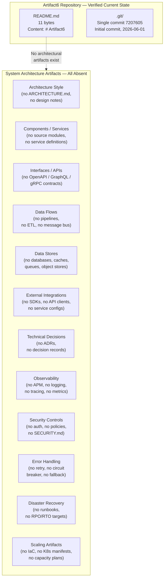
```mermaid
graph TB
    subgraph Current["Artifact6 Repository — Verified Current State"]
        README["README.md<br/>11 bytes<br/>Content: # Artifact6"]
        GitMeta[".git/<br/>Single commit 7207605<br/>Initial commit, 2026-06-01"]
    end

    subgraph AbsentArchArtifacts["System Architecture Artifacts — All Absent"]
        STYLE["Architecture Style<br/>(no ARCHITECTURE.md,<br/>no design notes)"]
        COMP["Components / Services<br/>(no source modules,<br/>no service definitions)"]
        IFACE["Interfaces / APIs<br/>(no OpenAPI / GraphQL /<br/>gRPC contracts)"]
        FLOW["Data Flows<br/>(no pipelines,<br/>no ETL, no message bus)"]
        STORE["Data Stores<br/>(no databases, caches,<br/>queues, object stores)"]
        EXT["External Integrations<br/>(no SDKs, no API clients,<br/>no service configs)"]
        DEC["Technical Decisions<br/>(no ADRs,<br/>no decision records)"]
        OBS["Observability<br/>(no APM, no logging,<br/>no tracing, no metrics)"]
        SEC["Security Controls<br/>(no auth, no policies,<br/>no SECURITY.md)"]
        ERR["Error Handling<br/>(no retry, no circuit<br/>breaker, no fallback)"]
        DR["Disaster Recovery<br/>(no runbooks,<br/>no RPO/RTO targets)"]
        SCALE["Scaling Artifacts<br/>(no IaC, no K8s manifests,<br/>no capacity plans)"]
    end

    README -.->|"No architectural<br/>artifacts exist"| AbsentArchArtifacts
```

The dashed edge denotes the absence of any path from the repository's sole tracked content to any system-architecture layer. Because every category of system-architecture artifact is empty, no concrete component diagram, sequence diagram, decision tree, or error-handling flow can be constructed in this revision.

---

## 5.2 HIGH-LEVEL ARCHITECTURE EVIDENCE MAP

### 5.2.1 System Overview Evidence Map

The section prompt requires a detailed textual description of the overall architectural style and rationale, key architectural principles and patterns, and the system's boundaries and major interfaces. The evidence available for each element is summarized below.

| Required Element | Evidence in Repository | Documentable? |
|---|---|---|
| Overall architectural style and rationale | No `ARCHITECTURE.md`, design notes, ADRs, or source-code indicators of architectural style committed; core technical approach explicitly "undetermined" per Section 1.2.2.3 | No |
| Key architectural principles and patterns | No design-pattern implementations (no domain layer, service layer, repository, factory, mediator, etc.); no pattern documentation committed | No |
| System boundaries | System boundary is not declared per Section 1.3.1.2; no external-facing API surface, no UI surface, no integration surface | No |
| Major interfaces | No API contracts (OpenAPI, GraphQL SDL, gRPC `.proto`), no UI route definitions, no public SDK clients committed per Sections 1.2.1.3 and 3.5.2 | No |

No high-level architectural style or principle is observable. The system's boundaries and interfaces are not declared. The architectural rationale that would justify any style selection cannot be retroactively authored against zero evidence.

### 5.2.2 Core Components Evidence Map

The section prompt requires a table of core components specifying Component Name, Primary Responsibility, Key Dependencies, and Integration Points along with Critical Considerations. With no components present, the table contents would be entirely fabricated and are therefore replaced with an evidence-map representation below.

| Component Catalog Element | Evidence in Repository | Documentable? |
|---|---|---|
| Component name enumeration | Only `README.md` and `.git/` metadata exist per Section 1.2.2.2; no source modules, services, or libraries to name | No |
| Primary responsibility assignment | No business capabilities exist per Section 1.2.2.1; no behavior is implemented to be attributed | No |
| Key dependencies per component | No dependency manifest of any kind committed across 15 package managers per Section 3.4; no inter-component or external dependencies declared | No |
| Integration points per component | No client SDKs, API contracts, or interface definitions present per Sections 1.2.1.3 and 3.5.1; no integration surface to characterize | No |

The Core Components Table required by the prompt would have zero rows. No component name, responsibility, dependency, or integration point can be sourced from repository evidence.

### 5.2.3 Data Flow Evidence Map

The section prompt requires documentation of primary data flows between components, integration patterns and protocols, data transformation points, and key data stores and caches. The evidence available for each element is summarized below.

| Required Data-Flow Element | Evidence in Repository | Documentable? |
|---|---|---|
| Primary data flows between components | No components exist (per Section 1.2.2.2); no inter-component data flows possible | No |
| Integration patterns and protocols | No transport-protocol selection (REST, gRPC, GraphQL, WebSockets, MQTT, AMQP) indicated; no client libraries or server frameworks per Section 3.3 | No |
| Data transformation points | No ETL definitions, no schema-mapping code, no serialization/deserialization libraries per Section 4.2.2 | No |
| Data stores and caches | All ten storage categories "None declared" per Section 3.6.1; caching strategy explicitly "undeclared" per Section 3.6.3 | No |

The data-flow narrative required by the prompt cannot be authored. No data enters, exits, or moves within Artifact6 because no data-bearing artifacts exist.

### 5.2.4 External Integration Points Evidence Map

The section prompt requires a table of external integration points specifying System Name, Integration Type, Data Exchange Pattern, Protocol/Format, and SLA Requirements. The evidence available for each element is summarized below.

| External Integration Element | Evidence in Repository | Documentable? |
|---|---|---|
| Upstream/downstream system identification | No client SDKs, API contracts, or interface definitions present per Section 1.2.1.3; no upstream or downstream systems referenced | No |
| Integration type classification | No synchronous (HTTP, gRPC) or asynchronous (queue, event, webhook) integration code committed | No |
| Data exchange protocol and format | No serialization schemas (JSON Schema, Protobuf, Avro, XSD) committed; no Content-Type negotiation code | No |
| SLA requirements per integration | All KPI categories "Not declared in repository" per Section 1.2.3.3; no SLO or SLA documentation committed | No |

The External Integration Points Table required by the prompt would have zero rows. The eleven third-party service categories enumerated in Section 3.5.1 (external REST/GraphQL APIs, authentication/identity providers, payment/billing services, email/messaging services, observability/monitoring, error tracking, analytics, cloud provider, feature flags, CDN, search services) are all confirmed "None" with "no integration type" declared.

---

## 5.3 COMPONENT DETAILS EVIDENCE MAP

### 5.3.1 Per-Component Documentation Evidence Map

The section prompt requires, for each major component, specification of purpose and responsibilities, technologies and frameworks used, key interfaces and APIs, data persistence requirements, and scaling considerations. With no components present (per Section 1.2.2.2), no such per-component documentation can be produced. The evidence map below records the absence on each axis.

| Per-Component Documentation Axis | Evidence in Repository | Documentable? |
|---|---|---|
| Purpose and responsibilities | No components exist to assign purpose; no capabilities declared per Section 1.2.2.1 | No |
| Technologies and frameworks used | Zero programming languages adopted across 10+ language families per Section 3.2; zero frameworks adopted across backend, frontend, mobile, testing, ORM, ML, and CSS categories per Section 3.3 | No |
| Key interfaces and APIs | No API contracts (OpenAPI, GraphQL SDL, gRPC `.proto`) committed per Sections 3.5.2 and 4.2.2 | No |
| Data persistence requirements | No data stores configured per Section 3.6.1; persistence strategy "undeclared" per Section 3.6.3; no ORM models, schema files, or migrations per Section 3.6.2 | No |
| Scaling considerations | No scale targets, capacity plans, or topology documentation committed; no IaC, no container manifests, no Kubernetes definitions per Section 3.7 | No |

### 5.3.2 Required Component Diagrams Status

The section prompt mandates the production of detailed component interaction diagrams, state transition diagrams, and sequence diagrams for key flows. The producibility of each is recorded below.

| Required Diagram | Subject Matter Required | Producibility Status |
|---|---|---|
| Detailed component interaction diagrams | Inter-component message passing and dependency relationships | **Not producible** — no system components exist beyond `README.md` and `.git/` per Section 1.2.2.2 |
| State transition diagrams | Entity lifecycle and state-change rules | **Not producible** — no state machines, FSM definitions, statecharts, or workflow engines committed per Section 4.4.1 |
| Sequence diagrams for key flows | Cross-component or cross-system message exchanges over time | **Not producible** — no integrations exist per Sections 1.2.1.3 and 3.5.1; no contracts or clients committed per Section 4.5.1 |

The only Mermaid diagram that can be honestly authored in this section is the Repository State Snapshot in Section 5.1.3. All component-level diagrams remain deferred to a future revision when source code or component definitions are committed.

---

## 5.4 TECHNICAL DECISIONS EVIDENCE MAP

### 5.4.1 Architecture Style and Pattern Decisions

The section prompt requires documentation and justification of architecture style decisions and tradeoffs. The evidence available is summarized below.

| Technical Decision Element | Evidence in Repository | Documentable? |
|---|---|---|
| Architecture style decision | No ADRs, no `ARCHITECTURE.md`, no design notes committed per Section 1.2.2.3; no source code indicating style adoption | No |
| Tradeoff analysis | No engineering tradeoff documents committed; no `RATIONALE.md`, no design-review notes | No |
| Pattern adoption justification | No design pattern implementations identifiable; no pattern-justification documentation | No |

No architectural style has been selected; therefore no tradeoff analysis exists. Per Section 3.11.1, the commitment of an ADR or `ARCHITECTURE.md` is identified as the trigger event that would unlock architecture-style documentation.

### 5.4.2 Communication Pattern Decisions

The section prompt requires documentation of communication pattern choices (synchronous vs. asynchronous, request/response vs. event-driven, point-to-point vs. publish-subscribe). The evidence available is summarized below.

| Communication Pattern Element | Evidence in Repository | Documentable? |
|---|---|---|
| Transport protocol selection | No HTTP, gRPC, GraphQL, WebSocket, or message-broker libraries committed per Section 3.5.2 | No |
| Synchronous vs. asynchronous pattern | No request/response API surface, no event-driven infrastructure committed | No |
| Inter-service communication style | No service-mesh manifests (Istio, Linkerd, Consul Connect) committed per Section 3.5.2; no inter-service code surface exists | No |

No communication infrastructure exists. The eleven service categories enumerated in Section 3.5.1 are all confirmed "None," and the seven integration surfaces enumerated in Section 3.5.2 are all confirmed "Absent."

### 5.4.3 Data Storage and Caching Decisions

The section prompt requires documentation of data storage solution rationale and caching strategy justification. The evidence available is summarized below.

| Storage / Caching Decision Element | Evidence in Repository | Documentable? |
|---|---|---|
| Data storage solution selection | No data-persistence layer adopted across all ten storage categories per Section 3.6.1 | No |
| Storage rationale | No ADR documenting database selection, workload profile, or consistency model per Section 3.6.4 | No |
| Caching strategy (write-through, write-behind, cache-aside, TTL) | Caching strategy explicitly "undeclared" per Section 3.6.3 | No |
| Caching justification | No cache client configurations committed per Section 3.6.1; no caching ADR | No |

No storage technology has been adopted, configured, or referenced. Per Section 3.6.4, the required inputs to populate storage documentation are a database client or ORM dependency, a schema file or migration directory, a connection configuration, and an ADR — none of which exist in the repository.

### 5.4.4 Security Mechanism Decisions

The section prompt requires documentation of security mechanism selection. The evidence available is summarized below.

| Security Mechanism Element | Evidence in Repository | Documentable? |
|---|---|---|
| Authentication mechanism | No OAuth 2.0 / OIDC configuration, no JWT signing-key configuration, no SAML configuration per Section 3.5.3 | No |
| Authorization framework | No role-based or attribute-based access-control policy file per Section 3.5.3 | No |
| Encryption / secrets management | No `.env` files, no secrets-manager references, no encryption-library imports committed | No |
| Threat model / `SECURITY.md` | No `SECURITY.md`, no threat-model document, no security-policy file committed | No |

No security mechanism has been selected, configured, or referenced. Per Section 3.10.1, the security surface is null.

### 5.4.5 Required Decision Diagrams Status

The section prompt mandates the production of decision tree diagrams and Architecture Decision Records (ADRs). The producibility of each is recorded below.

| Required Artifact | Subject Matter Required | Producibility Status |
|---|---|---|
| Decision tree diagrams | Branching logic underlying architectural choices | **Not producible** — no decisions have been made or recorded; no decision artifacts to diagram |
| Architecture Decision Records (ADRs) | Numbered, narrative records of architectural decisions with context, options, decision, and consequences | **Not producible** — no ADRs committed; commitment of first ADR identified as forward-plan trigger per Section 3.11.1 |

No technical decisions have been recorded; therefore no decision tree or ADR can be authored against repository evidence.

---

## 5.5 CROSS-CUTTING CONCERNS EVIDENCE MAP

### 5.5.1 Monitoring and Observability Evidence Map

The section prompt requires documentation of the monitoring and observability approach. The evidence available is summarized below.

| Observability Element | Evidence in Repository | Documentable? |
|---|---|---|
| APM agent / instrumentation | No APM agent config (Datadog, New Relic, Dynatrace, AppDynamics) committed per Section 3.5.1 | No |
| Metrics export and aggregation | No metrics exporters (Prometheus client, StatsD, OpenMetrics) committed per Section 3.5.1 | No |
| Dashboards and SLO definitions | No Grafana / Datadog dashboard definitions; no SLO configuration committed | No |
| Health check / readiness endpoints | No HTTP server code exists in which to define health endpoints; no Kubernetes liveness/readiness manifests committed | No |

No observability surface exists. The "Observability / monitoring" category in Section 3.5.1 is confirmed "None" with "No APM agent config, log-aggregation config, or metrics exporters committed."

### 5.5.2 Logging and Tracing Evidence Map

The section prompt requires documentation of the logging and tracing strategy. The evidence available is summarized below.

| Logging / Tracing Element | Evidence in Repository | Documentable? |
|---|---|---|
| Logging framework | No logging framework imports (Winston, Bunyan, log4j, Python `logging`, structlog, zap, logrus) committed; no source files exist per Section 3.5.2 | No |
| Log configuration | No log-configuration files (`log4j2.xml`, `logback.xml`, `logging.conf`) committed | No |
| Distributed tracing | No tracing libraries (OpenTelemetry, Jaeger, Zipkin) committed; no tracing exporters configured | No |
| Log aggregation backend | No log-aggregation config (ELK, Splunk, Loki, CloudWatch Logs) committed per Section 3.5.1 | No |

No logging or tracing strategy can be documented. The logging and tracing infrastructure is absent on every axis.

### 5.5.3 Error Handling Evidence Map

The section prompt requires documentation of error handling patterns. This subsection consolidates the evidence already established in Section 4.4.2.

| Error Handling Element | Evidence in Repository | Documentable? |
|---|---|---|
| Retry mechanisms | No retry libraries (Tenacity, Polly, retry, backoff, resilience4j) committed per Section 4.4.2; no exponential-backoff or jitter implementations | No |
| Fallback processes / circuit breakers | No fallback handlers, circuit breakers (Hystrix, resilience4j), or bulkheads committed per Section 4.4.2 | No |
| Exception hierarchy / error taxonomy | No source files exist in which to define an exception hierarchy; no error-taxonomy documentation committed | No |
| Error notification flows | No alerting configuration (PagerDuty, Opsgenie, Slack webhooks); no error-tracking integration (Sentry, Bugsnag, Rollbar) committed per Sections 3.5.1 and 4.4.2 | No |

No error-handling surface exists at the code, configuration, or operational-documentation level. The error-handling flowchart required by the section prompt cannot be authored against repository evidence, confirming the finding in Section 4.5.1.

### 5.5.4 Authentication and Authorization Evidence Map

The section prompt requires documentation of the authentication and authorization framework. The evidence available is consolidated from Section 3.5.3 below.

| AuthN / AuthZ Element | Evidence in Repository | Documentable? |
|---|---|---|
| Authentication protocol | No OAuth 2.0 / OIDC client configuration, no JWT signing-key configuration or JWKS endpoint reference, no SAML configuration committed per Section 3.5.3 | No |
| Identity provider integration | No Auth0, Okta, Cognito, Azure AD, or Keycloak SDK references committed per Sections 3.5.1 and 3.5.3 | No |
| Authorization model | No role-based or attribute-based access-control policy file (no `casbin`, no OPA Rego, no policy bundles) per Section 3.5.3 | No |
| Session and credential management | No session-management code, no session-store configuration, no API-key management code per Section 3.5.3 | No |

No authentication or authorization framework can be documented. The AuthN/AuthZ surface is null.

### 5.5.5 Performance and SLA Evidence Map

The section prompt requires documentation of performance requirements and SLAs. The evidence available is summarized below.

| Performance / SLA Element | Evidence in Repository | Documentable? |
|---|---|---|
| Latency targets | Performance KPIs "Not declared in repository" per Section 1.2.3.3 | No |
| Throughput targets | Performance KPIs "Not declared in repository" per Section 1.2.3.3 | No |
| Availability / uptime SLOs | Reliability KPIs "Not declared in repository" per Section 1.2.3.3 | No |
| Error budget / burn rate policy | No SLO configuration, no error-budget policy committed per Section 1.2.3.3 | No |

No performance requirements or SLAs are declared. All five KPI categories enumerated in Section 1.2.3.3 (Functional, Performance, Reliability, Adoption/usage, Business/financial) are confirmed "Not declared in repository."

### 5.5.6 Disaster Recovery Evidence Map

The section prompt requires documentation of disaster recovery procedures. The evidence available is summarized below.

| Disaster Recovery Element | Evidence in Repository | Documentable? |
|---|---|---|
| Recovery Point Objective (RPO) | No RPO target declared per Section 3.6.3 | No |
| Recovery Time Objective (RTO) | No RTO target declared per Section 3.6.3 | No |
| Backup procedures and cadence | No backup procedures declared per Sections 3.6.3 and 4.4.2 | No |
| Runbooks and incident playbooks | No runbooks, disaster-recovery plans, or incident response playbooks committed per Section 4.4.2 | No |

No disaster-recovery procedure exists. Per Section 4.4.2, "no runbooks, disaster-recovery plans, or incident response playbooks committed; no RPO/RTO targets; no backup procedures declared."

### 5.5.7 Required Error Handling Diagram Status

The section prompt mandates the production of error handling flow diagrams. The producibility status, already established in Section 4.5.1, is restated below for the System Architecture context.

| Required Diagram | Subject Matter Required | Producibility Status |
|---|---|---|
| Error handling flows | Exception detection, classification, retry, fallback, and recovery paths | **Not producible** — no error taxonomy, exception hierarchy, or recovery logic committed per Section 4.4.2; restated in Section 4.5.1 |

---

## 5.6 CROSS-REFERENCES TO PRIOR SECTIONS

The findings recorded in Section 5 derive directly from the cumulative evidence established across Sections 1.x through 4.x. The mapping below makes the dependency chain explicit and ensures all claims are traceable to their authoritative source sections.

| Section 5 Subsection | Authoritative Prior-Section Finding |
|---|---|
| 5.2.1 System Overview Evidence Map | Section 1.2.2.3 (core technical approach undetermined); Section 1.3.1.2 (system boundary not declared) |
| 5.2.2 Core Components Evidence Map | Section 1.2.2.2 (only README.md + .git/ exist); Section 1.2.2.1 (capabilities list empty) |
| 5.2.3 Data Flow Evidence Map | Section 3.6.1 (all storage categories None declared); Section 4.2.2 (no API/event/batch flows) |
| 5.2.4 External Integration Points Evidence Map | Section 1.2.1.3 (no enterprise landscape integration); Section 3.5.1 (zero external services) |
| 5.3.1 Per-Component Documentation Evidence Map | Sections 3.2 and 3.3 (no languages, no frameworks); Section 3.6 (no persistence); Section 3.7 (no deployment tooling) |
| 5.3.2 Required Component Diagrams Status | Section 4.5.1 (all required diagrams "Not producible") |
| 5.4.1 Architecture Style and Pattern Decisions | Section 1.2.2.3 (undetermined approach); Section 3.11.1 (ADR/ARCHITECTURE.md as future trigger) |
| 5.4.2 Communication Pattern Decisions | Sections 3.5.1 and 3.5.2 (zero integrations, zero communication libraries) |
| 5.4.3 Data Storage and Caching Decisions | Section 3.6.1 (no storage); Section 3.6.3 (caching "undeclared") |
| 5.4.4 Security Mechanism Decisions | Section 3.5.3 (no auth implementation); Section 3.10.1 (null security surface) |
| 5.5.1 Monitoring and Observability Evidence Map | Section 3.5.1 (observability/monitoring "None") |
| 5.5.2 Logging and Tracing Evidence Map | Section 3.5.1 (no log-aggregation, no APM); Section 3.5.2 (no source files exist) |
| 5.5.3 Error Handling Evidence Map | Section 4.4.2 (all error-handling categories absent); Section 4.5.1 (error flow diagram "Not producible") |
| 5.5.4 Authentication and Authorization Evidence Map | Section 3.5.3 (no auth); Section 3.10.1 (null security surface) |
| 5.5.5 Performance and SLA Evidence Map | Section 1.2.3.3 (all KPI categories "Not declared") |
| 5.5.6 Disaster Recovery Evidence Map | Section 4.4.2 (no runbooks, no DR plans); Section 3.6.3 (no RPO/RTO) |

---

## 5.7 REQUIRED INPUTS TO POPULATE SYSTEM ARCHITECTURE

Following the artifact-to-subsection mapping pattern established in Section 4.7, the System Architecture section can be substantively populated once specific repository artifacts are committed. The table below maps required artifacts to the subsections they would unlock.

| Required Artifact | Section 5 Subsection It Would Populate |
|---|---|
| First source-code modules with module boundaries | 5.2.1 System Overview; 5.2.2 Core Components Table |
| First dependency manifest (`package.json`, `requirements.txt`, `pyproject.toml`, `go.mod`, etc.) | 5.3.1 Per-component technologies and frameworks |
| `ARCHITECTURE.md` or system context diagram | 5.2.1 System Overview; 5.2.2 System boundaries; 5.4.1 Architecture style rationale |
| First ADR (`docs/adr/0001-*.md` or equivalent) | 5.4 Technical Decisions (all subsections); 5.4.5 ADR diagrams |
| First API contract (OpenAPI / GraphQL SDL / `.proto`) | 5.2.4 External Integration Points; 5.2.3 Data Flow Description; 5.3.2 Sequence diagrams |
| First database schema, ORM model, or migration | 5.3.1 Data persistence requirements; 5.4.3 Data storage rationale |
| First cache configuration (`redis.conf`, in-process cache config) | 5.4.3 Caching strategy justification |
| First authentication / identity configuration | 5.4.4 Security mechanism selection; 5.5.4 AuthN/AuthZ framework |
| First observability / APM configuration | 5.5.1 Monitoring and observability approach |
| First logging or tracing configuration | 5.5.2 Logging and tracing strategy |
| First retry / circuit-breaker / fallback implementation | 5.5.3 Error handling patterns; 5.5.7 Error handling flow diagram |
| First NFR document with SLAs/SLOs | 5.5.5 Performance requirements and SLAs |
| First runbook or disaster-recovery plan | 5.5.6 Disaster recovery procedures |
| `Dockerfile`, Kubernetes manifests, or IaC (`*.tf`) | 5.3.1 Scaling considerations; deployment architecture |
| State machine / workflow engine definitions | 5.3.2 State transition diagrams |
| Authoritative user context with concrete architectural definitions | All subsections, with explicit cross-reference to the authoritative source |

---

## 5.8 FORWARD PLAN

### 5.8.1 Section Revision Triggers

This System Architecture section should be revised when any of the following repository events occur. The trigger table below extends the patterns established in Sections 2.8.1, 3.11.1, and 4.8.1.

| Trigger Event | Resulting Section Revision |
|---|---|
| First source-code module committed | 5.2.1 System Overview; 5.2.2 Core Components Table; 5.3.1 Per-component documentation |
| First dependency manifest committed | 5.3.1 Component technologies and frameworks |
| `ARCHITECTURE.md` or context diagram committed | 5.2.1 System Overview; 5.4.1 Architecture style decisions |
| First ADR committed | 5.4 Technical Decisions (all subsections); 5.4.5 ADR documentation |
| First API contract committed | 5.2.4 External Integration Points; 5.2.3 Data Flow Description; 5.3.2 Sequence diagrams |
| First database / ORM / migration artifact committed | 5.3.1 Data persistence; 5.4.3 Data storage rationale |
| First cache configuration committed | 5.4.3 Caching strategy justification |
| First authentication / identity configuration committed | 5.4.4 Security mechanism selection; 5.5.4 AuthN/AuthZ framework |
| First observability / APM configuration committed | 5.5.1 Monitoring and observability approach |
| First logging or tracing configuration committed | 5.5.2 Logging and tracing strategy |
| First retry / circuit-breaker / error-handler code committed | 5.5.3 Error handling patterns; 5.5.7 Error handling flow diagram |
| First NFR document with SLAs committed | 5.5.5 Performance requirements and SLAs |
| First runbook or disaster-recovery plan committed | 5.5.6 Disaster recovery procedures |
| `Dockerfile`, IaC, or Kubernetes manifests committed | 5.3.1 Scaling considerations |
| State machine or workflow engine definitions committed | 5.3.2 State transition diagrams |
| Authoritative user context with concrete architectural definitions supplied | All subsections, with explicit cross-reference to the authoritative source |

### 5.8.2 Documentation Consistency Commitments

When this section is next revised, the author should ensure consistency with concurrently-updated prior sections. Following the precedent established in Sections 2.8.2, 3.11.2, and 4.8.2:

1. **Maintain alignment with Section 1.2.2.2** (Major System Components), which must concurrently be updated to enumerate the components participating in the architecture.
2. **Maintain alignment with Section 1.2.2.3** (Core Technical Approach), which must concurrently be updated to remove the "undetermined" characterization once a technology stack and architectural style are adopted.
3. **Coordinate with Section 2.2** (Feature Catalog), so that the architecture reflects components introduced by features and each component is traceable to one or more `F-XXX` feature identifiers.
4. **Coordinate with Section 2.4** (Feature Relationships), so that component interaction diagrams in Section 5.3.2 reflect declared integrations and dependencies.
5. **Coordinate with Section 2.6** (Traceability Matrix), so that each architectural decision is traceable to requirements, ADRs, and test cases.
6. **Coordinate with Section 3.x** (Technology Stack), so that component technology selections in Section 5.3.1 align with the declared programming languages, frameworks, dependencies, third-party services, storage technologies, and deployment tooling.
7. **Coordinate with Section 4.x** (Process Flowcharts), so that the architecture reflects component participation in documented workflows per the Section 4.8.3 forward-reference. Sequence diagrams in Section 5.3.2 must mirror integration sequence diagrams in Section 4.5.1.
8. **Replace the empty-state evidence maps** in Sections 5.2 through 5.5 with populated tables, narrative descriptions, and Mermaid diagrams.
9. **Promote candidate technologies from Section 3.9 only upon adoption**, with each promotion accompanied by a corresponding ADR and a committed manifest/configuration that implements the choice per Section 3.9.1.

### 5.8.3 Linkage to Subsequent Specification Sections

System Architecture documentation, once populated, will provide source material for downstream specification sections. The table below identifies those forward dependencies, extending the precedent of Section 4.8.3.

| Forward-Dependent Concern | Coordination Required |
|---|---|
| Data Model & Schema | Component-level persistence requirements in Section 5.3.1 must align with data model schemas |
| API Specifications | External integration points in Section 5.2.4 and sequence diagrams in Section 5.3.2 must align with API contracts |
| Security Architecture | Security mechanism selection in Section 5.4.4 and AuthN/AuthZ evidence in Section 5.5.4 must align with security control catalogs |
| Deployment Architecture | Scaling considerations in Section 5.3.1 must align with infrastructure and deployment topology |
| Test Strategy | Each component, decision, and integration point becomes a test-case anchor |
| Operations & Maintenance | Disaster recovery procedures in Section 5.5.6 become runbook source material |
| Monitoring & Observability | Approach declared in Section 5.5.1 becomes SLO and dashboard source material |

---

## 5.9 SECTION VERSIONING

Per the precedent established in Sections 2.7.3, 3.11.3, and 4.9, this section is versioned alongside repository commits to enable traceability of empty-state documentation against the underlying repository evidence.

| Version | Date | Repository Commit | Notable State |
|---|---|---|---|
| 1.0 | 2026-06-01 | `7207605` | Empty repository; section documents the absence of all system-architecture artifacts (components, interfaces, data flows, integrations, technical decisions, observability, security, error handling, performance, disaster recovery) and identifies the artifact inputs required to enable substantive content |

Subsequent versions of this section should be authored when any of the trigger events in Section 5.8.1 occur. Each subsequent version should preserve the cross-reference structure to Sections 1.x, 2.x, 3.x, and 4.x while replacing empty-state evidence maps with populated content, populated diagrams, and accompanying narrative.

---

## 5.10 REFERENCES

### 5.10.1 Files Examined

- `README.md` — The sole tracked file in the repository (11 bytes, single line `# Artifact6`). Examined to confirm absence of architecture references, system context, technology selections, or design narrative within the only committed content.

### 5.10.2 Folders Explored

- `/` (repository root, depth 0) — Confirmed to contain only `README.md` (the sole tracked file) and `.git/` metadata. No subdirectories with source content, configuration, infrastructure-as-code, CI/CD definitions, or architectural documentation. Confirmed absence of `src/`, `app/`, `services/`, `lib/`, `docs/`, `infra/`, `.github/`, `tests/`, `config/`, or any other architectural-artifact directories.

### 5.10.3 Searches Conducted

- Filesystem search for `.blitzyignore` files — No `.blitzyignore` files exist.
- Filesystem search for `.git` directory — Verified Git metadata presence with single commit `7207605`.
- Semantic file search for "source code architecture configuration" — Zero results.
- Semantic file search for "Artifact6 README documentation project" — Zero results.
- Semantic file search for "infrastructure deployment containerization" — Zero results.
- Semantic folder search for "application source modules services components" — Zero results.

### 5.10.4 Technical Specification Cross-References

The following prior sections of this Technical Specification were retrieved and consulted to ensure consistency and to ground every absence claim in an authoritative prior finding:

- **Section 1.2 SYSTEM OVERVIEW** — Established empty business context (1.2.1), empty capabilities list (1.2.2.1), single-file component inventory (1.2.2.2), undetermined technical approach (1.2.2.3), and absence of KPIs (1.2.3.3).
- **Section 1.3 SCOPE** — Established the Verified Repository Facts table and the evidence-only documentation methodology, including the system-boundary-not-declared finding (1.3.1.2).
- **Section 2.7 DOCUMENTATION CONSTRAINTS AND ASSUMPTIONS** — Authoritative source for the evidence-only constraint (2.7.1), the assumptions log (2.7.2), and the section-versioning pattern (2.7.3).
- **Section 3.1 SECTION POPULATION STATUS** — Established the section-prompt fidelity constraint (3.1.2) and the Repository State Snapshot Mermaid diagram pattern (3.1.3).
- **Section 3.2 PROGRAMMING LANGUAGES** — Confirmed zero programming languages adopted, foreclosing per-component technology documentation.
- **Section 3.3 FRAMEWORKS & LIBRARIES** — Confirmed zero frameworks across backend, frontend, mobile, testing, ORM, ML, and CSS categories.
- **Section 3.4 OPEN SOURCE DEPENDENCIES** — Confirmed zero dependencies across all surveyed package managers.
- **Section 3.5 THIRD-PARTY SERVICES** — Confirmed zero external service integrations (3.5.1), zero integration surface indicators (3.5.2), and null AuthN/AuthZ surface (3.5.3).
- **Section 3.6 DATABASES & STORAGE** — Confirmed all ten storage categories "None declared" (3.6.1), absent data-layer indicators (3.6.2), and undeclared persistence/caching strategies (3.6.3).
- **Section 3.7 DEVELOPMENT & DEPLOYMENT** — Confirmed Git as the sole tool; no build, container, IaC, or CI/CD configuration committed.
- **Section 3.9 CANDIDATE TECHNOLOGY STACK (PROPOSED, NOT YET ADOPTED)** — Disclosed the candidate AWS / Docker / Terraform / GitHub Actions / Python / Flask / Auth0 / MongoDB / LangChain / React / TypeScript / TailwindCSS / React Native / Swift / Kotlin / Objective-C / ElectronJS stack as **candidate-only**, with no repository evidence of adoption.
- **Section 3.10 SECURITY IMPLICATIONS OF (NON-)SELECTIONS** — Established null security surface, informing Section 5.4.4 and Section 5.5.4.
- **Section 3.11 FORWARD PLAN FOR THIS SECTION** — Established the documentation consistency commitments pattern referenced in Section 5.8.2.
- **Section 4.1 SECTION POPULATION STATUS** — Established the authoritative state declaration pattern for empty-section documentation (4.1.1, 4.1.2, 4.1.3).
- **Section 4.2 SYSTEM WORKFLOWS EVIDENCE MAP** — Confirmed absence of business processes, integration workflows, API interactions, event flows, and batch sequences.
- **Section 4.4 TECHNICAL IMPLEMENTATION EVIDENCE MAP** — Confirmed absence of state management (4.4.1) and error handling (4.4.2), directly informing Sections 5.3.2 and 5.5.3.
- **Section 4.5 REQUIRED DIAGRAMS STATUS** — Established that none of the required process-flowchart diagrams are producible (4.5.1), directly informing Sections 5.3.2, 5.4.5, and 5.5.7.
- **Section 4.8 FORWARD PLAN** — Established the section revision triggers (4.8.1), consistency commitments (4.8.2), and forward-dependency linkage (4.8.3) patterns extended by Section 5.8.
- **Section 4.9 SECTION VERSIONING** — Established the section-versioning table format adopted in Section 5.9.

# 6. SYSTEM COMPONENTS DESIGN

## 6.1 Core Services Architecture

#### SYSTEM ARCHITECTURE

## 6.1 CORE SERVICES ARCHITECTURE

### 6.1.1 Authoritative State Declaration

**Core Services Architecture is not applicable for this system in its current revision.** The governing section prompt explicitly authorizes this determination, directing: *"If the system does not require microservices, distributed architecture, or distinct service components, clearly state 'Core Services Architecture is not applicable for this system' and explain why."* The conditions warranting this determination are independently and jointly established by every prior section of this Technical Specification, as summarized below.

The applicability of a Core Services Architecture section presupposes the existence of (a) at least two distinct services or service components, (b) one or more inter-service communication paths, and (c) at least one architectural decision regarding service decomposition, scaling, or resilience. **None of these preconditions is satisfied by the Artifact6 repository.**

#### 6.1.1.1 Repository State Baseline

The verified repository state, established in Section 1.3.3.1 and confirmed across Sections 3.1 through 5.10, is summarized below.

| Repository Fact | Verified Value | Authoritative Source |
|---|---|---|
| Tracked content | `README.md` only (11 bytes, content `# Artifact6`) | Section 1.3.3.1 |
| Commit history | One commit (`7207605`, "Initial commit", 2026-06-01) | Section 1.3.3.1 |
| Source code modules | None | Section 1.2.2.2 |
| Service definitions | None | Section 5.2.2 |
| Subdirectories with code or configuration | None (only `.git/` metadata exists) | Section 1.3.3.1 |

#### 6.1.1.2 Why a Core Services Architecture Cannot Be Authored

The preconditions for documenting service components, scalability design, and resilience patterns are absent on every axis. The table below summarizes the cumulative findings established in prior sections.

| Precondition | Required Evidence | Repository Evidence |
|---|---|---|
| Service components exist | Source modules, service manifests, or component definitions | None — only `README.md` and `.git/` exist (Section 1.2.2.2) |
| Technology stack adopted | At least one programming language, framework, or runtime | Zero languages, frameworks, dependencies (Sections 3.2, 3.3, 3.4) |
| Inter-service communication declared | Transport protocol selection or client libraries | No HTTP/gRPC/GraphQL/messaging clients (Section 3.5.2) |
| Deployment topology declared | Container manifests, IaC, or orchestration configuration | No containerization, no IaC, no Kubernetes (Section 3.7) |
| Operational policies declared | SLAs, KPIs, RPO/RTO, runbooks | All KPI categories "Not declared" (Section 1.2.3.3); no DR plans (Section 5.5.6) |

Because no service surface, no transport surface, no deployment surface, and no operational-policy surface exists, every required subsection of the Core Services Architecture (Service Components, Scalability Design, Resilience Patterns) would require fabrication to populate. This is prohibited by the evidence-only documentation constraint established in Section 2.7.1.

### 6.1.2 Section-Prompt Fidelity Constraint

Consistent with the constraint architecture articulated in Section 2.7.1 (evidence-only documentation), Section 3.1.2 (section-prompt fidelity for the Technology Stack), and Section 5.1.2 (section-prompt fidelity for System Architecture), this section documents the **inventory of absences** for each architectural element mandated by the prompt, rather than manufacturing components, decisions, or diagrams that have no basis in repository evidence.

#### 6.1.2.1 Prohibited Authoring Actions for This Section

Specifically, Section 6.1 does **not**:

- Decompose Artifact6 into hypothetical services (e.g., "API service," "worker service," "auth service") for which no source modules exist per Section 1.2.2.2.
- Select transport protocols (REST, gRPC, GraphQL, WebSockets, MQTT, AMQP) for inter-service communication where no clients, servers, or contracts are committed per Sections 3.5.2 and 5.2.3.
- Assert service-discovery mechanisms (DNS-SD, Consul, etcd, Eureka, Kubernetes Service objects) absent any service-mesh manifests or registry configuration per Sections 3.5.1 and 3.7.3.
- Specify load-balancing strategies (L4/L7, round-robin, least-connections, weighted) absent any ingress, gateway, or mesh configuration per Section 3.7.3.
- Define circuit-breaker, bulkhead, timeout, or retry policies for which no implementations exist per Section 4.4.2.
- Declare horizontal or vertical scaling strategies, autoscaler triggers (CPU%, RPS, queue depth), or resource limits absent any container definitions, Kubernetes HPA/VPA manifests, or IaC per Sections 3.7.3 and 3.7.4.
- Manufacture capacity-planning baselines, performance budgets, or scaling targets absent the KPIs that would anchor them per Section 1.2.3.3.
- Author RPO/RTO targets, failover sequences, backup cadences, or service-degradation policies absent any disaster-recovery plan, runbook, or operational documentation per Sections 5.5.6 and 4.4.2.
- Assign version numbers or configuration parameters to any technology from the Candidate Technology Stack of Section 3.9, which is explicitly proposed but not adopted.

#### 6.1.2.2 What This Section Does Document

This section authoritatively documents:

1. The specific architectural elements required by the section prompt and the evidence (or absence thereof) supporting each.
2. The producibility status of each required diagram.
3. The set of repository events that would trigger revision of this section in a future revision of the Technical Specification.
4. Cross-references to authoritative prior-section findings that establish each individual absence.

### 6.1.3 Service Components Evidence Map

The section prompt enumerates six required Service Components elements. The evidence available in the repository to document each is recorded below.

#### 6.1.3.1 Service Boundaries and Responsibilities

| Required Element | Evidence in Repository | Documentable? |
|---|---|---|
| Service inventory | Only `README.md` and `.git/` exist per Section 1.2.2.2; zero service modules | No |
| Service boundaries | No bounded contexts, domain modules, or service manifests committed per Section 5.2.2 | No |
| Service responsibilities | No business capabilities declared per Section 1.2.2.1; no behavior assigned | No |
| Component decomposition rationale | No `ARCHITECTURE.md`, ADRs, or design notes committed per Section 5.2.1 | No |

The Core Components Table that would normally populate this subsection would have zero rows. Section 5.2.2 has already established that "no component name, responsibility, dependency, or integration point can be sourced from repository evidence."

#### 6.1.3.2 Inter-Service Communication Patterns

| Required Element | Evidence in Repository | Documentable? |
|---|---|---|
| Synchronous transport selection | No HTTP, gRPC, or GraphQL client/server libraries committed per Section 3.5.2 | No |
| Asynchronous transport selection | No message brokers (Kafka, RabbitMQ, SQS, NATS), no AMQP/MQTT clients per Section 3.5.2 | No |
| API contracts | No OpenAPI, GraphQL SDL, AsyncAPI, or `.proto` files committed per Section 5.2.4 | No |
| Serialization formats | No JSON Schema, Protobuf, Avro, or XSD definitions committed per Section 5.2.4 | No |

Because no clients, servers, brokers, or contracts exist, no synchronous or asynchronous inter-service communication pattern can be authoritatively documented. Section 5.2.3 confirms that "no data enters, exits, or moves within Artifact6 because no data-bearing artifacts exist."

#### 6.1.3.3 Service Discovery, Load Balancing, and Resilience Primitives

| Required Element | Evidence in Repository | Documentable? |
|---|---|---|
| Service discovery mechanism | No service mesh manifests (Istio, Linkerd, Consul Connect), no DNS-SD or registry configuration per Sections 3.5.1 and 3.7.3 | No |
| Load balancing strategy | No ingress controllers, API gateways, mesh sidecars, or load-balancer configuration committed per Section 3.7.3 | No |
| Circuit breaker patterns | No fallback handlers or circuit breakers (Hystrix, resilience4j, Polly) committed per Section 4.4.2 | No |
| Retry and fallback mechanisms | No retry libraries (Tenacity, Polly, retry, backoff, resilience4j) and no graceful-degradation strategies committed per Section 4.4.2 | No |

Section 4.4.2 has authoritatively established that "no retry libraries... and no fallback handlers, circuit breakers (Hystrix, resilience4j), bulkheads, or graceful-degradation strategies" exist in the repository. No service-discovery configuration exists because no services exist to discover.

### 6.1.4 Scalability Design Evidence Map

The section prompt enumerates five required Scalability Design elements. The evidence available in the repository to document each is recorded below.

#### 6.1.4.1 Horizontal and Vertical Scaling Approach

| Required Element | Evidence in Repository | Documentable? |
|---|---|---|
| Horizontal scaling approach | No stateless service definitions, no Kubernetes Deployments, no replica configuration per Section 3.7.3 | No |
| Vertical scaling approach | No container resource definitions (CPU/memory requests or limits) committed per Section 3.7.3 | No |
| Statefulness classification | No persistent volumes, StatefulSets, or session-affinity configuration committed | No |
| Scaling topology | No multi-region, multi-AZ, or active-active/active-passive topology documentation committed | No |

#### 6.1.4.2 Auto-Scaling Triggers and Resource Allocation

| Required Element | Evidence in Repository | Documentable? |
|---|---|---|
| Auto-scaling triggers | No Kubernetes HPA/VPA manifests, no cloud auto-scaler configuration, no metric-based policies per Section 3.7.3 | No |
| Auto-scaling rules and thresholds | No CPU%, RPS, queue-depth, or custom-metric thresholds committed per Section 3.7.4 | No |
| Resource allocation strategy | No container resource requests/limits, no namespace quotas, no node pool definitions per Section 3.7.3 | No |
| Cost-allocation model | No FinOps tagging policy, no cost-allocation labels, no chargeback configuration committed | No |

#### 6.1.4.3 Performance Optimization and Capacity Planning

| Required Element | Evidence in Repository | Documentable? |
|---|---|---|
| Performance optimization techniques | No source files exist in which to apply optimizations; no caching, batching, or compression code committed per Sections 3.6.1 and 4.4.1 | No |
| Latency / throughput targets | Performance KPIs "Not declared in repository" per Sections 1.2.3.3 and 5.5.5 | No |
| Capacity planning guidelines | "No scale targets, capacity plans, or topology documentation committed" per Section 5.3.1 | No |
| Load-test artifacts | No load-test scripts (k6, Gatling, Locust, JMeter), no historical performance data committed | No |

Section 5.5.5 has authoritatively established that all five KPI categories enumerated in Section 1.2.3.3 (Functional, Performance, Reliability, Adoption/usage, Business/financial) are confirmed "Not declared in repository." Capacity planning cannot proceed in the absence of capacity targets.

### 6.1.5 Resilience Patterns Evidence Map

The section prompt enumerates five required Resilience Patterns elements. The evidence available in the repository to document each is recorded below.

#### 6.1.5.1 Fault Tolerance Mechanisms

| Required Element | Evidence in Repository | Documentable? |
|---|---|---|
| Retry with backoff | No retry libraries (Tenacity, Polly, retry, backoff, resilience4j) committed per Section 4.4.2 | No |
| Circuit breaker | No circuit-breaker libraries (Hystrix, resilience4j, Polly) committed per Section 4.4.2 | No |
| Bulkhead isolation | No bulkhead or thread-pool isolation implementations committed per Section 4.4.2 | No |
| Timeout policy | No timeout configurations, no deadline propagation, no context-cancellation patterns committed | No |

Section 5.5.3 has authoritatively confirmed that "no error-handling surface exists at the code, configuration, or operational-documentation level."

#### 6.1.5.2 Disaster Recovery Procedures

| Required Element | Evidence in Repository | Documentable? |
|---|---|---|
| Recovery Point Objective (RPO) | No RPO target declared per Sections 3.6.3 and 5.5.6 | No |
| Recovery Time Objective (RTO) | No RTO target declared per Sections 3.6.3 and 5.5.6 | No |
| Backup procedures | No backup procedures, schedules, or retention policies declared per Sections 3.6.3 and 5.5.6 | No |
| Incident response runbooks | No runbooks, disaster-recovery plans, or incident response playbooks committed per Section 4.4.2 | No |

Section 5.5.6 has authoritatively established that "no disaster-recovery procedure exists" because no runbooks, RPO/RTO targets, or backup procedures are declared.

#### 6.1.5.3 Data Redundancy, Failover, and Service Degradation

| Required Element | Evidence in Repository | Documentable? |
|---|---|---|
| Data redundancy approach | All ten storage categories "None declared" per Section 3.6.1; no replication topology committed | No |
| Failover configuration | No primary/replica configuration, no multi-AZ database failover, no DNS-failover policy committed per Section 3.6.1 | No |
| Service degradation policy | "No graceful-degradation strategies committed" per Section 4.4.2 | No |
| Chaos engineering practice | No chaos-engineering tooling (Chaos Monkey, Litmus, Gremlin), no fault-injection harness committed | No |

Section 3.6.1 has authoritatively established that every storage category — relational databases, document stores, key-value stores, time-series databases, search indexes, blob/object storage, caches, message queues, ledgers/blockchains, and graph databases — is "None declared." Without data stores, data redundancy and failover are categorically inapplicable.

### 6.1.6 Required Diagrams Status

The section prompt mandates three Mermaid.js diagrams. The producibility status of each is recorded below, consistent with the precedents established in Sections 4.5.1, 5.3.2, and 5.5.7.

| Required Diagram | Subject Matter Required | Producibility Status |
|---|---|---|
| Service interaction diagram | Inter-service message exchanges and call graphs | **Not producible** — no services exist beyond `README.md` and `.git/` per Sections 1.2.2.2 and 5.3.2 |
| Scalability architecture | Load balancers, autoscalers, replicas, and capacity envelopes | **Not producible** — no containerization, IaC, or Kubernetes manifests per Section 3.7 |
| Resilience pattern implementations | Circuit breakers, retry loops, bulkheads, and fallback paths | **Not producible** — no resilience libraries or error-recovery code per Sections 4.4.2 and 5.5.3 |

The only Mermaid diagram that can be honestly authored against current repository evidence is the Repository State Snapshot below, which mirrors the precedent in Section 5.1.3.

### 6.1.7 Repository State Snapshot

Consistent with the precedent established in Sections 1.2.2.2, 2.4.3, 3.1.3, 4.1.3, and 5.1.3, the diagram below restates the verified repository inventory and overlays the categories of Core Services Architecture artifact that are confirmed absent. This is the only Mermaid diagram producible against current repository evidence; the three diagrams mandated by the section prompt (Service Interaction, Scalability Architecture, Resilience Pattern Implementations) cannot be authored without fabricating content, which is prohibited by Section 2.7.1.

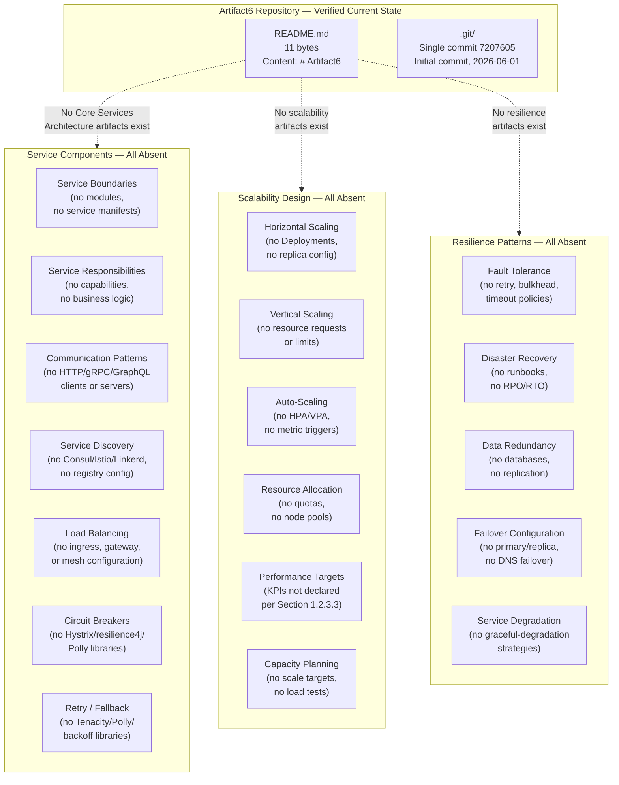
```mermaid
graph TB
    subgraph Current["Artifact6 Repository — Verified Current State"]
        README["README.md<br/>11 bytes<br/>Content: # Artifact6"]
        GitMeta[".git/<br/>Single commit 7207605<br/>Initial commit, 2026-06-01"]
    end

    subgraph ServiceComponents["Service Components — All Absent"]
        SVCB["Service Boundaries<br/>(no modules,<br/>no service manifests)"]
        SVCR["Service Responsibilities<br/>(no capabilities,<br/>no business logic)"]
        COMM["Communication Patterns<br/>(no HTTP/gRPC/GraphQL<br/>clients or servers)"]
        DISC["Service Discovery<br/>(no Consul/Istio/Linkerd,<br/>no registry config)"]
        LB["Load Balancing<br/>(no ingress, gateway,<br/>or mesh configuration)"]
        CB["Circuit Breakers<br/>(no Hystrix/resilience4j/<br/>Polly libraries)"]
        RETRY["Retry / Fallback<br/>(no Tenacity/Polly/<br/>backoff libraries)"]
    end

    subgraph Scalability["Scalability Design — All Absent"]
        HSCALE["Horizontal Scaling<br/>(no Deployments,<br/>no replica config)"]
        VSCALE["Vertical Scaling<br/>(no resource requests<br/>or limits)"]
        AUTO["Auto-Scaling<br/>(no HPA/VPA,<br/>no metric triggers)"]
        ALLOC["Resource Allocation<br/>(no quotas,<br/>no node pools)"]
        PERF["Performance Targets<br/>(KPIs not declared<br/>per Section 1.2.3.3)"]
        CAP["Capacity Planning<br/>(no scale targets,<br/>no load tests)"]
    end

    subgraph Resilience["Resilience Patterns — All Absent"]
        FT["Fault Tolerance<br/>(no retry, bulkhead,<br/>timeout policies)"]
        DR["Disaster Recovery<br/>(no runbooks,<br/>no RPO/RTO)"]
        REDUN["Data Redundancy<br/>(no databases,<br/>no replication)"]
        FAIL["Failover Configuration<br/>(no primary/replica,<br/>no DNS failover)"]
        DEGR["Service Degradation<br/>(no graceful-degradation<br/>strategies)"]
    end

    README -.->|"No Core Services<br/>Architecture artifacts exist"| ServiceComponents
    README -.->|"No scalability<br/>artifacts exist"| Scalability
    README -.->|"No resilience<br/>artifacts exist"| Resilience
```

The dashed edges denote the absence of any path from the repository's sole tracked content to any Core Services Architecture layer. Because every architectural category mandated by the section prompt is empty, no concrete service interaction diagram, scalability architecture, or resilience pattern diagram can be constructed in this revision.

### 6.1.8 Cross-References to Prior Sections

Every absence documented in Sections 6.1.3 through 6.1.5 is anchored in the authoritative findings of prior sections of this Technical Specification. The table below maps each Section 6.1 topic to the prior section that authoritatively establishes its absence.

#### 6.1.8.1 Service Components Cross-Reference Map

| Section 6.1 Topic | Authoritative Prior Section |
|---|---|
| Service boundaries and responsibilities | Section 1.2.2.2; Section 5.2.2 |
| Inter-service communication patterns | Section 3.5.2; Section 5.2.3 |
| Service discovery mechanisms | Section 3.5.1; Section 3.7.3 |
| Load balancing strategy | Section 3.7.3; Section 3.7.4 |
| Circuit breaker patterns | Section 4.4.2; Section 5.5.3 |
| Retry and fallback mechanisms | Section 4.4.2; Section 5.5.3 |

#### 6.1.8.2 Scalability Design Cross-Reference Map

| Section 6.1 Topic | Authoritative Prior Section |
|---|---|
| Horizontal / vertical scaling approach | Section 3.7.3; Section 5.3.1 |
| Auto-scaling triggers and rules | Section 3.7.3; Section 3.7.4 |
| Resource allocation strategy | Section 3.7.3; Section 5.3.1 |
| Performance optimization techniques | Section 1.2.3.3; Section 5.5.5 |
| Capacity planning guidelines | Section 5.3.1; Section 5.5.5 |

#### 6.1.8.3 Resilience Patterns Cross-Reference Map

| Section 6.1 Topic | Authoritative Prior Section |
|---|---|
| Fault tolerance mechanisms | Section 4.4.2; Section 5.5.3 |
| Disaster recovery procedures | Section 5.5.6; Section 4.4.2 |
| Data redundancy approach | Section 3.6.1; Section 3.6.3 |
| Failover configurations | Section 3.6.1; Section 3.7 |
| Service degradation policies | Section 4.4.2; Section 5.5.3 |

### 6.1.9 Forward Plan

Consistent with the section-revision-trigger pattern established in Sections 2.8, 3.11, 4.8, and 5.8, the table below enumerates the repository events that would warrant revision of Section 6.1 in a future iteration of this Technical Specification. Each trigger maps to one or more subsections of Section 6.1 that would gain authoritative content.

#### 6.1.9.1 Section Revision Triggers

| Trigger Event | Resulting Section 6.1 Subsection Revision |
|---|---|
| First source-code module committed | 6.1.3.1 Service Boundaries and Responsibilities |
| First dependency manifest committed (e.g., `package.json`, `requirements.txt`, `go.mod`, `pom.xml`) | 6.1.3.1 Service Components Technologies |
| First API contract committed (OpenAPI, GraphQL SDL, AsyncAPI, `.proto`) | 6.1.3.2 Inter-Service Communication Patterns |
| First `Dockerfile`, Compose file, or Kubernetes manifest committed | 6.1.4.1 Scaling; 6.1.4.2 Resource Allocation |

#### 6.1.9.2 Additional Revision Triggers

| Trigger Event | Resulting Section 6.1 Subsection Revision |
|---|---|
| First IaC artifact (Terraform, Pulumi, CloudFormation, Bicep) committed | 6.1.4.2 Auto-Scaling; 6.1.5.3 Failover Configuration |
| First service-mesh configuration (Istio, Linkerd, Consul Connect) committed | 6.1.3.3 Service Discovery; 6.1.3.3 Load Balancing |
| First resilience library (Hystrix, resilience4j, Polly, Tenacity) committed | 6.1.5.1 Fault Tolerance Mechanisms |
| First NFR document with SLAs/SLOs / RPO/RTO committed | 6.1.4.3 Performance Targets; 6.1.5.2 Disaster Recovery |
| First runbook or disaster-recovery plan committed | 6.1.5.2 Disaster Recovery Procedures |
| First `ARCHITECTURE.md` or context diagram committed | 6.1.3.1 Service Boundaries; 6.1.2 Constraints |
| First ADR (Architecture Decision Record) committed | 6.1.3 through 6.1.5 (decision-rationale narrative) |
| Authoritative user context with concrete architectural definitions supplied | All subsections of 6.1, with explicit cross-reference to the supplied context |

#### 6.1.9.3 Documentation Consistency Commitments

When any of the above triggers fires, the following consistency commitments apply to the revision of Section 6.1:

1. **Cross-reference integrity.** Updated findings in Section 6.1 must remain consistent with the corresponding updates in Sections 1.2, 3.5, 3.6, 3.7, 4.4, and 5.2 through 5.5.
2. **Evidence-only authorship.** New service, scaling, or resilience claims must be grounded in the committed artifact or supplied user context; speculation about "typical" patterns for a project named Artifact6 remains prohibited per Section 2.7.1.
3. **Candidate-stack neutrality.** Adoption of any element from the Candidate Technology Stack of Section 3.9 must be evidenced by an actual commit, not inferred from the candidate-stack proposal.
4. **Diagram producibility revaluation.** The producibility status of the three required diagrams in Section 6.1.6 must be reassessed at each revision; once producible, the diagrams must be authored before Section 6.1 can transition from "Not Applicable" to a populated state.

### 6.1.10 Section Versioning

Consistent with the section-versioning pattern established in Sections 2.7.3, 3.11.3, 4.9, and 5.9, the table below records the revision history of Section 6.1 against the repository state at each revision.

| Version | Date | Repository Commit | Notable State |
|---|---|---|---|
| 1.0 | 2026-06-01 | `7207605` | Empty repository; section documents the absence of all Core Services Architecture artifacts (service components, scalability design, resilience patterns) and confirms "Not Applicable" determination per the section prompt's explicit directive. |

#### References

#### Files Examined

- `README.md` — The repository's only tracked file (11 bytes, content `# Artifact6`). Used to confirm the absence of any service definitions, configuration files, or architectural documentation that would otherwise underpin a Core Services Architecture section.

#### Folders Explored

- `/` (repository root, depth 0) — Contains exactly one tracked child (`README.md`) plus the `.git/` metadata directory. No subdirectories with source modules, services, container definitions, infrastructure-as-code, Kubernetes manifests, service-mesh configuration, runbooks, or resilience-library imports exist. Used to confirm the comprehensive absence of Core Services Architecture artifacts.

#### Searches Conducted

- Filesystem search for `.blitzyignore` files — Confirmed that no `.blitzyignore` files exist in the repository.
- Semantic file search for "service architecture microservice component scaling resilience" — Zero results, confirming no service-architecture source files exist.
- Semantic folder search for "services source code modules backend infrastructure" — Zero results, confirming no service, source, or infrastructure folders exist.

#### Cross-Referenced Technical Specification Sections

- **Section 1.2.2.1 (Major System Capabilities)** — Established that no business capabilities exist, which precludes any service-responsibility assignment.
- **Section 1.2.2.2 (Major System Components)** — Established that only `README.md` and `.git/` metadata exist; no service components are present.
- **Section 1.2.2.3 (Core Technical Approach)** — Established that the technical approach is "undetermined," prohibiting any architectural-style declaration.
- **Section 1.2.3.3 (Success Criteria / KPIs)** — Established that all five KPI categories (Functional, Performance, Reliability, Adoption/usage, Business/financial) are "Not declared," eliminating the anchoring metrics for performance targets and capacity planning.
- **Section 1.3.1.2 (Implementation Boundaries)** — Established that the system boundary is "Not declared," eliminating service-boundary documentation.
- **Section 1.3.3.1 (Verified Repository Facts)** — Provided the authoritative repository state baseline (single commit `7207605`, sole file `README.md`, no subdirectories).
- **Section 2.7.1 (Evidence-Only Constraint)** — Provided the prohibition against speculating about "typical" features or technologies, which governs the "Not Applicable" determination in this section.
- **Section 3.2 (Programming Languages)** — Established that zero programming languages are adopted, eliminating any service-implementation technology.
- **Section 3.3 (Frameworks & Libraries)** — Established that zero frameworks are adopted across backend, frontend, mobile, testing, ORM, ML, and CSS categories.
- **Section 3.4 (Open Source Dependencies)** — Established that zero dependencies exist across all 15 enumerated package managers.
- **Section 3.5.1 (Third-Party Services Catalogue)** — Established that all eleven external-service categories are "None," eliminating the integration surface that would justify service-discovery or load-balancing documentation.
- **Section 3.5.2 (Service Integration Evidence Map)** — Established that no HTTP, gRPC, GraphQL, WebSocket, AMQP, or MQTT clients are committed, eliminating inter-service communication documentation.
- **Section 3.5.3 (AuthN/AuthZ Surface)** — Established that the authentication and authorization surface is null.
- **Section 3.6.1 (Database & Storage Catalogue)** — Established that all ten storage categories are "None declared," eliminating data redundancy and failover documentation.
- **Section 3.6.3 (Persistence Strategy and RPO/RTO)** — Established that no RPO/RTO targets, no backup procedures, and no caching strategy are declared.
- **Section 3.7 (Development & Deployment)** — Established that no containerization (no Dockerfile/Compose), no Kubernetes/Helm manifests, no IaC (Terraform/Pulumi/CloudFormation), and no CI/CD pipelines are committed.
- **Section 3.9 (Candidate Technology Stack)** — Established the candidate-only stack (AWS, Docker, Terraform, GitHub Actions, Python, Flask, Auth0, MongoDB, etc.) that is explicitly **not adopted**; this section does not draw on any candidate-stack element to author content.
- **Section 4.4.1 (State Management Evidence Map)** — Established that no state machines, persistence points, caches, or transaction boundaries exist.
- **Section 4.4.2 (Error Handling Evidence Map)** — Established that no retry libraries, no circuit breakers, no fallback handlers, no graceful-degradation strategies, and no runbooks/disaster-recovery plans are committed.
- **Section 4.5.1 (Required Diagrams Status)** — Established the precedent that required diagrams are marked "Not producible" when underlying evidence is absent.
- **Section 5.1.2 (Section-Prompt Fidelity Constraint)** — Established the constraint architecture (no inventing architecture styles, no fabricating components, no hypothesizing communication patterns) that governs this section.
- **Section 5.1.3 (Repository State Snapshot)** — Established the Mermaid diagram precedent reused in Section 6.1.7.
- **Section 5.2.1 (System Overview Evidence Map)** — Confirmed that no architectural style, principle, system boundary, or interface is documentable.
- **Section 5.2.2 (Core Components Evidence Map)** — Confirmed that the Core Components Table has zero documentable rows.
- **Section 5.2.3 (Data Flow Evidence Map)** — Confirmed that no data enters, exits, or moves within Artifact6.
- **Section 5.2.4 (External Integration Points Evidence Map)** — Confirmed that the External Integration Points Table has zero documentable rows.
- **Section 5.3.1 (Per-Component Documentation Evidence Map)** — Confirmed that no per-component documentation (purpose, technologies, interfaces, persistence, scaling) is producible.
- **Section 5.3.2 (Required Component Diagrams Status)** — Confirmed that component-level diagrams remain deferred to a future revision.
- **Section 5.5.3 (Error Handling Evidence Map)** — Confirmed that no error-handling surface exists at code, configuration, or operational-documentation level.
- **Section 5.5.5 (Performance and SLA Evidence Map)** — Confirmed that all latency, throughput, availability, and error-budget elements are "Not declared."
- **Section 5.5.6 (Disaster Recovery Evidence Map)** — Confirmed that no RPO/RTO targets, no backup procedures, and no runbooks exist.
- **Section 5.5.7 (Required Error Handling Diagram Status)** — Established the producibility-status pattern for resilience-related diagrams.
- **Section 5.8 (Forward Plan)** — Established the section-revision-trigger pattern reused in Section 6.1.9.
- **Section 5.9 (Section Versioning)** — Established the section-versioning table format reused in Section 6.1.10.
- **Section 5.10 (References)** — Established the References subsection format reused in this section.

## 6.2 Database Design

### 6.2.1 Authoritative State Declaration

**Database Design is not applicable to this system in its current revision.** The governing section prompt explicitly authorizes this determination, directing: *"If the system does not require or direct database or persistent storage interactions are not clearly evident, clearly state 'Database Design is not applicable to this system' and explain why."* This conclusion is independently and jointly established by every prior section of this Technical Specification that touched on persistence, data flows, schema artifacts, or storage services.

The applicability of a Database Design section presupposes the existence of (a) at least one selected and adopted database technology (relational, document, key-value, columnar, graph, time-series, search, or embedded), (b) at least one schema artifact (DDL, ORM model, migration script, or schema-registry entry), and (c) at least one data-access path (CRUD code, repository implementation, or query module). **None of these preconditions is satisfied by the Artifact6 repository.**

This determination mirrors the precedent established in Section 6.1 (Core Services Architecture), which authored an identical "Not Applicable" determination on the same evidentiary basis.

#### 6.2.1.1 Repository State Baseline

The verified repository state established in Section 1.3.3.1 and reconfirmed across Sections 3.1 through 6.1 is summarized below. The baseline is unchanged from the snapshot used by Section 6.1.

| Repository Fact | Verified Value | Authoritative Source |
|---|---|---|
| Tracked content | `README.md` only (11 bytes, content `# Artifact6`) | Section 1.3.3.1 |
| Commit history | One commit (`7207605`, "Initial commit", 2026-06-01) | Section 1.3.3.1 |
| Subdirectories | None (only `.git/` metadata exists) | Section 1.3.3.1 |
| Data persistence artifacts | None across all 10 storage categories | Section 3.6.1 |
| Data-layer indicator files | None across all 7 indicator categories | Section 3.6.2 |
| Persistence strategy declarations | None across all 5 strategic concerns | Section 3.6.3 |

#### 6.2.1.2 Why Database Design Cannot Be Authored

The preconditions for documenting schema design, data management, compliance considerations, and performance optimization are absent on every axis. The table below summarizes the cumulative findings established in prior sections.

| Precondition | Required Evidence | Repository Evidence |
|---|---|---|
| Database technology adopted | Driver, connection string, ORM, or container service | None — all 10 storage categories "None declared" (Section 3.6.1) |
| Schema artifacts committed | DDL files, migration directories, ORM models, schema registries | None — all 7 data-layer indicators "Absent" (Section 3.6.2) |
| Data-access code committed | Repository pattern, DAO classes, query modules, CRUD handlers | None — no source modules of any kind (Section 1.2.2.2) |
| Persistence strategy declared | OLTP/OLAP classification, consistency model, transaction boundaries | None — all 5 strategic concerns "undeclared" (Section 3.6.3) |
| Operational policies declared | RPO/RTO targets, backup cadence, retention policies | None — all KPIs "Not declared" (Section 1.2.3.3); no DR plans (Section 5.5.6) |

Because no storage surface, no schema surface, no data-access surface, and no operational-policy surface exists, every required subsection of Database Design (Schema Design, Data Management, Compliance Considerations, Performance Optimization) would require fabrication to populate. This is prohibited by the evidence-only documentation constraint established in Section 2.7.1.

### 6.2.2 Section-Prompt Fidelity Constraint

Consistent with the constraint architecture articulated in Section 2.7.1 (evidence-only documentation), Section 3.1.2 (section-prompt fidelity for the Technology Stack), Section 5.1.2 (section-prompt fidelity for System Architecture), and Section 6.1.2 (section-prompt fidelity for Core Services Architecture), this section documents the **inventory of absences** for each schema, data-management, compliance, and performance-optimization element mandated by the prompt, rather than manufacturing entities, indexes, policies, or diagrams that have no basis in repository evidence.

#### 6.2.2.1 Prohibited Authoring Actions for This Section

Specifically, Section 6.2 does **not**:

- Design a hypothetical schema (entities, attributes, relationships, cardinalities) for a project that has no declared domain model, no requirements artifacts, and no feature catalog (per Sections 1.3.1.1 and 2.2).
- Select a database technology (MongoDB, PostgreSQL, MySQL, DynamoDB, Redis, Cassandra, etc.) absent any committed driver, connection string, schema file, or ADR.
- Promote MongoDB or any other entry from the Section 3.9 Candidate Technology Stack to "adopted" status; per Section 3.9.1, the candidate stack has not been adopted, and per Section 3.9.6 caveats, no version pin, justification, or integration requirement may be authored for candidate-only components.
- Specify indexing strategies (B-Tree, hash, GIN, GiST, BRIN, full-text), partitioning approaches (range, list, hash, composite), or sharding keys absent any tables or collections to index, partition, or shard.
- Author replication topologies (primary/replica, multi-master, leader-follower, quorum-based) absent any database to replicate, consistent with the finding in Section 6.1.5.3.
- Specify backup architectures, retention windows, point-in-time-recovery (PITR) windows, or restore procedures absent any RPO/RTO declarations per Section 3.6.3 and absent any disaster-recovery plan per Section 5.5.6.
- Define migration procedures (forward/backward migrations, blue-green schema deployment, expand-contract patterns) absent any migration tooling (Alembic, Flyway, Liquibase, Knex, Prisma migrate) per Section 3.6.2.
- Specify archival policies, cold-storage tiering, or data-lifecycle rules absent any data being processed (per Section 5.2.3, "no data enters, exits, or moves within Artifact6").
- Author caching policies (write-through, write-behind, cache-aside, refresh-ahead, TTL governance) absent any cache client configuration per Section 3.6.3.
- Manufacture compliance controls (GDPR, CCPA, HIPAA, SOC 2, PCI-DSS) absent any committed privacy policy, retention document, or audit-trail implementation.
- Specify access controls (database-user roles, row-level security, column-level masking) absent any AuthN/AuthZ surface per Section 3.5.3.
- Specify connection-pool sizing (HikariCP, pgbouncer, PgPool-II, mongoose pool options), read/write splitting configuration, or batch-processing throughput targets absent any database driver, connection string, or workload profile.

#### 6.2.2.2 What This Section Does Document

This section authoritatively documents:

1. The specific database-design elements required by the section prompt and the evidence (or absence thereof) supporting each.
2. The producibility status of each required diagram (database schema diagrams, data flow diagrams, replication architecture).
3. The Repository State Snapshot Mermaid diagram — the only diagram producible against current repository evidence.
4. Cross-references to authoritative prior-section findings that establish each individual absence.
5. The repository events that would trigger revision of this section in a future iteration of the Technical Specification.

### 6.2.3 Schema Design Evidence Map

The section prompt enumerates six required Schema Design elements: entity relationships, data models and structures, indexing strategy, partitioning approach, replication configuration, and backup architecture. The evidence available in the repository to document each is recorded below.

#### 6.2.3.1 Entity Relationships and Data Models

| Required Element | Evidence in Repository | Documentable? |
|---|---|---|
| Entity catalog | No domain classes, ORM models, or DTOs per Section 3.6.2; no business capabilities per Section 1.2.2.1 | No |
| Entity relationships (1:1, 1:N, N:M) | No schema files, no foreign-key declarations, no association tables committed per Section 3.6.2 | No |
| Attribute definitions and constraints | No column definitions, no `NOT NULL`/`UNIQUE`/`CHECK` constraints, no validation rules committed | No |
| Data models and structures | No `prisma/schema.prisma`, no `models.py` (Django/SQLAlchemy), no `entities/*.ts` (TypeORM) per Section 3.6.2 | No |

Because no entities have been declared and no domain model exists, no entity-relationship diagram (ERD) can be authored, no foreign-key constraints can be documented, and no attribute-level constraints can be enumerated. The ERD that would normally populate this subsection would have zero entities and zero relationships.

#### 6.2.3.2 Indexing and Partitioning Strategy

| Required Element | Evidence in Repository | Documentable? |
|---|---|---|
| Index inventory | No DDL `CREATE INDEX` statements, no ORM `@Index` decorators, no Prisma `@@index` directives committed | No |
| Indexing strategy rationale | No query workload profile declared per Section 3.6.3; no `EXPLAIN`/`EXPLAIN ANALYZE` output committed | No |
| Partition keys / sharding keys | No range/list/hash partition declarations, no Mongo shard keys, no DynamoDB partition keys committed | No |
| Partition pruning / tablespace allocation | No tablespace definitions, no storage-tier rules, no archive partitions committed | No |

Because no tables or collections have been created, there is no surface on which to apply indexing or partitioning. No primary keys, unique keys, secondary indexes, composite indexes, partial indexes, expression indexes, or covering indexes can be documented in this revision. Index documentation, including the all-indexes-and-constraints inventory required by the section prompt's output format requirements, is consequently empty.

#### 6.2.3.3 Replication Configuration and Backup Architecture

| Required Element | Evidence in Repository | Documentable? |
|---|---|---|
| Replication topology | No primary/replica configuration, no multi-AZ failover, no leader-election protocol per Section 6.1.5.3 | No |
| Replication mode | No synchronous/asynchronous/semi-synchronous replication mode declared; no quorum config | No |
| Read-replica routing | No read-replica endpoints, no driver-level read-preference configuration committed | No |
| Backup architecture | No backup procedures, schedules, retention policies, or cold-storage locations declared per Sections 3.6.3 and 5.5.6 | No |

Section 3.6.1 has authoritatively established that all ten storage categories — primary relational database, primary document/NoSQL database, key-value store, cache layer, message broker/queue, search index, object/blob storage, time-series database, graph database, and local/embedded storage — are "None declared." Section 6.1.5.3 has authoritatively established that "Without data stores, data redundancy and failover are categorically inapplicable." Section 5.5.6 has authoritatively established that "no disaster-recovery procedure exists." These three findings jointly preclude the authoring of any replication or backup architecture documentation.

### 6.2.4 Data Management Evidence Map

The section prompt enumerates five required Data Management elements: migration procedures, versioning strategy, archival policies, data storage and retrieval mechanisms, and caching policies. The evidence available in the repository to document each is recorded below.

#### 6.2.4.1 Migration Procedures and Versioning Strategy

| Required Element | Evidence in Repository | Documentable? |
|---|---|---|
| Migration tooling | No `migrations/` directory, no `alembic.ini`, no `knexfile.js`, no Flyway/Liquibase configs per Section 3.6.2 | No |
| Migration authoring conventions | No baseline schema, no version-numbered migrations, no naming conventions committed | No |
| Schema versioning strategy | No schema-registry entries, no version-numbered API contracts, no semver policy for schemas | No |
| Forward / backward compatibility | No expand-contract migration patterns, no blue-green schema rollout policy committed | No |

Section 3.6.2 has authoritatively confirmed that all standard migration tooling indicators (Alembic, Knex, Flyway, Liquibase, Prisma migrate, etc.) are "Absent" from the repository. No baseline schema exists from which subsequent migrations could be derived, and no version-numbering convention can be retroactively assigned to a non-existent migration history.

#### 6.2.4.2 Archival Policies

| Required Element | Evidence in Repository | Documentable? |
|---|---|---|
| Archival code or jobs | No scheduled archival jobs, no cron entries, no Airflow/Argo workflows committed | No |
| Cold-storage tiering | No S3 lifecycle policies, no DynamoDB TTL configurations, no Mongo TTL indexes committed | No |
| Hot-warm-cold data classification | No data-classification policy, no temperature-based tiering rules committed | No |
| Soft-delete vs. hard-delete policy | No tombstone columns, no `deleted_at` fields, no logical-deletion patterns committed | No |

Because no data is being produced, processed, or stored, no archival policy is applicable. Section 5.2.3 has authoritatively established that "no data enters, exits, or moves within Artifact6 because no data-bearing artifacts exist."

#### 6.2.4.3 Storage, Retrieval, and Caching Policies

| Required Element | Evidence in Repository | Documentable? |
|---|---|---|
| Data storage mechanism | No write paths, no INSERT/UPDATE/UPSERT statements, no ORM `save()`/`create()` invocations | No |
| Data retrieval mechanism | No read paths, no SELECT queries, no ORM `find()`/`query()` invocations, no DAO interfaces | No |
| Cache layer selection | No cache client (Redis, Memcached, Caffeine, EhCache, Hazelcast) configuration per Section 3.6.1 | No |
| Caching policy | No write-through, write-behind, cache-aside, or refresh-ahead pattern; no TTL governance per Section 3.6.3 | No |

Section 3.6.3 has explicitly classified caching strategy as "undeclared," covering "Write-through, write-behind, cache-aside, TTL policies." No cache layer can be documented, and no cache-eviction policy (LRU, LFU, FIFO, ARC, TLRU) can be specified.

### 6.2.5 Compliance Considerations Evidence Map

The section prompt enumerates five required Compliance Considerations elements: data retention rules, backup and fault tolerance policies, privacy controls, audit mechanisms, and access controls. The evidence available in the repository to document each is recorded below.

#### 6.2.5.1 Data Retention and Backup Policies

| Required Element | Evidence in Repository | Documentable? |
|---|---|---|
| Data retention rules | No retention policy documents, no `retention.yml`, no regulatory-mapping spreadsheets committed | No |
| Backup cadence | No backup schedules, no `cron` entries, no managed-service snapshot policies committed per Section 5.5.6 | No |
| RPO (Recovery Point Objective) | "No RPO target declared" per Sections 3.6.3 and 5.5.6 | No |
| RTO (Recovery Time Objective) | "No RTO target declared" per Sections 3.6.3 and 5.5.6 | No |

Section 5.5.6 has authoritatively established that "no disaster-recovery procedure exists" because no runbooks, RPO/RTO targets, or backup procedures are declared. Section 6.1.5.2 has cross-referenced and reaffirmed this finding.

#### 6.2.5.2 Privacy Controls

| Required Element | Evidence in Repository | Documentable? |
|---|---|---|
| Field-level encryption | No encryption-at-rest configuration, no per-field encryption (AWS KMS, Vault Transit) committed per Section 3.6.3 | No |
| PII classification / tagging | No data dictionary, no PII tagging schema, no Macie/DLP integration committed | No |
| Anonymization / pseudonymization | No tokenization libraries, no anonymization pipelines, no k-anonymity utilities committed | No |
| Right-to-erasure (GDPR Art. 17) | No deletion workflows, no subject-access-request endpoints, no consent-management code committed | No |

Section 3.10 (Security Implications) has confirmed that all ten security concerns — including data-at-rest encryption, secrets management, key management, and data residency — cannot be assessed because the surface is null. No GDPR, CCPA, HIPAA, SOC 2, or PCI-DSS compliance controls can be retroactively documented against zero data-handling code.

#### 6.2.5.3 Audit Mechanisms and Access Controls

| Required Element | Evidence in Repository | Documentable? |
|---|---|---|
| Audit logging | No audit-trail tables, no event-sourcing implementation, no append-only journals committed | No |
| Change Data Capture (CDC) | No Debezium, no Kafka Connect, no logical-replication consumers committed | No |
| Database access controls | No database-user roles, no `GRANT`/`REVOKE` statements, no IAM policies committed per Section 3.5.3 | No |
| Row-level / column-level security | No PostgreSQL RLS policies, no Mongo redaction views, no column-level masking committed | No |

Section 3.5.3 has authoritatively established that the AuthN/AuthZ surface is null. With no authentication identity, no authorization framework, and no database to authorize access to, no role-based access control (RBAC), attribute-based access control (ABAC), or relationship-based access control (ReBAC) policy can be documented.

### 6.2.6 Performance Optimization Evidence Map

The section prompt enumerates five required Performance Optimization elements: query optimization patterns, caching strategy, connection pooling, read/write splitting, and batch processing approach. The evidence available in the repository to document each is recorded below.

#### 6.2.6.1 Query Optimization and Caching Strategy

| Required Element | Evidence in Repository | Documentable? |
|---|---|---|
| Query optimization patterns | No queries exist; no `EXPLAIN`/`EXPLAIN ANALYZE` output, no query analyzers configured | No |
| Index usage analysis | No `pg_stat_statements`, no Mongo profiler, no Slow Query Log configuration committed | No |
| Caching strategy | "Undeclared" per Section 3.6.3; no cache invalidation policy, no cache stampede mitigations committed | No |
| Query result caching | No materialized views, no cached query results, no application-level result caches committed | No |

Section 5.5.5 has authoritatively established that all five KPI categories enumerated in Section 1.2.3.3 (Functional, Performance, Reliability, Adoption/usage, Business/financial) are "Not declared in repository." Without performance KPIs, no query latency budget can be authored, and without queries, no optimization patterns can be specified.

#### 6.2.6.2 Connection Pooling and Read/Write Splitting

| Required Element | Evidence in Repository | Documentable? |
|---|---|---|
| Connection pool selection | No HikariCP, pgbouncer, PgPool-II, c3p0, or driver-native pool configuration committed | No |
| Pool sizing parameters | No min/max pool size, no idle-timeout, no leak-detection threshold committed | No |
| Read/write splitting | No primary/replica routing code, no read-preference configuration, no proxy-layer routing committed | No |
| Connection-level retry | No connection retry policy, no failover-aware drivers configured | No |

Because no database driver is declared in any manifest (per Section 3.4, "zero dependencies exist across all 15 enumerated package managers" per Section 6.1.8), no connection pool can be configured. The forward path for connection-pool documentation is contingent on the first driver dependency being committed.

#### 6.2.6.3 Batch Processing Approach

| Required Element | Evidence in Repository | Documentable? |
|---|---|---|
| Batch processing framework | No Spring Batch, no Airflow, no Argo Workflows, no AWS Batch configurations committed | No |
| Bulk-write patterns | No `BULK INSERT`, no `COPY`, no Mongo `bulkWrite()`, no DynamoDB `BatchWriteItem` code committed | No |
| ETL pipeline definitions | No data-pipeline DAGs, no dbt models, no Spark/Flink jobs committed | No |
| Scheduled job orchestration | No cron entries, no Kubernetes CronJobs, no event-driven schedulers committed | No |

No source code modules exist (per Section 1.2.2.2), no scheduling infrastructure exists (per Section 3.7), and no data pipeline definitions exist (per Section 5.2.3). Batch processing has no documentable surface in this revision.

### 6.2.7 Required Diagrams Status

The section prompt mandates three Mermaid.js diagrams. The producibility status of each is recorded below, consistent with the precedents established in Sections 4.5.1, 5.3.2, 5.5.7, and 6.1.6.

| Required Diagram | Subject Matter Required | Producibility Status |
|---|---|---|
| Database schema diagrams (ERD) | Entities, attributes, primary keys, foreign keys, cardinality | **Not producible** — no entities, no schema files, no ORM models per Section 3.6.2 |
| Data flow diagrams | Read/write paths, transformation points, cache interactions | **Not producible** — no data flows per Section 5.2.3 ("no data enters, exits, or moves within Artifact6") |
| Replication architecture | Primary/replica topology, failover paths, regional distribution | **Not producible** — no databases configured; no replication topology per Sections 3.6.1 and 6.1.5.3 |

The only Mermaid diagram that can be honestly authored against current repository evidence is the Repository State Snapshot in Section 6.2.8 below, which mirrors the precedent in Sections 5.1.3 and 6.1.7. The three diagrams mandated by the section prompt (Database Schema, Data Flow, Replication Architecture) cannot be authored without fabricating entities, flows, or topologies, which is prohibited by Section 2.7.1.

### 6.2.8 Repository State Snapshot

Consistent with the precedent established in Sections 1.2.2.2, 2.4.3, 3.1.3, 4.1.3, 5.1.3, and 6.1.7, the diagram below restates the verified repository inventory and overlays the categories of Database Design artifact that are confirmed absent. This is the only Mermaid diagram producible against current repository evidence; the three diagrams mandated by the section prompt (Database Schema Diagrams, Data Flow Diagrams, Replication Architecture) cannot be authored without fabricating content, which is prohibited by Section 2.7.1.

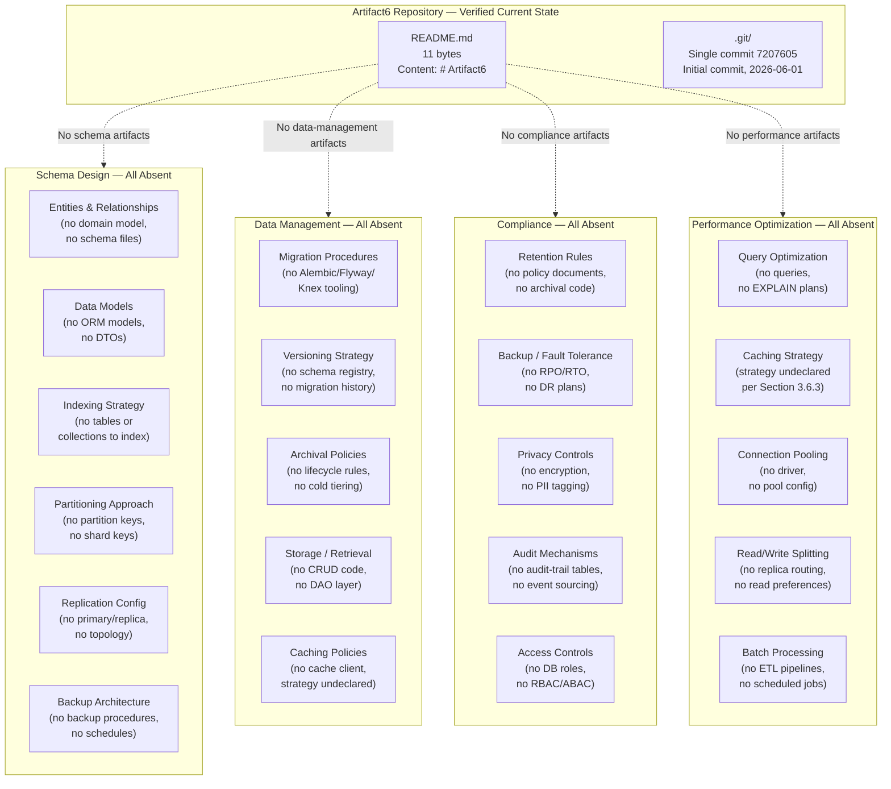
```mermaid
graph TB
    subgraph Current["Artifact6 Repository — Verified Current State"]
        README["README.md<br/>11 bytes<br/>Content: # Artifact6"]
        GitMeta[".git/<br/>Single commit 7207605<br/>Initial commit, 2026-06-01"]
    end

    subgraph SchemaDesign["Schema Design — All Absent"]
        ENT["Entities & Relationships<br/>(no domain model,<br/>no schema files)"]
        DM["Data Models<br/>(no ORM models,<br/>no DTOs)"]
        IDX["Indexing Strategy<br/>(no tables or<br/>collections to index)"]
        PART["Partitioning Approach<br/>(no partition keys,<br/>no shard keys)"]
        REPL["Replication Config<br/>(no primary/replica,<br/>no topology)"]
        BKP["Backup Architecture<br/>(no backup procedures,<br/>no schedules)"]
    end

    subgraph DataMgmt["Data Management — All Absent"]
        MIG["Migration Procedures<br/>(no Alembic/Flyway/<br/>Knex tooling)"]
        VER["Versioning Strategy<br/>(no schema registry,<br/>no migration history)"]
        ARCH["Archival Policies<br/>(no lifecycle rules,<br/>no cold tiering)"]
        STOR["Storage / Retrieval<br/>(no CRUD code,<br/>no DAO layer)"]
        CACHE["Caching Policies<br/>(no cache client,<br/>strategy undeclared)"]
    end

    subgraph Compliance["Compliance — All Absent"]
        RET["Retention Rules<br/>(no policy documents,<br/>no archival code)"]
        BFT["Backup / Fault Tolerance<br/>(no RPO/RTO,<br/>no DR plans)"]
        PRIV["Privacy Controls<br/>(no encryption,<br/>no PII tagging)"]
        AUD["Audit Mechanisms<br/>(no audit-trail tables,<br/>no event sourcing)"]
        ACC["Access Controls<br/>(no DB roles,<br/>no RBAC/ABAC)"]
    end

    subgraph Performance["Performance Optimization — All Absent"]
        QRY["Query Optimization<br/>(no queries,<br/>no EXPLAIN plans)"]
        CS["Caching Strategy<br/>(strategy undeclared<br/>per Section 3.6.3)"]
        POOL["Connection Pooling<br/>(no driver,<br/>no pool config)"]
        RW["Read/Write Splitting<br/>(no replica routing,<br/>no read preferences)"]
        BATCH["Batch Processing<br/>(no ETL pipelines,<br/>no scheduled jobs)"]
    end

    README -.->|"No schema artifacts"| SchemaDesign
    README -.->|"No data-management artifacts"| DataMgmt
    README -.->|"No compliance artifacts"| Compliance
    README -.->|"No performance artifacts"| Performance
```

The dashed edges denote the absence of any path from the repository's sole tracked content to any Database Design layer. Because every category mandated by the section prompt is empty, no concrete schema diagram, data flow diagram, or replication architecture diagram can be constructed in this revision.

### 6.2.9 Cross-References to Prior Sections

Every absence documented in Sections 6.2.3 through 6.2.6 is anchored in the authoritative findings of prior sections of this Technical Specification. The table below maps each Section 6.2 topic to the prior section that authoritatively establishes its absence.

#### 6.2.9.1 Schema Design Cross-Reference Map

| Section 6.2 Topic | Authoritative Prior Section |
|---|---|
| Entity relationships and data models | Section 3.6.1; Section 3.6.2 |
| Indexing strategy | Section 3.6.2; Section 5.3.1 |
| Partitioning approach | Section 3.6.1; Section 5.2.3 |
| Replication configuration | Section 3.6.1; Section 6.1.5.3 |
| Backup architecture | Section 3.6.3; Section 5.5.6 |

#### 6.2.9.2 Data Management Cross-Reference Map

| Section 6.2 Topic | Authoritative Prior Section |
|---|---|
| Migration procedures | Section 3.6.2; Section 3.6.4 |
| Versioning strategy | Section 3.6.2; Section 3.6.3 |
| Archival policies | Section 3.6.3; Section 5.2.3 |
| Storage and retrieval mechanisms | Section 3.6.1; Section 5.2.3 |
| Caching policies | Section 3.6.3; Section 4.4.1 |

#### 6.2.9.3 Compliance and Performance Cross-Reference Map

| Section 6.2 Topic | Authoritative Prior Section |
|---|---|
| Data retention rules | Section 3.6.3; Section 5.5.6 |
| Backup and fault tolerance | Section 3.6.3; Section 5.5.6; Section 6.1.5.2 |
| Privacy controls | Section 3.6.3; Section 3.10 |
| Audit mechanisms | Section 3.5.3; Section 5.5.3 |
| Access controls | Section 3.5.3; Section 5.5.4 |
| Query optimization | Section 1.2.3.3; Section 5.5.5 |
| Caching strategy | Section 3.6.3; Section 5.4.3 |
| Connection pooling | Section 3.4; Section 3.6.2 |
| Read/write splitting | Section 3.6.1; Section 6.1.5.3 |
| Batch processing | Section 1.2.2.2; Section 5.2.3 |

### 6.2.10 Forward Plan

Consistent with the section-revision-trigger pattern established in Sections 2.8, 3.11, 4.8, 5.8, and 6.1.9, the table below enumerates the repository events that would warrant revision of Section 6.2 in a future iteration of this Technical Specification. Each trigger maps to one or more subsections of Section 6.2 that would gain authoritative content.

#### 6.2.10.1 Section Revision Triggers

The following are the primary trigger events for re-authoring this section. Each event represents a discrete repository commit (or supplied authoritative user context) that would unblock the corresponding Section 6.2 subsection.

| Trigger Event | Resulting Section 6.2 Subsection Revision |
|---|---|
| First database driver or ORM dependency declared in a manifest | 6.2.3.1 Entity Relationships; 6.2.6.2 Connection Pooling |
| First schema file, migration directory, or model class committed | 6.2.3.1 Entity Relationships; 6.2.4.1 Migration Procedures |
| First `docker-compose.yml` declaring DB services committed | 6.2.3.3 Replication Configuration; 6.2.6.2 Connection Pooling |
| First connection-string configuration committed | 6.2.6.2 Connection Pooling; 6.2.5.3 Access Controls |

#### 6.2.10.2 Additional Revision Triggers

| Trigger Event | Resulting Section 6.2 Subsection Revision |
|---|---|
| First ADR documenting database selection committed | All subsections of 6.2 (with rationale narrative) |
| First cache client (Redis, Memcached) configuration committed | 6.2.4.3 Caching Policies; 6.2.6.1 Caching Strategy |
| First backup procedure or RPO/RTO declaration committed | 6.2.3.3 Backup Architecture; 6.2.5.1 Retention |
| First IaC artifact (Terraform RDS/Aurora/DynamoDB) committed | 6.2.3.3 Replication; 6.2.5.1 Backup |
| First privacy policy or data-retention document committed | 6.2.5.1 Retention; 6.2.5.2 Privacy Controls |
| First audit-logging code or audit-trail table committed | 6.2.5.3 Audit Mechanisms |
| First indexing or query-plan artifact committed | 6.2.3.2 Indexing; 6.2.6.1 Query Optimization |
| First batch-processing job, ETL DAG, or scheduled task committed | 6.2.6.3 Batch Processing |
| Authoritative user context with concrete database design supplied | All subsections of 6.2, with explicit cross-reference to supplied context |

#### 6.2.10.3 Documentation Consistency Commitments

When any of the above triggers fires, the following consistency commitments apply to the revision of Section 6.2:

1. **Cross-reference integrity.** Updated findings in Section 6.2 must remain consistent with the corresponding updates in Sections 3.6, 3.10, 4.4, 5.2, 5.5, and 6.1 (particularly 6.1.5.3).
2. **Evidence-only authorship.** New schema, data-management, compliance, or performance claims must be grounded in the committed artifact or supplied user context; speculation about "typical" database patterns for a project named Artifact6 remains prohibited per Section 2.7.1.
3. **Candidate-stack neutrality.** Adoption of MongoDB or any other element from the Candidate Technology Stack of Section 3.9 must be evidenced by an actual commit (driver dependency, connection string, schema artifact, or ADR), not inferred from the candidate-stack proposal. Per Section 3.9.6, no version pin, justification, or compatibility analysis may be authored absent committed artifacts.
4. **Diagram producibility reevaluation.** The producibility status of the three required diagrams in Section 6.2.7 (Database Schema, Data Flow, Replication Architecture) must be reassessed at each revision; once producible, each diagram must be authored before Section 6.2 can transition from "Not Applicable" to a populated state.
5. **Indexing and constraints disclosure.** When schema artifacts are committed, all indexes (primary, secondary, composite, partial, expression, full-text) and all constraints (`NOT NULL`, `UNIQUE`, `CHECK`, foreign-key, default values) must be enumerated in tabular form per the section prompt's output format requirements.

### 6.2.11 Section Versioning

Consistent with the section-versioning pattern established in Sections 2.7.3, 3.11.3, 4.9, 5.9, and 6.1.10, the table below records the revision history of Section 6.2 against the repository state at each revision.

| Version | Date | Repository Commit | Notable State |
|---|---|---|---|
| 1.0 | 2026-06-01 | `7207605` | Empty repository; section documents the absence of all Database Design artifacts (schema design, data management, compliance considerations, performance optimization) and confirms "Not Applicable" determination per the section prompt's explicit directive. |

#### References

**Files Examined**

- `README.md` — The repository's only tracked file (11 bytes, content `# Artifact6`). Used to confirm the absence of any database configuration, schema definition, ORM model, migration script, connection string, or persistence-related code that would otherwise underpin a Database Design section.

**Folders Explored**

- `/` (repository root, depth 0) — Contains exactly one tracked child (`README.md`) plus the `.git/` metadata directory. No subdirectories with database client code, schema files, migration directories, ORM models, connection configuration, container-compose service definitions, or IaC database resources exist. Used to confirm the comprehensive absence of Database Design artifacts.

**Searches Conducted**

- Filesystem search for `*.sql` files — Confirmed no SQL schema or DDL files are present in the repository.
- Filesystem search for `schema*` files — Confirmed no schema artifacts (e.g., `schema.prisma`, `schema.graphql`) exist in the repository.
- Semantic file search for "database schema migration ORM persistence storage" — Zero relevant results, confirming no database-related source files exist.
- Semantic folder search for "database storage data models schema migrations" — Zero relevant results, confirming no database-related folders exist.
- Semantic file search for "SQL queries connection pool indexing transactions" — Zero relevant results, confirming no query, pool, or transaction code exists.
- Semantic file search for "data model entity relationship table definition" — Zero relevant results, confirming no entity or relationship definitions exist.

**Cross-Referenced Technical Specification Sections**

- **Section 1.2.1.3 (Integration Landscape)** — Established that "No database connectors, ETL configs, or data-catalog references" exist in the repository, anchoring the Section 6.2 finding that no persistence layer is present.
- **Section 1.2.2.1 (Major System Capabilities)** — Established that no business capabilities exist, which precludes any domain-model authoring.
- **Section 1.2.2.2 (Major System Components)** — Established that only `README.md` and `.git/` metadata exist; no data-access modules are present.
- **Section 1.2.3.3 (Success Criteria / KPIs)** — Established that all KPI categories (including Performance and Reliability) are "Not declared," eliminating the anchoring metrics for query-latency targets and availability budgets.
- **Section 1.3.1.1 (In-Scope Elements)** — Established that no data domains are in scope; no schema, ER model, or data dictionary is declared.
- **Section 1.3.3.1 (Verified Repository Facts)** — Provided the authoritative repository state baseline (single commit `7207605`, sole file `README.md`, no subdirectories).
- **Section 2.7.1 (Evidence-Only Constraint)** — Provided the prohibition against speculating about "typical" patterns, which governs the "Not Applicable" determination in this section.
- **Section 3.4 (Open Source Dependencies)** — Established that zero dependencies exist across all 15 package managers, eliminating any database driver or ORM library.
- **Section 3.5.1 (Third-Party Services Catalogue)** — Established that no DB-as-a-service (Atlas, RDS, Aurora, DynamoDB-as-managed-service) integration is committed.
- **Section 3.5.2 (Service Integration Evidence Map)** — Established that no database-client libraries or service integrations exist.
- **Section 3.5.3 (AuthN/AuthZ Surface)** — Established that the authentication and authorization surface is null, eliminating database-user role documentation.
- **Section 3.6.1 (Data Persistence Inventory)** ⭐ **PRIMARY SOURCE** — Established that all ten storage categories (primary relational, primary document/NoSQL, key-value, cache, broker/queue, search index, object/blob, time-series, graph, embedded) are "None declared."
- **Section 3.6.2 (Data-Layer Evidence Map)** ⭐ **PRIMARY SOURCE** — Established that all seven data-layer indicators (ORM/ODM, migration tooling, schema files, connection strings, container DB services, embedded-DB artifacts, cloud-DB IaC) are "Absent."
- **Section 3.6.3 (Persistence Strategy)** ⭐ **PRIMARY SOURCE** — Established that all five strategic concerns (persistence strategy, caching strategy, backup/recovery, data residency, schema evolution) are "undeclared."
- **Section 3.6.4 (Required Inputs)** — Established the trigger conditions for populating the Databases & Storage subsection, which Section 6.2.10 mirrors as its revision-trigger framework.
- **Section 3.7 (Development & Deployment)** — Established that no containerization (no Compose file with DB services), no IaC (no `*.tf` with RDS/Aurora/DynamoDB), and no CI/CD with database-migration steps exist.
- **Section 3.9 (Candidate Technology Stack)** — Established that MongoDB is listed as a candidate primary database but **not adopted**; the Section 3.9.6 caveats govern Section 6.2 by prohibiting version pinning, integration-requirement authoring, and compatibility analysis for candidate-only components.
- **Section 3.10 (Security Implications)** — Confirmed that all ten security concerns (including data-at-rest encryption, secrets management, key management, data residency) cannot be assessed against zero data-handling surface.
- **Section 4.4.1 (State Management Evidence Map)** — Confirmed that no state machines, persistence points, caches, or transaction boundaries exist.
- **Section 4.4.2 (Error Handling Evidence Map)** — Confirmed that no retry, circuit-breaker, or disaster-recovery surface exists.
- **Section 5.2.3 (Data Flow Evidence Map)** — Confirmed that "no data enters, exits, or moves within Artifact6," which authoritatively forecloses any data-flow diagram authoring.
- **Section 5.3.1 (Per-Component Documentation Evidence Map)** — Confirmed that no per-component persistence or scaling considerations are documentable.
- **Section 5.4.3 (Storage Solution Rationale)** — Confirmed that no data storage selection, no storage rationale, and no caching-strategy decision exists.
- **Section 5.5.3 (Error Handling Evidence Map)** — Confirmed that no error-handling surface exists at code, configuration, or operational level.
- **Section 5.5.4 (AuthN/AuthZ Evidence Map)** — Confirmed that no authentication or authorization surface exists.
- **Section 5.5.5 (Performance and SLA Evidence Map)** — Confirmed that all latency, throughput, availability, and error-budget elements are "Not declared."
- **Section 5.5.6 (Disaster Recovery Evidence Map)** — Confirmed that no RPO/RTO targets, no backup procedures, and no runbooks exist; anchors Section 6.2.5.1.
- **Section 5.8 (Forward Plan)** — Established the section-revision-trigger pattern reused in Section 6.2.10.
- **Section 5.9 (Section Versioning)** — Established the section-versioning table format reused in Section 6.2.11.
- **Section 6.1 (Core Services Architecture)** ⭐ **PRECEDENT** — Established the "Not Applicable" determination pattern, structural template, evidence-map subsection style, and Repository State Snapshot Mermaid diagram template that Section 6.2 mirrors. Section 6.1.5.3 specifically anchors the Section 6.2.3.3 finding on replication and failover absence.

## 6.3 Integration Architecture

### 6.3.1 Authoritative State Declaration

**Integration Architecture is not applicable for this system in its current revision.** The governing section prompt explicitly authorizes this determination, directing: *"If the system does not require integration with external systems or services, clearly state 'Integration Architecture is not applicable for this system' and explain why."* This conclusion is independently and jointly established by every prior section of this Technical Specification that touched on external services, API contracts, service-integration code, message brokers, or event-driven workflows.

The applicability of an Integration Architecture section presupposes the existence of (a) at least one external system, third-party service, or peer service to integrate with, (b) at least one transport, protocol, or messaging surface (HTTP/gRPC/GraphQL client or server, message broker driver, webhook handler, or service-mesh sidecar), and (c) at least one contract artifact, configuration file, or integration source module. **None of these preconditions is satisfied by the Artifact6 repository.**

This determination mirrors the precedent established in Section 6.1 (Core Services Architecture) and Section 6.2 (Database Design), each of which authored an identical "Not Applicable" determination on the same evidentiary basis.

#### 6.3.1.1 Repository State Baseline

The verified repository state established in Section 1.3.3.1 and reconfirmed across Sections 3.1 through 6.2 is summarized below. The baseline is unchanged from the snapshot used by Sections 6.1.1.1 and 6.2.1.1.

| Repository Fact | Verified Value | Authoritative Source |
|---|---|---|
| Tracked content | `README.md` only (11 bytes, content `# Artifact6`) | Section 1.3.3.1 |
| Commit history | One commit (`7207605`, "Initial commit", 2026-06-01) | Section 1.3.3.1 |
| Subdirectories | None (only `.git/` metadata exists) | Section 1.3.3.1 |
| Third-party service integrations | None across all 11 service categories | Section 3.5.1 |
| Integration-surface indicators | All 7 indicators "Absent" | Section 3.5.2 |
| AuthN/AuthZ surface | Null (no OAuth, JWT, SAML, RBAC, ABAC) | Section 3.5.3 |
| Integration workflow elements | All 4 elements undocumentable | Section 4.2.2 |

#### 6.3.1.2 Why Integration Architecture Cannot Be Authored

The preconditions for documenting API design, message processing, and external systems are absent on every axis. The table below summarizes the cumulative findings established in prior sections.

| Precondition | Required Evidence | Repository Evidence |
|---|---|---|
| External systems exist | At least one third-party service, peer service, or external API integrated | None — all 11 service categories "None" per Section 3.5.1 |
| API surface declared | HTTP/gRPC/GraphQL servers or clients; OpenAPI, GraphQL SDL, `.proto` files | None — no source files exist; all indicators "Absent" per Section 3.5.2 |
| Messaging surface declared | Message broker driver, event handler, stream processor, or batch scheduler | None — "message queue" category "None declared" per Section 3.6.1; all integration workflows "No" per Section 4.2.2 |
| Authentication surface declared | OAuth/OIDC config, JWT signing keys, SAML metadata, identity-provider client | None — AuthN/AuthZ surface null per Section 3.5.3 |
| Gateway / mesh surface declared | API gateway manifest, ingress controller, service-mesh sidecar configuration | None — no containerization, IaC, or mesh manifests per Section 3.7 |

Because no integration surface, no API surface, no messaging surface, no authentication surface, and no gateway/mesh surface exists, every required subsection of Integration Architecture (API Design, Message Processing, External Systems) would require fabrication to populate. This is prohibited by the evidence-only documentation constraint established in Section 2.7.1.

### 6.3.2 Section-Prompt Fidelity Constraint

Consistent with the constraint architecture articulated in Section 2.7.1 (evidence-only documentation), Section 3.1.2 (section-prompt fidelity for the Technology Stack), Section 5.1.2 (section-prompt fidelity for System Architecture), Section 6.1.2 (section-prompt fidelity for Core Services Architecture), and Section 6.2.2 (section-prompt fidelity for Database Design), this section documents the **inventory of absences** for each API design, message processing, and external systems element mandated by the prompt, rather than manufacturing protocols, contracts, brokers, or diagrams that have no basis in repository evidence.

#### 6.3.2.1 Prohibited Authoring Actions for This Section

Specifically, Section 6.3 does **not**:

- Invent API protocols (REST, gRPC, GraphQL, WebSockets, MQTT, AMQP, SOAP) for a system that has no committed clients, servers, or contracts per Section 3.5.2.
- Specify authentication methods (OAuth 2.0, OIDC, SAML, JWT, API Keys, mTLS) absent any committed auth library, identity provider configuration, or `.well-known` artifact per Section 3.5.3.
- Author authorization frameworks (RBAC, ABAC, ReBAC, PBAC) absent any policy file, role definitions, Casbin model, OPA Rego bundle, or access-control source code per Sections 3.5.3 and 5.5.4.
- Specify rate-limiting algorithms (token bucket, leaky bucket, sliding window, fixed window) absent any rate-limiter middleware, gateway plugin configuration, or quota declaration per Sections 3.7.3 and 5.5.1.
- Declare API versioning strategies (URI versioning, header versioning, query-parameter versioning, content negotiation, semver for contracts) absent any committed API contracts.
- Mandate documentation standards (OpenAPI 3.x, AsyncAPI, JSON:API, HAL, Siren, GraphQL SDL) absent any documentation-generator configuration or contract artifact.
- Select message brokers (Apache Kafka, RabbitMQ, NATS, Amazon SQS, Google Pub/Sub, Azure Service Bus, ActiveMQ) absent any broker driver or client configuration per Section 3.6.1.
- Specify event-processing patterns (event sourcing, CQRS, choreography, orchestration, saga, outbox) absent any committed event handler, event schema, or domain-event source code.
- Author stream-processing topologies (Kafka Streams, Apache Flink, Apache Spark Streaming, Faust, Apache Beam) absent any stream-processor source code or job manifest.
- Define batch processing flows (Spring Batch, Apache Airflow, Argo Workflows, AWS Batch, Prefect, Dagster) absent any scheduler configuration, DAG definition, or batch-framework dependency per Section 6.2.6.3.
- Specify retry libraries (Tenacity, Polly, resilience4j, retry, backoff) or circuit-breaker patterns (Hystrix, resilience4j, Polly) absent any error-handling source code per Sections 4.4.2 and 5.5.3.
- Promote candidate technologies from Section 3.9 (AWS, Docker, Terraform, Python, Flask, Auth0, MongoDB, GitHub Actions, LangChain, React) to "adopted" status; per Section 3.9.6, no version pin, configuration, or integration requirement may be authored for candidate-only components.
- Specify API gateway configuration (Kong, Apigee, AWS API Gateway, Azure API Management, Tyk, Istio gateway, Ambassador) absent any IaC, container manifest, ingress definition, or mesh manifest per Section 3.7.3.
- Author external service contracts (SLAs, retry policies, fallback behaviors, circuit-breaker thresholds, dead-letter queue policies) absent any external service integration per Section 3.5.1.
- Speculate on legacy system interfaces, predecessor product compatibility, deprecation matrices, or migration plans absent any committed legacy adapter or compatibility shim per Section 1.2.1.2.

#### 6.3.2.2 What This Section Does Document

This section authoritatively documents:

1. The specific integration architecture elements required by the section prompt and the evidence (or absence thereof) supporting each.
2. The producibility status of each required diagram (integration flow diagrams, API architecture diagrams, message flow diagrams).
3. The Repository State Snapshot Mermaid diagram — the only diagram producible against current repository evidence.
4. Cross-references to authoritative prior-section findings that establish each individual absence.
5. The repository events that would trigger revision of this section in a future iteration of the Technical Specification.

### 6.3.3 API Design Evidence Map

The section prompt enumerates six required API Design elements: protocol specifications, authentication methods, authorization framework, rate limiting strategy, versioning approach, and documentation standards. The evidence available in the repository to document each is recorded below.

#### 6.3.3.1 Protocol Specifications and Authentication Methods

| Required Element | Evidence in Repository | Documentable? |
|---|---|---|
| HTTP / REST protocol surface | No source files importing `axios`, `requests`, `httpx`, `fetch`, or server frameworks (Flask, Express, FastAPI, Spring Boot) per Section 3.5.2 | No |
| gRPC / GraphQL / WebSocket protocol surface | No `.proto` files, GraphQL schemas, WebSocket handlers, or transport-specific clients committed per Section 3.5.2 | No |
| OAuth 2.0 / OIDC / SAML authentication | No `.well-known/` artifacts, no OAuth-client configuration, no SAML metadata, no JWT signing-key configuration per Section 3.5.3 | No |
| API key / mTLS authentication | No API-key management code, no certificate-store configuration, no mTLS handshake configuration committed per Section 3.5.3 | No |

Section 3.5.2 has authoritatively established that all seven integration-surface indicators (HTTP client libraries, OAuth/OIDC configuration, service credentials, API contract specifications, SDK configuration, webhook endpoints, service-mesh configuration) are "Absent." Section 3.5.3 has authoritatively established that the AuthN/AuthZ surface is null. No protocol can be documented absent transport code, and no authentication method can be documented absent identity-provider configuration.

#### 6.3.3.2 Authorization Framework and Rate Limiting Strategy

| Required Element | Evidence in Repository | Documentable? |
|---|---|---|
| Role-based access control (RBAC) | No role definitions, no permission tables, no `@PreAuthorize` decorators, no policy files committed per Sections 3.5.3 and 5.5.4 | No |
| Attribute-based or relationship-based access control | No Casbin model, no OPA Rego bundles, no SpiceDB/Zanzibar schema committed per Section 5.5.4 | No |
| Rate-limiter middleware | No rate-limiter libraries (`express-rate-limit`, `slowapi`, `django-ratelimit`, `bucket4j`) committed per Section 3.4 | No |
| Gateway-level rate-limit configuration | No Kong plugins, no AWS API Gateway throttle settings, no Apigee quota policies, no Istio EnvoyFilter configurations per Section 3.7.3 | No |

Section 5.5.4 has authoritatively confirmed that the authentication-and-authorization surface is null at code, configuration, and policy-document levels. Section 3.7.3 has authoritatively confirmed the absence of any API gateway, ingress controller, or service-mesh manifest that could host rate-limit policies. Without identities to throttle, requests to count, or endpoints to protect, no rate-limiting strategy is documentable.

#### 6.3.3.3 Versioning Approach and Documentation Standards

| Required Element | Evidence in Repository | Documentable? |
|---|---|---|
| URI-based API versioning | No route definitions (e.g., `/v1/`, `/v2/`), no path-prefix conventions committed | No |
| Header-based / media-type versioning | No `Accept-Version` header handlers, no `application/vnd.*+json` content-negotiation code committed | No |
| API documentation generator | No OpenAPI 3.x specs, no Swagger UI / Redoc / Stoplight configuration, no `openapi.yaml` or `swagger.json` committed per Section 3.5.2 | No |
| GraphQL / AsyncAPI / JSON Schema documentation | No GraphQL SDL files, no AsyncAPI specs, no JSON Schema artifacts committed | No |

No API contract exists from which to derive a versioning policy, and no documentation generator can be configured against zero endpoints. The all-endpoints-and-contracts inventory that would normally populate this subsection, in compliance with the section prompt's "Markdown tables for API specifications" requirement, contains zero rows.

### 6.3.4 Message Processing Evidence Map

The section prompt enumerates five required Message Processing elements: event processing patterns, message queue architecture, stream processing design, batch processing flows, and error handling strategy. The evidence available in the repository to document each is recorded below.

#### 6.3.4.1 Event Processing Patterns and Message Queue Architecture

| Required Element | Evidence in Repository | Documentable? |
|---|---|---|
| Event handlers / domain events | No event-handler source code, no domain-event classes, no event schemas committed per Section 4.2.2 | No |
| Event processing patterns (event sourcing, CQRS, saga, outbox) | No write-side/read-side separation, no event-store implementation, no saga orchestrator/choreography code committed | No |
| Message broker selection | "Message queue" storage category "None declared" per Section 3.6.1; no Kafka, RabbitMQ, NATS, SQS, Pub/Sub, Service Bus, or ActiveMQ client per Section 3.5.2 | No |
| Producer / consumer / topic topology | No topic definitions, no consumer-group configuration, no producer client setup, no exchange/queue bindings committed | No |

Section 3.6.1 has authoritatively classified the "message queue" storage category as "None declared," and Section 4.2.2 has authoritatively confirmed that "no event processing flows" exist in the repository. Without a broker, without producer/consumer code, and without event schemas, no message queue architecture or event-processing pattern is documentable.

#### 6.3.4.2 Stream Processing Design and Batch Processing Flows

| Required Element | Evidence in Repository | Documentable? |
|---|---|---|
| Stream processing framework | No Kafka Streams, Apache Flink, Apache Spark Streaming, Faust, Apache Beam, or Materialize dependencies committed per Section 3.4 | No |
| Stream topology (windowing, joining, aggregation) | No stream-processing source files, no windowing configurations, no join-key declarations committed per Section 5.2.3 | No |
| Batch processing framework | No Spring Batch, Apache Airflow, Argo Workflows, AWS Batch, Prefect, or Dagster configuration committed per Section 6.2.6.3 | No |
| Scheduled job orchestration | No cron entries, no Kubernetes CronJobs, no Airflow DAGs, no event-driven schedulers committed per Sections 3.7 and 4.2.2 | No |

Section 5.2.3 has authoritatively established that "no data enters, exits, or moves within Artifact6," which forecloses any stream-processing or batch-processing topology authoring. Section 6.2.6.3 has authoritatively confirmed the absence of all batch-processing frameworks, bulk-write patterns, ETL pipeline definitions, and scheduled-job orchestration.

#### 6.3.4.3 Error Handling Strategy

| Required Element | Evidence in Repository | Documentable? |
|---|---|---|
| Retry policy (exponential backoff, jitter) | No retry libraries (Tenacity, Polly, resilience4j, retry, backoff) committed per Section 4.4.2 | No |
| Circuit breaker / bulkhead patterns | No circuit-breaker libraries (Hystrix, resilience4j, Polly) committed per Sections 4.4.2 and 5.5.3 | No |
| Dead-letter queue (DLQ) configuration | No DLQ routing rules, no poison-message handlers, no retry-topic configurations committed per Section 4.2.2 | No |
| Error tracking integration | No Sentry, Bugsnag, or Rollbar SDK or DSN configuration committed per Section 3.5.1 | No |

Section 4.4.2 has authoritatively established that "no retry libraries... and no fallback handlers, circuit breakers (Hystrix, resilience4j), bulkheads, or graceful-degradation strategies" exist in the repository. Section 5.5.3 has authoritatively established that "no error-handling surface exists at the code, configuration, or operational-documentation level." Section 3.5.1 has authoritatively confirmed the "Error tracking" service category as "None." No error-handling strategy for integration flows is documentable across any of these dimensions.

### 6.3.5 External Systems Evidence Map

The section prompt enumerates four required External Systems elements: third-party integration patterns, legacy system interfaces, API gateway configuration, and external service contracts. The evidence available in the repository to document each is recorded below.

#### 6.3.5.1 Third-Party Integration Patterns

| Service Category Required | Provider | Evidence Source |
|---|---|---|
| External REST / GraphQL APIs | None | No API client code, SDKs, or endpoint configurations committed per Section 3.5.1 |
| Authentication / identity provider | None | No auth config, OIDC settings, or identity-provider references committed per Section 3.5.1 |
| Payment / billing services | None | No payment-SDK references or webhook handlers committed per Section 3.5.1 |
| Email / messaging services | None | No SMTP, SendGrid, Twilio, or messaging-API configurations committed per Section 3.5.1 |
| Observability / monitoring | None | No APM agent config, log-aggregation config, or metrics exporters committed per Section 3.5.1 |
| Error tracking | None | No Sentry, Bugsnag, or Rollbar configuration committed per Section 3.5.1 |
| Analytics | None | No analytics-SDK or tracking-pixel code committed per Section 3.5.1 |
| Cloud provider | None | No AWS/GCP/Azure SDK references or service configurations committed per Section 3.5.1 |
| Feature flags / experimentation | None | No LaunchDarkly, Split, or Flagsmith configuration committed per Section 3.5.1 |
| CDN | None | No CDN configuration or asset-delivery setup committed per Section 3.5.1 |
| Search services | None | No Algolia, Elasticsearch, or OpenSearch client config committed per Section 3.5.1 |

All eleven third-party service categories enumerated by Section 3.5.1 are confirmed "None." Because no external service is integrated, no third-party integration pattern (synchronous request/response, asynchronous webhook, polling, streaming, file-transfer, batch-export) can be documented. The integration-pattern inventory that would normally populate this subsection contains zero rows.

#### 6.3.5.2 Legacy System Interfaces

| Required Element | Evidence in Repository | Documentable? |
|---|---|---|
| Predecessor system reference | No references to a legacy system, predecessor product, or upgrade path per Section 1.2.1.2 | No |
| Legacy adapter / compatibility shim | No legacy-protocol adapters (SOAP, JMS, IBM MQ, mainframe, CORBA), no anti-corruption layers committed | No |
| Migration plan / dual-write strategy | No migration plan, no dual-write code, no strangler-pattern adapter committed per Section 1.3.2 | No |
| Deprecation / compatibility matrix | No deprecation notice, no compatibility matrix, no end-of-life calendar committed | No |

Section 1.2.1.2 has authoritatively confirmed that no legacy system reference, predecessor product, or upgrade pathway exists. Without an antecedent system to integrate with or migrate from, no legacy interface documentation is producible.

#### 6.3.5.3 API Gateway Configuration and External Service Contracts

| Required Element | Evidence in Repository | Documentable? |
|---|---|---|
| API gateway selection | No Kong, Apigee, AWS API Gateway, Azure API Management, Tyk, or Ambassador configuration committed per Section 3.7.3 | No |
| Ingress / service-mesh manifest | No Kubernetes Ingress, Istio Gateway, Linkerd, or Consul Connect manifests committed per Sections 3.7.3 and 6.1.3.3 | No |
| OpenAPI / gRPC / AsyncAPI contracts | No `openapi.yaml`, no `.proto` files, no `asyncapi.yaml` specifications committed per Sections 3.5.2 and 5.2.4 | No |
| Service-level agreement (SLA) artifacts | No SLA documents, no SLO/SLI definitions, no error-budget specifications committed per Section 5.5.5 | No |

Section 6.1.3.3 has authoritatively confirmed that "no ingress controllers, API gateways, mesh sidecars, or load-balancer configuration" exist in the repository. Section 5.2.4 has authoritatively confirmed that the External Integration Points Table has zero documentable rows. Without a gateway to configure or contracts to govern, no API gateway configuration or external service contract is documentable.

### 6.3.6 Required Diagrams Status

The section prompt mandates three Mermaid.js diagrams (integration flow diagrams, API architecture diagrams, message flow diagrams) and requires sequence diagrams for key flows. The producibility status of each is recorded below, consistent with the precedents established in Sections 4.5.1, 5.3.2, 5.5.7, 6.1.6, and 6.2.7.

| Required Diagram | Subject Matter Required | Producibility Status |
|---|---|---|
| Integration flow diagrams | End-to-end flow from external system through application to data layer; cross-system data movement | **Not producible** — no external systems integrated per Section 3.5.1; no application source code per Section 1.2.2.2; no data layer per Section 3.6.1 |
| API architecture diagrams | API gateway topology, service mesh layout, transport selection, authentication flow | **Not producible** — no API contracts per Section 3.5.2; no gateway/mesh manifests per Section 3.7.3; no authentication framework per Section 3.5.3 |
| Message flow diagrams | Broker topology, producer/consumer relationships, topic structures, event routing | **Not producible** — no message brokers per Section 3.6.1 ("message queue" category "None declared"); no event schemas per Section 4.2.2 |
| Sequence diagrams for key flows | Actor-to-system, system-to-system, or service-to-broker interactions over time | **Not producible** — no flows exist (per Sections 4.2.1 and 4.2.2); no actors, systems, or services to sequence per Section 5.2.2 |

The only Mermaid diagram that can be honestly authored against current repository evidence is the Repository State Snapshot in Section 6.3.7 below, which mirrors the precedent in Sections 5.1.3, 6.1.7, and 6.2.8. The diagrams mandated by the section prompt (Integration Flow, API Architecture, Message Flow, Sequence) cannot be authored without fabricating systems, contracts, or topologies, which is prohibited by Section 2.7.1.

### 6.3.7 Repository State Snapshot

Consistent with the precedent established in Sections 1.2.2.2, 2.4.3, 3.1.3, 4.1.3, 5.1.3, 6.1.7, and 6.2.8, the diagram below restates the verified repository inventory and overlays the categories of Integration Architecture artifact that are confirmed absent. This is the only Mermaid diagram producible against current repository evidence; the diagrams mandated by the section prompt cannot be authored without fabricating content, which is prohibited by Section 2.7.1.

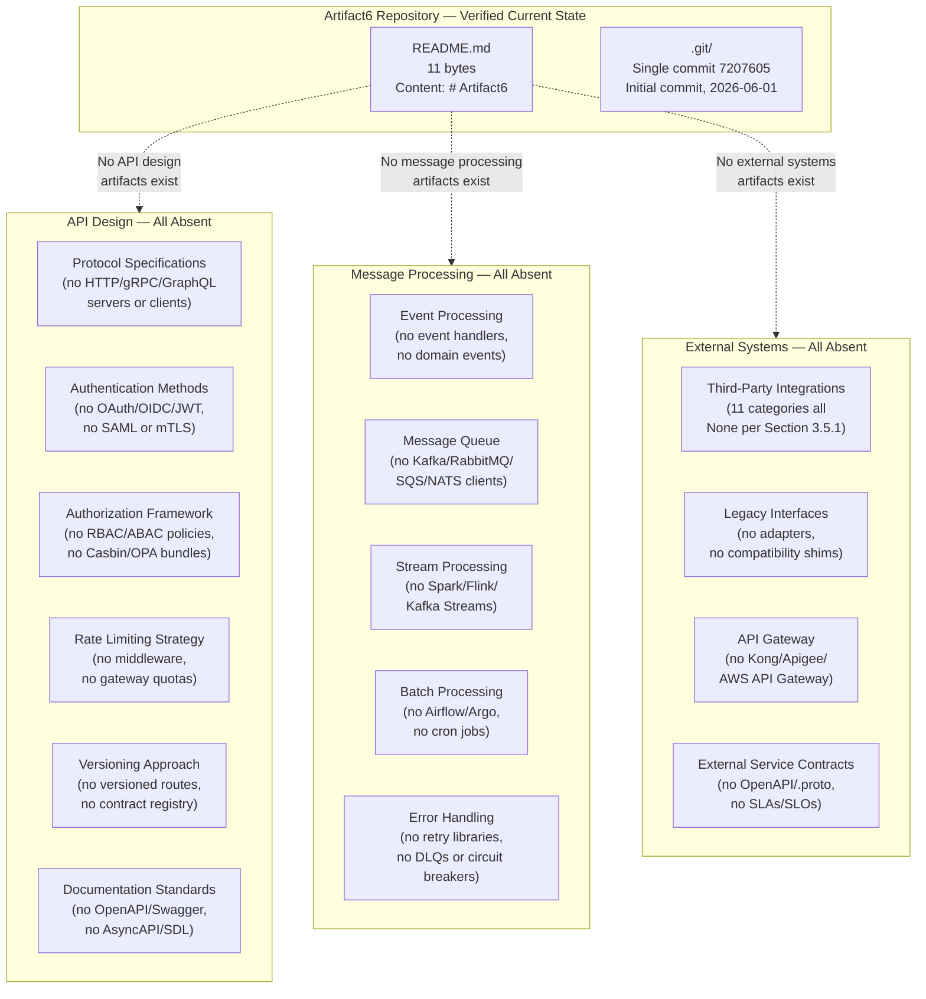
```mermaid
graph TB
    subgraph Current["Artifact6 Repository — Verified Current State"]
        README["README.md<br/>11 bytes<br/>Content: # Artifact6"]
        GitMeta[".git/<br/>Single commit 7207605<br/>Initial commit, 2026-06-01"]
    end

    subgraph APIDesign["API Design — All Absent"]
        PROTO["Protocol Specifications<br/>(no HTTP/gRPC/GraphQL<br/>servers or clients)"]
        AUTH["Authentication Methods<br/>(no OAuth/OIDC/JWT,<br/>no SAML or mTLS)"]
        AUTHZ["Authorization Framework<br/>(no RBAC/ABAC policies,<br/>no Casbin/OPA bundles)"]
        RATE["Rate Limiting Strategy<br/>(no middleware,<br/>no gateway quotas)"]
        VER["Versioning Approach<br/>(no versioned routes,<br/>no contract registry)"]
        DOCS["Documentation Standards<br/>(no OpenAPI/Swagger,<br/>no AsyncAPI/SDL)"]
    end

    subgraph MessageProc["Message Processing — All Absent"]
        EVT["Event Processing<br/>(no event handlers,<br/>no domain events)"]
        MQ["Message Queue<br/>(no Kafka/RabbitMQ/<br/>SQS/NATS clients)"]
        STREAM["Stream Processing<br/>(no Spark/Flink/<br/>Kafka Streams)"]
        BATCH["Batch Processing<br/>(no Airflow/Argo,<br/>no cron jobs)"]
        ERRMSG["Error Handling<br/>(no retry libraries,<br/>no DLQs or circuit breakers)"]
    end

    subgraph ExtSys["External Systems — All Absent"]
        TPI["Third-Party Integrations<br/>(11 categories all<br/>None per Section 3.5.1)"]
        LEG["Legacy Interfaces<br/>(no adapters,<br/>no compatibility shims)"]
        GW["API Gateway<br/>(no Kong/Apigee/<br/>AWS API Gateway)"]
        CONTRACT["External Service Contracts<br/>(no OpenAPI/.proto,<br/>no SLAs/SLOs)"]
    end

    README -.->|"No API design<br/>artifacts exist"| APIDesign
    README -.->|"No message processing<br/>artifacts exist"| MessageProc
    README -.->|"No external systems<br/>artifacts exist"| ExtSys
```

The dashed edges denote the absence of any path from the repository's sole tracked content to any Integration Architecture layer. Because every category mandated by the section prompt is empty, no concrete integration flow diagram, API architecture diagram, message flow diagram, or sequence diagram can be constructed in this revision.

### 6.3.8 Cross-References to Prior Sections

Every absence documented in Sections 6.3.3 through 6.3.5 is anchored in the authoritative findings of prior sections of this Technical Specification. The table below maps each Section 6.3 topic to the prior section that authoritatively establishes its absence.

#### 6.3.8.1 API Design Cross-Reference Map

| Section 6.3 Topic | Authoritative Prior Section |
|---|---|
| Protocol specifications | Section 3.5.2; Section 5.2.4 |
| Authentication methods | Section 3.5.3; Section 5.5.4 |
| Authorization framework | Section 3.5.3; Section 5.5.4 |
| Rate limiting strategy | Section 3.7.3; Section 5.5.1 |
| Versioning approach | Section 3.5.2; Section 5.2.4 |
| Documentation standards | Section 3.5.2; Section 3.5.4 |

#### 6.3.8.2 Message Processing Cross-Reference Map

| Section 6.3 Topic | Authoritative Prior Section |
|---|---|
| Event processing patterns | Section 3.6.1; Section 4.2.2 |
| Message queue architecture | Section 3.6.1; Section 4.2.2 |
| Stream processing design | Section 4.2.2; Section 5.2.3 |
| Batch processing flows | Section 4.2.2; Section 6.2.6.3 |
| Error handling strategy | Section 4.4.2; Section 5.5.3 |

#### 6.3.8.3 External Systems Cross-Reference Map

| Section 6.3 Topic | Authoritative Prior Section |
|---|---|
| Third-party integration patterns | Section 1.2.1.3; Section 3.5.1 |
| Legacy system interfaces | Section 1.2.1.2; Section 1.3.2 |
| API gateway configuration | Section 3.7.3; Section 6.1.3.3 |
| External service contracts | Section 3.5.2; Section 5.2.4 |

### 6.3.9 Forward Plan

Consistent with the section-revision-trigger pattern established in Sections 2.8, 3.11, 4.8, 5.8, 6.1.9, and 6.2.10, the table below enumerates the repository events that would warrant revision of Section 6.3 in a future iteration of this Technical Specification. Each trigger maps to one or more subsections of Section 6.3 that would gain authoritative content.

#### 6.3.9.1 Section Revision Triggers

The following are the primary trigger events for re-authoring this section. Each event represents a discrete repository commit (or supplied authoritative user context) that would unblock the corresponding Section 6.3 subsection.

| Trigger Event | Resulting Section 6.3 Subsection Revision |
|---|---|
| First API contract committed (OpenAPI, GraphQL SDL, AsyncAPI, `.proto`) | 6.3.3.1 Protocol Specifications; 6.3.3.3 Versioning and Documentation |
| First HTTP/gRPC/GraphQL client or server library declared in a manifest | 6.3.3.1 Protocol Specifications |
| First authentication library or identity-provider configuration committed | 6.3.3.1 Authentication Methods; 6.3.3.2 Authorization Framework |
| First rate-limiter middleware or API-gateway throttle configuration committed | 6.3.3.2 Rate Limiting Strategy; 6.3.5.3 API Gateway |

#### 6.3.9.2 Additional Revision Triggers

| Trigger Event | Resulting Section 6.3 Subsection Revision |
|---|---|
| First message broker driver or client configuration committed | 6.3.4.1 Event Processing; 6.3.4.1 Message Queue Architecture |
| First stream-processing framework dependency committed | 6.3.4.2 Stream Processing Design |
| First batch scheduler configuration (cron, Airflow, Argo) committed | 6.3.4.2 Batch Processing Flows |
| First retry / circuit-breaker library committed | 6.3.4.3 Error Handling Strategy |
| First external service SDK or webhook handler committed | 6.3.5.1 Third-Party Integration Patterns |
| First legacy-system adapter or compatibility shim committed | 6.3.5.2 Legacy System Interfaces |
| First API gateway or service-mesh manifest committed | 6.3.5.3 API Gateway Configuration |
| First external service contract or SLA document committed | 6.3.5.3 External Service Contracts |
| First ADR documenting an integration decision committed | All subsections of 6.3 (with rationale narrative) |
| Authoritative user context with concrete integration definitions supplied | All subsections of 6.3, with explicit cross-reference to supplied context |

#### 6.3.9.3 Documentation Consistency Commitments

When any of the above triggers fires, the following consistency commitments apply to the revision of Section 6.3:

1. **Cross-reference integrity.** Updated findings in Section 6.3 must remain consistent with the corresponding updates in Sections 1.2, 3.5, 3.6, 3.7, 4.2, 4.4, 5.2, 5.4, 5.5, 6.1, and 6.2.
2. **Evidence-only authorship.** New protocol, authentication, messaging, or gateway claims must be grounded in the committed artifact or supplied user context; speculation about "typical" integration patterns for a project named Artifact6 remains prohibited per Section 2.7.1.
3. **Candidate-stack neutrality.** Adoption of Auth0, AWS API Gateway, or any other element from the Candidate Technology Stack of Section 3.9 must be evidenced by an actual commit (SDK dependency, tenant configuration, IaC artifact, or ADR), not inferred from the candidate-stack proposal. Per Section 3.9.6, no version pin, justification, or integration-pattern analysis may be authored absent committed artifacts.
4. **Diagram producibility reevaluation.** The producibility status of the diagrams required in Section 6.3.6 (Integration Flow, API Architecture, Message Flow, Sequence) must be reassessed at each revision; once producible, each diagram must be authored before Section 6.3 can transition from "Not Applicable" to a populated state.
5. **API specification disclosure.** When API contracts are committed, all endpoints, methods, request/response schemas, status codes, authentication requirements, and rate-limit policies must be enumerated in tabular form per the section prompt's "Use Markdown tables for API specifications" and "Tables should never have more than four columns" requirements.
6. **External-dependency disclosure.** When external service integrations are committed, all external dependencies must be documented with provider, integration type, contract reference, and SLA terms, consistent with the section prompt's "Document all external dependencies" requirement.

### 6.3.10 Section Versioning

Consistent with the section-versioning pattern established in Sections 2.7.3, 3.11.3, 4.9, 5.9, 6.1.10, and 6.2.11, the table below records the revision history of Section 6.3 against the repository state at each revision.

| Version | Date | Repository Commit | Notable State |
|---|---|---|---|
| 1.0 | 2026-06-01 | `7207605` | Empty repository; section documents the absence of all Integration Architecture artifacts (API design, message processing, external systems) and confirms "Not Applicable" determination per the section prompt's explicit directive. |

#### References

**Files Examined**

- `README.md` — The repository's only tracked file (11 bytes, content `# Artifact6`). Used to confirm the absence of any API client/server code, broker configuration, identity-provider configuration, gateway manifest, contract specification, or external-service SDK that would otherwise underpin an Integration Architecture section.

**Folders Explored**

- `/` (repository root, depth 0) — Contains exactly one tracked child (`README.md`) plus the `.git/` metadata directory. No subdirectories with API source modules, contract files, broker client code, gateway/ingress manifests, service-mesh configurations, IaC integration resources, or external-service SDK initializations exist. Used to confirm the comprehensive absence of Integration Architecture artifacts.

**Searches Conducted**

- Semantic file search for "API endpoint REST GraphQL gRPC integration external service" — Zero results, confirming no integration-related source files exist in the repository index.
- Semantic folder search for "API integration external services webhook controllers" — Zero results, confirming no integration-related folders exist.
- Filesystem check for `.blitzyignore` files — Confirmed no `.blitzyignore` files exist in the system.
- System-level access check of repository root — Returned explicit confirmation that the repository is empty beyond the single tracked file.

**Cross-Referenced Technical Specification Sections**

- **Section 1.2.1.2 (Existing Systems / Legacy Landscape)** — Established that no references to a legacy system, predecessor product, or upgrade path exist, anchoring Section 6.3.5.2 (Legacy System Interfaces).
- **Section 1.2.1.3 (Integration Landscape)** — Established that no client SDKs, API contracts, or interface definitions are present, anchoring Section 6.3.5.1 (Third-Party Integration Patterns).
- **Section 1.2.2.2 (Major System Components)** — Established that only `README.md` and `.git/` metadata exist; no integration components are present.
- **Section 1.3.1.2 (Implementation Boundaries)** — Established that the system boundary is "Not declared," eliminating any integration-boundary documentation.
- **Section 1.3.2 (Out of Scope)** — Confirmed no migration scope, no legacy integration scope, and no third-party integration scope is declared.
- **Section 1.3.3.1 (Verified Repository Facts)** — Provided the authoritative repository state baseline (single commit `7207605`, sole file `README.md`, no subdirectories).
- **Section 2.7.1 (Evidence-Only Constraint)** — Provided the prohibition against speculating about "typical" features, which governs the "Not Applicable" determination in this section.
- **Section 3.4 (Open Source Dependencies)** — Established that zero dependencies exist across all 15 package managers, eliminating any integration library (HTTP client, broker driver, OAuth client, gateway SDK).
- **Section 3.5.1 (External Service Integrations)** ⭐ **PRIMARY SOURCE** — Established that all eleven third-party service categories are "None," anchoring Section 6.3.5.1.
- **Section 3.5.2 (Service Integration Evidence Map)** ⭐ **PRIMARY SOURCE** — Established that all seven integration-surface indicators (HTTP client libraries, OAuth/OIDC configuration, service credentials, API contract specifications, SDK configuration, webhook endpoints, service-mesh configuration) are "Absent," anchoring Section 6.3.3.1.
- **Section 3.5.3 (Authentication, Authorization, and Identity)** ⭐ **PRIMARY SOURCE** — Established that the AuthN/AuthZ surface is null (no OAuth 2.0/OIDC, no JWT, no SAML, no API-key management, no RBAC/ABAC policies, no session management), anchoring Sections 6.3.3.1 and 6.3.3.2.
- **Section 3.5.4 (Required Inputs to Document Third-Party Services)** — Established the trigger conditions for populating the Third-Party Services subsection, which Section 6.3.9 mirrors as its revision-trigger framework.
- **Section 3.6.1 (Data Persistence Inventory)** — Established that the "message queue" storage category is "None declared," anchoring Section 6.3.4.1 (Message Queue Architecture).
- **Section 3.7 (Development & Deployment)** — Established that no containerization (no Dockerfile/Compose), no Kubernetes/Helm manifests, no IaC (Terraform/Pulumi/CloudFormation), and no CI/CD pipelines are committed, anchoring Section 6.3.5.3 (API Gateway Configuration).
- **Section 3.9 (Candidate Technology Stack)** — Established that Auth0, AWS, Flask, and other candidates are listed but **not adopted**; the Section 3.9.6 caveats govern Section 6.3 by prohibiting integration-pattern authoring for candidate-only components.
- **Section 4.2.1 (Core Business Processes Evidence Map)** — Confirmed that no end-to-end user journeys, system interactions, decision points, or error-handling paths can be authored.
- **Section 4.2.2 (Integration Workflows Evidence Map)** ⭐ **PRIMARY SOURCE** — Confirmed that all four integration workflow elements (data flow between systems, API interactions, event processing flows, batch processing sequences) are undocumentable, anchoring Section 6.3.4.
- **Section 4.4.2 (Error Handling Evidence Map)** — Confirmed that no retry libraries, no circuit breakers, no fallback handlers, no graceful-degradation strategies, and no runbooks/disaster-recovery plans are committed, anchoring Section 6.3.4.3.
- **Section 5.2.3 (Data Flow Evidence Map)** — Confirmed that "no data enters, exits, or moves within Artifact6," anchoring Section 6.3.4.2 (Stream Processing).
- **Section 5.2.4 (External Integration Points Evidence Map)** — Confirmed that the External Integration Points Table has zero documentable rows, anchoring Sections 6.3.3 and 6.3.5.
- **Section 5.4 (Technical Decisions Evidence Map)** — Confirmed that no communication pattern decisions, no transport protocol selection, and no security mechanism decisions exist.
- **Section 5.5.1 (Cross-Cutting Concerns)** — Confirmed that no rate-limiting, throttling, or quota-management surface exists.
- **Section 5.5.3 (Error Handling Evidence Map)** — Confirmed that no error-handling surface exists at code, configuration, or operational level, anchoring Section 6.3.4.3.
- **Section 5.5.4 (AuthN/AuthZ Evidence Map)** — Confirmed that no authentication or authorization surface exists, anchoring Section 6.3.3.2.
- **Section 5.5.5 (Performance and SLA Evidence Map)** — Confirmed that all latency, throughput, availability, and error-budget elements are "Not declared," anchoring Section 6.3.5.3 (SLA artifacts).
- **Section 5.8 (Forward Plan)** — Established the section-revision-trigger pattern reused in Section 6.3.9.
- **Section 5.9 (Section Versioning)** — Established the section-versioning table format reused in Section 6.3.10.
- **Section 6.1 (Core Services Architecture)** ⭐ **PRECEDENT** — Established the "Not Applicable" determination pattern, structural template, evidence-map subsection style, and Repository State Snapshot Mermaid diagram template that Section 6.3 mirrors. Section 6.1.3.3 specifically anchors Section 6.3.5.3 (API Gateway Configuration absence).
- **Section 6.2 (Database Design)** ⭐ **PRECEDENT** — Reinforced the "Not Applicable" determination pattern; Section 6.2.6.3 specifically anchors Section 6.3.4.2 (Batch Processing absence).

## 6.4 Security Architecture

### 6.4.1 Authoritative State Declaration

**Detailed Security Architecture is not applicable for this system in its current revision.** The governing section prompt explicitly authorizes this determination, directing: *"If the system does not require specific security considerations beyond standard practices, clearly state 'Detailed Security Architecture is not applicable for this system' and explain which standard security practices will be followed instead."* This conclusion is independently and jointly established by every prior section of this Technical Specification that touched on authentication, authorization, identity management, encryption, secrets management, audit logging, or compliance controls.

The applicability of a Security Architecture section presupposes the existence of (a) at least one authentication mechanism or identity-provider integration, (b) at least one authorization policy or access-control framework, (c) at least one data-protection control (encryption at rest, encryption in transit, secrets manager, key-management service), and (d) at least one auditable event surface or compliance attestation artifact. **None of these preconditions is satisfied by the Artifact6 repository.**

This determination mirrors the precedent established in Section 6.1 (Core Services Architecture), Section 6.2 (Database Design), and Section 6.3 (Integration Architecture), each of which authored an identical "Not Applicable" determination on the same evidentiary basis. Section 6.4 inherits the structural template, evidence-map subsection style, and Repository State Snapshot diagram convention from those precedents while substituting security-specific subject matter for the architectural, persistence, and integration subject matter previously addressed.

The standard security practices that will be applied to future commits — should artifacts be introduced — are enumerated in Section 6.4.8 below. These practices are recorded as deferred guidance rather than current implementation.

#### 6.4.1.1 Repository State Baseline

The verified repository state established in Section 1.3.3.1 and reconfirmed across Sections 3.1 through 6.3 is summarized below. The baseline is unchanged from the snapshot used by Sections 6.1.1.1, 6.2.1.1, and 6.3.1.1.

| Repository Fact | Verified Value | Authoritative Source |
|---|---|---|
| Tracked content | `README.md` only (11 bytes, content `# Artifact6`) | Section 1.3.3.1 |
| Commit history | One commit (`7207605`, "Initial commit", 2026-06-01) | Section 1.3.3.1 |
| Subdirectories | None (only `.git/` metadata exists) | Section 1.3.3.1 |
| AuthN/AuthZ surface | Null on all axes | Section 3.5.3 |
| Security-mechanism decisions | All four elements "Not documentable" | Section 5.4.4 |
| AuthN/AuthZ evidence map | All four elements "Not documentable" | Section 5.5.4 |
| Security-implication concerns | All ten concerns "not assessable" | Section 3.10.1 |

#### 6.4.1.2 Why a Security Architecture Cannot Be Authored

The preconditions for documenting an authentication framework, authorization system, and data-protection regime are absent on every axis. The table below summarizes the cumulative findings established in prior sections.

| Precondition | Required Evidence | Repository Evidence |
|---|---|---|
| Identity surface exists | OAuth/OIDC config, JWT signing keys, SAML metadata, identity-provider SDK | None — Section 3.5.3 confirms null AuthN surface |
| Authorization surface exists | RBAC/ABAC policy file, Casbin model, OPA Rego bundle, role definitions | None — Section 3.5.3 and Section 5.5.4 confirm null AuthZ surface |
| Data-protection surface exists | Encryption library imports, KMS/Vault references, `.env*` files, secrets manifest | None — Section 3.10.1 confirms null data-protection surface |
| Audit surface exists | Audit-log code, audit-trail tables, append-only journals, event-sourcing | None — Section 6.2.5.3 confirms no audit mechanism |
| Compliance surface exists | `SECURITY.md`, threat model, PII tagging, GDPR/HIPAA/SOC 2/PCI-DSS documentation | None — Section 3.10.1 confirms no threat model committed |

Because no identity surface, no authorization surface, no data-protection surface, no audit surface, and no compliance surface exists, every required subsection of Security Architecture (Authentication Framework, Authorization System, Data Protection) would require fabrication to populate. This is prohibited by the evidence-only documentation constraint established in Section 2.7.1.

### 6.4.2 Section-Prompt Fidelity Constraint

Consistent with the constraint architecture articulated in Section 2.7.1 (evidence-only documentation), Section 3.1.2 (section-prompt fidelity for the Technology Stack), Section 5.1.2 (section-prompt fidelity for System Architecture), Section 6.1.2 (section-prompt fidelity for Core Services Architecture), Section 6.2.2 (section-prompt fidelity for Database Design), and Section 6.3.2 (section-prompt fidelity for Integration Architecture), this section documents the **inventory of absences** for each authentication, authorization, and data-protection element mandated by the prompt, rather than manufacturing identity providers, policies, encryption regimes, or diagrams that have no basis in repository evidence.

#### 6.4.2.1 Prohibited Authoring Actions for This Section

Specifically, Section 6.4 does **not**:

- Select identity providers (Auth0, Okta, Cognito, Azure AD, Keycloak, Ping Identity, Google Workspace, OneLogin) absent any committed SDK, tenant configuration, or `.well-known` discovery artifact per Sections 3.5.1 and 3.5.3.
- Specify authentication protocols (OAuth 2.0, OpenID Connect, SAML 2.0, WS-Federation, LDAP, Kerberos) absent any client configuration, federation metadata, or directory binding per Section 3.5.3.
- Define multi-factor authentication regimes (TOTP, WebAuthn/FIDO2, SMS-OTP, push notification, hardware token, biometric) absent any MFA library, second-factor enrollment flow, or recovery-code policy per Section 5.5.4.
- Author session-management policies (cookie attributes, session lifetimes, idle-timeout, absolute-timeout, concurrent-session limits) absent any session-store configuration (Redis, Memcached, JWT-only stateless) per Section 3.5.3.
- Specify token handling (JWT signing algorithms, JWKS endpoint, refresh-token rotation, reference vs. self-encoded tokens, token-introspection endpoint) absent any JWT library or signing-key configuration per Section 3.5.3.
- Mandate password policies (minimum length, complexity, history, age, breach-check via Have-I-Been-Pwned) absent any credential-storage code, password-hashing library (bcrypt, scrypt, Argon2, PBKDF2), or identity store.
- Define authorization frameworks (RBAC, ABAC, ReBAC, PBAC, ACL) absent any role definitions, permission tables, policy files, Casbin models, OPA Rego bundles, SpiceDB/Zanzibar schemas, or Cedar policies per Sections 3.5.3 and 5.5.4.
- Specify permission models (resource-action pairs, scopes, claims, OAuth scopes, role hierarchies) absent any committed permission catalog or policy artifact.
- Designate policy enforcement points (PEPs), policy decision points (PDPs), policy administration points (PAPs), or policy information points (PIPs) absent any middleware, gateway plugin, service-mesh authorization filter, or sidecar policy enforcer per Section 6.1.3.3.
- Author audit-logging schemas, retention policies, tamper-evidence mechanisms (hash chains, signed logs, immutable storage), or SIEM integrations absent any logging framework imports per Section 5.5.2 or any audit-trail table per Section 6.2.5.3.
- Select encryption standards (AES-256-GCM, ChaCha20-Poly1305, RSA-4096, ECDSA-P256, Ed25519) absent any cryptography library imports, certificate stores, or HSM/TPM references.
- Specify key-management infrastructure (AWS KMS, GCP Cloud KMS, Azure Key Vault, HashiCorp Vault, CyberArk Conjur) absent any KMS SDK reference, key-policy file, or vault-agent configuration per Section 3.10.1.
- Define data-masking rules (tokenization, format-preserving encryption, dynamic data masking, redaction views) absent any classification taxonomy, PII catalog, or masking library per Section 6.2.5.2.
- Mandate secure-communication policies (TLS 1.3, mTLS, cipher suites, certificate-pinning, HSTS, certificate transparency) absent any TLS configuration, certificate, or transport-security middleware per Section 3.10.1.
- Manufacture compliance controls (GDPR Articles 5/17/25/32, CCPA, HIPAA Safeguards, SOC 2 CC-series, PCI-DSS Requirements, ISO 27001 Annex A) absent any compliance documentation, attestation, or control-mapping artifact per Section 6.2.5.2.
- Promote candidate technologies from Section 3.9 (Auth0 for authentication; AWS KMS for key management; Docker image-signing via cosign; Terraform OPA/Sentinel policy-as-code; GitHub Actions OIDC federation; MongoDB field-level encryption) to "adopted" status; per Section 3.9.6, no version pin, configuration, or integration requirement may be authored for candidate-only components.

#### 6.4.2.2 What This Section Does Document

This section authoritatively documents:

1. The specific security architecture elements required by the section prompt and the evidence (or absence thereof) supporting each.
2. The producibility status of each required diagram (authentication flow diagrams, authorization flow diagrams, security zone diagrams).
3. The Repository State Snapshot Mermaid diagram — the only diagram producible against current repository evidence.
4. The standard security practices that will become applicable when corresponding artifacts are committed, presented as deferred guidance rather than current controls.
5. Cross-references to authoritative prior-section findings that establish each individual absence.
6. The repository events that would trigger revision of this section in a future iteration of the Technical Specification.

### 6.4.3 Authentication Framework Evidence Map

The section prompt enumerates five required Authentication Framework elements: identity management, multi-factor authentication, session management, token handling, and password policies. The evidence available in the repository to document each is recorded below.

#### 6.4.3.1 Identity Management and Multi-Factor Authentication

| Required Element | Evidence in Repository | Documentable? |
|---|---|---|
| Identity provider selection | No Auth0, Okta, Cognito, Azure AD, or Keycloak SDK references committed per Sections 3.5.1 and 5.5.4 | No |
| OAuth 2.0 / OIDC client configuration | No `.well-known/` artifacts, no OAuth-client config, no client-secret manifest per Section 3.5.3 | No |
| SAML federation metadata | No SAML metadata XML, no IdP/SP entity-descriptor files committed per Section 3.5.3 | No |
| Multi-factor authentication library | No TOTP, WebAuthn, FIDO2, SMS-OTP, push-notification, or hardware-token integration per Section 5.5.4 | No |

Section 3.5.3 has authoritatively established that no authentication service, identity provider, or authorization framework has been integrated into the repository. Section 5.5.4 has authoritatively confirmed that no Auth0, Okta, Cognito, Azure AD, or Keycloak SDK references are committed. Multi-factor authentication is categorically inapplicable in the absence of a primary authentication factor; without a base identity surface, no second-factor enrollment flow, recovery-code policy, or step-up authentication trigger can be documented.

#### 6.4.3.2 Session Management and Token Handling

| Required Element | Evidence in Repository | Documentable? |
|---|---|---|
| Session-management code | No session-management code, no session-store configuration committed per Section 3.5.3 | No |
| Session-store backend | No Redis, Memcached, Hazelcast, or database-backed session-store configured per Section 3.6.1 | No |
| JWT handling | No JWT signing-key configuration, no JWKS endpoint reference, no token-validation middleware per Section 3.5.3 | No |
| API key / opaque-token management | No API-key management code, no token-introspection endpoint configured per Section 3.5.3 | No |

Section 3.5.3 has authoritatively established that no session-management code, no session-store configuration, no JWT signing-key configuration, and no API-key management code is committed to the repository. Section 5.5.4 has confirmed at the AuthN/AuthZ evidence-map level that "session and credential management" is "Not documentable." Cookie attributes (`HttpOnly`, `Secure`, `SameSite`, `Domain`, `Path`, `Max-Age`), session lifetimes, idle-timeout policies, absolute-timeout policies, and concurrent-session limits cannot be specified absent a session-bearing transport layer.

#### 6.4.3.3 Password Policies

| Required Element | Evidence in Repository | Documentable? |
|---|---|---|
| Credential storage mechanism | No password-hashing library (bcrypt, scrypt, Argon2, PBKDF2) committed per Section 3.4 | No |
| Password complexity rules | No registration handlers, no validators, no policy-configuration files committed | No |
| Password history / age policy | No credential store; no history table; no age-enforcement schedule committed | No |
| Breach-check integration | No Have-I-Been-Pwned API client, no leaked-credential database integration committed per Section 3.5.1 | No |

No credential-storage code exists. Section 3.4 has authoritatively established that zero dependencies exist across all 15 enumerated package managers, eliminating any password-hashing library that would anchor a credential-storage policy. In the absence of a credential surface, no minimum-length requirement, complexity-class requirement, password-history depth, or age-rotation cadence can be specified. The password-policy table that would normally populate this subsection contains zero rows.

### 6.4.4 Authorization System Evidence Map

The section prompt enumerates five required Authorization System elements: role-based access control, permission management, resource authorization, policy enforcement points, and audit logging. The evidence available in the repository to document each is recorded below.

#### 6.4.4.1 Role-Based Access Control and Permission Management

| Required Element | Evidence in Repository | Documentable? |
|---|---|---|
| Role definitions | No role catalog, no `roles.yaml`, no `@Role` decorator, no IAM role manifest committed per Section 3.5.3 | No |
| Permission catalog | No permission tables, no scope definitions, no claim mappings committed per Section 5.5.4 | No |
| RBAC policy file | No Casbin model file, no OPA Rego bundle, no policy.yaml; no SpiceDB schema per Section 5.5.4 | No |
| Attribute-based access control | No ABAC policies, no Cedar policies, no policy bundles; no PIP-attribute resolvers committed per Section 5.5.4 | No |

Section 3.5.3 has authoritatively established that no role-based or attribute-based access-control policy file is committed. Section 5.5.4 has confirmed at the AuthN/AuthZ evidence-map level that the authorization model is "Not documentable" because no `casbin`, no OPA Rego, and no policy bundles are present. The role-permission matrix that would normally populate this subsection — mapping subjects to actions on resources — contains zero rows.

#### 6.4.4.2 Resource Authorization and Policy Enforcement Points

| Required Element | Evidence in Repository | Documentable? |
|---|---|---|
| Resource catalog | No resource definitions, no API endpoints, no domain objects to authorize per Section 5.2.4 | No |
| Policy Enforcement Point (PEP) | No middleware, no decorator, no service-mesh authorization filter committed per Section 6.1.3.3 | No |
| Policy Decision Point (PDP) | No OPA sidecar, no SpiceDB/Zanzibar service, no embedded policy engine committed per Section 3.5.3 | No |
| Policy Information Point (PIP) | No attribute-resolver code, no claim-enrichment service, no IdP-attribute caching configured | No |

Section 6.1.3.3 has authoritatively established that no ingress controllers, API gateways, mesh sidecars, or load-balancer configuration exist in the repository. Section 5.2.4 has authoritatively established that the External Integration Points Table has zero documentable rows, eliminating any resource catalog against which authorization could be defined. Without resources to protect or enforcement points at which to intercept requests, no resource-authorization regime can be documented in this revision.

#### 6.4.4.3 Audit Logging

| Required Element | Evidence in Repository | Documentable? |
|---|---|---|
| Audit-event taxonomy | No event catalog, no schema files, no audit-domain documentation committed | No |
| Audit-log emission | No logging framework imports (Winston, Bunyan, log4j, Python `logging`, structlog, zap, logrus) per Section 5.5.2 | No |
| Audit-trail storage | No audit-trail tables, no event-sourcing implementation, no append-only journals committed per Section 6.2.5.3 | No |
| SIEM / log-aggregation integration | No Splunk, ELK, Loki, Datadog, or CloudWatch Logs configuration committed per Section 3.5.1 | No |

Section 5.5.2 has authoritatively confirmed that no logging framework imports are committed; Section 6.2.5.3 has authoritatively confirmed that no audit-trail tables, no event-sourcing implementation, and no append-only journals are committed. Section 3.5.1 has authoritatively confirmed that the "Observability / monitoring" service category is "None," eliminating any log-aggregation or SIEM endpoint to which audit events could be forwarded. No audit-logging surface exists at the code, configuration, or operational-documentation level.

### 6.4.5 Data Protection Evidence Map

The section prompt enumerates five required Data Protection elements: encryption standards, key management, data masking rules, secure communication, and compliance controls. The evidence available in the repository to document each is recorded below.

#### 6.4.5.1 Encryption Standards and Key Management

| Required Element | Evidence in Repository | Documentable? |
|---|---|---|
| Encryption-at-rest standard | "Data-at-rest encryption: No - No data store configured" per Section 3.10.1 | No |
| Encryption-in-transit standard | "Data-in-transit encryption: No - No network services exposed" per Section 3.10.1 | No |
| Cryptography library | No `cryptography`, `pyca`, `node-crypto`, `bouncycastle`, `libsodium` imports committed per Section 3.4 | No |
| Key-management service | No AWS KMS, GCP Cloud KMS, Azure Key Vault, HashiCorp Vault, CyberArk Conjur references per Section 3.10.1 | No |

Section 3.10.1 has authoritatively confirmed that data-at-rest encryption is "not assessable" because "no data store [is] configured," and data-in-transit encryption is "not assessable" because "no network services [are] exposed." Section 3.4 has authoritatively established that zero dependencies exist across all 15 enumerated package managers, eliminating any cryptography library or KMS SDK that would anchor an encryption-standards policy. No key-derivation function, no envelope encryption regime, no key-rotation cadence, and no key-hierarchy declaration is documentable.

#### 6.4.5.2 Data Masking Rules and Secure Communication

| Required Element | Evidence in Repository | Documentable? |
|---|---|---|
| Data-classification taxonomy | No PII catalog, no sensitivity-tagging schema, no `data-classification.yaml` committed per Section 6.2.5.2 | No |
| Tokenization / format-preserving encryption | No tokenization libraries, no anonymization pipelines, no k-anonymity utilities committed per Section 6.2.5.2 | No |
| Dynamic data masking / redaction views | No PostgreSQL RLS policies, no Mongo redaction views, no column-level masking committed per Section 6.2.5.3 | No |
| TLS / mTLS configuration | No TLS certificates, no cipher-suite policy, no HSTS configuration committed per Section 3.10.1 | No |

Section 6.2.5.2 has authoritatively established that no tokenization libraries, no anonymization pipelines, and no k-anonymity utilities are committed. Section 3.10.1 has authoritatively confirmed that data-in-transit encryption is "not assessable" because no network services are exposed; consequently, no TLS version selection, no cipher-suite ordering, no certificate-pinning policy, and no mutual-TLS handshake configuration is documentable. The data-masking inventory that would normally populate this subsection contains zero classifications and zero masking rules.

#### 6.4.5.3 Compliance Controls

| Required Element | Evidence in Repository | Documentable? |
|---|---|---|
| Threat model / `SECURITY.md` | "No `SECURITY.md` or threat model committed" per Section 3.10.1 | No |
| Secrets management | "No secrets, `.env*`, or secrets-manager refs committed" per Section 3.10.1 | No |
| SBOM / supply-chain attestation | "No SBOM / supply-chain attestation: No build artifacts produced" per Section 3.10.1 | No |
| Regulatory compliance documentation | No GDPR, CCPA, HIPAA, SOC 2, or PCI-DSS compliance controls documentable per Section 6.2.5.2 | No |

Section 3.10.1 has authoritatively confirmed that secrets management ("No secrets, `.env*`, or secrets-manager refs committed"), CI/CD pipeline security ("No pipelines defined"), and SBOM / supply-chain attestation ("No build artifacts produced") are all "not assessable" from current repository state. Section 6.2.5.2 has authoritatively established that "no GDPR, CCPA, HIPAA, SOC 2, or PCI-DSS compliance controls can be retroactively documented against zero data-handling code." The compliance-control matrix that would normally populate this subsection — mapping each regulatory requirement to its implementing control — contains zero rows.

#### 6.4.5.4 Consolidated Security Control Matrix

The section prompt requires inclusion of a security control matrix. The control matrix below consolidates the findings of Sections 6.4.3, 6.4.4, and 6.4.5 across the section prompt's three top-level topic areas.

| Control Domain | Required Control Family | Current Implementation Status |
|---|---|---|
| Authentication Framework | Identity management, MFA, session management, token handling, password policies | None implemented; surface null per Section 3.5.3 |
| Authorization System | RBAC, permission management, resource authorization, policy enforcement, audit logging | None implemented; surface null per Section 5.5.4 |
| Data Protection — Confidentiality | Encryption at rest, encryption in transit, key management, data masking | None implemented; surface null per Section 3.10.1 |
| Data Protection — Integrity | Hash verification, signed payloads, tamper-evident logging, message authentication codes | None implemented; no cryptography library committed per Section 3.4 |
| Data Protection — Availability | Backup encryption, DR-replica encryption, key escrow, disaster-recovery key rotation | None implemented; no DR plan per Section 5.5.6; no backup procedures per Section 6.2.5.1 |
| Compliance | GDPR, CCPA, HIPAA, SOC 2, PCI-DSS, ISO 27001 | None applicable; no data-handling code or attestation artifacts per Section 6.2.5.2 |

#### 6.4.5.5 Compliance Requirements Inventory

The section prompt requires documentation of compliance requirements. The inventory below records each major regulatory framework alongside its applicability status against the current repository state. The framework becomes assessable only when the corresponding data-handling code, attestation document, or policy artifact is committed.

| Compliance Framework | Applicability to Current State | Trigger for Assessability |
|---|---|---|
| GDPR (EU 2016/679) | Not applicable — no personal data processed per Section 6.2.5.2 | First commit of code processing EU subject data |
| CCPA / CPRA (California) | Not applicable — no consumer data processed per Section 6.2.5.2 | First commit of code processing California consumer data |
| HIPAA (US health information) | Not applicable — no PHI processed per Section 6.2.5.2 | First commit of code processing PHI |
| PCI-DSS (cardholder data) | Not applicable — no cardholder data processed per Section 6.2.5.2 | First commit of code touching PAN, CVV, or track data |
| SOC 2 (Trust Services Criteria) | Not applicable — no service operating per Section 5.5.5 | First operational deployment and audit period |
| ISO/IEC 27001 (ISMS) | Not applicable — no information security management system documented | First commit of ISMS scope statement and Statement of Applicability |
| NIST CSF (Cybersecurity Framework) | Not applicable — no cybersecurity functions implemented per Section 3.10.1 | First commit of any Identify/Protect/Detect/Respond/Recover control |
| FedRAMP (US federal cloud) | Not applicable — no cloud environment provisioned per Section 3.9.2 | First production deployment to a FedRAMP boundary |

### 6.4.6 Required Diagrams Status

The section prompt mandates three Mermaid.js diagrams (authentication flow diagrams, authorization flow diagrams, security zone diagrams). The producibility status of each is recorded below, consistent with the precedents established in Sections 4.5.1, 5.3.2, 5.5.7, 6.1.6, 6.2.7, and 6.3.6.

| Required Diagram | Subject Matter Required | Producibility Status |
|---|---|---|
| Authentication flow diagrams | Subject-to-IdP-to-RP flow; OAuth/OIDC handshake; SAML assertion exchange; MFA challenge flow | **Not producible** — no authentication framework exists per Sections 3.5.3 and 5.5.4 |
| Authorization flow diagrams | PEP-to-PDP-to-PIP exchanges; policy evaluation paths; permission resolution; grant/deny outcomes | **Not producible** — no authorization model exists per Sections 3.5.3 and 5.5.4 |
| Security zone diagrams | Network segmentation; trust boundaries; DMZ topology; internal/external zones; service-mesh perimeters | **Not producible** — no network topology, no deployment surface, no service boundaries per Sections 3.7 and 6.1 |

The only Mermaid diagram that can be honestly authored against current repository evidence is the Repository State Snapshot in Section 6.4.7 below, which mirrors the precedent in Sections 5.1.3, 6.1.7, 6.2.8, and 6.3.7. The diagrams mandated by the section prompt (Authentication Flow, Authorization Flow, Security Zone) cannot be authored without fabricating identities, policies, or trust boundaries, which is prohibited by Section 2.7.1.

### 6.4.7 Repository State Snapshot

Consistent with the precedent established in Sections 1.2.2.2, 2.4.3, 3.1.3, 4.1.3, 5.1.3, 6.1.7, 6.2.8, and 6.3.7, the diagram below restates the verified repository inventory and overlays the categories of Security Architecture artifact that are confirmed absent. This is the only Mermaid diagram producible against current repository evidence; the diagrams mandated by the section prompt cannot be authored without fabricating content, which is prohibited by Section 2.7.1.

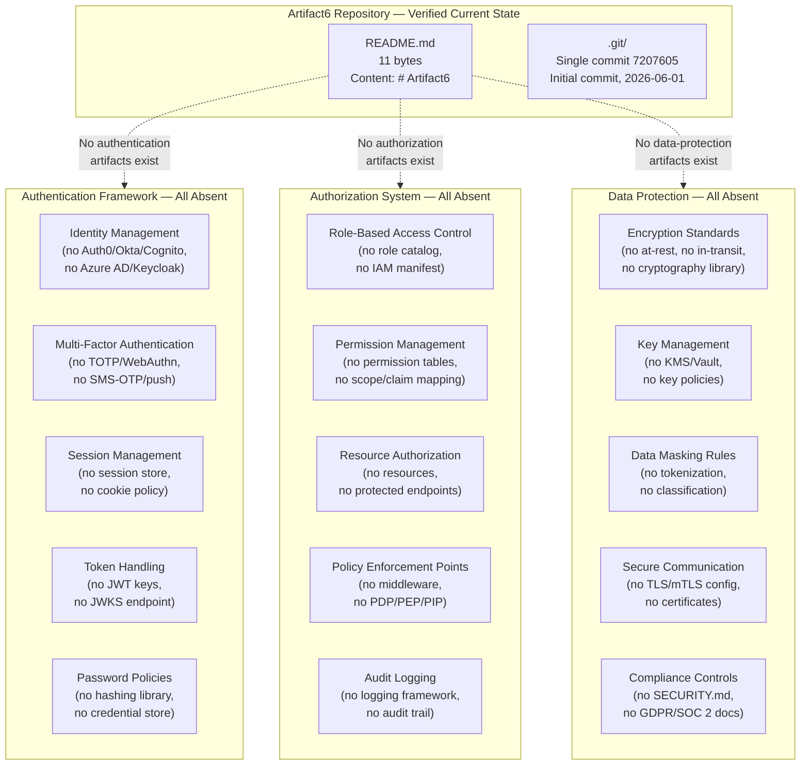
```mermaid
graph TB
    subgraph Current["Artifact6 Repository — Verified Current State"]
        README["README.md<br/>11 bytes<br/>Content: # Artifact6"]
        GitMeta[".git/<br/>Single commit 7207605<br/>Initial commit, 2026-06-01"]
    end

    subgraph AuthFwk["Authentication Framework — All Absent"]
        IDM["Identity Management<br/>(no Auth0/Okta/Cognito,<br/>no Azure AD/Keycloak)"]
        MFA["Multi-Factor Authentication<br/>(no TOTP/WebAuthn,<br/>no SMS-OTP/push)"]
        SESS["Session Management<br/>(no session store,<br/>no cookie policy)"]
        TOK["Token Handling<br/>(no JWT keys,<br/>no JWKS endpoint)"]
        PWD["Password Policies<br/>(no hashing library,<br/>no credential store)"]
    end

    subgraph AuthZ["Authorization System — All Absent"]
        RBAC["Role-Based Access Control<br/>(no role catalog,<br/>no IAM manifest)"]
        PERM["Permission Management<br/>(no permission tables,<br/>no scope/claim mapping)"]
        RES["Resource Authorization<br/>(no resources,<br/>no protected endpoints)"]
        PEP["Policy Enforcement Points<br/>(no middleware,<br/>no PDP/PEP/PIP)"]
        AUD["Audit Logging<br/>(no logging framework,<br/>no audit trail)"]
    end

    subgraph DataProt["Data Protection — All Absent"]
        ENC["Encryption Standards<br/>(no at-rest, no in-transit,<br/>no cryptography library)"]
        KEY["Key Management<br/>(no KMS/Vault,<br/>no key policies)"]
        MASK["Data Masking Rules<br/>(no tokenization,<br/>no classification)"]
        COMM["Secure Communication<br/>(no TLS/mTLS config,<br/>no certificates)"]
        COMP["Compliance Controls<br/>(no SECURITY.md,<br/>no GDPR/SOC 2 docs)"]
    end

    README -.->|"No authentication<br/>artifacts exist"| AuthFwk
    README -.->|"No authorization<br/>artifacts exist"| AuthZ
    README -.->|"No data-protection<br/>artifacts exist"| DataProt
```

The dashed edges denote the absence of any path from the repository's sole tracked content to any Security Architecture layer. Because every category mandated by the section prompt is empty, no concrete authentication flow diagram, authorization flow diagram, or security zone diagram can be constructed in this revision.

### 6.4.8 Standard Security Practices for Future Adoption

The section prompt directs that, when "Not Applicable" is declared, the document must "explain which standard security practices will be followed instead." This subsection enumerates the deferred guidance that will be applied to future commits, drawn from Section 3.10.2's forward-looking posture for candidate selections. None of the practices below describes a current implementation; each is recorded as a commitment to govern future security-relevant artifacts when they are introduced.

#### 6.4.8.1 Standard Practices for Future Source-Code Commits

| Practice Domain | Standard Practice Commitment |
|---|---|
| Secure coding | Input validation, output encoding, parameterized queries (no string concatenation in SQL/NoSQL queries), safe deserialization |
| Dependency security | Software Composition Analysis (SCA) via Dependabot or Renovate; automated CVE scanning at PR time |
| Supply-chain hygiene | Commit signing (Sigstore/Gitsign or GPG), branch protection rules, mandatory code review prior to merge |
| Secrets handling | No plaintext secrets in source; secrets externalized to environment variables or managed secret stores at runtime |

These practices become operationally measurable only when the first source-code module is committed. Until then, no source-code surface exists against which to apply them.

#### 6.4.8.2 Standard Practices Aligned with the Candidate Technology Stack

Section 3.9 enumerates a Candidate Technology Stack (AWS, Docker, Terraform, GitHub Actions, Python, Flask, Auth0, MongoDB, LangChain, React, React Native). Section 3.10.2 enumerates forward-looking security postures for each candidate. The table below records the standard security practices that will be applied when (and only when) each candidate is actually adopted via committed artifacts, per the Section 3.9.6 caveat that no adoption may be inferred from candidate-status.

| Candidate Domain | Standard Practice Commitment (Deferred) |
|---|---|
| Auth0 (identity) | Tenant configuration, RBAC role mapping, JWT validation, token-rotation policy, callback URL allow-listing per Section 3.10.2 |
| MongoDB (database) | SCRAM or X.509 authentication, TLS for in-transit encryption, field-level encryption for sensitive data, network-level isolation per Section 3.10.2 |
| AWS (cloud platform) | IAM least-privilege roles, S3 bucket policy with public-access blocks, KMS key management, Security Groups/NACLs, GuardDuty/Security Hub enablement per Section 3.10.2 |
| Docker (containers) | Base-image vulnerability scanning, non-root container users, image signing via cosign or Notary per Section 3.10.2 |
| Terraform (IaC) | State-file encryption and access control (S3 + DynamoDB backend with KMS), policy-as-code enforcement (OPA or Sentinel) per Section 3.10.2 |
| GitHub Actions (CI/CD) | OIDC federation to cloud providers (eliminating long-lived credentials), `permissions:` scoping per workflow, pinning of third-party actions to commit SHAs per Section 3.10.2 |
| LangChain (AI framework) | Prompt-injection mitigation, model-provider API-key isolation, output validation for downstream tool calls per Section 3.10.2 |
| React / React Native (frontend) | Content Security Policy (CSP) headers, dependency scanning for npm advisories, deep-link validation per Section 3.10.2 |

Each entry above is conditional. Per Section 3.9.6, "no selections are final," "compatibility unverified," "version pins absent by design," and "justifications deferred." The standard practices become applicable only when the corresponding candidate is adopted via a committed artifact (SDK dependency, tenant configuration, IaC resource, or ADR).

### 6.4.9 Cross-References to Prior Sections

Every absence documented in Sections 6.4.3 through 6.4.5 is anchored in the authoritative findings of prior sections of this Technical Specification. The table below maps each Section 6.4 topic to the prior section that authoritatively establishes its absence.

#### 6.4.9.1 Authentication Framework Cross-Reference Map

| Section 6.4 Topic | Authoritative Prior Section |
|---|---|
| Identity management | Section 3.5.1; Section 3.5.3 |
| Multi-factor authentication | Section 3.5.3; Section 5.5.4 |
| Session management | Section 3.5.3; Section 5.5.4 |
| Token handling | Section 3.5.3; Section 5.5.4 |
| Password policies | Section 3.4; Section 3.5.3 |

#### 6.4.9.2 Authorization System Cross-Reference Map

| Section 6.4 Topic | Authoritative Prior Section |
|---|---|
| Role-based access control | Section 3.5.3; Section 5.5.4 |
| Permission management | Section 3.5.3; Section 5.5.4 |
| Resource authorization | Section 5.2.4; Section 6.1.3.3 |
| Policy enforcement points | Section 6.1.3.3; Section 6.3.5.3 |
| Audit logging | Section 5.5.2; Section 6.2.5.3 |

#### 6.4.9.3 Data Protection Cross-Reference Map

| Section 6.4 Topic | Authoritative Prior Section |
|---|---|
| Encryption standards | Section 3.10.1; Section 5.4.4 |
| Key management | Section 3.10.1; Section 5.4.4 |
| Data masking rules | Section 6.2.5.2; Section 6.2.5.3 |
| Secure communication | Section 3.5.2; Section 3.10.1 |
| Compliance controls | Section 3.10.1; Section 6.2.5.2 |

### 6.4.10 Forward Plan

Consistent with the section-revision-trigger pattern established in Sections 2.8, 3.11, 4.8, 5.8, 6.1.9, 6.2.10, and 6.3.9, the table below enumerates the repository events that would warrant revision of Section 6.4 in a future iteration of this Technical Specification. Each trigger maps to one or more subsections of Section 6.4 that would gain authoritative content.

#### 6.4.10.1 Section Revision Triggers

The following are the primary trigger events for re-authoring this section. Each event represents a discrete repository commit (or supplied authoritative user context) that would unblock the corresponding Section 6.4 subsection.

| Trigger Event | Resulting Section 6.4 Subsection Revision |
|---|---|
| First authentication library or identity-provider configuration committed | 6.4.3.1 Identity Management; 6.4.3.2 Token Handling |
| First MFA library or second-factor enrollment flow committed | 6.4.3.1 Multi-Factor Authentication |
| First password-hashing library or credential-storage code committed | 6.4.3.3 Password Policies |
| First authorization library (Casbin, OPA, Cedar, SpiceDB) or policy file committed | 6.4.4.1 RBAC; 6.4.4.2 Policy Enforcement Points |

#### 6.4.10.2 Additional Revision Triggers

| Trigger Event | Resulting Section 6.4 Subsection Revision |
|---|---|
| First role catalog, IAM policy, or permission table committed | 6.4.4.1 Role-Based Access Control; 6.4.4.1 Permission Management |
| First logging framework import or audit-trail table committed | 6.4.4.3 Audit Logging |
| First cryptography library import or encryption regime committed | 6.4.5.1 Encryption Standards |
| First KMS / Vault / secrets-manager reference committed | 6.4.5.1 Key Management; 6.4.5.3 Secrets Management |
| First `.env*` file or secrets manifest committed | 6.4.5.3 Secrets Management |
| First TLS certificate, mTLS configuration, or cipher-suite policy committed | 6.4.5.2 Secure Communication |
| First data-classification taxonomy, PII tagging schema, or masking library committed | 6.4.5.2 Data Masking Rules |
| First `SECURITY.md`, threat-model document, or security-policy file committed | 6.4.5.3 Compliance Controls |
| First compliance document (GDPR / CCPA / HIPAA / SOC 2 / PCI-DSS attestation) committed | 6.4.5.3 Compliance Controls |
| First IaC artifact provisioning a security boundary (Security Groups, NACLs, IAM roles) committed | 6.4.4.2 Resource Authorization; 6.4.5 Security Zone Diagrams |
| First ADR documenting a security decision committed | All subsections of 6.4 (with rationale narrative) |
| Authoritative user context with concrete security definitions supplied | All subsections of 6.4, with explicit cross-reference to supplied context |

#### 6.4.10.3 Documentation Consistency Commitments

When any of the above triggers fires, the following consistency commitments apply to the revision of Section 6.4:

1. **Cross-reference integrity.** Updated findings in Section 6.4 must remain consistent with the corresponding updates in Sections 1.2, 3.5, 3.6, 3.7, 3.10, 4.4, 5.4, 5.5, 6.1, 6.2, and 6.3 (particularly 6.3.3.1 and 6.3.3.2 for authentication and authorization).
2. **Evidence-only authorship.** New authentication, authorization, encryption, key-management, or compliance claims must be grounded in the committed artifact or supplied user context; speculation about "typical" security patterns for a project named Artifact6 remains prohibited per Section 2.7.1.
3. **Candidate-stack neutrality.** Adoption of Auth0, AWS KMS, MongoDB field-level encryption, or any other element from the Candidate Technology Stack of Section 3.9 must be evidenced by an actual commit (SDK dependency, tenant configuration, IaC artifact, or ADR), not inferred from the candidate-stack proposal. Per Section 3.9.6, no version pin, justification, or integration-pattern analysis may be authored absent committed artifacts.
4. **Diagram producibility reevaluation.** The producibility status of the diagrams required in Section 6.4.6 (Authentication Flow, Authorization Flow, Security Zone) must be reassessed at each revision; once producible, each diagram must be authored before Section 6.4 can transition from "Not Applicable" to a populated state.
5. **Security policy disclosure.** When security artifacts are committed, all policies, controls, and configurations must be enumerated in tabular form per the section prompt's "Use Markdown tables for security policies" and "Tables should never have more than four columns" requirements.
6. **Security control matrix update.** The security control matrix authored in Section 6.4.5.4 must be revised to reflect each newly implemented control, with its implementation status changing from "None implemented" to a specific reference describing the implementing artifact.
7. **Compliance disclosure.** When compliance documentation is committed, all regulatory requirements must be documented with framework reference, applicable controls, and attestation status, consistent with the section prompt's "Document compliance requirements" directive.

### 6.4.11 Section Versioning

Consistent with the section-versioning pattern established in Sections 2.7.3, 3.11.3, 4.9, 5.9, 6.1.10, 6.2.11, and 6.3.10, the table below records the revision history of Section 6.4 against the repository state at each revision.

| Version | Date | Repository Commit | Notable State |
|---|---|---|---|
| 1.0 | 2026-06-01 | `7207605` | Empty repository; section documents the absence of all Security Architecture artifacts (authentication framework, authorization system, data protection) and confirms "Not Applicable" determination per the section prompt's explicit directive. Standard security practices enumerated as deferred guidance for future commits. |

#### References

**Files Examined**

- `README.md` — The repository's only tracked file (11 bytes, content `# Artifact6`). Used to confirm the absence of any authentication code, identity-provider configuration, authorization policy, encryption library, secrets manifest, certificate store, audit-logging implementation, or security-documentation artifact that would otherwise underpin a Security Architecture section.

**Folders Explored**

- `/` (repository root, depth 0) — Contains exactly one tracked child (`README.md`) plus the `.git/` metadata directory. No subdirectories with security configuration, identity-provider integration, certificate stores, secrets management, IAM policy files, cryptography modules, audit-log emitters, compliance documentation, threat-model artifacts, or `SECURITY.md` policy files exist. Used to confirm the comprehensive absence of Security Architecture artifacts.

**Searches Conducted**

- Semantic file search for "security authentication authorization encryption credentials secrets" — Zero results, confirming no security-related source files exist in the repository index.
- Semantic folder search for "security authentication identity access control" — Zero results, confirming no security-related folders exist.
- Filesystem check for `.blitzyignore` files — Confirmed no `.blitzyignore` files exist in the system.

**Cross-Referenced Technical Specification Sections**

- **Section 1.2.1.3 (Enterprise Landscape Integration)** — Established that "No auth configuration, OIDC settings, or identity-provider references" exist in the repository, anchoring the absence of identity management documentation in Section 6.4.3.
- **Section 1.2.2.2 (Major System Components)** — Established that only `README.md` and `.git/` metadata exist; no security components are present.
- **Section 1.3.3.1 (Verified Repository Facts)** — Provided the authoritative repository state baseline (single commit `7207605`, sole file `README.md`, no subdirectories) reused in Section 6.4.1.1.
- **Section 2.7.1 (Evidence-Only Constraint)** — Provided the prohibition against speculating about "typical" features or technologies, which governs the "Not Applicable" determination in this section.
- **Section 3.4 (Open Source Dependencies)** — Established that zero dependencies exist across all 15 enumerated package managers, eliminating any cryptography library, password-hashing library, JWT library, OAuth client, or audit-logging library.
- **Section 3.5.1 (External Service Integrations)** — Established that the "Authentication / identity provider" service category is "None" and that all eleven third-party service categories are confirmed "None."
- **Section 3.5.2 (Service Integration Evidence Map)** — Established that all seven integration-surface indicators (including OAuth/OIDC configuration and service credentials) are "Absent."
- **Section 3.5.3 (Authentication, Authorization, and Identity)** ⭐ **PRIMARY SOURCE** — Established that the AuthN/AuthZ surface is null (no OAuth 2.0/OIDC, no JWT, no SAML, no API-key management, no RBAC/ABAC policies, no session management). Anchors Sections 6.4.3 and 6.4.4.
- **Section 3.6.1 (Data Persistence Inventory)** — Established that all ten storage categories are "None declared," eliminating any session-store backend or audit-trail storage target.
- **Section 3.7 (Development & Deployment)** — Established that no containerization (no Dockerfile/Compose), no Kubernetes/Helm manifests, no IaC (Terraform/Pulumi/CloudFormation), and no CI/CD pipelines are committed, eliminating CI/CD security and IaC security surfaces.
- **Section 3.9 (Candidate Technology Stack)** — Established that Auth0, AWS, MongoDB, and other candidates are listed but **not adopted**; the Section 3.9.6 caveats govern Section 6.4 by prohibiting authoring of any security control for candidate-only components. Section 6.4.8.2 draws on Section 3.9 for forward-looking deferred guidance.
- **Section 3.10 (Security Implications of (Non-)Selections)** ⭐ **PRIMARY SOURCE** — Established that all ten security concerns (dependency vulnerabilities, AuthN/AuthZ weaknesses, data-at-rest encryption, data-in-transit encryption, secrets management, container image provenance, IaC drift, CI/CD pipeline security, SBOM/supply-chain attestation, threat model) are "not assessable." Section 3.10.2 provides the forward-looking security posture reused in Section 6.4.8.2.
- **Section 4.4.2 (Error Handling Evidence Map)** — Confirmed that no retry, circuit-breaker, or error-tracking integration exists, eliminating any error-tracking integration that would feed security-event monitoring.
- **Section 5.2.4 (External Integration Points Evidence Map)** — Confirmed that the External Integration Points Table has zero documentable rows, eliminating any resource catalog against which authorization could be defined; anchors Section 6.4.4.2.
- **Section 5.4.4 (Security Mechanism Decisions)** ⭐ **PRIMARY SOURCE** — Confirmed that all four security mechanism elements (authentication mechanism, authorization framework, encryption / secrets management, threat model / `SECURITY.md`) are "Not documentable." Anchors all subsections of Section 6.4.
- **Section 5.5.2 (Logging and Tracing Evidence Map)** — Confirmed that no logging framework imports are committed; anchors Section 6.4.4.3 audit logging absence.
- **Section 5.5.4 (AuthN/AuthZ Evidence Map)** ⭐ **PRIMARY SOURCE** — Confirmed that all four AuthN/AuthZ elements (authentication protocol, identity-provider integration, authorization model, session and credential management) are "Not documentable." Anchors Sections 6.4.3 and 6.4.4.
- **Section 5.5.5 (Performance and SLA Evidence Map)** — Confirmed that no performance or SLA targets exist, eliminating any availability-control documentation in Section 6.4.5.4.
- **Section 5.5.6 (Disaster Recovery Evidence Map)** — Confirmed that no RPO/RTO targets, no backup procedures, and no runbooks exist; anchors the data-protection availability-control absence in Section 6.4.5.4.
- **Section 6.1 (Core Services Architecture)** ⭐ **PRECEDENT** — Established the "Not Applicable" determination pattern, structural template, evidence-map subsection style, and Repository State Snapshot Mermaid diagram template that Section 6.4 mirrors. Section 6.1.3.3 specifically anchors Section 6.4.4.2 (Policy Enforcement Points absence).
- **Section 6.2 (Database Design)** ⭐ **PRECEDENT** — Reinforced the "Not Applicable" determination pattern; Section 6.2.5.2 specifically anchors Section 6.4.5.2 (Data Masking Rules absence) and Section 6.4.5.3 (Compliance Controls absence); Section 6.2.5.3 anchors Section 6.4.4.3 (Audit Logging absence).
- **Section 6.3 (Integration Architecture)** ⭐ **PRECEDENT** — Most recent and directly analogous "Not Applicable" determination, sharing AuthN/AuthZ subject-matter coverage in Sections 6.3.3.1 and 6.3.3.2. Section 6.3 provides the structural template most directly mirrored by Section 6.4. Section 6.3.5.3 anchors Section 6.4.4.2 (Policy Enforcement Points absence at the gateway/mesh layer).

## 6.5 Monitoring and Observability

### 6.5.1 Authoritative State Declaration

**Detailed Monitoring Architecture is not applicable for this system in its current revision.** The governing section prompt explicitly authorizes this determination, directing: *"If the system does not require specific monitoring beyond basic health checks, clearly state 'Detailed Monitoring Architecture is not applicable for this system' and explain which basic monitoring practices will be followed instead."* This conclusion is independently and jointly established by every prior section of this Technical Specification that touched on metrics collection, log aggregation, distributed tracing, alerting, dashboards, health checks, performance KPIs, availability SLOs, or operational runbooks.

The applicability of a Monitoring and Observability section presupposes the existence of (a) at least one running service or instrumented binary against which telemetry could be collected, (b) at least one metrics exporter, logging framework, or tracing library configured to emit observability signals, (c) at least one alerting integration, dashboard definition, or SLO declaration, and (d) at least one health-check endpoint, runbook, or incident-response artifact. **None of these preconditions is satisfied by the Artifact6 repository.**

This determination mirrors the precedent established in Section 6.1 (Core Services Architecture), Section 6.2 (Database Design), Section 6.3 (Integration Architecture), and Section 6.4 (Security Architecture), each of which authored an identical "Not Applicable" determination on the same evidentiary basis. Section 6.5 inherits the structural template, evidence-map subsection style, and Repository State Snapshot diagram convention from those precedents while substituting monitoring- and observability-specific subject matter for the architectural, persistence, integration, and security subject matter previously addressed.

The basic monitoring practices that will be applied to future commits — should observability artifacts be introduced — are enumerated in Section 6.5.8 below. These practices are recorded as deferred guidance rather than current implementation.

#### 6.5.1.1 Repository State Baseline

The verified repository state established in Section 1.3.3.1 and reconfirmed across Sections 3.1 through 6.4 is summarized below. The baseline is unchanged from the snapshot used by Sections 6.1.1.1, 6.2.1.1, 6.3.1.1, and 6.4.1.1.

| Repository Fact | Verified Value | Authoritative Source |
|---|---|---|
| Tracked content | `README.md` only (11 bytes, content `# Artifact6`) | Section 1.3.3.1 |
| Commit history | One commit (`7207605`, "Initial commit", 2026-06-01) | Section 1.3.3.1 |
| Subdirectories | None (only `.git/` metadata exists) | Section 1.3.3.1 |
| Observability / monitoring services | None | Section 3.5.1 |
| Logging / tracing frameworks | None | Section 5.5.2 |
| Performance / Reliability KPIs | All "Not declared" | Section 1.2.3.3 |
| Runbooks / disaster-recovery plans | None | Sections 4.4.2 and 5.5.6 |

#### 6.5.1.2 Why a Detailed Monitoring Architecture Cannot Be Authored

The preconditions for documenting a monitoring infrastructure, observability pattern catalog, and incident-response regime are absent on every axis. The table below summarizes the cumulative findings established in prior sections.

| Precondition | Required Evidence | Repository Evidence |
|---|---|---|
| Telemetry-emitting service exists | Source modules, container images, deployed services | None — only `README.md` and `.git/` exist per Section 1.2.2.2 |
| Observability instrumentation exists | APM agent config, metrics exporters, logging framework, tracing library | None — confirmed null on every axis per Section 5.5.1 |
| Alerting / dashboard surface exists | PagerDuty / Opsgenie integration, Grafana / Datadog dashboards, SLO config | None — confirmed null on every axis per Sections 4.4.2 and 5.5.1 |
| Performance / reliability targets exist | NFR document, SLO definitions, error-budget policy | None — all KPIs "Not declared" per Section 1.2.3.3 |
| Incident-response artifacts exist | Runbooks, escalation policies, post-mortem templates | None — confirmed absent per Sections 4.4.2 and 5.5.6 |

Because no telemetry surface, no instrumentation surface, no alerting surface, no targets surface, and no incident-response surface exists, every required subsection of Monitoring and Observability (Monitoring Infrastructure, Observability Patterns, Incident Response) would require fabrication to populate. This is prohibited by the evidence-only documentation constraint established in Section 2.7.1.

### 6.5.2 Section-Prompt Fidelity Constraint

Consistent with the constraint architecture articulated in Section 2.7.1 (evidence-only documentation), Section 3.1.2 (section-prompt fidelity for the Technology Stack), Section 5.1.2 (section-prompt fidelity for System Architecture), Section 6.1.2 (section-prompt fidelity for Core Services Architecture), Section 6.2.2 (section-prompt fidelity for Database Design), Section 6.3.2 (section-prompt fidelity for Integration Architecture), and Section 6.4.2 (section-prompt fidelity for Security Architecture), this section documents the **inventory of absences** for each monitoring, observability, and incident-response element mandated by the prompt, rather than manufacturing telemetry pipelines, dashboards, alert rules, SLOs, or runbooks that have no basis in repository evidence.

#### 6.5.2.1 Prohibited Authoring Actions for This Section

Specifically, Section 6.5 does **not**:

- Select APM platforms (Datadog, New Relic, Dynatrace, AppDynamics, Honeycomb, Lightstep) absent any committed agent configuration, SDK reference, or API-key manifest per Sections 3.5.1 and 5.5.1.
- Specify metrics collection technologies (Prometheus, StatsD, OpenMetrics, OpenTelemetry Metrics, CloudWatch Metrics, Micrometer) absent any exporter library, scrape configuration, or `/metrics` endpoint per Section 5.5.1.
- Define log-aggregation backends (Elasticsearch/ELK, Splunk, Loki, CloudWatch Logs, Stackdriver, Datadog Logs, Sumo Logic) absent any committed forwarder configuration, log-shipper installation, or backend endpoint per Sections 3.5.1 and 5.5.2.
- Author distributed-tracing strategies (OpenTelemetry, Jaeger, Zipkin, AWS X-Ray, Tempo, Honeycomb) absent any tracer initialization, context-propagation middleware, or span exporter configuration per Section 5.5.2.
- Configure alert managers (PagerDuty, Opsgenie, VictorOps, Splunk On-Call) or webhook destinations (Slack, Microsoft Teams, Discord, email) absent any committed alert-rule file, webhook URL, or notification-channel manifest per Sections 3.5.1 and 4.4.2.
- Specify error-tracking integrations (Sentry, Bugsnag, Rollbar, Raygun, Airbrake) absent any committed SDK initialization, DSN configuration, or release-tracking manifest per Section 3.5.1.
- Author dashboard definitions (Grafana JSON, Datadog dashboard JSON, Kibana saved objects, CloudWatch dashboards) absent any committed dashboard artifact, panel definition, or query specification per Section 5.5.1.
- Define health-check endpoints (`/health`, `/healthz`, `/livez`, `/readyz`, `/ping`, `/status`) absent any HTTP server code, gRPC reflection service, or Kubernetes liveness/readiness probe manifest per Sections 3.7.3 and 5.5.1.
- Specify performance metrics (request latency percentiles, throughput targets, error-rate budgets, saturation thresholds, RED/USE-method indicators) absent any NFR document or SLO/SLI declaration per Sections 1.2.3.3 and 5.5.5.
- Author business metrics (conversion rates, transaction volumes, active-user counts, revenue-impact metrics) absent any business / financial KPI declaration per Section 1.2.3.3.
- Declare SLA targets (availability percentages, latency budgets, error budgets, mean-time-to-recovery commitments) absent any reliability KPI declaration or contractual document per Section 5.5.5.
- Specify capacity-tracking baselines (resource-utilization headroom, growth trends, scale-event thresholds, cost envelopes) absent any capacity plan, load-test artifact, or topology documentation per Sections 5.3.1 and 5.5.5.
- Define alert-routing trees (severity-based fan-out, on-call rotation schedules, follow-the-sun routing, secondary-escalation paths) absent any alerting integration, on-call schedule, or routing-policy manifest per Section 4.4.2.
- Author escalation procedures (paging thresholds, escalation timers, incident-commander assignment policies, war-room activation criteria) absent any incident-response playbook per Section 5.5.6.
- Manufacture runbooks (operational procedures, recovery steps, diagnostic command sequences, mitigation playbooks) absent any committed runbook document per Sections 4.4.2 and 5.5.6.
- Specify post-mortem processes (blameless-review template, root-cause-analysis methodology, five-whys procedure, fishbone diagrams, timeline-reconstruction templates) absent any committed post-mortem template or retrospective artifact.
- Define improvement-tracking mechanisms (action-item registers, follow-up issue templates, recurring-incident dashboards, MTTR/MTBF trend charts) absent any tracking artifact, issue-tracker integration, or metric definition.
- Promote candidate technologies from Section 3.9 (AWS CloudWatch, GitHub Actions workflow notifications, MongoDB performance advisors, LangSmith for LangChain tracing, React DevTools, React Native Flipper) to "adopted" status; per Section 3.9.6, no version pin, configuration, or integration requirement may be authored for candidate-only components, none of which are observability platforms.

#### 6.5.2.2 What This Section Does Document

This section authoritatively documents:

1. The specific monitoring and observability elements required by the section prompt and the evidence (or absence thereof) supporting each.
2. The producibility status of each required diagram (monitoring architecture, alert flow diagrams, dashboard layouts).
3. The Repository State Snapshot Mermaid diagram — the only diagram producible against current repository evidence.
4. The basic monitoring practices that will become applicable when corresponding artifacts are committed, presented as deferred guidance rather than current controls.
5. Cross-references to authoritative prior-section findings that establish each individual absence.
6. The repository events that would trigger revision of this section in a future iteration of the Technical Specification.

### 6.5.3 Monitoring Infrastructure Evidence Map

The section prompt enumerates five required Monitoring Infrastructure elements: metrics collection, log aggregation, distributed tracing, alert management, and dashboard design. The evidence available in the repository to document each is recorded below.

#### 6.5.3.1 Metrics Collection

| Required Element | Evidence in Repository | Documentable? |
|---|---|---|
| APM agent / instrumentation | No APM agent config (Datadog, New Relic, Dynatrace, AppDynamics) committed per Sections 3.5.1 and 5.5.1 | No |
| Metrics exporter library | No Prometheus client, StatsD, OpenMetrics, OpenTelemetry Metrics, or Micrometer imports committed per Section 5.5.1 | No |
| `/metrics` HTTP endpoint | No HTTP server code exists in which to expose a metrics endpoint per Section 5.5.1 | No |
| Scrape configuration / push gateway | No `prometheus.yml`, no scrape-config manifest, no Pushgateway URL declared per Section 5.5.1 | No |

Section 5.5.1 has authoritatively established that "no observability surface exists" and that "the 'Observability / monitoring' category in Section 3.5.1 is confirmed 'None' with 'No APM agent config, log-aggregation config, or metrics exporters committed.'" The metrics-collection inventory that would normally populate this subsection — mapping each emitted metric to its name, type, labels, and cardinality — contains zero rows.

#### 6.5.3.2 Log Aggregation

| Required Element | Evidence in Repository | Documentable? |
|---|---|---|
| Logging framework | No logging framework imports (Winston, Bunyan, log4j, Python `logging`, structlog, zap, logrus) committed per Section 5.5.2 | No |
| Log configuration | No log-configuration files (`log4j2.xml`, `logback.xml`, `logging.conf`) committed per Section 5.5.2 | No |
| Structured-log schema | No JSON schema, no field catalog, no correlation-ID convention committed per Section 5.5.2 | No |
| Log aggregation backend | No log-aggregation config (ELK, Splunk, Loki, CloudWatch Logs, Stackdriver, Datadog Logs) committed per Sections 3.5.1 and 5.5.2 | No |

Section 5.5.2 has authoritatively established that "no logging or tracing strategy can be documented" because "the logging and tracing infrastructure is absent on every axis." The log-aggregation inventory that would normally populate this subsection — mapping each log source to its severity policy, retention class, and routing destination — contains zero rows.

#### 6.5.3.3 Distributed Tracing

| Required Element | Evidence in Repository | Documentable? |
|---|---|---|
| Tracing library | No OpenTelemetry, Jaeger, Zipkin, AWS X-Ray, or Tempo client libraries committed per Section 5.5.2 | No |
| Context propagation middleware | No HTTP / gRPC interceptors, no `traceparent` header handling, no W3C Trace Context support per Section 5.5.2 | No |
| Span exporter configuration | No OTLP exporter endpoint, no Jaeger collector URL, no Zipkin reporter configured per Section 5.5.2 | No |
| Sampling policy | No tail-based, head-based, or rate-limited sampling configuration committed per Section 5.5.2 | No |

Section 5.5.2 has authoritatively confirmed that "no tracing libraries (OpenTelemetry, Jaeger, Zipkin) [are] committed" and "no tracing exporters [are] configured." The distributed-tracing inventory that would normally populate this subsection — mapping each instrumented call path to its span hierarchy and sampling rate — contains zero rows.

#### 6.5.3.4 Alert Management

| Required Element | Evidence in Repository | Documentable? |
|---|---|---|
| Alert rule definitions | No Prometheus alert rules (`*.rules.yml`), no Datadog monitor JSON, no CloudWatch Alarms committed per Section 4.4.2 | No |
| Alerting integration | No PagerDuty, Opsgenie, VictorOps, or Splunk On-Call configuration committed per Section 4.4.2 | No |
| Notification channels | No Slack, Microsoft Teams, Discord, or email-webhook URLs committed per Section 4.4.2 | No |
| Error-tracking integration | No Sentry, Bugsnag, or Rollbar configuration committed per Section 3.5.1 | No |

Section 4.4.2 has authoritatively established that "no alerting configuration (PagerDuty, Opsgenie, Slack webhooks); no error-tracking integration (Sentry, Bugsnag, Rollbar) [is] committed." The alert-rule inventory that would normally populate this subsection — mapping each condition to its threshold, severity, and notification channel — contains zero rows.

#### 6.5.3.5 Dashboard Design

| Required Element | Evidence in Repository | Documentable? |
|---|---|---|
| Dashboard definitions | No Grafana JSON, no Datadog dashboard JSON, no Kibana saved objects, no CloudWatch dashboards committed per Section 5.5.1 | No |
| Panel / widget catalog | No panel definitions, no query specifications, no visualization library references committed per Section 5.5.1 | No |
| Audience-specific views | No executive, on-call, or service-owner dashboard variants committed per Section 5.5.1 | No |
| Dashboard-as-code tooling | No Grafonnet, no Terraform-Grafana, no `dashboards/` directory committed per Sections 3.7 and 5.5.1 | No |

Section 5.5.1 has authoritatively confirmed the absence of "Grafana / Datadog dashboard definitions" and "SLO configuration" in the repository. The dashboard inventory that would normally populate this subsection — mapping each dashboard to its panel set, audience, and data sources — contains zero rows.

### 6.5.4 Observability Patterns Evidence Map

The section prompt enumerates five required Observability Patterns elements: health checks, performance metrics, business metrics, SLA monitoring, and capacity tracking. The evidence available in the repository to document each is recorded below.

#### 6.5.4.1 Health Checks

| Required Element | Evidence in Repository | Documentable? |
|---|---|---|
| HTTP health-check endpoint | No HTTP server code exists in which to define health endpoints per Section 5.5.1 | No |
| Kubernetes liveness probe | No Kubernetes liveness manifests committed per Sections 3.7 and 5.5.1 | No |
| Kubernetes readiness probe | No Kubernetes readiness manifests committed per Sections 3.7 and 5.5.1 | No |
| Dependency health checks | No downstream-dependency probes, no synthetic monitors, no smoke-test endpoints committed per Section 3.5.2 | No |

Section 5.5.1 has authoritatively confirmed that "no HTTP server code exists in which to define health endpoints" and "no Kubernetes liveness/readiness manifests [are] committed." Section 3.7 has further confirmed that no Dockerfile, no Compose file, no Kubernetes manifest, no Helm chart, no service-mesh configuration, no Terraform / IaC, and no CI/CD pipeline definitions exist in the repository. Without a runtime surface, no liveness, readiness, or startup probe can be defined.

#### 6.5.4.2 Performance Metrics

The section prompt requires a tabular definition of performance metrics. The table below catalogs the metric families expected by industry-standard observability practice (RED method: Rate, Errors, Duration; USE method: Utilization, Saturation, Errors) alongside their documentability status against current repository evidence.

| Metric Family | Representative Indicators | Documentable Against Current Evidence? |
|---|---|---|
| Request Rate | Requests per second, queries per second, RPC invocation count | No — no HTTP/gRPC/messaging clients per Section 3.5.2 |
| Error Rate | HTTP 5xx ratio, RPC error rate, exception frequency | No — no error taxonomy or handlers per Section 4.4.2 |
| Duration / Latency | p50/p95/p99 latency, end-to-end response time, queue-wait time | No — no Performance KPIs per Section 1.2.3.3 |
| Resource Utilization | CPU%, memory%, disk I/O, network throughput | No — no deployment surface per Section 3.7 |
| Resource Saturation | Queue depth, thread-pool exhaustion, connection-pool wait time | No — no runtime components per Section 1.2.2.2 |

Section 5.5.5 has authoritatively confirmed that all five KPI categories enumerated in Section 1.2.3.3 (Functional, Performance, Reliability, Adoption/usage, Business/financial) are confirmed "Not declared in repository." The performance-metrics catalog that would normally populate this subsection contains zero documentable indicators.

#### 6.5.4.3 Business Metrics

The section prompt requires a tabular definition of business metrics. The table below catalogs the metric families expected by industry-standard product observability alongside their documentability status against current repository evidence.

| Metric Family | Representative Indicators | Documentable Against Current Evidence? |
|---|---|---|
| User Engagement | Active users (DAU/MAU), session duration, retention cohort metrics | No — no Adoption/usage KPIs per Section 1.2.3.3 |
| Conversion / Funnel | Sign-up rate, activation rate, drop-off points, funnel completion | No — no business capabilities per Section 1.2.2.1 |
| Transactional Volume | Transactions per minute, order count, revenue per minute | No — no Business/financial KPIs per Section 1.2.3.3 |
| Feature Adoption | Feature-flag opt-in rate, A/B variant exposure, usage breadth | No — no feature catalog, no feature flags per Section 3.5.1 |
| Customer Satisfaction | NPS, CSAT, support-ticket volume, user-feedback sentiment | No — no customer-facing surface per Section 1.2.1.3 |

Section 1.2.3.3 has authoritatively established that "no KPIs are defined anywhere in the repository" for any of the five categories. The business-metrics catalog that would normally populate this subsection contains zero documentable indicators.

#### 6.5.4.4 SLA Monitoring

The section prompt requires explicit documentation of SLA requirements. The table below records the standard service-level constructs alongside their declaration status in the repository.

| SLA Construct | Standard Definition | Declaration Status |
|---|---|---|
| Service Level Indicator (SLI) | Measurable proxy for user-experience quality (e.g., success ratio, latency-bucket ratio) | Not declared — no Reliability KPIs per Section 1.2.3.3 |
| Service Level Objective (SLO) | Internal target for an SLI over a rolling window (e.g., 99.9% over 30 days) | Not declared — no SLO configuration committed per Section 5.5.5 |
| Service Level Agreement (SLA) | Contractual commitment to an SLO, with remediation terms | Not declared — no contractual or compliance documentation per Section 6.4.5.5 |
| Error Budget | Inverse of SLO; permitted unreliability budget per window | Not declared — no error-budget policy committed per Section 5.5.5 |
| Burn-Rate Policy | Multi-window, multi-burn-rate alerting thresholds (e.g., Google SRE Workbook patterns) | Not declared — no alerting configuration committed per Section 4.4.2 |

Section 5.5.5 has authoritatively confirmed that latency targets, throughput targets, availability / uptime SLOs, and error-budget / burn-rate policies are all "Not declared in repository." The SLA requirements that would normally populate this subsection contain zero declared targets, zero measurement windows, and zero contractual commitments.

#### 6.5.4.5 Capacity Tracking

| Required Element | Evidence in Repository | Documentable? |
|---|---|---|
| Resource-utilization baseline | No deployment surface per Section 3.7; no historical metrics available per Section 5.5.1 | No |
| Growth-trend tracking | No time-series data store; no Performance / Adoption KPIs per Section 1.2.3.3 | No |
| Scale-event thresholds | No HPA/VPA manifests, no autoscaler triggers per Section 3.7.3 | No |
| Cost envelope / FinOps tagging | No cost-allocation labels, no chargeback configuration per Section 6.1.4.2 | No |

Section 5.3.1 has authoritatively confirmed that "no scale targets, capacity plans, or topology documentation [are] committed." Section 6.1.4.3 has further confirmed that "capacity planning cannot proceed in the absence of capacity targets." The capacity-tracking inventory that would normally populate this subsection — mapping each resource class to its baseline, headroom, and scale-event threshold — contains zero rows.

### 6.5.5 Incident Response Evidence Map

The section prompt enumerates five required Incident Response elements: alert routing, escalation procedures, runbooks, post-mortem processes, and improvement tracking. The evidence available in the repository to document each is recorded below.

#### 6.5.5.1 Alert Routing

| Required Element | Evidence in Repository | Documentable? |
|---|---|---|
| Alert-routing tree | No alert routes, no severity-based fan-out rules, no muting policies committed per Section 4.4.2 | No |
| On-call rotation schedule | No PagerDuty / Opsgenie schedule, no rotation file, no follow-the-sun policy committed per Section 4.4.2 | No |
| Severity taxonomy | No P1/P2/P3 (or SEV-0/SEV-1/SEV-2) definitions, no impact-classification matrix committed per Section 4.4.2 | No |
| Notification-channel mapping | No Slack/Teams/email channel assignments per severity tier committed per Section 4.4.2 | No |

Section 4.4.2 has authoritatively established that no alerting configuration (PagerDuty, Opsgenie, Slack webhooks) exists in the repository. Without an alerting integration, no routing tree, on-call schedule, or severity taxonomy can be documented.

#### 6.5.5.2 Escalation Procedures

| Required Element | Evidence in Repository | Documentable? |
|---|---|---|
| Escalation timers | No paging-timeout policies, no auto-escalation delays, no acknowledgment windows committed per Section 5.5.6 | No |
| Escalation tiers | No primary / secondary / manager / executive escalation chains committed per Section 5.5.6 | No |
| Incident-commander policy | No IC assignment policy, no rotational IC schedule, no IC training materials committed per Section 5.5.6 | No |
| War-room / bridge activation criteria | No criteria for activating an incident bridge, war room, or conference call committed per Section 5.5.6 | No |

Section 5.5.6 has authoritatively confirmed that "no disaster-recovery procedure exists" because no runbooks, RPO/RTO targets, or backup procedures are declared. The escalation-procedure catalog that would normally populate this subsection contains zero tiers and zero activation criteria.

#### 6.5.5.3 Runbooks

| Required Element | Evidence in Repository | Documentable? |
|---|---|---|
| Operational runbooks | No runbook documents, no operations directory, no `RUNBOOK.md` files committed per Section 4.4.2 | No |
| Disaster-recovery playbooks | No DR plans, no failover procedures, no restore-from-backup sequences committed per Sections 4.4.2 and 5.5.6 | No |
| Diagnostic command catalogs | No `kubectl` diagnostic sequences, no log-query catalogs, no debug-tool inventories committed per Section 3.7 | No |
| Mitigation playbooks | No traffic-shifting procedures, no rate-limit-adjustment steps, no rollback scripts committed per Section 3.7 | No |

Section 4.4.2 has authoritatively confirmed that "no runbooks, disaster-recovery plans, or incident response playbooks [are] committed." The runbook inventory that would normally populate this subsection — mapping each known failure mode to its diagnostic and mitigation steps — contains zero rows.

#### 6.5.5.4 Post-Mortem Processes

| Required Element | Evidence in Repository | Documentable? |
|---|---|---|
| Post-mortem template | No `POSTMORTEM.md` template, no blameless-review template, no retrospective format committed | No |
| Root-cause-analysis methodology | No 5-Whys procedure, no fishbone-diagram convention, no causal-chain analysis methodology committed | No |
| Timeline-reconstruction template | No standardized timeline format, no event-sequencing template, no detection-to-resolution timeline structure committed | No |
| Post-mortem publication / review cadence | No publication policy, no review meeting cadence, no archive structure committed | No |

The repository contains no documents matching any post-mortem-process category. The post-mortem catalog that would normally populate this subsection contains zero templates and zero published incidents.

#### 6.5.5.5 Improvement Tracking

| Required Element | Evidence in Repository | Documentable? |
|---|---|---|
| Action-item register | No issue-tracker integration, no `ACTIONS.md` register, no follow-up issue template committed | No |
| Recurring-incident dashboard | No tracking dashboard committed per Section 5.5.1; no metrics infrastructure per Section 5.5.1 | No |
| MTTR / MTBF trend tracking | No reliability KPIs per Section 1.2.3.3; no time-series store per Section 3.6.1 | No |
| Continuous-improvement cycle | No retrospective cadence, no improvement-OKR structure, no learning-review process committed | No |

Section 1.2.3.3 has authoritatively confirmed that no Reliability KPIs (including MTTR and MTBF candidates) are declared. The improvement-tracking inventory that would normally populate this subsection contains zero registers and zero trend baselines.

#### 6.5.5.6 Consolidated Alert Threshold Matrix

The section prompt requires inclusion of an alert threshold matrix. The matrix below consolidates the alert-threshold dimensions across the categories established by Section 6.5.3.4 and Section 6.5.5.1. Because no alerting infrastructure exists, every threshold remains undeclared; each row will become populated when the corresponding metric, SLO, and alerting integration are committed.

| Alert Category | Severity Tier | Threshold | Declaration Status |
|---|---|---|---|
| Availability degradation | SEV-1 / P1 | Error rate breaches SLO burn-rate budget | Not declared — no SLO per Section 5.5.5; no alerting integration per Section 4.4.2 |
| Latency breach | SEV-2 / P2 | p95 latency exceeds documented target | Not declared — no Performance KPIs per Section 1.2.3.3 |
| Capacity saturation | SEV-3 / P3 | Resource utilization exceeds documented headroom | Not declared — no deployment surface per Section 3.7 |
| Dependency failure | SEV-2 / P2 | Downstream-dependency probe fails over threshold window | Not declared — no integration surface per Section 3.5.2 |
| Background-job failure | SEV-3 / P3 | Job-failure rate exceeds documented threshold | Not declared — no jobs / workers committed per Section 5.2.2 |
| Security-event anomaly | SEV-1 / P1 | Anomalous authentication / authorization activity detected | Not declared — null security surface per Section 6.4 |

This matrix is intentionally enumerated to record the alert-threshold dimensions that will become populable once metrics, SLOs, and alerting integrations are committed. Every row's "Declaration Status" column will transition from "Not declared" to a specific threshold (with measurement window and burn-rate multiplier where applicable) at the trigger events enumerated in Section 6.5.10.

### 6.5.6 Required Diagrams Status

The section prompt mandates three Mermaid.js diagrams (monitoring architecture, alert flow diagrams, dashboard layouts). The producibility status of each is recorded below, consistent with the precedents established in Sections 4.5.1, 5.3.2, 5.5.7, 6.1.6, 6.2.7, 6.3.6, and 6.4.6.

| Required Diagram | Subject Matter Required | Producibility Status |
|---|---|---|
| Monitoring architecture | Telemetry-emitter-to-collector-to-backend topology; APM agent placement; metrics/logs/traces pipelines | **Not producible** — no metrics, logging, or tracing infrastructure exists per Sections 5.5.1 and 5.5.2 |
| Alert flow diagrams | Condition-to-rule-to-router-to-on-call exchanges; severity classification paths; notification fan-out | **Not producible** — no alerting configuration, no error-notification flows per Section 4.4.2 |
| Dashboard layouts | Panel grouping; audience-specific views; metric-to-panel mappings; drill-down hierarchies | **Not producible** — no dashboard definitions per Section 5.5.1 |

The only Mermaid diagram that can be honestly authored against current repository evidence is the Repository State Snapshot in Section 6.5.7 below, which mirrors the precedent in Sections 5.1.3, 6.1.7, 6.2.8, 6.3.7, and 6.4.7. The diagrams mandated by the section prompt (Monitoring Architecture, Alert Flow Diagrams, Dashboard Layouts) cannot be authored without fabricating telemetry pipelines, alert routes, or dashboard panels, which is prohibited by Section 2.7.1.

### 6.5.7 Repository State Snapshot

Consistent with the precedent established in Sections 1.2.2.2, 2.4.3, 3.1.3, 4.1.3, 5.1.3, 6.1.7, 6.2.8, 6.3.7, and 6.4.7, the diagram below restates the verified repository inventory and overlays the categories of Monitoring and Observability artifact that are confirmed absent. This is the only Mermaid diagram producible against current repository evidence; the diagrams mandated by the section prompt cannot be authored without fabricating content, which is prohibited by Section 2.7.1.

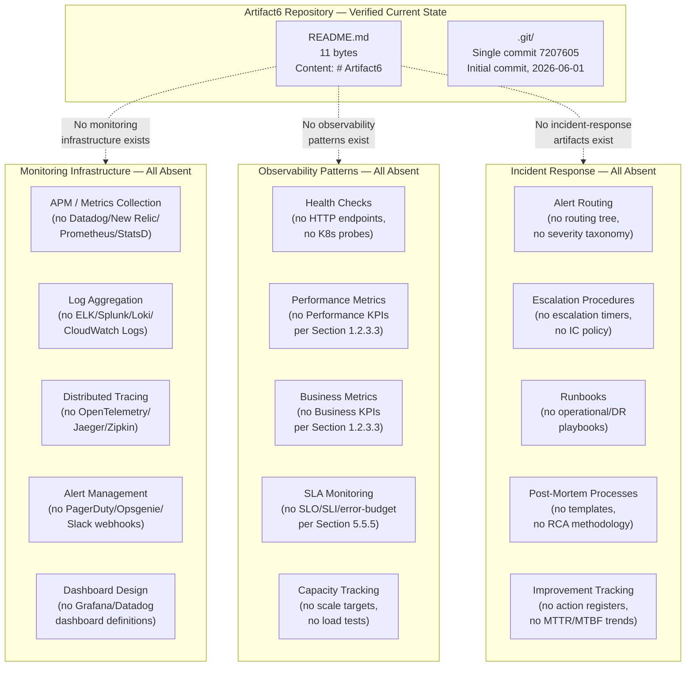
```mermaid
graph TB
    subgraph Current["Artifact6 Repository — Verified Current State"]
        README["README.md<br/>11 bytes<br/>Content: # Artifact6"]
        GitMeta[".git/<br/>Single commit 7207605<br/>Initial commit, 2026-06-01"]
    end

    subgraph MonInfra["Monitoring Infrastructure — All Absent"]
        APM["APM / Metrics Collection<br/>(no Datadog/New Relic/<br/>Prometheus/StatsD)"]
        LOGS["Log Aggregation<br/>(no ELK/Splunk/Loki/<br/>CloudWatch Logs)"]
        TRACE["Distributed Tracing<br/>(no OpenTelemetry/<br/>Jaeger/Zipkin)"]
        ALERT["Alert Management<br/>(no PagerDuty/Opsgenie/<br/>Slack webhooks)"]
        DASH["Dashboard Design<br/>(no Grafana/Datadog<br/>dashboard definitions)"]
    end

    subgraph ObsPat["Observability Patterns — All Absent"]
        HEALTH["Health Checks<br/>(no HTTP endpoints,<br/>no K8s probes)"]
        PERF["Performance Metrics<br/>(no Performance KPIs<br/>per Section 1.2.3.3)"]
        BIZ["Business Metrics<br/>(no Business KPIs<br/>per Section 1.2.3.3)"]
        SLA["SLA Monitoring<br/>(no SLO/SLI/error-budget<br/>per Section 5.5.5)"]
        CAP["Capacity Tracking<br/>(no scale targets,<br/>no load tests)"]
    end

    subgraph IncResp["Incident Response — All Absent"]
        ROUTE["Alert Routing<br/>(no routing tree,<br/>no severity taxonomy)"]
        ESC["Escalation Procedures<br/>(no escalation timers,<br/>no IC policy)"]
        RB["Runbooks<br/>(no operational/DR<br/>playbooks)"]
        PM["Post-Mortem Processes<br/>(no templates,<br/>no RCA methodology)"]
        IMP["Improvement Tracking<br/>(no action registers,<br/>no MTTR/MTBF trends)"]
    end

    README -.->|"No monitoring<br/>infrastructure exists"| MonInfra
    README -.->|"No observability<br/>patterns exist"| ObsPat
    README -.->|"No incident-response<br/>artifacts exist"| IncResp
```

The dashed edges denote the absence of any path from the repository's sole tracked content to any Monitoring and Observability layer. Because every category mandated by the section prompt is empty, no concrete monitoring architecture, alert flow diagram, or dashboard layout can be constructed in this revision.

### 6.5.8 Basic Monitoring Practices for Future Adoption

The section prompt directs that, when the system "does not require specific monitoring beyond basic health checks," the document must "explain which basic monitoring practices will be followed instead." This subsection enumerates the deferred guidance that will be applied to future commits, drawn from observability industry-standard postures aligned with the candidate-stack neutrality of Section 3.9.6. None of the practices below describes a current implementation; each is recorded as a commitment to govern future observability-relevant artifacts when they are introduced.

#### 6.5.8.1 Baseline Practices for the First Source-Code Commit

| Practice Domain | Baseline Practice Commitment |
|---|---|
| Process liveness | Process exit codes, container restart counts, and orchestrator-native liveness reporting become the minimum signal |
| Structured logging | First logging-framework adoption must emit JSON-structured logs with timestamp, severity, and correlation-ID fields |
| Error visibility | First error-tracking SDK adoption (Sentry, Bugsnag, Rollbar) becomes the default error-notification path before custom alerting is added |
| Health endpoint | First HTTP server adoption must expose `/health` (or `/healthz`) returning a 200 status when the process is alive and dependencies are reachable |

These practices become operationally measurable only when the first source-code module is committed. Until then, no source-code surface exists against which to apply them.

#### 6.5.8.2 Baseline Practices Aligned with the Candidate Technology Stack

Section 3.9 enumerates a Candidate Technology Stack (AWS, Docker, Terraform, GitHub Actions, Python, Flask, Auth0, MongoDB, LangChain, React, React Native). The table below records the basic observability practices that will be applied when (and only when) each candidate is actually adopted via committed artifacts, per the Section 3.9.6 caveat that no adoption may be inferred from candidate-status.

| Candidate Domain | Baseline Observability Practice (Deferred) |
|---|---|
| Python / Flask (backend) | Standard-library `logging` configured with JSON formatter; Flask request/response logging middleware; uncaught-exception logger; OpenTelemetry-Python auto-instrumentation when service mesh is introduced |
| MongoDB (database) | Driver-level slow-query logging; Atlas-native or self-hosted `mongostat`/`mongotop` baselines; query-profiler enablement on non-production replicas |
| AWS (cloud platform) | CloudWatch Logs default ingestion; CloudWatch Metrics for compute/storage primitives; CloudWatch Alarms for the SLO indicators declared at NFR commit time; X-Ray for distributed tracing |
| Docker (containers) | `docker logs` JSON driver baseline; container stdout/stderr capture as the default log path; image labels for build/version metadata |
| Terraform (IaC) | Provisioning-event logging via Terraform Cloud / `terraform plan` outputs; drift-detection cadence at first `terraform.tfstate` commit |
| GitHub Actions (CI/CD) | Workflow-run logs as the default observability surface for build/test/deploy; `workflow_run` event-driven alerting at first failure |
| Auth0 (identity) | Auth0 Logs Stream to chosen aggregation backend; anomaly-detection alerts for failed-login spikes; audit-log retention per Section 6.4.4.3 |
| LangChain (AI framework) | LangSmith tracing for prompt-chain observability when LangChain is first imported; token-usage metrics emission to the chosen metrics backend |
| React / React Native (frontend) | Browser-side error reporting via the chosen error-tracking SDK; Core Web Vitals capture; React DevTools Profiler / Flipper for local performance investigation |

Each entry above is conditional. Per Section 3.9.6, "no selections are final," "compatibility unverified," "version pins absent by design," and "justifications deferred." The basic monitoring practices become applicable only when the corresponding candidate is adopted via a committed artifact (SDK dependency, agent configuration, IaC resource, or ADR).

#### 6.5.8.3 Baseline Health-Check Practice

When the first HTTP service or worker is committed, the following minimum health-check practice will be applied as the entry-level observability commitment:

| Practice Element | Baseline Commitment |
|---|---|
| Liveness endpoint | A `/healthz` (or `/livez`) endpoint returning HTTP 200 when the process is alive, regardless of dependency state |
| Readiness endpoint | A `/readyz` endpoint returning HTTP 200 only when downstream dependencies (database, cache, message broker) are reachable |
| Probe-interval defaults | Liveness every 10 seconds with 3-failure tolerance; readiness every 5 seconds with 2-failure tolerance (orchestrator-default-aligned) |
| Dependency probe coverage | Each external dependency declared in a future Section 3.5 update gets a corresponding readiness sub-check |

This practice constitutes the minimum "basic monitoring" referenced by the section prompt. It is recorded as deferred guidance until the first HTTP server, gRPC server, or worker process is committed.

### 6.5.9 Cross-References to Prior Sections

Every absence documented in Sections 6.5.3 through 6.5.5 is anchored in the authoritative findings of prior sections of this Technical Specification. The tables below map each Section 6.5 topic to the prior section that authoritatively establishes its absence.

#### 6.5.9.1 Monitoring Infrastructure Cross-Reference Map

| Section 6.5 Topic | Authoritative Prior Section |
|---|---|
| Metrics collection | Section 3.5.1; Section 5.5.1 |
| Log aggregation | Section 3.5.1; Section 5.5.2 |
| Distributed tracing | Section 5.5.2 |
| Alert management | Section 3.5.1; Section 4.4.2 |
| Dashboard design | Section 3.5.1; Section 5.5.1 |

#### 6.5.9.2 Observability Patterns Cross-Reference Map

| Section 6.5 Topic | Authoritative Prior Section |
|---|---|
| Health checks | Section 3.7; Section 5.5.1 |
| Performance metrics | Section 1.2.3.3; Section 5.5.5 |
| Business metrics | Section 1.2.2.1; Section 1.2.3.3 |
| SLA monitoring | Section 1.2.3.3; Section 5.5.5 |
| Capacity tracking | Section 5.3.1; Section 6.1.4.3 |

#### 6.5.9.3 Incident Response Cross-Reference Map

| Section 6.5 Topic | Authoritative Prior Section |
|---|---|
| Alert routing | Section 3.5.1; Section 4.4.2 |
| Escalation procedures | Section 4.4.2; Section 5.5.6 |
| Runbooks | Section 4.4.2; Section 5.5.6 |
| Post-mortem processes | Section 4.4.2; Section 5.5.6 |
| Improvement tracking | Section 1.2.3.3; Section 5.5.5 |

### 6.5.10 Forward Plan

Consistent with the section-revision-trigger pattern established in Sections 2.8, 3.11, 4.8, 5.8, 6.1.9, 6.2.10, 6.3.9, and 6.4.10, the table below enumerates the repository events that would warrant revision of Section 6.5 in a future iteration of this Technical Specification. Each trigger maps to one or more subsections of Section 6.5 that would gain authoritative content.

#### 6.5.10.1 Section Revision Triggers

The following are the primary trigger events for re-authoring this section. Each event represents a discrete repository commit (or supplied authoritative user context) that would unblock the corresponding Section 6.5 subsection. These triggers align with the linkages declared in Section 5.8.1 and Section 5.8.3's note that "Monitoring & Observability: Approach declared in Section 5.5.1 becomes SLO and dashboard source material."

| Trigger Event | Resulting Section 6.5 Subsection Revision |
|---|---|
| First APM agent / instrumentation library committed (Datadog, New Relic, Dynatrace SDK) | 6.5.3.1 Metrics Collection; 6.5.3.3 Distributed Tracing |
| First metrics exporter committed (Prometheus client, StatsD, OpenMetrics, Micrometer) | 6.5.3.1 Metrics Collection; 6.5.3.5 Dashboard Design |
| First logging framework import committed (Winston, Bunyan, log4j, Python `logging`, structlog, zap, logrus) | 6.5.3.2 Log Aggregation |
| First log-aggregation backend configuration committed (ELK, Splunk, Loki, CloudWatch Logs, Stackdriver) | 6.5.3.2 Log Aggregation |

#### 6.5.10.2 Additional Revision Triggers

| Trigger Event | Resulting Section 6.5 Subsection Revision |
|---|---|
| First tracing library committed (OpenTelemetry, Jaeger, Zipkin, AWS X-Ray, Tempo) | 6.5.3.3 Distributed Tracing |
| First health-check endpoint or Kubernetes liveness/readiness probe manifest committed | 6.5.4.1 Health Checks |
| First alerting integration committed (PagerDuty, Opsgenie, VictorOps, Slack webhook) | 6.5.3.4 Alert Management; 6.5.5.1 Alert Routing; 6.5.5.2 Escalation Procedures |
| First error-tracking SDK committed (Sentry, Bugsnag, Rollbar) | 6.5.3.4 Alert Management |
| First dashboard definition committed (Grafana JSON, Datadog dashboard JSON, Kibana saved object) | 6.5.3.5 Dashboard Design |
| First SLO / SLI definition or NFR document committed | 6.5.4.4 SLA Monitoring; 6.5.4.2 Performance Metrics; 6.5.5.6 Alert Threshold Matrix |
| First business / financial KPI declaration committed | 6.5.4.3 Business Metrics |
| First capacity plan, load-test artifact, or topology document committed | 6.5.4.5 Capacity Tracking |
| First runbook or operational playbook committed | 6.5.5.3 Runbooks; 6.5.5.2 Escalation Procedures |
| First post-mortem template or retrospective document committed | 6.5.5.4 Post-Mortem Processes |
| First action-item register, issue-tracker integration, or improvement-OKR document committed | 6.5.5.5 Improvement Tracking |
| First on-call rotation schedule or incident-commander policy committed | 6.5.5.1 Alert Routing; 6.5.5.2 Escalation Procedures |
| First ADR documenting a monitoring / observability stack decision committed | All subsections of 6.5 (with rationale narrative) |
| Authoritative user context with concrete monitoring requirements supplied | All subsections of 6.5, with explicit cross-reference to supplied context |

#### 6.5.10.3 Documentation Consistency Commitments

When any of the above triggers fires, the following consistency commitments apply to the revision of Section 6.5:

1. **Cross-reference integrity.** Updated findings in Section 6.5 must remain consistent with the corresponding updates in Sections 1.2, 3.5, 3.6, 3.7, 4.4, 5.4, 5.5, 6.1, 6.2, 6.3, and 6.4 (particularly 5.5.1 for monitoring approach, 5.5.2 for logging/tracing, 5.5.5 for SLAs, 5.5.6 for DR-derived incident response, and 6.4.4.3 for audit-log monitoring overlap).
2. **Evidence-only authorship.** New metrics, logging, tracing, alerting, SLO, runbook, or post-mortem claims must be grounded in the committed artifact or supplied user context; speculation about "typical" monitoring patterns for a project named Artifact6 remains prohibited per Section 2.7.1.
3. **Candidate-stack neutrality.** Adoption of any element from the Candidate Technology Stack of Section 3.9 must be evidenced by an actual commit (SDK dependency, agent configuration, IaC artifact, or ADR), not inferred from the candidate-stack proposal. Per Section 3.9.6, no version pin, justification, or integration-pattern analysis may be authored absent committed artifacts.
4. **Diagram producibility reevaluation.** The producibility status of the diagrams required in Section 6.5.6 (Monitoring Architecture, Alert Flow Diagrams, Dashboard Layouts) must be reassessed at each revision; once producible, each diagram must be authored before Section 6.5 can transition from "Not Applicable" to a populated state.
5. **Metric and SLA disclosure.** When metrics and SLOs are committed, all metric definitions, SLI formulas, SLO targets, error-budget windows, and burn-rate alerting thresholds must be enumerated in tabular form per the section prompt's "Use Markdown tables for metrics definitions" and "Tables should never have more than four columns" requirements.
6. **Alert threshold matrix update.** The consolidated alert threshold matrix authored in Section 6.5.5.6 must be revised to reflect each newly declared threshold, with its declaration status changing from "Not declared" to a specific threshold value (with measurement window and burn-rate multiplier where applicable).
7. **SLA requirement disclosure.** When SLA / SLO documents are committed, all service-level constructs must be documented with framework reference, applicable indicators, and contractual or internal commitment status, consistent with the section prompt's "Document SLA requirements" directive.
8. **Incident-response synchronization.** Runbook, escalation, and post-mortem artifacts updated in Section 6.5.5 must be synchronized with the disaster-recovery findings in Section 5.5.6 and the error-notification flows in Section 4.4.2.

### 6.5.11 Section Versioning

Consistent with the section-versioning pattern established in Sections 2.7.3, 3.11.3, 4.9, 5.9, 6.1.10, 6.2.11, 6.3.10, and 6.4.11, the table below records the revision history of Section 6.5 against the repository state at each revision.

| Version | Date | Repository Commit | Notable State |
|---|---|---|---|
| 1.0 | 2026-06-01 | `7207605` | Empty repository; section documents the absence of all Monitoring and Observability artifacts (monitoring infrastructure, observability patterns, incident response) and confirms "Not Applicable" determination per the section prompt's explicit directive. Basic monitoring practices enumerated as deferred guidance for future commits. |

#### References

#### Files Examined

- `README.md` — The repository's only tracked file (11 bytes, content `# Artifact6`). Used to confirm the absence of any APM agent configuration, metrics exporter, logging framework, tracing library, alerting integration, dashboard definition, health-check endpoint, SLO/SLI specification, runbook, or post-mortem template that would otherwise underpin a Monitoring and Observability section.

#### Folders Explored

- `/` (repository root, depth 0) — Contains exactly one tracked child (`README.md`) plus the `.git/` metadata directory. No subdirectories with monitoring source modules, observability configurations, logging frameworks, tracing libraries, dashboard definitions, alert-rule files, runbooks, on-call rotation schedules, post-mortem archives, or SLO definitions exist. Used to confirm the comprehensive absence of Monitoring and Observability artifacts.

#### Searches Conducted

- Semantic file search for "monitoring observability metrics logging tracing health check alerts dashboards" — Zero results, confirming no monitoring-related source files exist in the repository index.
- Semantic folder search for "monitoring observability operations infrastructure metrics" — Zero results, confirming no monitoring-related folders exist.
- Filesystem search for `.blitzyignore` files — Confirmed no `.blitzyignore` files exist in the repository.

#### Cross-Referenced Technical Specification Sections

- **Section 1.2.2.1 (Primary System Capabilities)** — Established that no business capabilities exist, which precludes any business-metric declaration; anchors Section 6.5.4.3.
- **Section 1.2.2.2 (Major System Components)** — Established that only `README.md` and `.git/` metadata exist; no instrumentable components are present.
- **Section 1.2.3.3 (Success Criteria / KPIs)** ⭐ **PRIMARY SOURCE** — Established that all five KPI categories (Functional, Performance, Reliability, Adoption/usage, Business/financial) are "Not declared in repository." Anchors Sections 6.5.4.2, 6.5.4.3, and 6.5.4.4.
- **Section 1.3.3.1 (Verified Repository Facts)** — Provided the authoritative repository state baseline (single commit `7207605`, sole file `README.md`, no subdirectories) reused in Section 6.5.1.1.
- **Section 2.7.1 (Evidence-Only Constraint)** — Provided the prohibition against speculating about "typical" features or technologies, which governs the "Not Applicable" determination in this section.
- **Section 3.5.1 (External Service Integrations)** ⭐ **PRIMARY SOURCE** — Established that the "Observability / monitoring" service category is "None" with "No APM agent config, log-aggregation config, or metrics exporters committed," and that the "Error tracking" category is "None" with "No Sentry, Bugsnag, or Rollbar configuration committed." Anchors all of Section 6.5.3.
- **Section 3.5.2 (Service Integration Evidence Map)** — Established that no HTTP-client libraries, no API contracts, and no webhook endpoints are committed, eliminating any inbound or outbound telemetry channel.
- **Section 3.7 (Development & Deployment)** — Established that no Dockerfile, no Compose file, no Kubernetes/Helm manifests, no IaC (Terraform/Pulumi/CloudFormation), and no CI/CD pipelines are committed; anchors Section 6.5.4.1 (no probes possible) and Section 6.5.4.5 (no capacity surface).
- **Section 3.9 (Candidate Technology Stack)** — Established that AWS, Docker, Terraform, GitHub Actions, Python, Flask, Auth0, MongoDB, LangChain, React, and React Native are listed as candidates but **not adopted**; the Section 3.9.6 caveats govern Section 6.5 by prohibiting authoring of any monitoring control for candidate-only components. Section 6.5.8.2 draws on Section 3.9 for forward-looking deferred guidance.
- **Section 4.4.2 (Error Handling Evidence Map)** ⭐ **PRIMARY SOURCE** — Established that no retry libraries, no fallback handlers, no alerting configuration (PagerDuty, Opsgenie, Slack webhooks), no error-tracking integration (Sentry, Bugsnag, Rollbar), no runbooks, no disaster-recovery plans, and no incident-response playbooks are committed. Anchors Sections 6.5.3.4, 6.5.5.1, 6.5.5.2, and 6.5.5.3.
- **Section 5.2.2 (Core Components Evidence Map)** — Confirmed that the Core Components Table has zero documentable rows, eliminating any instrumentation target.
- **Section 5.3.1 (Per-Component Documentation Evidence Map)** — Confirmed that no scale targets, capacity plans, or topology documentation are committed; anchors Section 6.5.4.5.
- **Section 5.5.1 (Monitoring and Observability Evidence Map)** ⭐ **PRIMARY SOURCE** — Established that APM agent / instrumentation, metrics export and aggregation, dashboards and SLO definitions, and health check / readiness endpoints are all "Not documentable." Anchors all of Sections 6.5.3 and 6.5.4.1.
- **Section 5.5.2 (Logging and Tracing Evidence Map)** ⭐ **PRIMARY SOURCE** — Established that no logging framework imports, no log-configuration files, no tracing libraries, and no log-aggregation backends are committed. Anchors Sections 6.5.3.2 and 6.5.3.3.
- **Section 5.5.3 (Error Handling Evidence Map)** — Confirmed that no error notification flows exist, anchoring Section 6.5.3.4 and 6.5.5.1.
- **Section 5.5.5 (Performance and SLA Evidence Map)** ⭐ **PRIMARY SOURCE** — Established that latency targets, throughput targets, availability / uptime SLOs, and error-budget / burn-rate policies are all "Not declared in repository." Anchors Section 6.5.4.4.
- **Section 5.5.6 (Disaster Recovery Evidence Map)** ⭐ **PRIMARY SOURCE** — Established that no RPO/RTO targets, no backup procedures, and no runbooks or incident-response playbooks are committed. Anchors Sections 6.5.5.2, 6.5.5.3, and 6.5.5.4.
- **Section 5.8 (Forward Plan)** ⭐ **TRIGGER PATTERN SOURCE** — Established the section-revision-trigger pattern reused in Section 6.5.10. Section 5.8.1 explicitly identifies "First observability / APM configuration committed," "First logging or tracing configuration committed," "First NFR document with SLAs committed," and "First runbook or disaster-recovery plan committed" as trigger events. Section 5.8.3 explicitly states "Monitoring & Observability: Approach declared in Section 5.5.1 becomes SLO and dashboard source material."
- **Section 6.1 (Core Services Architecture)** ⭐ **PRECEDENT** — Established the "Not Applicable" determination pattern, structural template, evidence-map subsection style, and Repository State Snapshot Mermaid diagram template that Section 6.5 mirrors. Section 6.1.4.3 anchors Section 6.5.4.5 (capacity tracking absence).
- **Section 6.2 (Database Design)** ⭐ **PRECEDENT** — Reinforced the "Not Applicable" determination pattern.
- **Section 6.3 (Integration Architecture)** ⭐ **PRECEDENT** — Reinforced the "Not Applicable" determination pattern; relevant for the absence of any integration-channel telemetry.
- **Section 6.4 (Security Architecture)** ⭐ **PRECEDENT** — Most recent and directly analogous "Not Applicable" determination, sharing structural conventions reused in Section 6.5. Section 6.4.4.3 anchors Section 6.5.3.4 (no audit-log monitoring surface). Section 6.4.5.5 anchors Section 6.5.4.4 (no contractual / compliance SLA documentation).

## 6.6 Testing Strategy

### 6.6.1 Authoritative State Declaration

**Detailed Testing Strategy is not applicable for this system in its current revision.** The governing section prompt explicitly authorizes this determination, directing: *"If the system is a simple library, tool, or does not require comprehensive testing, clearly state 'Detailed Testing Strategy is not applicable for this system' and explain why, then document only the basic unit testing approach that will be used."* This conclusion is independently and jointly established by every prior section of this Technical Specification that touched on testing frameworks, test runners, mocking libraries, code coverage, CI/CD pipelines, performance KPIs, security scanning, or quality gates.

The applicability of a Testing Strategy section presupposes the existence of (a) at least one source-code module against which tests could be authored, (b) at least one declared test framework, test runner, or assertion library, (c) at least one CI/CD pipeline definition that exercises tests against committed code, and (d) at least one quality-gate declaration (coverage threshold, success-rate requirement, performance budget) or NFR document. **None of these preconditions is satisfied by the Artifact6 repository.**

The Artifact6 case is materially more emphatic than the typical "simple library or tool" scenario contemplated by the section prompt. The repository is not a simple library awaiting documentation of its existing unit-test approach — it is an empty repository awaiting initial implementation. There is no source-code surface to test, no test surface against which to define a strategy, and no execution surface against which to attach quality gates.

This determination mirrors the precedent established in Section 6.1 (Core Services Architecture), Section 6.2 (Database Design), Section 6.3 (Integration Architecture), Section 6.4 (Security Architecture), and Section 6.5 (Monitoring and Observability), each of which authored an identical "Not Applicable" determination on the same evidentiary basis. Section 6.6 inherits the structural template, evidence-map subsection style, and Repository State Snapshot diagram convention from those precedents while substituting testing- and quality-specific subject matter for the architectural, persistence, integration, security, and observability subject matter previously addressed.

The basic testing practices that will be applied to future commits — should test artifacts be introduced — are enumerated in Section 6.6.8 below. These practices are recorded as deferred guidance rather than current implementation.

#### 6.6.1.1 Repository State Baseline

The verified repository state established in Section 1.3.3.1 and reconfirmed across Sections 3.1 through 6.5 is summarized below. The baseline is unchanged from the snapshot used by Sections 6.1.1.1, 6.2.1.1, 6.3.1.1, 6.4.1.1, and 6.5.1.1.

| Repository Fact | Verified Value | Authoritative Source |
|---|---|---|
| Tracked content | `README.md` only (11 bytes, content `# Artifact6`) | Section 1.3.3.1 |
| Commit history | One commit (`7207605`, "Initial commit", 2026-06-01) | Section 1.3.3.1 |
| Subdirectories | None (only `.git/` metadata exists) | Section 1.3.3.1 |
| Source-code modules | None | Section 1.2.2.2 |
| Testing framework | None declared | Section 3.3.1 |
| Test framework config files (`jest.config.*`, `pytest.ini`, `vitest.config.*`) | Files absent | Section 3.3.2 |
| Open-source dependencies (across all 15 package managers) | Zero | Section 3.4 |
| CI/CD pipeline configurations | None | Section 3.7.5 |
| Performance / Reliability KPIs | All "Not declared" | Sections 1.2.3.3 and 5.5.5 |

#### 6.6.1.2 Why a Detailed Testing Strategy Cannot Be Authored

The preconditions for documenting a testing approach, test-automation regime, and quality-metrics framework are absent on every axis. The table below summarizes the cumulative findings established in prior sections.

| Precondition | Required Evidence | Repository Evidence |
|---|---|---|
| Testable source surface exists | Source modules, packages, classes, functions to test | None — only `README.md` and `.git/` exist per Section 1.2.2.2 |
| Test framework adopted | `jest.config.*`, `pytest.ini`, `vitest.config.*`, `pom.xml` Surefire/Failsafe, `go test` packages | None — "Testing framework: None declared" per Section 3.3.1; all config files absent per Section 3.3.2 |
| Test execution surface exists | CI/CD pipeline (`.github/workflows/`, `.gitlab-ci.yml`, `Jenkinsfile`, etc.) | None — "No CI/CD pipeline configuration exists in the repository" per Section 3.7.5 |
| Quality-gate declarations exist | NFR document, coverage thresholds, performance budgets, success-rate targets | None — all KPIs "Not declared" per Section 1.2.3.3; no Performance/Reliability targets per Section 5.5.5 |
| Test data and environment exist | Fixtures, factories, seed scripts, `docker-compose.test.yml`, `.env.test`, container images | None — no data layer per Section 6.2; no containerization or environment manifests per Section 3.7.3 |

Because no source-code surface, no test-framework surface, no test-execution surface, no quality-gate surface, and no test-environment surface exists, every required subsection of Testing Strategy (Testing Approach, Test Automation, Quality Metrics) would require fabrication to populate. This is prohibited by the evidence-only documentation constraint established in Section 2.7.1.

### 6.6.2 Section-Prompt Fidelity Constraint

Consistent with the constraint architecture articulated in Section 2.7.1 (evidence-only documentation), Section 3.1.2 (section-prompt fidelity for the Technology Stack), Section 5.1.2 (section-prompt fidelity for System Architecture), Section 6.1.2 (section-prompt fidelity for Core Services Architecture), Section 6.2.2 (section-prompt fidelity for Database Design), Section 6.3.2 (section-prompt fidelity for Integration Architecture), Section 6.4.2 (section-prompt fidelity for Security Architecture), and Section 6.5.2 (section-prompt fidelity for Monitoring and Observability), this section documents the **inventory of absences** for each testing approach, test-automation, and quality-metric element mandated by the prompt, rather than manufacturing test frameworks, test pyramids, coverage thresholds, or CI/CD pipelines that have no basis in repository evidence.

#### 6.6.2.1 Prohibited Authoring Actions for This Section

Specifically, Section 6.6 does **not**:

- Select unit-testing frameworks (Jest, Vitest, Mocha, Jasmine, Karma, AVA, Tape, pytest, unittest, nose2, JUnit 5, TestNG, Spock, RSpec, Minitest, NUnit, xUnit.net, MSTest, Go `testing`, Catch2, Google Test) absent any committed test-runner configuration, dependency declaration, or test file per Sections 3.3.1, 3.3.2, and 3.4.1.
- Specify assertion libraries (Chai, Sinon-Chai, expect, assert, AssertJ, Hamcrest, FluentAssertions, testify) absent any committed dependency or test file per Section 3.4.1.
- Define mocking libraries (Sinon, Jest mocks, unittest.mock, Mockito, MockK, PowerMock, EasyMock, MSW, nock, WireMock, hoverfly, VCR.py, Betamax) absent any committed dependency or test fixture per Section 3.4.1.
- Author test-organization conventions (test-directory layout `tests/`, `__tests__/`, `spec/`, `cypress/`, `e2e/`; file-naming patterns `*.test.*`, `*.spec.*`, `*_test.py`, `*Test.java`; describe/it/it-each block conventions) absent any committed test directory or test file.
- Specify integration-testing frameworks (Supertest, REST Assured, Postman/Newman, Karate, Pact, Spring Cloud Contract, testcontainers, LocalStack, mongo-mock, embedded H2/HSQLDB, in-memory Redis) absent any committed integration-test artifact per Sections 3.4.1 and 6.2.
- Define E2E / UI-automation frameworks (Playwright, Cypress, Selenium WebDriver, Puppeteer, WebdriverIO, Nightwatch.js, TestCafe, Appium, Detox, Espresso, XCUITest) absent any committed E2E configuration or test scenario per Section 3.4.1.
- Author performance / load-testing tooling (k6, Gatling, JMeter, Locust, Artillery, Apache Benchmark, wrk, Vegeta, Tsung) absent any committed performance-test script per Section 6.1.4.3, which has authoritatively confirmed "no load-test scripts ... committed."
- Specify cross-browser testing matrices (BrowserStack, Sauce Labs, LambdaTest, Selenium Grid, Playwright cross-browser projects) absent any committed browser-matrix configuration or device-farm credentials.
- Configure code-coverage tools (Istanbul / nyc, Jest coverage, Coverage.py, JaCoCo, Cobertura, OpenCover, SimpleCov, gocover, llvm-cov, Tarpaulin) absent any committed `.coveragerc`, `coverage` block in `pyproject.toml`, `jest.config.*` coverage section, or coverage-report destination per Section 3.4.1.
- Select security-testing tooling (SonarQube, Semgrep, Checkmarx, Veracode, Snyk, OWASP Dependency-Check, npm audit, pip-audit, Trivy, Grype, OWASP ZAP, Burp Suite, GitLeaks, TruffleHog) absent any committed scanner configuration or pipeline step per Sections 3.4.3 and 3.10.1.
- Define CI/CD test orchestration (GitHub Actions matrix strategy, GitLab CI parallel jobs, Jenkins parallel stages, CircleCI test splitting, Buildkite parallelism) absent any committed pipeline definition per Section 3.7.5.
- Mandate test reporting formats (JUnit XML, TestNG XML, NUnit XML, TAP, Allure, ReportPortal, html-reporter, Mochawesome) absent any committed reporter configuration or report-destination URL.
- Specify failed-test handling (automatic retry counts, `--rerun-failures` flags, quarantine policies, must-pass tagging) absent any committed retry-library configuration per Section 4.4.2 (which confirmed "no retry libraries committed").
- Author flaky-test management policies (flake-detection thresholds, quarantine-after-N-failures policies, periodic flaky-test reviews, `pytest-rerunfailures` configuration, Jest `--testFailureExitCode` strategies) absent any committed test surface.
- Manufacture code-coverage targets (line, branch, function, statement, condition coverage percentages), test-success-rate thresholds, or performance budgets absent any committed NFR document, ADR, or quality-gate manifest per Sections 1.2.3.3 and 5.5.5.
- Define quality-gate frameworks (SonarQube Quality Gates, Code Climate, Codacy, DeepSource, GitHub branch-protection required-status-checks) absent any committed configuration per Section 3.7.1, which confirmed "Linting: None declared" and "Code formatting: None declared."
- Specify test-environment management (`.env.test`, `docker-compose.test.yml`, ephemeral preview environments, namespaced K8s test environments, test-database seeding policies) absent any committed environment manifest per Sections 3.7.3 and 3.7.4.
- Promote candidate technologies from Section 3.9 (pytest for Python/Flask; Jest + React Testing Library for React; Playwright/Cypress for E2E; testcontainers for MongoDB; moto/LocalStack for AWS; terratest for Terraform; LangSmith for LangChain) to "adopted" status; per Section 3.9.6, no version pin, configuration, or integration requirement may be authored for candidate-only components, none of which are testing frameworks at the present time.

#### 6.6.2.2 What This Section Does Document

This section authoritatively documents:

1. The specific testing approach, test-automation, and quality-metric elements required by the section prompt and the evidence (or absence thereof) supporting each.
2. The producibility status of each required diagram (test execution flow, test environment architecture, test data flow).
3. The Repository State Snapshot Mermaid diagram — the only diagram producible against current repository evidence.
4. The basic testing practices that will become applicable when corresponding artifacts are committed, presented as deferred guidance rather than current controls.
5. Cross-references to authoritative prior-section findings that establish each individual absence.
6. The repository events that would trigger revision of this section in a future iteration of the Technical Specification.

### 6.6.3 Testing Approach Evidence Map

The section prompt enumerates three required Testing Approach categories: Unit Testing, Integration Testing, and End-to-End Testing. The section prompt's Notes additionally direct the inclusion of security testing requirements. The evidence available in the repository to document each is recorded below.

#### 6.6.3.1 Unit Testing

The section prompt requires documentation of testing frameworks and tools, test organization structure, mocking strategy, code coverage requirements, test naming conventions, and test data management.

| Required Element | Evidence in Repository | Documentable? |
|---|---|---|
| Unit-testing framework | "Testing framework: None declared" per Section 3.3.1; `jest.config.*`, `pytest.ini`, `vitest.config.*` all absent per Section 3.3.2 | No |
| Test organization structure | No `tests/`, `test/`, `__tests__/`, `spec/`, or `cypress/` directories exist per Section 1.3.3.1 | No |
| Mocking strategy / libraries | No mocking library (Sinon, Mockito, unittest.mock, MSW) committed; zero dependencies across 15 package managers per Section 3.4 | No |
| Code-coverage tooling | No Istanbul/nyc, Coverage.py, JaCoCo, or coverage-config files committed per Sections 3.3.2 and 3.4.1 | No |
| Test naming conventions | No tests exist to name; no contributor / style guide committed per Section 3.7.1 | No |
| Test-data management (fixtures, factories) | No fixture files, factory libraries (Factory Bot, factory_boy), or seed scripts committed per Section 6.2 | No |

Section 3.3.1 has authoritatively established that no testing framework is adopted. Section 3.3.2 has authoritatively established that the standard test-framework configuration files (`jest.config.*`, `pytest.ini`, `vitest.config.*`) are absent from the repository. Section 3.4 has authoritatively established that zero dependencies exist across the fifteen enumerated package managers, eliminating any assertion library, mocking library, or coverage tool that would anchor a unit-testing approach. The unit-testing inventory that would normally populate this subsection — mapping each test suite to its framework, location, mocking pattern, and coverage contribution — contains zero rows.

#### 6.6.3.2 Integration Testing

The section prompt requires documentation of service integration test approach, API testing strategy, database integration testing, external service mocking, and test environment management.

| Required Element | Evidence in Repository | Documentable? |
|---|---|---|
| Service integration tests | No services exist to integrate per Section 6.1; no test surface per Section 3.3.1 | No |
| API testing strategy | No API contracts (OpenAPI, GraphQL SDL, AsyncAPI, `.proto`) per Section 5.2.4; no API surface per Section 6.3 | No |
| Database integration testing | No databases configured per Section 6.2; no DB drivers per Section 3.4; no `testcontainers` reference | No |
| External service mocking (WireMock, MSW, nock, hoverfly) | No external services integrated per Section 3.5.1 (all eleven categories "None") | No |
| Test-environment management | No `docker-compose.test.yml`, no `.env.test`, no test-environment manifests committed per Sections 3.7.3 and 3.7.4 | No |

Section 5.2.4 has authoritatively confirmed that the External Integration Points Table has zero documentable rows, eliminating any API surface against which to define API tests. Section 6.2 has authoritatively confirmed that no databases are configured, eliminating any database-integration test target. Section 3.5.1 has authoritatively confirmed that all eleven third-party service categories are "None," eliminating any external-service-mocking target. The integration-testing inventory that would normally populate this subsection — mapping each cross-component contract to its test harness and mock infrastructure — contains zero rows.

#### 6.6.3.3 End-to-End Testing

The section prompt requires documentation of E2E test scenarios, UI automation approach, test data setup/teardown, performance testing requirements, and cross-browser testing strategy.

| Required Element | Evidence in Repository | Documentable? |
|---|---|---|
| E2E test scenarios | No user workflows declared per Section 2.2 (Feature Catalog empty); no journeys per Section 4.2.1 | No |
| UI automation framework | No frontend source per Section 3.2; no E2E tooling (Playwright, Cypress, Selenium, Puppeteer) per Section 3.4.1 | No |
| Test data setup / teardown | No data layer per Section 6.2; no seed scripts or data-builder utilities committed | No |
| Performance / load testing | "No load-test scripts (k6, Gatling, Locust, JMeter), no historical performance data committed" per Section 6.1.4.3 | No |
| Cross-browser testing matrix | No browser surface; no Selenium Grid, BrowserStack, Sauce Labs, or LambdaTest configuration committed | No |

Section 2.2 has authoritatively established that the Feature Catalog is empty, eliminating any user-workflow definition against which E2E scenarios could be authored. Section 6.1.4.3 has authoritatively confirmed that no load-test scripts (k6, Gatling, Locust, JMeter) and no historical performance data are committed. Section 1.2.3.3 has authoritatively confirmed that no Performance KPIs are declared, eliminating any performance-test threshold. The E2E-testing inventory that would normally populate this subsection — mapping each end-to-end scenario to its automation framework, data setup, performance threshold, and browser-matrix — contains zero rows.

#### 6.6.3.4 Security Testing

The section prompt's Notes direct: "Include security testing requirements." This subsection records the inventory of security-testing categories that the section prompt's directive would normally populate.

| Required Element | Evidence in Repository | Documentable? |
|---|---|---|
| SAST (Static Application Security Testing) | No SonarQube, Semgrep, Checkmarx, or Veracode configuration committed per Section 3.10.1 | No |
| DAST (Dynamic Application Security Testing) | No OWASP ZAP, Burp Suite, or Acunetix configuration committed; no deployment surface per Section 3.7 | No |
| SCA (Software Composition Analysis) | "No SCA scanner configuration ... is committed" per Section 3.4.3; no dependencies to scan per Section 3.4.1 | No |
| Secret scanning | No TruffleHog, GitLeaks, or GitHub secret-scanning configuration; "no secrets-manager refs committed" per Section 6.4.5.3 | No |
| Container / IaC scanning | No Trivy, Grype, Checkov, or tfsec configuration; no Dockerfile, no IaC artifacts per Sections 3.7.3 and 3.7.4 | No |
| Penetration testing artifacts | No formal pen-test reports, no engagement scopes, no remediation registers committed | No |

Section 3.10.1 has authoritatively established that all ten security-implication concerns (including SBOM/supply-chain attestation, CI/CD pipeline security, and threat model) are "not assessable" because no pipelines are defined and no build artifacts are produced. Section 3.4.3 has authoritatively confirmed that no SCA scanner configuration is committed. The security-testing inventory that would normally populate this subsection contains zero scanners, zero scan policies, and zero pen-test engagements.

#### 6.6.3.5 Consolidated Test Strategy Matrix

The section prompt requires inclusion of a test strategy matrix. The matrix below consolidates the findings of Sections 6.6.3.1 through 6.6.3.4 across the section prompt's enumerated testing categories.

| Test Layer | Required Framework Family | Current Implementation Status |
|---|---|---|
| Unit Testing | Jest, Vitest, Mocha, pytest, unittest, JUnit 5, Go testing, RSpec | None implemented; framework surface null per Section 3.3.1 |
| Integration Testing | Supertest, REST Assured, testcontainers, Spring TestContext, pytest fixtures | None implemented; no service surface per Section 6.1; no databases per Section 6.2 |
| End-to-End Testing | Playwright, Cypress, Selenium WebDriver, Puppeteer, WebdriverIO, Detox | None implemented; no UI/frontend per Section 3.2; no journeys per Section 4.2.1 |
| Performance Testing | k6, Gatling, JMeter, Locust, Artillery | None implemented; "no load-test scripts" per Section 6.1.4.3 |
| Security Testing | Semgrep, Snyk, Trivy, OWASP ZAP, GitLeaks, npm audit | None implemented; all security concerns "not assessable" per Section 3.10.1 |
| Cross-Browser Testing | Selenium Grid, BrowserStack, Sauce Labs, Playwright cross-browser | None implemented; no browser surface; no UI/frontend per Section 3.2 |

### 6.6.4 Test Automation Evidence Map

The section prompt enumerates six required Test Automation elements: CI/CD integration, automated test triggers, parallel test execution, test reporting requirements, failed test handling, and flaky test management. The evidence available in the repository to document each is recorded below.

#### 6.6.4.1 CI/CD Integration

| Required Element | Evidence in Repository | Documentable? |
|---|---|---|
| CI/CD pipeline definition | "No CI/CD pipeline configuration exists in the repository" per Section 3.7.5 | No |
| GitHub Actions workflow | No `.github/workflows/*.yml` committed per Section 3.7.5 | No |
| GitLab CI configuration | No `.gitlab-ci.yml` committed per Section 3.7.5 | No |
| Jenkins / CircleCI / Azure / Travis config | No `Jenkinsfile`, `.circleci/config.yml`, `azure-pipelines.yml`, or `.travis.yml` committed per Section 3.7.5 | No |

Section 3.7.5 has authoritatively established that no CI/CD pipeline configuration exists in the repository and that "Builds, tests, security scans, and deployments are therefore unautomated as of commit `7207605`." The CI/CD-integration inventory that would normally populate this subsection — mapping each pipeline to its stages, test invocations, and gating logic — contains zero rows.

#### 6.6.4.2 Automated Test Triggers and Parallel Execution

| Required Element | Evidence in Repository | Documentable? |
|---|---|---|
| Pull-request trigger configuration | No PR-triggered workflow definitions committed per Section 3.7.5 | No |
| Push trigger configuration | No push-triggered workflow definitions committed per Section 3.7.5 | No |
| Scheduled / cron trigger configuration | No `schedule:` workflow definitions, no nightly test schedules committed per Section 3.7.5 | No |
| Manual / dispatch trigger configuration | No `workflow_dispatch:` or manual-run configurations committed per Section 3.7.5 | No |
| Parallel test execution (matrix builds, sharding) | No `strategy: matrix:` blocks, no test-sharding configuration, no `pytest -n` references committed | No |

Section 3.7.5 has authoritatively confirmed the comprehensive absence of CI/CD pipeline definitions across all six standard providers (GitHub Actions, GitLab CI, Jenkins, CircleCI, Azure Pipelines, Travis CI). Without a pipeline surface, no trigger event (PR, push, schedule, dispatch) can be configured and no parallel-execution strategy can be specified. The trigger-and-parallelism inventory contains zero rows.

#### 6.6.4.3 Test Reporting and Failed / Flaky Test Handling

| Required Element | Evidence in Repository | Documentable? |
|---|---|---|
| Test-report format (JUnit XML, TestNG XML, TAP) | No reporter configuration; no test execution surface per Section 3.3.1 | No |
| Report-rendering integration (Allure, ReportPortal, dorny/test-reporter) | No report-destination URL, no report-publishing step committed per Section 3.7.5 | No |
| Failed-test auto-retry (`pytest-rerunfailures`, Jest `--retry`) | No retry library committed per Section 4.4.2; no test surface to retry | No |
| Flaky-test detection / quarantine | No flake-detection tooling, no `@pytest.mark.flaky`, no `skip` taxonomy committed | No |
| Failure notification (Slack webhook on red build, PagerDuty page) | No alerting configuration committed per Sections 4.4.2 and 6.5.3.4 | No |

Section 4.4.2 has authoritatively confirmed that no retry libraries are committed, eliminating any failed-test-retry mechanism. Section 6.5.3.4 has authoritatively confirmed that no alerting integration (PagerDuty, Opsgenie, Slack webhooks) is committed, eliminating any failure-notification target. The test-reporting and failed/flaky-test-handling inventory contains zero policies, zero retry counts, and zero quarantine rules.

### 6.6.5 Quality Metrics Evidence Map

The section prompt enumerates five required Quality Metrics elements: code coverage targets, test success rate requirements, performance test thresholds, quality gates, and documentation requirements. The evidence available in the repository to document each is recorded below.

#### 6.6.5.1 Code Coverage Targets

| Required Element | Evidence in Repository | Documentable? |
|---|---|---|
| Line-coverage threshold | No coverage-tool configuration committed per Sections 3.3.2 and 3.4.1 | No |
| Branch-coverage threshold | No coverage-tool configuration committed per Sections 3.3.2 and 3.4.1 | No |
| Function / statement coverage threshold | No coverage-tool configuration committed per Sections 3.3.2 and 3.4.1 | No |
| Diff-coverage / patch-coverage threshold | No diff-coverage tool (Codecov, Coveralls) configuration committed per Section 3.7.5 | No |

Section 3.4 has authoritatively established that no coverage library (Istanbul/nyc, Coverage.py, JaCoCo, Cobertura, SimpleCov) is among the zero committed dependencies. Section 1.2.3.3 has authoritatively established that no Functional KPIs are declared, eliminating any coverage-as-quality-KPI declaration. The coverage-target inventory that would normally populate this subsection — mapping each coverage dimension to its threshold, exclusion list, and enforcement mechanism — contains zero rows.

#### 6.6.5.2 Test Success Rate Requirements

| Required Element | Evidence in Repository | Documentable? |
|---|---|---|
| Test pass-rate target (percentage of suites passing per build) | No Functional / Reliability KPIs per Section 1.2.3.3 | No |
| Build success rate (percentage of green builds over a window) | No CI/CD telemetry surface per Sections 3.7.5 and 6.5.3.1 | No |
| Mean time to fix broken builds | No incident-tracking surface per Sections 4.4.2 and 6.5.5.5 | No |
| Test-stability ratio (non-flake passing rate) | No test execution surface; no flake-detection tooling committed | No |

Section 1.2.3.3 has authoritatively established that all five KPI categories (Functional, Performance, Reliability, Adoption/usage, Business/financial) are "Not declared in repository." Section 5.5.5 has authoritatively confirmed that no Performance or Reliability targets are declared. The success-rate-requirement inventory that would normally populate this subsection contains zero declared targets and zero measurement windows.

#### 6.6.5.3 Performance Test Thresholds

| Required Element | Evidence in Repository | Documentable? |
|---|---|---|
| Latency budgets (p50, p95, p99) | All "Not declared" per Sections 1.2.3.3 and 5.5.5 | No |
| Throughput targets (RPS, TPS) | All "Not declared" per Sections 1.2.3.3 and 5.5.5 | No |
| Resource-utilization ceilings (CPU%, memory%, connection pool saturation) | No deployment surface per Section 3.7; no Performance KPIs per Section 1.2.3.3 | No |
| Soak / endurance test duration | No load-test artifacts committed per Section 6.1.4.3 | No |
| Spike / stress test capacity | No load-test artifacts committed per Section 6.1.4.3 | No |

Section 5.5.5 has authoritatively confirmed that latency targets, throughput targets, availability/uptime SLOs, and error-budget/burn-rate policies are all "Not declared in repository." Section 6.1.4.3 has authoritatively confirmed that "no load-test scripts (k6, Gatling, Locust, JMeter), no historical performance data" are committed. The performance-threshold inventory that would normally populate this subsection contains zero declared budgets, zero load profiles, and zero stress scenarios.

#### 6.6.5.4 Quality Gates and Documentation Requirements

| Required Element | Evidence in Repository | Documentable? |
|---|---|---|
| Quality-gate platform (SonarQube, Code Climate, Codacy, DeepSource) | No quality-gate configuration committed; no static-analysis tools per Section 3.7.1 | No |
| Required-status-check policy (GitHub branch protection) | No `.github/CODEOWNERS`, no branch-protection rules committed per Section 3.7.5 | No |
| Test documentation requirements (`TESTING.md`, `CONTRIBUTING.md` test section) | No test documentation, no `CONTRIBUTING.md`, no `TESTING.md` committed | No |
| Test ADR / decision documentation | No `docs/adr/`, no decision records committed | No |
| Mutation testing / advanced quality scoring | No Stryker, Pitest, mutmut, cosmic-ray configuration committed per Section 3.4.1 | No |

Section 3.7.1 has authoritatively confirmed that linting, code formatting, and pre-commit hooks are all "None declared," eliminating any source-of-truth for quality-gate inputs. The quality-gate inventory that would normally populate this subsection contains zero gates, zero status-check requirements, and zero documentation policies.

#### 6.6.5.5 Consolidated Quality Gate Matrix

The section prompt requires inclusion of quality-gate documentation. The matrix below consolidates the gate dimensions across the categories established by Sections 6.6.5.1 through 6.6.5.4. Because no test-execution or quality-tracking infrastructure exists, every threshold remains undeclared; each row will become populated when the corresponding test surface, coverage tool, and CI gate are committed.

| Quality Gate Category | Metric | Threshold | Declaration Status |
|---|---|---|---|
| Unit-test coverage | Line / branch coverage percentage | Not specified | Not declared — no coverage tooling per Sections 3.3.2 and 3.4.1 |
| Integration-test stability | Pass rate over rolling window | Not specified | Not declared — no test execution surface per Section 3.7.5 |
| Build success | Successful builds percentage | Not specified | Not declared — no CI/CD pipeline per Section 3.7.5 |
| Performance budget | p95 latency / max throughput | Not specified | Not declared — no Performance KPIs per Section 1.2.3.3 |
| Security finding ceiling | High/Critical CVE count per release | Not specified | Not declared — no SCA scanner per Section 3.4.3 |
| Code-quality score | SonarQube quality-gate composite | Not specified | Not declared — no static-analysis tools per Section 3.7.1 |

This matrix is intentionally enumerated to record the quality-gate dimensions that will become populable once the corresponding tooling is committed. Every row's "Declaration Status" column will transition from "Not declared" to a specific threshold (with measurement window where applicable) at the trigger events enumerated in Section 6.6.10.

### 6.6.6 Required Diagrams Status

The section prompt mandates three Mermaid.js diagrams (test execution flow, test environment architecture, test data flow diagrams). The producibility status of each is recorded below, consistent with the precedents established in Sections 4.5.1, 5.3.2, 5.5.7, 6.1.6, 6.2.7, 6.3.6, 6.4.6, and 6.5.6.

| Required Diagram | Subject Matter Required | Producibility Status |
|---|---|---|
| Test execution flow | Unit → integration → E2E sequencing; trigger events (PR/push/schedule); parallel and serial paths; failure-handling branches | **Not producible** — no test framework per Section 3.3.1; no CI/CD pipeline per Section 3.7.5 |
| Test environment architecture | Test-infrastructure topology; environment isolation; service mocking layout; test-data backends; ephemeral preview environments | **Not producible** — no deployment surface per Section 3.7; no service architecture per Section 6.1 |
| Test data flow | Test-data sources, fixtures, factories; data lifecycle through unit/integration/E2E stages; cleanup paths | **Not producible** — no data layer per Section 6.2; "no data enters, exits, or moves within Artifact6" per Section 5.2.3 |

The only Mermaid diagram that can be honestly authored against current repository evidence is the Repository State Snapshot in Section 6.6.7 below, which mirrors the precedent in Sections 5.1.3, 6.1.7, 6.2.8, 6.3.7, 6.4.7, and 6.5.7. The diagrams mandated by the section prompt (Test Execution Flow, Test Environment Architecture, Test Data Flow) cannot be authored without fabricating test stages, environments, or data paths, which is prohibited by Section 2.7.1.

### 6.6.7 Repository State Snapshot

Consistent with the precedent established in Sections 1.2.2.2, 2.4.3, 3.1.3, 4.1.3, 5.1.3, 6.1.7, 6.2.8, 6.3.7, 6.4.7, and 6.5.7, the diagram below restates the verified repository inventory and overlays the categories of Testing Strategy artifact that are confirmed absent. This is the only Mermaid diagram producible against current repository evidence; the diagrams mandated by the section prompt cannot be authored without fabricating content, which is prohibited by Section 2.7.1.

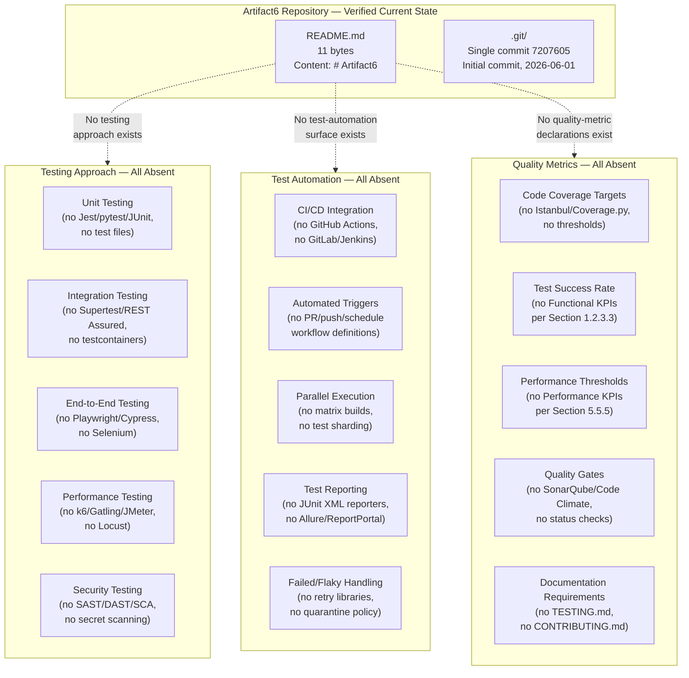
```mermaid
graph TB
    subgraph Current["Artifact6 Repository — Verified Current State"]
        README["README.md<br/>11 bytes<br/>Content: # Artifact6"]
        GitMeta[".git/<br/>Single commit 7207605<br/>Initial commit, 2026-06-01"]
    end

    subgraph TestApproach["Testing Approach — All Absent"]
        UNIT["Unit Testing<br/>(no Jest/pytest/JUnit,<br/>no test files)"]
        INTEG["Integration Testing<br/>(no Supertest/REST Assured,<br/>no testcontainers)"]
        E2E["End-to-End Testing<br/>(no Playwright/Cypress,<br/>no Selenium)"]
        PERF["Performance Testing<br/>(no k6/Gatling/JMeter,<br/>no Locust)"]
        SEC["Security Testing<br/>(no SAST/DAST/SCA,<br/>no secret scanning)"]
    end

    subgraph TestAuto["Test Automation — All Absent"]
        CI["CI/CD Integration<br/>(no GitHub Actions,<br/>no GitLab/Jenkins)"]
        TRIG["Automated Triggers<br/>(no PR/push/schedule<br/>workflow definitions)"]
        PAR["Parallel Execution<br/>(no matrix builds,<br/>no test sharding)"]
        REP["Test Reporting<br/>(no JUnit XML reporters,<br/>no Allure/ReportPortal)"]
        FLAKE["Failed/Flaky Handling<br/>(no retry libraries,<br/>no quarantine policy)"]
    end

    subgraph QualMetrics["Quality Metrics — All Absent"]
        COV["Code Coverage Targets<br/>(no Istanbul/Coverage.py,<br/>no thresholds)"]
        SUCC["Test Success Rate<br/>(no Functional KPIs<br/>per Section 1.2.3.3)"]
        PTHR["Performance Thresholds<br/>(no Performance KPIs<br/>per Section 5.5.5)"]
        GATE["Quality Gates<br/>(no SonarQube/Code Climate,<br/>no status checks)"]
        DOC["Documentation Requirements<br/>(no TESTING.md,<br/>no CONTRIBUTING.md)"]
    end

    README -.->|"No testing<br/>approach exists"| TestApproach
    README -.->|"No test-automation<br/>surface exists"| TestAuto
    README -.->|"No quality-metric<br/>declarations exist"| QualMetrics
```

The dashed edges denote the absence of any path from the repository's sole tracked content to any Testing Strategy layer. Because every category mandated by the section prompt is empty, no concrete test execution flow, test environment architecture, or test data flow diagram can be constructed in this revision.

### 6.6.8 Basic Testing Practices for Future Adoption

The section prompt directs that, when "Not Applicable" is declared, the document must "document only the basic unit testing approach that will be used." This subsection enumerates the deferred guidance that will be applied to future commits, drawn from industry-standard testing postures aligned with the candidate-stack neutrality of Section 3.9.6. None of the practices below describes a current implementation; each is recorded as a commitment to govern future testing-relevant artifacts when they are introduced.

#### 6.6.8.1 Baseline Practices for the First Source-Code Commit

| Practice Domain | Baseline Practice Commitment |
|---|---|
| Test-first discipline | Each source-code module must be accompanied by at least one unit test exercising its primary behavior at commit time |
| Test colocation / convention | Tests adopt the language ecosystem's standard layout (`tests/` for Python, `__tests__/` or `*.test.ts` for Node.js, `src/test/java/` for Java, `_test.go` siblings for Go) at first source commit |
| Pure-function preference | Side-effect-free pure functions are favored as the primary testable unit, minimizing the need for mocks |
| Deterministic tests | Time, randomness, and external I/O are isolated behind seams that can be controlled or stubbed in tests |

These practices become operationally measurable only when the first source-code module is committed. Until then, no source-code surface exists against which to apply them.

#### 6.6.8.2 Baseline Practices Aligned with the Candidate Technology Stack

Section 3.9 enumerates a Candidate Technology Stack (AWS, Docker, Terraform, GitHub Actions, Python, Flask, Auth0, MongoDB, LangChain, React, React Native). The table below records the basic testing practices that will be applied when (and only when) each candidate is actually adopted via committed artifacts, per the Section 3.9.6 caveat that no adoption may be inferred from candidate-status.

| Candidate Domain | Baseline Testing Practice (Deferred) |
|---|---|
| Python / Flask (backend) | `pytest` as standard runner; `pytest-cov` for coverage; `responses` or `httpx-mock` for HTTP-call mocking; Flask test client for in-process integration tests; `pytest-asyncio` for async code |
| MongoDB (database) | `mongomock` or testcontainers-mongodb for integration tests; transactional rollback patterns where supported; explicit teardown between tests |
| AWS (cloud platform) | `moto` for AWS-service mocking in unit tests; LocalStack for higher-fidelity local integration tests; CloudWatch / X-Ray validation in non-production environments |
| Docker (containers) | `testcontainers` for ephemeral service dependencies; multi-stage Dockerfiles isolating test and production layers; image-build validation in CI |
| Terraform (IaC) | `terraform validate` and `terraform plan` checks in CI; `terratest` for IaC integration tests; OPA / Sentinel policy-as-code tests for governance |
| GitHub Actions (CI/CD) | Test invocation as workflow step; matrix builds for OS/language-version coverage; `actions/upload-artifact` for reports; `dorny/test-reporter` for JUnit XML rendering |
| Auth0 (identity) | JWT-verification unit tests with test signing keys; integration tests against an Auth0 test tenant; mocked Auth0 Management API for unit coverage |
| LangChain (AI framework) | `pytest-vcr` (or equivalent) for replaying LLM responses; LangSmith for trace-based test verification; prompt-regression test suites |
| React / React Native (frontend) | Jest + React Testing Library for component tests; Playwright or Cypress for browser E2E; Detox for React Native E2E; Storybook + visual-regression for UI snapshots |

Each entry above is conditional. Per Section 3.9.6, "no selections are final," "compatibility unverified," "version pins absent by design," and "justifications deferred." The basic testing practices become applicable only when the corresponding candidate is adopted via a committed artifact (dependency manifest, ADR, or implementation file).

#### 6.6.8.3 Baseline Coverage, Reporting, and Quality-Gate Practice

When the first source-code module and accompanying tests are committed, the following minimum quality posture will be applied as the entry-level testing commitment:

| Practice Element | Baseline Commitment |
|---|---|
| Initial coverage tracking | Coverage instrumentation enabled from the first test commit (no retroactive backfilling); coverage reports archived per build |
| Initial coverage floor | A floor (rather than a ceiling) is committed at first test landing; the floor monotonically rises as suites mature; explicit ADR required to lower the floor |
| CI gating posture | At first CI pipeline commit, the unit-test stage is a blocking required-status-check on protected branches; integration and E2E stages are added incrementally |
| Reporting and visibility | JUnit-XML-compatible reports produced by the test runner; rendered in CI via `dorny/test-reporter` (or the platform equivalent); failures surfaced in the pull-request UI |
| Test-data hygiene | Tests must not depend on test-execution order; shared fixtures use explicit setup/teardown; no production data, no production credentials in test code |
| Documentation expectation | A `TESTING.md` (or equivalent contributing-guide section) introduced concurrently with the first test commit, documenting framework choice, layout convention, and run instructions |

This practice constitutes the minimum "basic unit testing approach" referenced by the section prompt. It is recorded as deferred guidance until the first source-code module and first test are committed.

### 6.6.9 Cross-References to Prior Sections

Every absence documented in Sections 6.6.3 through 6.6.5 is anchored in the authoritative findings of prior sections of this Technical Specification. The tables below map each Section 6.6 topic to the prior section that authoritatively establishes its absence.

#### 6.6.9.1 Testing Approach Cross-Reference Map

| Section 6.6 Topic | Authoritative Prior Section |
|---|---|
| Unit-testing framework selection | Section 3.3.1; Section 3.3.2 |
| Test dependencies (assertion, mocking, coverage) | Section 3.4.1; Section 3.4.2 |
| Test source surface | Section 1.2.2.2; Section 3.2 |
| Integration-test service surface | Section 5.2.4; Section 6.1; Section 6.3 |
| Integration-test data surface | Section 3.6.1; Section 6.2 |
| External-service mocking | Section 3.5.1; Section 3.5.2 |
| E2E test journeys | Section 2.2; Section 4.2.1 |
| Performance / load testing | Section 1.2.3.3; Section 5.5.5; Section 6.1.4.3 |
| Security testing (SAST / DAST / SCA) | Section 3.4.3; Section 3.10.1; Section 6.4 |

#### 6.6.9.2 Test Automation Cross-Reference Map

| Section 6.6 Topic | Authoritative Prior Section |
|---|---|
| CI/CD integration | Section 3.7.5 |
| Automated test triggers | Section 3.7.5 |
| Parallel test execution | Section 3.7.5 |
| Test environment management | Section 3.7.3; Section 3.7.4 |
| Test reporting | Section 5.5.1; Section 6.5.3.5 |
| Failed-test handling / retry | Section 4.4.2 |
| Failure notification | Section 4.4.2; Section 6.5.3.4 |

#### 6.6.9.3 Quality Metrics Cross-Reference Map

| Section 6.6 Topic | Authoritative Prior Section |
|---|---|
| Code coverage targets | Section 3.3.2; Section 3.4.1; Section 1.2.3.3 |
| Test success-rate requirements | Section 1.2.3.3; Section 5.5.5 |
| Performance test thresholds | Section 1.2.3.3; Section 5.5.5; Section 6.1.4.3 |
| Quality gates | Section 3.7.1; Section 3.7.5 |
| Documentation requirements | Section 2.5; Section 2.7 |
| Traceability to test cases | Section 2.6; Section 5.8.3 |

### 6.6.10 Forward Plan

Consistent with the section-revision-trigger pattern established in Sections 2.8, 3.11, 4.8, 5.8, 6.1.9, 6.2.10, 6.3.9, 6.4.10, and 6.5.10, the table below enumerates the repository events that would warrant revision of Section 6.6 in a future iteration of this Technical Specification. Each trigger maps to one or more subsections of Section 6.6 that would gain authoritative content. These triggers align with the linkage declared in Section 5.8.3, which explicitly notes "Test Strategy: Each component, decision, and integration point becomes a test-case anchor."

#### 6.6.10.1 Section Revision Triggers

The following are the primary trigger events for re-authoring this section. Each event represents a discrete repository commit (or supplied authoritative user context) that would unblock the corresponding Section 6.6 subsection.

| Trigger Event | Resulting Section 6.6 Subsection Revision |
|---|---|
| First test file committed (`*_test.py`, `*.test.ts`, `*Spec.js`, `*Test.java`, `_test.go`) | 6.6.3.1 Unit Testing |
| First test-framework dependency declared (jest, pytest, vitest, mocha, JUnit, Go testing) | 6.6.3.1 Unit Testing |
| First test-framework configuration file committed (`jest.config.*`, `pytest.ini`, `pyproject.toml [tool.pytest.ini_options]`, `vitest.config.*`) | 6.6.3.1 Unit Testing |
| First CI workflow with test steps committed (`.github/workflows/ci.yml`, `.gitlab-ci.yml`, `Jenkinsfile`) | 6.6.4.1 CI/CD Integration; 6.6.4.2 Automated Test Triggers |

#### 6.6.10.2 Additional Revision Triggers

| Trigger Event | Resulting Section 6.6 Subsection Revision |
|---|---|
| First mocking library committed (Mockito, Sinon, unittest.mock, MSW, WireMock, nock) | 6.6.3.1 Mocking Strategy |
| First code-coverage tool configuration committed (`.coveragerc`, `coverage` block in `pyproject.toml`, Istanbul config) | 6.6.5.1 Code Coverage Targets |
| First integration-test directory, fixture, or testcontainers reference committed | 6.6.3.2 Integration Testing |
| First E2E framework dependency committed (Playwright, Cypress, Selenium, Puppeteer, Detox) | 6.6.3.3 End-to-End Testing |
| First performance / load-test artifact committed (k6 scripts, JMeter `.jmx`, Locust `locustfile.py`, Gatling simulations) | 6.6.3.3 Performance Testing |
| First SAST / SCA / DAST scanner configuration committed (Semgrep, Snyk, Trivy, OWASP ZAP, GitLeaks) | 6.6.3.4 Security Testing |
| First test fixture, factory, or seed file committed | 6.6.3.1 Test Data Management |
| First test-report publishing step or destination configured (Allure, ReportPortal, dorny/test-reporter) | 6.6.4.3 Test Reporting |
| First flaky-test annotation, retry library, or quarantine policy committed | 6.6.4.3 Failed / Flaky Test Handling |
| First NFR document with coverage thresholds, success-rate targets, or performance budgets committed | 6.6.5.1 Code Coverage; 6.6.5.2 Success Rate; 6.6.5.3 Performance Thresholds |
| First quality-gate configuration committed (SonarQube `sonar-project.properties`, Code Climate `.codeclimate.yml`, branch-protection JSON) | 6.6.5.4 Quality Gates |
| First `TESTING.md` or `CONTRIBUTING.md` test section committed | 6.6.5.4 Documentation Requirements |
| First ADR documenting a testing decision committed | All subsections of 6.6 (with rationale narrative) |
| Authoritative user context with concrete testing requirements supplied | All subsections of 6.6, with explicit cross-reference to supplied context |

#### 6.6.10.3 Documentation Consistency Commitments

When any of the above triggers fires, the following consistency commitments apply to the revision of Section 6.6:

1. **Cross-reference integrity.** Updated findings in Section 6.6 must remain consistent with the corresponding updates in Sections 1.2, 2.6 (Traceability Matrix), 3.3, 3.4, 3.7, 5.5, 6.1, 6.2, 6.3, 6.4, and 6.5. Section 5.8.3 specifically commits each "component, decision, and integration point" to become a test-case anchor in Section 2.6.
2. **Evidence-only authorship.** New unit-test, integration-test, E2E-test, performance-test, or security-test claims must be grounded in the committed artifact or supplied user context; speculation about "typical" testing patterns for a project named Artifact6 remains prohibited per Section 2.7.1.
3. **Candidate-stack neutrality.** Adoption of pytest, Jest, Playwright, testcontainers, or any other testing tool implied by Section 3.9's Candidate Technology Stack must be evidenced by an actual commit (dependency manifest, ADR, or test file), not inferred from the candidate-stack proposal. Per Section 3.9.6, no version pin, justification, or integration-pattern analysis may be authored absent committed artifacts.
4. **Diagram producibility reevaluation.** The producibility status of the diagrams required in Section 6.6.6 (Test Execution Flow, Test Environment Architecture, Test Data Flow) must be reassessed at each revision; once producible, each diagram must be authored before Section 6.6 can transition from "Not Applicable" to a populated state.
5. **Test inventory disclosure.** When test artifacts are committed, all test suites, frameworks, fixtures, and run instructions must be enumerated in tabular form per the section prompt's "Use Markdown tables for test requirements" and "Tables should never have more than four columns" requirements.
6. **Quality-gate matrix update.** The consolidated quality-gate matrix authored in Section 6.6.5.5 must be revised to reflect each newly declared threshold, with its declaration status changing from "Not declared" to a specific threshold value (with measurement window where applicable).
7. **Traceability synchronization.** Test-case anchors recorded in Section 2.6 must remain synchronized with the suites enumerated in Section 6.6.3, the pipelines enumerated in Section 6.6.4, and the gates enumerated in Section 6.6.5.
8. **Cross-cutting test surface alignment.** Test-related claims must be synchronized with the monitoring surface in Section 6.5 (test-result emission as a telemetry source), the security surface in Section 6.4 (security-testing as part of the security control matrix), and the error-handling surface in Section 4.4.2 (failed-test retry and notification flows).

### 6.6.11 Section Versioning

Consistent with the section-versioning pattern established in Sections 2.7.3, 3.11.3, 4.9, 5.9, 6.1.10, 6.2.11, 6.3.10, 6.4.11, and 6.5.11, the table below records the revision history of Section 6.6 against the repository state at each revision.

| Version | Date | Repository Commit | Notable State |
|---|---|---|---|
| 1.0 | 2026-06-01 | `7207605` | Empty repository; section documents the absence of all Testing Strategy artifacts (testing approach, test automation, quality metrics) and confirms "Not Applicable" determination per the section prompt's explicit directive. Basic testing practices enumerated as deferred guidance for future commits. |

### 6.6.12 References

#### 6.6.12.1 Files Examined

- `README.md` — The repository's only tracked file (11 bytes, content `# Artifact6`). Used to confirm the absence of any test file, test-runner configuration, mocking library reference, coverage configuration, CI/CD pipeline definition, performance-test script, security-scanner configuration, or quality-gate declaration that would otherwise underpin a Testing Strategy section.

#### 6.6.12.2 Folders Explored

- `/` (repository root, depth 0) — Contains exactly one tracked child (`README.md`) plus the `.git/` metadata directory. No subdirectories matching `tests/`, `test/`, `__tests__/`, `spec/`, `cypress/`, `e2e/`, `features/`, `playwright/`, `selenium/`, `k6/`, `jmeter/`, `locust/`, `.github/workflows/`, `.circleci/`, or any other test- or automation-related layout exist. Used to confirm the comprehensive absence of Testing Strategy artifacts.

#### 6.6.12.3 Searches Conducted

- Semantic file search for "test unit integration e2e coverage mocking framework runner" — Zero results, confirming no test-related source files exist in the repository index.
- Semantic folder search for "tests test automation ci cd quality coverage" — Zero results, confirming no test-related folders exist.
- Filesystem check for `.blitzyignore` files — Confirmed no `.blitzyignore` files exist in the system.
- Filesystem inspection of repository root (`ls -la`) — Confirmed only `README.md` and `.git/` are present.

#### 6.6.12.4 Cross-Referenced Technical Specification Sections

- **Section 1.2.2.2 (Major System Components)** — Established that only `README.md` and `.git/` metadata exist; no testable components are present. Anchors the absence of a test surface in Section 6.6.3.
- **Section 1.2.3.3 (Success Criteria / KPIs)** ⭐ **PRIMARY SOURCE** — Established that all five KPI categories (Functional, Performance, Reliability, Adoption/usage, Business/financial) are "Not declared in repository." Anchors Sections 6.6.5.1, 6.6.5.2, and 6.6.5.3.
- **Section 1.3.3.1 (Verified Repository Facts)** — Provided the authoritative repository state baseline (single commit `7207605`, sole file `README.md`, no subdirectories) reused in Section 6.6.1.1.
- **Section 2.2 (Feature Catalog)** — Confirmed empty feature catalog, eliminating any user-workflow definition against which E2E test scenarios could be authored. Anchors Section 6.6.3.3.
- **Section 2.5 (Implementation Considerations)** — Confirmed no maintenance, performance, or security requirements documentable, anchoring Section 6.6.5.4 documentation requirements.
- **Section 2.6 (Traceability Matrix)** — Confirmed "Requirement → Test Case: No test artifacts committed," anchoring Section 6.6.10.3 traceability commitment.
- **Section 2.7.1 (Evidence-Only Constraint)** — Provided the prohibition against speculating about "typical" features or technologies, which governs the "Not Applicable" determination in this section.
- **Section 3.2 (Programming Languages)** — Confirmed zero languages adopted across the ten enumerated language families, eliminating any language-specific test-runner target.
- **Section 3.3 (Frameworks & Libraries)** ⭐ **PRIMARY SOURCE** — Section 3.3.1 explicitly confirmed "Testing framework: None declared"; Section 3.3.2 explicitly confirmed `jest.config.*`, `pytest.ini`, `vitest.config.*` are all absent. Anchors all of Section 6.6.3.1.
- **Section 3.4 (Open Source Dependencies)** — Established that zero dependencies exist across the fifteen enumerated package managers, eliminating any assertion library, mocking library, coverage tool, or SCA scanner. Section 3.4.3 explicitly anchors Section 6.6.3.4 security testing.
- **Section 3.5.1 (External Service Integrations)** — Confirmed all eleven third-party service categories are "None," eliminating any external-service-mocking target for integration tests. Anchors Section 6.6.3.2.
- **Section 3.5.2 (Service Integration Evidence Map)** — Confirmed no HTTP-client libraries or API contracts are committed, eliminating any API-test target.
- **Section 3.7 (Development & Deployment)** ⭐ **PRIMARY SOURCE** — Section 3.7.5 explicitly confirmed "No CI/CD pipeline configuration exists in the repository. Builds, tests, security scans, and deployments are therefore unautomated." Anchors all of Section 6.6.4. Sections 3.7.3 and 3.7.4 anchor test-environment absence.
- **Section 3.9 (Candidate Technology Stack)** — Established that AWS, Docker, Terraform, GitHub Actions, Python, Flask, Auth0, MongoDB, LangChain, React, and React Native are listed as candidates but **not adopted**; the Section 3.9.6 caveats govern Section 6.6 by prohibiting authoring of any test control for candidate-only components. Section 6.6.8.2 draws on Section 3.9 for forward-looking deferred guidance.
- **Section 3.10 (Security Implications of (Non-)Selections)** — Section 3.10.1 confirmed that all ten security concerns are "not assessable" because "no pipelines [are] defined" and "no build artifacts [are] produced." Anchors Section 6.6.3.4 security testing absence.
- **Section 4.2.1 (User-Visible Journeys)** — Confirmed no user journeys declared, eliminating any E2E scenario target. Anchors Section 6.6.3.3.
- **Section 4.4.2 (Error Handling Evidence Map)** — Confirmed no retry libraries, no error-tracking integration, no runbooks committed; anchors Section 6.6.4.3 failed-test retry absence and notification absence.
- **Section 5.2.3 (Data Flow Evidence Map)** — Confirmed "no data enters, exits, or moves within Artifact6"; anchors Section 6.6.6 test-data-flow diagram non-producibility.
- **Section 5.2.4 (External Integration Points Evidence Map)** — Confirmed zero integration points, eliminating any API-test target; anchors Section 6.6.3.2.
- **Section 5.5.5 (Performance and SLA Evidence Map)** ⭐ **PRIMARY SOURCE** — Confirmed all latency targets, throughput targets, availability SLOs, and error-budget policies are "Not declared in repository." Anchors Section 6.6.5.3.
- **Section 5.8 (Forward Plan)** ⭐ **TRIGGER PATTERN SOURCE** — Established the section-revision-trigger pattern reused in Section 6.6.10. Section 5.8.3 explicitly states "Test Strategy: Each component, decision, and integration point becomes a test-case anchor."
- **Section 6.1 (Core Services Architecture)** ⭐ **PRECEDENT** — Established the "Not Applicable" determination pattern, structural template, evidence-map subsection style, and Repository State Snapshot Mermaid diagram template that Section 6.6 mirrors. Section 6.1.4.3 specifically anchors Section 6.6.3.3 (load-test absence) and Section 6.6.5.3 (performance-threshold absence).
- **Section 6.2 (Database Design)** ⭐ **PRECEDENT** — Reinforced the "Not Applicable" determination pattern; anchors Section 6.6.3.2 (no database integration-test target).
- **Section 6.3 (Integration Architecture)** ⭐ **PRECEDENT** — Reinforced the "Not Applicable" determination pattern; anchors Section 6.6.3.2 (no API-integration test target).
- **Section 6.4 (Security Architecture)** ⭐ **PRECEDENT** — Established the "Standard Practices for Future Adoption" subsection template (Section 6.4.8) most directly mirrored by Section 6.6.8. Anchors Section 6.6.3.4 (security testing).
- **Section 6.5 (Monitoring and Observability)** ⭐ **PRECEDENT** — Most directly analogous "Not Applicable" determination (both Sections 6.5 and 6.6 cover cross-cutting operational concerns). Section 6.5.3.4 anchors Section 6.6.4.3 (failure-notification absence); Section 6.5.3.5 anchors Section 6.6.4.3 (test-reporting absence); Section 6.5.10.3 provides the Documentation Consistency Commitments template most directly mirrored by Section 6.6.10.3.

# 7. User Interface Design

## 7.1 Applicability Determination

### 7.1.1 Authoritative State Declaration

**No user interface required.**

This determination is mandated by the governing section prompt, which explicitly directs: *"If the project doesn't define a user interface (UI), leave the section empty with the note 'No user interface required'."* The conditions warranting this determination are independently and jointly established by every prior section of this Technical Specification, and are summarized in the Repository State Baseline (Section 7.1.2) and the UI-Topic Evidence Maps (Section 7.2).

The applicability of a User Interface Design section presupposes the existence of (a) at least one UI surface (web, mobile, desktop, or terminal), (b) one or more selected UI technologies (framework, language, styling system), and (c) at least one design decision regarding screens, interactions, or visual design. **None of these preconditions is satisfied by the Artifact6 repository.**

### 7.1.2 Repository State Baseline

The verified repository state — established in Section 1.3.3.1 and re-confirmed across Sections 3.1 through 5.10 — is summarized below. This is the same baseline that drove the "Not Applicable" determination for Core Services Architecture in Section 6.1.

| Repository Fact | Verified Value | Authoritative Source |
|---|---|---|
| Tracked content | `README.md` only (11 bytes, content `# Artifact6`) | Section 1.3.3.1 |
| Commit history | One commit (`7207605`, "Initial commit", 2026-06-01) | Section 1.3.3.1 |
| Source code modules | None | Section 1.2.2.2 |
| Subdirectories | None (only `.git/` metadata exists) | Section 1.3.3.1 |
| Frontend / web language | None declared | Section 3.2.1 |
| Mobile / cross-platform language | None declared | Section 3.2.1 |
| Frontend UI framework | None declared | Section 3.3.1 |
| Mobile framework | None declared | Section 3.3.1 |
| CSS / styling framework | None declared | Section 3.3.1 |
| UI surface declared | None | Section 5.2.1 |
| UI route definitions | None | Section 5.2.1 |
| UX research / personas | None | Section 1.1.3 |

### 7.1.3 Section-Prompt Fidelity Constraint

Consistent with the constraint architecture articulated in Section 2.7.1 (evidence-only documentation), Section 3.1.2 (section-prompt fidelity for the Technology Stack), Section 5.1.2 (section-prompt fidelity for System Architecture), and Section 6.1.2 (section-prompt fidelity for Core Services Architecture), Section 7 documents the **inventory of absences** for each UI element enumerated by the prompt, rather than fabricating screens, technologies, schemas, or interactions that have no basis in repository evidence.

#### 7.1.3.1 Prohibited Authoring Actions for This Section

Specifically, Section 7 does **not**:

- Select frontend frameworks (React, Vue, Angular, Svelte, Next.js, Nuxt, Astro, Remix) for which no `package.json`, no `tsconfig.json`, no `vite.config.ts`, no `webpack.config.js`, and no `next.config.js` are committed per Section 3.3.2.
- Select mobile frameworks (React Native, Flutter, SwiftUI, Jetpack Compose, Xamarin) for which no Swift, Kotlin, Objective-C, or cross-platform source files exist per Section 3.2.2.
- Select styling frameworks (TailwindCSS, Bootstrap, Material UI, Chakra UI, styled-components) for which no `tailwind.config.js`, no `postcss.config.js`, and no `*.scss` files are committed per Section 3.3.2.
- Enumerate screens, pages, routes, or wireframes for which no UI source files (`*.html`, `*.css`, `*.jsx`, `*.tsx`, `*.vue`, `*.svelte`, `*.swift`, `*.kt`), no routing configuration, and no design assets exist per Sections 3.2.2 and 5.2.1.
- Define UI/backend interaction boundaries, API contracts, or data-fetching patterns absent any OpenAPI specification, GraphQL SDL, gRPC `.proto`, or HTTP/WebSocket client code per Sections 5.2.3 and 5.2.4.
- Author UI schemas (component prop interfaces, form-validation schemas, state-shape definitions) absent any TypeScript interface, JSON Schema, Zod/Yup schema, or component manifest committed.
- Specify user interactions (click handlers, form submissions, gestures, keyboard shortcuts, drag-and-drop) absent any event-handler code or interaction specification committed.
- Articulate visual design considerations (color palettes, typography, spacing scales, dark-mode behavior, motion, accessibility targets) absent any design tokens, style guide, Figma export, or theme file committed.
- Adopt any element from the Candidate Technology Stack of Section 3.9 (which lists React, TypeScript, TailwindCSS, React Native, Swift, Kotlin, Objective-C, ElectronJS among others) as an actual UI selection — these are explicitly **proposed but not adopted** per Section 3.1.2.

#### 7.1.3.2 What This Section Does Document

This section authoritatively documents:

1. The specific UI elements required by the section prompt and the evidence (or absence thereof) supporting each.
2. The producibility status of UI artifacts the section prompt would normally require (screens, schemas, interaction maps, visual specifications).
3. Cross-references to authoritative prior-section findings that establish each individual absence.
4. The set of repository events that would trigger revision of this section in a future iteration of the Technical Specification.

## 7.2 UI-Topic Evidence Maps

The section prompt enumerates seven UI topics to document when a UI is required. Each topic is mapped to the available repository evidence below; every topic is confirmed **inapplicable** for the current revision.

### 7.2.1 Core UI Technologies Evidence Map

| Required Element | Evidence in Repository | Documentable? |
|---|---|---|
| Frontend framework selection (React/Vue/Angular/Svelte/etc.) | "Frontend UI framework: None declared" per Section 3.3.1; no `package.json`, no `vite.config.ts`, no `next.config.js`, no `webpack.config.js` per Section 3.3.2 | No |
| Frontend programming language (JavaScript/TypeScript) | "Frontend / web: None declared" per Section 3.2.1; zero `*.js`, `*.ts`, `*.jsx`, `*.tsx` files per Section 3.2.2 | No |
| Mobile framework selection (React Native/Flutter/native iOS/native Android) | "Mobile framework: None declared" per Section 3.3.1; "Mobile / cross-platform: None declared" per Section 3.2.1 | No |
| Mobile programming language (Swift/Kotlin/Objective-C/Dart) | Zero `*.swift`, `*.m`, `*.mm`, `*.kt` files; no `Package.swift`, no `Podfile`, no `build.gradle` per Section 3.2.2 | No |
| CSS / styling framework (TailwindCSS/Bootstrap/Material UI/etc.) | "CSS / styling framework: None declared" per Section 3.3.1; no `tailwind.config.js`, no `postcss.config.js`, no `*.scss` files per Section 3.3.2 | No |
| Build tooling for UI (Vite/Webpack/Rollup/esbuild/Parcel) | No `vite.config.ts`, `webpack.config.js`, `rollup.config.js`, or equivalent committed per Section 3.3.2 | No |
| Desktop / Electron / native shell | No ElectronJS, Tauri, or native-shell manifests committed; "no UI surface" per Section 5.2.1 | No |

No UI technology — web, mobile, desktop, or terminal — has been selected, configured, or implied by any artifact in the repository.

### 7.2.2 UI Use Cases Evidence Map

| Required Element | Evidence in Repository | Documentable? |
|---|---|---|
| User personas | "End users / personas: Not defined in repository"; "No user-research artifacts, personas, or UX documentation exists" per Section 1.1.3 | No |
| UI-driven use cases or user stories | Section 1.2.2.1 confirms "no UI assets"; Feature Catalog (Section 2.2) is empty | No |
| Task flows / journey maps | No journey-map documentation, no flow diagrams, no use-case catalogue committed | No |
| Accessibility-driven use cases (WCAG, Section 508) | No accessibility requirements declared; no compliance targets committed | No |

Because no business capabilities exist per Section 1.2.2.1 and no feature surface is declared per the Feature Catalog, there are no UI-driven use cases to enumerate.

### 7.2.3 UI / Backend Interaction Boundaries Evidence Map

| Required Element | Evidence in Repository | Documentable? |
|---|---|---|
| Backend service surface to call | No backend service definitions; "Backend / server: None declared" per Section 3.2.1; "no external-facing API surface" per Section 5.2.1 | No |
| API contracts (OpenAPI / GraphQL SDL / `.proto`) | No OpenAPI, GraphQL SDL, AsyncAPI, or `.proto` files committed per Sections 5.2.3 and 5.2.4 | No |
| HTTP client library (fetch wrapper, Axios, TanStack Query, SWR, Apollo Client) | No HTTP, gRPC, GraphQL, or WebSocket clients committed per Section 3.5.2 | No |
| Authentication / session boundary | No auth configuration, no OIDC settings, no identity-provider references per Sections 1.2.1.3 and 3.5.3 | No |
| Real-time channel (WebSocket / SSE / WebRTC) | No real-time-transport selection per Section 5.2.3 | No |
| Error / loading / empty-state contract | No error-handling surface exists per Section 5.5.3; no UI source in which to define states | No |

There is no backend service to which a UI could connect and no UI to initiate connections. Section 5.2.1 has authoritatively established "no UI surface, no integration surface."

### 7.2.4 UI Schemas Evidence Map

| Required Element | Evidence in Repository | Documentable? |
|---|---|---|
| Component prop schemas (TypeScript interfaces, PropTypes) | No `*.ts`, `*.tsx`, `*.jsx`, `*.vue`, or `*.svelte` files committed per Section 3.2.2; no `tsconfig.json` per Section 3.3.2 | No |
| Form-validation schemas (Zod, Yup, Valibot, Joi, react-hook-form schemas) | No validation libraries, no schema files committed per Section 3.4 | No |
| State-shape definitions (Redux, Zustand, Pinia, MobX, Context value types) | "No state machines, persistence points, caches, or transaction boundaries" per Section 4.4.1 | No |
| Design-token schema (CSS variables, theme tokens, JSON design tokens) | No design tokens, no theme files, no token documentation committed | No |
| GraphQL document fragments / TypeScript-codegen artifacts | No GraphQL operations, no codegen configuration committed per Section 3.3.2 | No |

No UI schema of any kind — component prop, form validation, state shape, design token, or GraphQL document — can be sourced from repository evidence.

### 7.2.5 Screens Required Evidence Map

| Required Element | Evidence in Repository | Documentable? |
|---|---|---|
| Route / page definitions | "no UI route definitions" per Section 5.2.1; no router configuration committed | No |
| Screen / page source files | No `pages/`, no `app/`, no `views/`, no `screens/`, no `components/` directories exist; root contains only `README.md` and `.git/` per Section 1.3.3.1 | No |
| Wireframes / mockups | No `design/`, `mockups/`, `wireframes/`, `figma/`, or equivalent directories exist | No |
| Storybook stories / component catalog | No `*.stories.tsx`, no `.storybook/` directory, no component-explorer configuration committed | No |
| Navigation map / sitemap | No sitemap, no navigation graph, no information-architecture document committed | No |
| Modal / dialog inventory | No modal/dialog source code or specification committed | No |

The semantic file searches recorded in the section context (`"user interface frontend HTML CSS components"`, `"screen page view template render display"`) returned zero results. No screen, page, view, or template artifact exists in the repository.

### 7.2.6 User Interactions Evidence Map

| Required Element | Evidence in Repository | Documentable? |
|---|---|---|
| Event handlers (click, submit, change, focus, blur) | No source files committed per Section 1.2.2.2; no handlers possible | No |
| Form submissions and validation flows | No form source files, no validation libraries committed | No |
| Gesture / touch interactions (swipe, pinch, long-press) | No mobile or touch-target source committed per Section 3.2.2 | No |
| Keyboard shortcuts and command palettes | No keyboard-handler source committed | No |
| Drag-and-drop / file-upload interactions | No drag-and-drop libraries, no upload endpoints committed | No |
| Notification / toast / snackbar patterns | No notification framework, no toast library committed | No |
| Optimistic UI / loading / error feedback | No error-handling surface per Section 5.5.3; no optimistic-update patterns committed | No |

Because no UI source files, no event-handler code, and no interaction specifications exist, no user interaction can be authoritatively documented.

### 7.2.7 Visual Design Considerations Evidence Map

| Required Element | Evidence in Repository | Documentable? |
|---|---|---|
| Color palette / theme tokens | No `theme.*`, no design-token JSON, no CSS variable declarations committed | No |
| Typography scale and font selection | No `@font-face` declarations, no font files, no typography documentation committed | No |
| Spacing and layout grid | No grid system, no spacing tokens, no layout primitives committed | No |
| Iconography / illustration assets | No SVG icons, no PNG/JPEG/WebP assets, no icon font configuration committed | No |
| Dark-mode / theming behavior | No theme-switching code, no `prefers-color-scheme` handling committed | No |
| Motion / animation system | No animation libraries (Framer Motion, GSAP, Lottie), no `@keyframes` declarations committed | No |
| Accessibility targets (WCAG level, contrast ratios, ARIA patterns) | No accessibility requirements declared; no a11y testing tooling committed | No |
| Responsive-design breakpoints | No media-query definitions, no breakpoint tokens, no responsive-design documentation committed | No |
| Brand / style guide reference | No `BRAND.md`, no `STYLEGUIDE.md`, no brand asset directory committed | No |

No visual-design artifact of any kind exists in the repository. The absence is comprehensive: no color, typography, spacing, motion, accessibility, or responsive-design declaration is present.

## 7.3 Required Diagrams Status

The section prompt would normally require screen-flow diagrams, component hierarchy diagrams, and interaction sequence diagrams when a UI is documented. Consistent with the precedents established in Sections 4.5.1, 5.3.2, 5.5.7, and 6.1.6, the producibility of each is recorded below.

| UI Diagram | Subject Matter Required | Producibility Status |
|---|---|---|
| Screen-flow / navigation diagram | Page-to-page transitions, route guards, entry points | **Not producible** — no routes, screens, or navigation definitions per Section 5.2.1 |
| Component hierarchy diagram | Component tree, parent/child composition, slot/children flow | **Not producible** — no component source per Sections 1.2.2.2 and 3.3.2 |
| User-interaction sequence diagram | Click → request → response → state-update sequences | **Not producible** — no UI surface, no backend surface per Section 5.2.1 |
| Wireframe / mockup gallery | Annotated visual layouts per screen | **Not producible** — no design assets in repository |

The only Mermaid diagram that can be honestly authored against current repository evidence is the UI Surface Absence Snapshot in Section 7.4, which mirrors the precedents established in Sections 1.2.2.2, 5.1.3, and 6.1.7.

## 7.4 Repository State Snapshot

Consistent with the precedent established in Sections 1.2.2.2, 5.1.3, and 6.1.7, the diagram below restates the verified repository inventory and overlays the categories of UI artifact that are confirmed absent. This is the only Mermaid diagram producible against current repository evidence; the four diagrams that the section prompt would normally require (Screen-Flow, Component Hierarchy, Interaction Sequence, Wireframe Gallery) cannot be authored without fabricating content, which is prohibited by Section 2.7.1.

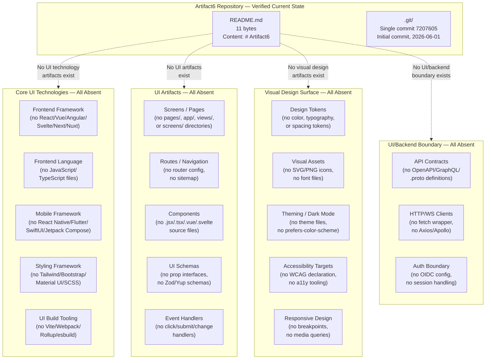
```mermaid
graph TB
    subgraph Current["Artifact6 Repository — Verified Current State"]
        README["README.md<br/>11 bytes<br/>Content: # Artifact6"]
        GitMeta[".git/<br/>Single commit 7207605<br/>Initial commit, 2026-06-01"]
    end

    subgraph UITech["Core UI Technologies — All Absent"]
        FFW["Frontend Framework<br/>(no React/Vue/Angular/<br/>Svelte/Next/Nuxt)"]
        FLANG["Frontend Language<br/>(no JavaScript/<br/>TypeScript files)"]
        MFW["Mobile Framework<br/>(no React Native/Flutter/<br/>SwiftUI/Jetpack Compose)"]
        STYLE["Styling Framework<br/>(no Tailwind/Bootstrap/<br/>Material UI/SCSS)"]
        BUILD["UI Build Tooling<br/>(no Vite/Webpack/<br/>Rollup/esbuild)"]
    end

    subgraph UIArtifacts["UI Artifacts — All Absent"]
        SCREENS["Screens / Pages<br/>(no pages/, app/, views/,<br/>or screens/ directories)"]
        ROUTES["Routes / Navigation<br/>(no router config,<br/>no sitemap)"]
        COMPS["Components<br/>(no .jsx/.tsx/.vue/.svelte<br/>source files)"]
        SCHEMAS["UI Schemas<br/>(no prop interfaces,<br/>no Zod/Yup schemas)"]
        EVENTS["Event Handlers<br/>(no click/submit/change<br/>handlers)"]
    end

    subgraph DesignSurface["Visual Design Surface — All Absent"]
        TOKENS["Design Tokens<br/>(no color, typography,<br/>or spacing tokens)"]
        ASSETS["Visual Assets<br/>(no SVG/PNG icons,<br/>no font files)"]
        THEME["Theming / Dark Mode<br/>(no theme files,<br/>no prefers-color-scheme)"]
        A11Y["Accessibility Targets<br/>(no WCAG declaration,<br/>no a11y tooling)"]
        RWD["Responsive Design<br/>(no breakpoints,<br/>no media queries)"]
    end

    subgraph Boundary["UI/Backend Boundary — All Absent"]
        APIC["API Contracts<br/>(no OpenAPI/GraphQL/<br/>.proto definitions)"]
        HTTPC["HTTP/WS Clients<br/>(no fetch wrapper,<br/>no Axios/Apollo)"]
        AUTHB["Auth Boundary<br/>(no OIDC config,<br/>no session handling)"]
    end

    README -.->|"No UI technology<br/>artifacts exist"| UITech
    README -.->|"No UI artifacts<br/>exist"| UIArtifacts
    README -.->|"No visual design<br/>artifacts exist"| DesignSurface
    README -.->|"No UI/backend<br/>boundary exists"| Boundary
```

The dashed edges denote the absence of any path from the repository's sole tracked content to any UI layer. Because every UI category enumerated by the section prompt is empty, no concrete screen-flow, component-hierarchy, interaction-sequence, or wireframe diagram can be constructed in this revision.

## 7.5 Cross-References to Prior Sections

Every absence documented in Sections 7.2 and 7.3 is anchored in the authoritative findings of prior sections of this Technical Specification. The table below maps each Section 7 topic to the prior section that authoritatively establishes its absence.

### 7.5.1 Core UI Technologies Cross-Reference Map

| Section 7 Topic | Authoritative Prior Section |
|---|---|
| Frontend framework selection | Section 3.3.1; Section 3.3.2 |
| Frontend language selection | Section 3.2.1; Section 3.2.2 |
| Mobile framework selection | Section 3.3.1; Section 3.2.1 |
| Mobile language selection | Section 3.2.2 |
| Styling framework selection | Section 3.3.1; Section 3.3.2 |
| UI build tooling | Section 3.3.2 |
| Desktop / Electron shell | Section 5.2.1 |

### 7.5.2 UI Artifacts Cross-Reference Map

| Section 7 Topic | Authoritative Prior Section |
|---|---|
| UI use cases / personas | Section 1.1.3; Section 1.2.2.1; Section 2.2 |
| UI / backend interaction boundary | Section 5.2.1; Section 5.2.3; Section 5.2.4 |
| UI schemas | Section 3.2.2; Section 3.3.2; Section 4.4.1 |
| Screens / pages / routes | Section 1.3.3.1; Section 5.2.1 |
| User interactions | Section 1.2.2.2; Section 5.5.3 |
| Visual design considerations | Section 3.3.1; Section 3.3.2 |

### 7.5.3 Diagram Producibility Cross-Reference Map

| Section 7 Diagram | Producibility Constraint Source |
|---|---|
| Screen-flow / navigation | Section 5.2.1 ("no UI route definitions") |
| Component hierarchy | Section 1.2.2.2; Section 3.3.2 |
| Interaction sequence | Section 5.2.1; Section 5.2.3 |
| Wireframe gallery | Section 1.3.3.1 (no design directories) |
| Repository State Snapshot | Section 5.1.3; Section 6.1.7 (precedent pattern) |

## 7.6 Forward Plan

Consistent with the section-revision-trigger pattern established in Sections 2.8, 3.11, 4.8, 5.8, and 6.1.9, the tables below enumerate the repository events that would warrant revision of Section 7 in a future iteration of this Technical Specification. Each trigger maps to one or more subsections of Section 7 that would gain authoritative content.

### 7.6.1 Section Revision Triggers — Technology Adoption

| Trigger Event | Resulting Section 7 Subsection Revision |
|---|---|
| First `package.json` with a UI framework dependency (React, Vue, Angular, Svelte, Next.js, Nuxt, Astro, Remix) committed | 7.2.1 Core UI Technologies |
| First `tsconfig.json` or `jsconfig.json` committed | 7.2.1 Core UI Technologies; 7.2.4 UI Schemas |
| First `vite.config.ts`, `webpack.config.js`, `next.config.js`, or equivalent build manifest committed | 7.2.1 Core UI Technologies |
| First `tailwind.config.js`, `postcss.config.js`, or `*.scss` file committed | 7.2.1 Core UI Technologies; 7.2.7 Visual Design Considerations |
| First Swift, Kotlin, or Dart source file committed | 7.2.1 Core UI Technologies (mobile) |
| First ElectronJS or Tauri manifest committed | 7.2.1 Core UI Technologies (desktop) |

### 7.6.2 Section Revision Triggers — UI Surface Definition

| Trigger Event | Resulting Section 7 Subsection Revision |
|---|---|
| First `pages/`, `app/`, `views/`, `screens/`, or `components/` directory committed | 7.2.5 Screens Required; 7.4 Repository State Snapshot |
| First UI source file (`*.jsx`, `*.tsx`, `*.vue`, `*.svelte`, `*.html`) committed | 7.2.5 Screens Required; 7.2.6 User Interactions |
| First router configuration (React Router, Vue Router, Next.js routes, SvelteKit routes) committed | 7.2.5 Screens Required |
| First Storybook configuration (`.storybook/`, `*.stories.*`) committed | 7.2.5 Screens Required (component catalog) |
| First form-validation schema (Zod, Yup, Valibot, Joi) committed | 7.2.4 UI Schemas |
| First state-management library import (Redux, Zustand, Pinia, MobX, Context APIs) committed | 7.2.4 UI Schemas (state shape) |

### 7.6.3 Section Revision Triggers — UI/Backend Boundary

| Trigger Event | Resulting Section 7 Subsection Revision |
|---|---|
| First API contract (OpenAPI, GraphQL SDL, AsyncAPI, `.proto`) committed | 7.2.3 UI / Backend Interaction Boundaries |
| First HTTP client (fetch wrapper, Axios, TanStack Query, SWR, Apollo Client, urql) committed | 7.2.3 UI / Backend Interaction Boundaries |
| First WebSocket / SSE / WebRTC client committed | 7.2.3 UI / Backend Interaction Boundaries |
| First authentication-flow source (OIDC client, NextAuth, Clerk, Auth0 SDK) committed | 7.2.3 UI / Backend Interaction Boundaries |
| First error/loading/empty-state component or hook committed | 7.2.3 UI / Backend Interaction Boundaries; 7.2.6 User Interactions |

### 7.6.4 Section Revision Triggers — Design and Accessibility

| Trigger Event | Resulting Section 7 Subsection Revision |
|---|---|
| First design-token file (CSS variables, JSON tokens, `theme.ts`) committed | 7.2.7 Visual Design Considerations |
| First icon set, illustration asset, or font file committed | 7.2.7 Visual Design Considerations |
| First animation library import (Framer Motion, GSAP, Lottie) or `@keyframes` declaration committed | 7.2.7 Visual Design Considerations |
| First accessibility test configuration (axe-core, Pa11y, jest-axe) committed | 7.2.7 Visual Design Considerations |
| First responsive-design breakpoint file or media-query module committed | 7.2.7 Visual Design Considerations |
| First Figma export, design-system document, or `STYLEGUIDE.md` committed | 7.2.7 Visual Design Considerations |
| First `BRAND.md`, persona document, or UX research artifact committed | 7.2.2 UI Use Cases |

### 7.6.5 Documentation Consistency Commitments

When any of the above triggers fires, the following consistency commitments apply to the revision of Section 7:

1. **Cross-reference integrity.** Updated findings in Section 7 must remain consistent with the corresponding updates in Sections 1.2, 3.2, 3.3, 5.2, and 6.1.
2. **Evidence-only authorship.** New screen, technology, schema, or visual-design claims must be grounded in the committed artifact or supplied user context; speculation about "typical" UI patterns for a project named Artifact6 remains prohibited per Section 2.7.1.
3. **Candidate-stack neutrality.** Adoption of any element from the Candidate Technology Stack of Section 3.9 (which includes React, TypeScript, TailwindCSS, React Native, Swift, Kotlin, Objective-C, ElectronJS) must be evidenced by an actual commit, not inferred from the candidate-stack proposal per Section 3.1.2.
4. **Diagram producibility revaluation.** The producibility status of the four UI diagrams in Section 7.3 must be reassessed at each revision; once producible, the diagrams must be authored before Section 7 can transition from "No user interface required" to a populated state.
5. **Section-prompt directive supremacy.** Until any of the above triggers fires, the section prompt's directive — "leave the section empty with the note 'No user interface required'" — remains binding.

## 7.7 Section Versioning

Consistent with the section-versioning pattern established in Sections 2.7.3, 3.11.3, 4.9, 5.9, and 6.1.10, the table below records the revision history of Section 7 against the repository state at each revision.

| Version | Date | Repository Commit | Notable State |
|---|---|---|---|
| 1.0 | 2026-06-01 | `7207605` | Empty repository; section documents "No user interface required" per the section prompt's explicit directive. All seven UI topics (core technologies, use cases, UI/backend boundaries, schemas, screens, interactions, visual design) are confirmed inapplicable with cross-references to authoritative prior-section findings. |

## 7.8 References

### 7.8.1 Files Examined

- `README.md` — The repository's only tracked file (11 bytes, content `# Artifact6`). Examined to confirm the comprehensive absence of any UI source file, design asset, route definition, component definition, schema, or visual-design declaration that would otherwise underpin a User Interface Design section.

### 7.8.2 Folders Explored

- `/` (repository root, depth 0) — Contains exactly one tracked child (`README.md`) plus the `.git/` metadata directory. No `pages/`, `app/`, `views/`, `screens/`, `components/`, `src/`, `client/`, `web/`, `mobile/`, `ios/`, `android/`, `design/`, `mockups/`, `wireframes/`, `figma/`, `assets/`, `public/`, `styles/`, `themes/`, or `stories/` subdirectories exist. Examined to confirm the absolute absence of any UI-related artifact at the source-tree level.

### 7.8.3 Semantic Searches Conducted

- `search_files("user interface frontend HTML CSS components")` — Returned zero results, confirming no UI-implementation source files exist.
- `search_files("screen page view template render display")` — Returned zero results, confirming no screen/page/view artifact exists.
- `search_folders("UI frontend components views pages")` — Returned zero results, confirming no UI-related folder hierarchy exists.
- Filesystem search for `.blitzyignore` — Confirmed that no `.blitzyignore` files mask UI artifacts from discovery.

### 7.8.4 Cross-Referenced Technical Specification Sections

- **Section 1.1.3 (Key Stakeholders and Users)** — Established "End users / personas: Not defined in repository" and "No user-research artifacts, personas, or UX documentation exists," eliminating the persona basis for UI use cases.
- **Section 1.2.1.3 (Enterprise Landscape Integration)** — Established that no upstream/downstream integrations, no authentication/identity providers, and no data-platform integrations are documented, eliminating the integration backdrop for a UI.
- **Section 1.2.2.1 (Primary System Capabilities)** — Established that the repository contains "no UI assets" and that the list of primary system capabilities is empty.
- **Section 1.2.2.2 (Major System Components)** — Established the verified inventory: only `README.md` and `.git/` metadata exist.
- **Section 1.3.3.1 (Verified Repository Facts)** — Provided the authoritative repository state baseline (single commit `7207605`, sole file `README.md`, no subdirectories).
- **Section 2.2 (Feature Catalog)** — Established that zero features exist, including any UI-related feature.
- **Section 2.7.1 (Evidence-Only Documentation Constraint)** — Provided the prohibition against speculating about "typical" UI features or technologies that governs this section's "Not Applicable" determination.
- **Section 3.1.2 (Section-Prompt Fidelity for Technology Stack)** — Established that the Candidate Technology Stack of Section 3.9 (React, TypeScript, TailwindCSS, React Native, Swift, Kotlin, Objective-C, ElectronJS) is **not adopted** and must not be cited as a UI choice.
- **Section 3.2.1 (Languages Declared)** — Established "Frontend / web: None declared" and "Mobile / cross-platform: None declared."
- **Section 3.2.2 (Language Evidence Map)** — Confirmed zero `*.js`, `*.ts`, `*.jsx`, `*.tsx`, `*.swift`, `*.m`, `*.mm`, `*.kt` files exist.
- **Section 3.3.1 (Frameworks Adopted)** — Established "Frontend UI framework: None declared," "Mobile framework: None declared," and "CSS / styling framework: None declared."
- **Section 3.3.2 (Framework Evidence Map)** — Confirmed absence of `package.json`, `tsconfig.json`, `vite.config.ts`, `webpack.config.js`, `next.config.js`, `tailwind.config.js`, and `postcss.config.js`.
- **Section 3.4 (Open Source Dependencies)** — Established that zero dependencies exist across all 15 enumerated package managers, eliminating any UI library adoption.
- **Section 3.5.2 (Service Integration Evidence Map)** — Established that no HTTP, gRPC, GraphQL, WebSocket, AMQP, or MQTT clients are committed, eliminating UI/backend communication.
- **Section 3.5.3 (AuthN/AuthZ Surface)** — Established that the authentication and authorization surface is null, eliminating any UI authentication boundary.
- **Section 3.9 (Candidate Technology Stack)** — Established the candidate-only stack that is explicitly **not adopted**; this section does not draw on any candidate-stack element to author content.
- **Section 4.4.1 (State Management Evidence Map)** — Established that no state machines, persistence points, caches, or transaction boundaries exist, eliminating any UI state-shape schema.
- **Section 5.1.3 (Repository State Snapshot)** — Established the Mermaid diagram precedent reused in Section 7.4.
- **Section 5.2.1 (System Overview Evidence Map)** — Confirmed "no external-facing API surface, no UI surface, no integration surface" and "no UI route definitions."
- **Section 5.2.3 (Data Flow Evidence Map)** — Confirmed that no data enters, exits, or moves within Artifact6, eliminating any UI/backend data exchange.
- **Section 5.2.4 (External Integration Points Evidence Map)** — Confirmed that no API contracts (OpenAPI, GraphQL SDL, AsyncAPI, `.proto`) are committed.
- **Section 5.5.3 (Error Handling Evidence Map)** — Confirmed that no error-handling surface exists, eliminating UI error/loading/empty-state contracts.
- **Section 6.1 (Core Services Architecture)** — Established the "Not Applicable" documentation precedent (Authoritative State Declaration, evidence maps per topic, Repository State Snapshot diagram, Forward Plan with Revision Triggers, Section Versioning) that this section reuses verbatim in structure.
- **Section 6.1.9 (Forward Plan)** — Established the section-revision-trigger pattern reused in Section 7.6.

# 8. Infrastructure

## 8.1 AUTHORITATIVE STATE DECLARATION

**Detailed Infrastructure Architecture is not applicable for this system in its current revision.** The governing section prompt explicitly authorizes this determination, directing: *"If the system is a standalone application or library that does not require deployment infrastructure, clearly state 'Detailed Infrastructure Architecture is not applicable for this system' and explain why, then document only the minimal build and distribution requirements."* This conclusion is independently and jointly established by every prior section of this Technical Specification that touched on cloud providers, containerization, infrastructure-as-code, orchestration, CI/CD pipelines, deployment environments, networking, capacity planning, or operational monitoring.

The Artifact6 case is materially more emphatic than the "standalone application or library" scenario contemplated by the section prompt. The repository is not a standalone library awaiting documentation of its existing build and distribution model — it is an empty repository whose entire tracked surface consists of an 11-byte placeholder README.md file. There is no deployable artifact to host, no service to operate, and no compiled, packaged, or containerized output against which an infrastructure architecture could be defined.

This determination mirrors the precedent established in Section 6.1 (Core Services Architecture), Section 6.2 (Database Design), Section 6.3 (Integration Architecture), Section 6.4 (Security Architecture), Section 6.5 (Monitoring and Observability), Section 6.6 (Testing Strategy), and Section 7 (User Interface Design), each of which authored an identical "Not Applicable" determination on the same evidentiary basis. Section 8 inherits the structural template, evidence-map subsection style, and Repository State Snapshot diagram convention from those precedents while substituting infrastructure-, deployment-, and operations-specific subject matter for the architectural, persistence, integration, security, observability, testing, and UI subject matter previously addressed.

The applicability of an Infrastructure section presupposes the existence of (a) at least one deployable artifact (compiled binary, container image, function package, or static site) against which infrastructure could be provisioned, (b) at least one declared infrastructure-as-code, cloud-provider, or containerization tool, (c) at least one CI/CD pipeline definition that produces or releases an artifact, and (d) at least one environment definition (development, staging, production) with associated resource specifications. **None of these preconditions is satisfied by the Artifact6 repository.**

The minimal build and distribution requirements directive issued by the section prompt is addressed in Section 8.11 below. The standard infrastructure practices that will be applied to future commits — should infrastructure artifacts be introduced — are enumerated in Section 8.12 below. Both subsections record deferred guidance rather than current implementation.

### 8.1.1 Repository State Baseline

The verified repository state established in Section 1.3.3.1 and reconfirmed across Sections 3.1 through 7 is summarized below. The baseline is unchanged from the snapshot used by Sections 6.1.1.1, 6.2.1.1, 6.3.1.1, 6.4.1.1, 6.5.1.1, 6.6.1.1, and 7.1.2.

| Repository Fact | Verified Value | Authoritative Source |
|---|---|---|
| Tracked content | `README.md` only (11 bytes, content `# Artifact6`) | Section 1.3.3.1 |
| Commit history | One commit (`7207605`, "Initial commit", 2026-06-01) | Section 1.3.3.1 |
| Subdirectories | None (only `.git/` metadata exists) | Section 1.3.3.1 |
| Containerization artifacts | None — no `Dockerfile`, no `docker-compose.yml`, no `Containerfile` | Section 3.7.3 |
| Kubernetes / Helm manifests | None | Section 3.7.3 |
| Infrastructure-as-Code artifacts | None — no Terraform, CloudFormation, Pulumi, CDK | Section 3.7.4 |
| Configuration-management manifests | None — no Ansible, Chef, Puppet, Salt | Section 3.7.4 |
| CI/CD pipeline configurations | None across all six standard providers | Section 3.7.5 |
| Cloud provider integrations | None — no AWS/GCP/Azure SDK references or service configurations | Section 3.5.1 |
| Observability / monitoring services | None | Section 3.5.1 |
| Storage / persistence services | None declared across all 10 storage categories | Section 3.6 |
| Disaster-recovery / backup procedures | None — no RPO/RTO targets, no runbooks committed | Section 5.5.6 |
| Performance / Reliability KPIs | All "Not declared in repository" | Sections 1.2.3.3 and 5.5.5 |

### 8.1.2 Why a Detailed Infrastructure Architecture Cannot Be Authored

The preconditions for documenting a deployment topology, cloud-services posture, containerization regime, orchestration plane, CI/CD pipeline, and infrastructure-monitoring strategy are absent on every axis. The table below summarizes the cumulative findings established in prior sections.

| Precondition | Required Evidence | Repository Evidence |
|---|---|---|
| Deployable artifact exists | Source modules, compiled binaries, container images, function packages, static sites | None — only `README.md` and `.git/` metadata exist per Section 1.2.2.2 |
| Containerization surface exists | `Dockerfile`, `Containerfile`, `docker-compose.yml`, container-registry references | None — confirmed absent on every axis per Section 3.7.3 |
| Infrastructure-as-Code surface exists | Terraform / Pulumi / CloudFormation / CDK / Ansible manifests | None — confirmed absent on every axis per Section 3.7.4 |
| CI/CD pipeline exists | GitHub Actions / GitLab CI / Jenkins / CircleCI / Azure / Travis configurations | None — "no CI/CD pipeline configuration exists in the repository" per Section 3.7.5 |
| Cloud-provider integration exists | AWS/GCP/Azure SDK imports, service-account credentials, region pins, IAM role references | None — confirmed "None" across all third-party service categories per Section 3.5.1 |
| Environment definitions exist | `.env.dev`, `.env.staging`, `.env.prod`, environment-specific configs or IaC variables | None — no environment manifests committed per Section 3.5.2 |
| Capacity / SLA targets exist | NFR documents, SLO declarations, error-budget policies, load-test artifacts | None — all KPI categories "Not declared" per Sections 1.2.3.3 and 5.5.5 |
| Operational artifacts exist | Runbooks, disaster-recovery plans, backup procedures, on-call rotations | None — confirmed absent per Section 5.5.6 |

Because no deployable artifact, no containerization surface, no IaC surface, no CI/CD surface, no cloud integration surface, no environment surface, no capacity/SLA surface, and no operational-artifact surface exists, every required subsection of Infrastructure (Deployment Environment, Cloud Services, Containerization, Orchestration, CI/CD Pipeline, Infrastructure Monitoring) would require fabrication to populate. This is prohibited by the evidence-only documentation constraint established in Section 2.7.1.

## 8.2 SECTION-PROMPT FIDELITY CONSTRAINT

Consistent with the constraint architecture articulated in Section 2.7.1 (evidence-only documentation), Section 3.1.2 (section-prompt fidelity for the Technology Stack), Section 5.1.2 (section-prompt fidelity for System Architecture), Section 6.1.2 (section-prompt fidelity for Core Services Architecture), Section 6.2.2 (section-prompt fidelity for Database Design), Section 6.3.2 (section-prompt fidelity for Integration Architecture), Section 6.4.2 (section-prompt fidelity for Security Architecture), Section 6.5.2 (section-prompt fidelity for Monitoring and Observability), Section 6.6.2 (section-prompt fidelity for Testing Strategy), and Section 7.1.3 (section-prompt fidelity for User Interface Design), this section documents the **inventory of absences** for each infrastructure element mandated by the prompt, rather than manufacturing deployment topologies, cloud-service catalogs, container build pipelines, orchestration clusters, CI/CD workflows, or monitoring stacks that have no basis in repository evidence.

### 8.2.1 Prohibited Authoring Actions for This Section

Specifically, Section 8 does **not**:

- Select cloud providers (AWS, Microsoft Azure, Google Cloud Platform, Oracle Cloud Infrastructure, Alibaba Cloud, IBM Cloud, DigitalOcean, Linode/Akamai, Cloudflare, Vercel, Netlify, Fly.io, Render, Railway) absent any committed SDK reference, service configuration, region pin, or account/tenant identifier per Section 3.5.1.
- Specify managed-service catalogs (EC2/RDS/S3/Lambda/EKS, GKE/Cloud SQL/Cloud Storage/Cloud Run, AKS/Azure SQL/Blob Storage/Functions) absent any committed IaC artifact declaring those resources per Section 3.7.4.
- Author region/zone topology (multi-region active-active, active-passive, single-region multi-AZ, edge deployment) absent any committed region/zone configuration per Section 3.7.4.
- Define container platforms (Docker Engine, containerd, Podman, CRI-O, Buildah, Kaniko, BuildKit) absent any committed `Dockerfile`, `Containerfile`, or build manifest per Section 3.7.3.
- Specify base-image strategies (Alpine, Debian-slim, Distroless, UBI, scratch; multi-stage build patterns; reproducible-builds posture) absent any committed image-build manifest per Section 3.7.3.
- Configure image registries (Docker Hub, Amazon ECR, Google Artifact Registry, Azure Container Registry, GitHub Container Registry, Harbor, Quay) absent any committed registry URL, push workflow, or pull-policy manifest per Sections 3.7.3 and 3.7.5.
- Adopt orchestration platforms (Kubernetes, Amazon ECS, AWS Fargate, HashiCorp Nomad, Docker Swarm, Apache Mesos, OpenShift) absent any committed manifest, cluster definition, or service-mesh configuration per Section 3.7.3.
- Define cluster architectures (control-plane sizing, node-pool taxonomies, etcd topology, network plugin choice, ingress controller selection) absent any committed cluster manifest per Section 3.7.3.
- Specify auto-scaling configurations (Horizontal Pod Autoscaler, Vertical Pod Autoscaler, Cluster Autoscaler, Karpenter, KEDA, AWS Application Auto Scaling, GCP Autoscaler, Azure VMSS) absent any committed scaler manifest per Section 6.1.4.2.
- Author Infrastructure-as-Code selections (Terraform, OpenTofu, Pulumi, AWS CloudFormation, AWS CDK, CDKTF, Azure Bicep, Ansible, Chef, Puppet, SaltStack, Crossplane) absent any committed `*.tf`, `*.bicep`, `*.yml`, or equivalent manifest per Section 3.7.4.
- Define configuration-management approaches (Ansible playbooks, Chef cookbooks, Puppet manifests, SaltStack states, Helm values, Kustomize overlays) absent any committed configuration manifest per Section 3.7.4.
- Specify environment-promotion strategies (GitOps with ArgoCD/Flux, dev→staging→prod promotion gates, environment-specific branches, ephemeral preview environments) absent any committed promotion-workflow manifest per Section 3.7.5.
- Author backup and disaster-recovery plans (RPO/RTO targets, backup cadence, multi-region replication, cross-account replication, snapshot retention, point-in-time recovery) absent any committed DR documentation per Section 5.5.6.
- Select CI/CD platforms (GitHub Actions, GitLab CI/CD, Jenkins, CircleCI, Buildkite, Azure Pipelines, Travis CI, AWS CodePipeline, Google Cloud Build, Bitbucket Pipelines) absent any committed pipeline definition per Section 3.7.5.
- Define deployment strategies (blue-green, canary, rolling, recreate, traffic-shadowing, A/B routing) absent any committed deployment manifest or release-controller configuration per Section 3.7.3.
- Specify rollback procedures (Helm rollback, ArgoCD rollback, Spinnaker manual judgment, Argo Rollouts canary analysis, AWS CodeDeploy automatic rollback) absent any committed rollback workflow per Section 3.7.5.
- Author release-management processes (release-please, semantic-release, changesets, conventional-commits-derived versioning, release-train cadences) absent any committed release-automation configuration per Section 3.7.5.
- Configure infrastructure monitoring (CloudWatch, Stackdriver/Cloud Monitoring, Azure Monitor, Datadog Infrastructure, New Relic Infrastructure, Prometheus node-exporter, Telegraf) absent any committed agent configuration or scrape target per Section 5.5.1.
- Define cost-monitoring tooling (AWS Cost Explorer, GCP Billing Reports, Azure Cost Management, CloudHealth, Cloudability, Kubecost, OpenCost, Vantage, ServiceNow FinOps) absent any committed cost-allocation tag policy or FinOps dashboard per Section 6.1.4.2.
- Specify security monitoring tooling (AWS GuardDuty, AWS Security Hub, AWS Inspector, GCP Security Command Center, Azure Defender, Wiz, Lacework, Datadog Cloud Security) absent any committed security-tooling configuration per Section 3.10.1.
- Author compliance auditing controls (AWS CloudTrail, AWS Config, GCP Cloud Audit Logs, Azure Activity Log, CIS Benchmarks, AWS Audit Manager, Drata, Vanta) absent any committed audit-log infrastructure per Section 3.10.1.
- Promote candidate technologies from Section 3.9 (AWS as cloud platform, Docker as containerization, Terraform as IaC, GitHub Actions as CI/CD, Python/Flask as backend, MongoDB as database, React as frontend) to "adopted" status; per Section 3.9.6, "no selections are final," "compatibility unverified," "version pins absent by design," and "justifications deferred" — no version pin, capacity sizing, region pin, cost estimate, or integration requirement may be authored for candidate-only components.
- Manufacture infrastructure cost estimates absent any deployment surface, resource declaration, or workload profile against which usage could be measured per Sections 3.7 and 5.5.5.
- Specify resource-sizing guidelines (instance types, CPU/memory requests-limits, storage IOPS provisioning, network bandwidth tiers) absent any workload, capacity plan, or load-test data per Section 6.1.4.3.

### 8.2.2 What This Section Does Document

This section authoritatively documents:

1. The specific infrastructure elements required by the section prompt and the evidence (or absence thereof) supporting each.
2. The producibility status of each required diagram (infrastructure architecture, deployment workflow, environment promotion flow, network architecture).
3. The Repository State Snapshot Mermaid diagram — the only diagram producible against current repository evidence.
4. The minimal build and distribution requirements posture, recorded as deferred guidance per the section prompt's explicit instruction.
5. The standard infrastructure practices that will become applicable when corresponding artifacts are committed, presented as deferred guidance rather than current controls.
6. Cross-references to authoritative prior-section findings that establish each individual absence.
7. The repository events that would trigger revision of this section in a future iteration of the Technical Specification.

## 8.3 DEPLOYMENT ENVIRONMENT EVIDENCE MAP

The section prompt enumerates two required Deployment Environment categories: Target Environment Assessment and Environment Management. The evidence available in the repository to document each is recorded below.

### 8.3.1 Target Environment Assessment

The section prompt requires documentation of environment type (on-premises/cloud/hybrid/multi-cloud), geographic distribution requirements, resource requirements (compute/memory/storage/network), and compliance and regulatory requirements.

| Required Element | Evidence in Repository | Documentable? |
|---|---|---|
| Environment type (on-prem / cloud / hybrid / multi-cloud) | No cloud-provider SDK references or service configurations committed per Section 3.5.1; no on-premises bare-metal manifests; no hybrid-connectivity (Direct Connect, ExpressRoute, Interconnect) declarations | No |
| Geographic distribution requirements | No region/zone configurations, no multi-region IaC, no data-residency declarations, no edge-deployment manifests per Section 3.7.4 | No |
| Compute resource requirements | No container resource definitions, no Kubernetes `requests`/`limits` manifests, no EC2/GCE instance-type declarations per Section 3.7.3 | No |
| Memory resource requirements | No `resources.requests.memory`, no JVM heap specifications, no instance-type memory tiers declared per Section 3.7.3 | No |
| Storage resource requirements | No PersistentVolumeClaims, no EBS/PD volumes, no S3 bucket declarations per Sections 3.6 and 3.7.4 | No |
| Network resource requirements | No VPC manifests, no subnet CIDRs, no bandwidth tiers, no DNS zones declared per Section 3.7.4 | No |
| Compliance and regulatory requirements | No SOC 2, ISO 27001, HIPAA, PCI-DSS, GDPR, or regional-compliance documentation committed per Section 6.4.5.5 | No |

Section 3.5.1 has authoritatively confirmed that the "Cloud provider" category is "None" with "No AWS/GCP/Azure SDK references or service configurations committed." Section 3.7.4 has authoritatively confirmed that no `*.tf`, CloudFormation, Pulumi, or CDK artifacts are committed. Without a target-environment declaration, no geographic distribution, resource-requirement specification, or compliance baseline can be authored. The Target Environment Assessment inventory contains zero documentable rows.

### 8.3.2 Environment Management

The section prompt requires documentation of Infrastructure-as-Code (IaC) approach, configuration management strategy, environment promotion strategy (dev/staging/prod), and backup and disaster recovery plans.

| Required Element | Evidence in Repository | Documentable? |
|---|---|---|
| Infrastructure-as-Code approach | No Terraform (`*.tf`), CloudFormation, Pulumi, AWS CDK, or CDKTF artifacts committed per Section 3.7.4 | No |
| Configuration management strategy | No Ansible playbooks, Chef cookbooks, Puppet manifests, or SaltStack states committed per Section 3.7.4 | No |
| Environment promotion strategy (dev/staging/prod) | No environment-specific configs (`.env.dev`, `.env.staging`, `.env.prod`); no IaC workspaces/stacks; no GitOps promotion manifests committed per Section 3.5.2 | No |
| Backup procedures | No backup procedures declared per Sections 3.6.3 and 5.5.6 | No |
| Backup cadence | No snapshot schedules, no automated backup configurations declared per Section 5.5.6 | No |
| Disaster recovery — RPO | No RPO target declared per Section 5.5.6 | No |
| Disaster recovery — RTO | No RTO target declared per Section 5.5.6 | No |
| Runbooks and incident playbooks | No runbooks, disaster-recovery plans, or incident-response playbooks committed per Sections 4.4.2 and 5.5.6 | No |

Section 5.5.6 has authoritatively confirmed that "no disaster-recovery procedure exists" because "no runbooks, disaster-recovery plans, or incident response playbooks committed; no RPO/RTO targets; no backup procedures declared." Section 3.7.4 has authoritatively confirmed the comprehensive absence of IaC and configuration-management artifacts. The Environment Management inventory contains zero documentable rows.

## 8.4 CLOUD SERVICES EVIDENCE MAP

The section prompt directs: *"If the system does not use cloud services, clearly state why and skip this section. Otherwise, document: Cloud provider selection and justification, Core services required with versions, High availability design, Cost optimization strategy, Security and compliance considerations."*

**The Artifact6 system does not use cloud services in its current revision.** This determination is authoritatively established by Section 3.5.1, which records "Cloud provider: None" with the evidence note "No AWS/GCP/Azure SDK references or service configurations committed." This subsection therefore records the inventory of absences for each cloud-service element rather than fabricating provider selections, service catalogs, or HA topologies that have no basis in repository evidence.

### 8.4.1 Cloud Provider Selection

| Required Element | Evidence in Repository | Documentable? |
|---|---|---|
| Cloud provider selection | No AWS/GCP/Azure/OCI/Alibaba/IBM Cloud SDK imports or account/tenant identifiers committed per Section 3.5.1 | No |
| Provider-selection justification | No ADR documenting cloud-provider tradeoffs; no `docs/adr/` directory committed per Section 3.7.1 | No |
| Multi-cloud / cloud-agnostic posture | No abstraction layer, no Crossplane manifests, no Pulumi multi-provider stacks committed per Section 3.7.4 | No |
| Sovereign-cloud / region-specific provider posture | No region pins, no GovCloud / China-region / sovereign-cloud declarations committed per Section 3.7.4 | No |

### 8.4.2 Core Services and Versions

| Required Element | Evidence in Repository | Documentable? |
|---|---|---|
| Compute services (EC2, GCE, Azure VM, ECS, Cloud Run, AKS, Lambda, Cloud Functions, Azure Functions) | No service references; no IaC declarations committed per Section 3.7.4 | No |
| Storage services (S3, GCS, Azure Blob, EFS, Filestore, EBS, Persistent Disk) | No object-store or block-store configurations; storage category "None declared" per Section 3.6 | No |
| Database services (RDS, Aurora, Cloud SQL, Cosmos DB, DynamoDB, Firestore) | No managed-database configurations; database "Not Applicable" per Section 6.2 | No |
| Networking services (VPC, Cloud Load Balancing, CloudFront, Cloud CDN, Azure Front Door, Route 53, Cloud DNS) | No networking manifests; CDN category "None" per Section 3.5.1 | No |
| Messaging / streaming services (SQS, SNS, Pub/Sub, EventBridge, Kinesis, Service Bus, MSK) | No messaging references; messaging "None" per Section 3.5.1 | No |
| Identity services (IAM, Cognito, Cloud IAM, Azure AD, Auth0) | No identity configurations; identity provider "None" per Sections 3.5.1 and 3.5.3 | No |
| Service versions / API revisions | Per Section 3.9.6, "version pins absent by design" — no candidate version may be authored | No |

Section 3.9.6 has authoritatively established that, even for candidate-stack components, "version pins [are] absent by design" because they "cannot be evaluated without concrete version pins, which do not exist." The Core Services inventory contains zero documentable rows.

### 8.4.3 High Availability, Cost Optimization, and Security Posture

| Required Element | Evidence in Repository | Documentable? |
|---|---|---|
| High availability design | No multi-AZ configurations, no replication topologies, no Route 53 health checks committed per Section 6.1.5 | No |
| Failover topology | No active-passive / active-active manifests, no global load-balancer configurations committed | No |
| Cost optimization strategy | No FinOps tagging, no cost-allocation labels, no Reserved-Instance / Savings-Plan / Committed-Use-Discount commitments per Section 6.1.4.2 | No |
| Right-sizing / spot-instance posture | No Spot/Preemptible/Spot Block configurations, no Karpenter consolidation policies committed | No |
| Security and compliance considerations | All ten security concerns "not assessable" per Section 3.10.1; no IAM-policy artifacts, no KMS configurations committed | No |
| Encryption at rest / in transit | No KMS / Cloud KMS / Key Vault references; no TLS certificate management committed per Sections 3.10.1 and 6.4 | No |

Section 3.10.1 has authoritatively confirmed that all ten security-implication concerns are "not assessable" because "no pipelines [are] defined and no build artifacts [are] produced." The High Availability, Cost Optimization, and Security inventory contains zero documentable rows.

## 8.5 CONTAINERIZATION EVIDENCE MAP

The section prompt directs: *"If the system does not use containers, clearly state why and skip this section. Otherwise, document: Container platform selection, Base image strategy, Image versioning approach, Build optimization techniques, Security scanning requirements."*

**The Artifact6 system does not use containers in its current revision.** This determination is authoritatively established by Section 3.7.3, which records the comprehensive absence of all containerization artifacts across container image build, multi-container local-dev, container ignore rules, Kubernetes manifests, Helm charts, and service-mesh configuration. This subsection therefore records the inventory of absences for each containerization element rather than fabricating container platforms, image strategies, or security-scanning regimes that have no basis in repository evidence.

### 8.5.1 Container Platform Selection

| Required Element | Evidence in Repository | Documentable? |
|---|---|---|
| Container runtime (Docker Engine, containerd, Podman, CRI-O) | No container runtime references; no `Dockerfile` or `Containerfile` committed per Section 3.7.3 | No |
| Build tool (Docker, BuildKit, Buildah, Kaniko, Jib) | No build-tool configurations; no `docker buildx` invocations declared | No |
| Local development tool (Docker Desktop, Podman Desktop, Rancher Desktop, OrbStack, Lima) | No `docker-compose.yml`, no `compose.yaml`, no `.devcontainer/devcontainer.json` per Sections 3.7.1 and 3.7.3 | No |
| Registry (Docker Hub, ECR, GAR, ACR, GHCR, Harbor, Quay) | No registry URL, no push workflows, no pull-secret manifests committed per Section 3.7.3 | No |

### 8.5.2 Image Strategy, Versioning, Build Optimization, and Security Scanning

| Required Element | Evidence in Repository | Documentable? |
|---|---|---|
| Base image strategy (Alpine, Debian-slim, Distroless, UBI, scratch) | No base-image references; no multi-stage `Dockerfile` committed per Section 3.7.3 | No |
| Image versioning approach (semver tags, immutable tags, SHA-based digests, mutable `:latest`) | No image tags, no versioning policy, no registry artifacts committed per Section 3.7.3 | No |
| Build optimization (BuildKit caching, layer ordering, mount caches, multi-stage builds) | No `Dockerfile` to optimize; no `buildx bake` files; no cache-mount declarations per Section 3.7.3 | No |
| Reproducibility (SOURCE_DATE_EPOCH, build-args determinism, lockfile-driven builds) | No build manifests; no lockfiles per Section 3.4 | No |
| Image security scanning (Trivy, Grype, Snyk Container, Anchore, Clair) | No scanner configurations committed per Sections 3.10.1 and 6.6.3.4 | No |
| Non-root container user enforcement | No `USER` directive surface; no PodSecurityPolicy / PodSecurityStandard manifests committed per Section 3.10.1 | No |
| Image signing (cosign, Notary, Notary v2) | No signing-key references, no Sigstore manifests, no `cosign.pub` committed | No |
| SBOM generation (Syft, cyclonedx, spdx-sbom-generator) | No SBOM tooling configured per Section 3.10.1 ("SBOM / supply-chain attestation" not assessable) | No |

Section 3.7.3 has authoritatively confirmed that "No containerization or orchestration artifact exists in the repository." Section 3.10.1 has authoritatively confirmed that container-image-provenance and SBOM/supply-chain-attestation concerns are "not assessable" because no images are built. The Containerization inventory contains zero documentable rows.

## 8.6 ORCHESTRATION EVIDENCE MAP

The section prompt directs: *"If the system does not require orchestration, clearly state why and skip this section. Otherwise, document: Orchestration platform selection, Cluster architecture, Service deployment strategy, Auto-scaling configuration, Resource allocation policies."*

**The Artifact6 system does not require orchestration in its current revision.** This determination is authoritatively established by Section 3.7.3, which records the comprehensive absence of Kubernetes manifests, Helm charts, and service-mesh configurations, and by Section 5.2.2, which confirmed that the Core Components Table has zero documentable rows — orchestration presupposes the existence of services to orchestrate. This subsection therefore records the inventory of absences for each orchestration element rather than fabricating clusters, deployment strategies, or scaling policies that have no basis in repository evidence.

### 8.6.1 Orchestration Platform Selection

| Required Element | Evidence in Repository | Documentable? |
|---|---|---|
| Orchestration platform (Kubernetes, Amazon ECS, AWS Fargate, Nomad, Docker Swarm, OpenShift) | No orchestration manifests committed per Section 3.7.3 | No |
| Managed Kubernetes selection (EKS, GKE, AKS, DOKS, LKE, Rancher) | No managed-cluster references, no cluster-credential references committed per Section 3.5.1 | No |
| Service-mesh selection (Istio, Linkerd, Consul Connect, AWS App Mesh, Cilium Service Mesh) | "No Istio/Linkerd manifests committed" per Section 3.7.3 | No |
| Ingress controller / API gateway (Nginx, Traefik, HAProxy, Contour, AWS ALB Controller, Istio Gateway) | No Ingress manifests, no Gateway-API resources committed per Sections 3.7.3 and 6.3.5.3 | No |

### 8.6.2 Cluster Architecture, Deployment, Scaling, and Resource Policies

| Required Element | Evidence in Repository | Documentable? |
|---|---|---|
| Cluster control-plane architecture | No cluster definitions, no etcd topology, no control-plane HA configurations committed per Section 3.7.3 | No |
| Node-pool taxonomy (general / compute / memory-optimized / GPU / spot pools) | No node-pool manifests, no Karpenter NodePool CRDs, no managed-node-group declarations committed per Section 3.7.3 | No |
| Service deployment strategy (Deployment, StatefulSet, DaemonSet, Job, CronJob) | No workload-resource manifests committed per Sections 3.7.3 and 5.2.2 | No |
| Rolling-update / canary / blue-green policy | No `strategy:` block manifests, no Argo Rollouts, no Flagger configurations committed | No |
| Horizontal Pod Autoscaler (HPA) | No HPA manifests committed; no metric source per Section 5.5.1 | No |
| Vertical Pod Autoscaler (VPA) | No VPA manifests committed; no historical-metric source per Section 5.5.1 | No |
| Cluster Autoscaler / Karpenter | No autoscaler manifests, no NodePool consolidation policies committed per Section 6.1.4.2 | No |
| KEDA (event-driven scaling) | No `ScaledObject` / `ScaledJob` manifests, no scaler configurations committed | No |
| Namespace strategy (per-team, per-environment, per-service) | No `Namespace` manifests committed per Section 3.7.3 | No |
| ResourceQuota / LimitRange | No quota manifests, no namespace-level resource bounds committed per Section 6.1.4.2 | No |
| NetworkPolicy / micro-segmentation | No `NetworkPolicy` manifests, no Calico / Cilium policy configurations committed per Section 6.4 | No |
| PodSecurityStandard / OPA Gatekeeper / Kyverno | No admission-control policy manifests committed per Section 3.10.1 | No |

Section 5.2.2 has authoritatively confirmed that the Core Components Table has zero documentable rows, eliminating any workload against which orchestration could be defined. Section 6.1.4.2 has authoritatively anchored the absence of any scaling approach. The Orchestration inventory contains zero documentable rows.

## 8.7 CI/CD PIPELINE EVIDENCE MAP

The section prompt enumerates two required CI/CD categories: Build Pipeline and Deployment Pipeline. The evidence available in the repository to document each is recorded below. The applicability anchor is Section 3.7.5, which states: *"No CI/CD pipeline configuration exists in the repository. Builds, tests, security scans, and deployments are therefore unautomated as of commit `7207605`."*

### 8.7.1 Build Pipeline

The section prompt requires documentation of source control triggers, build environment requirements, dependency management, artifact generation and storage, and quality gates.

| Required Element | Evidence in Repository | Documentable? |
|---|---|---|
| Source-control trigger configuration (PR / push / schedule / dispatch / tag) | No `.github/workflows/*.yml`, `.gitlab-ci.yml`, `Jenkinsfile`, `.circleci/config.yml`, `azure-pipelines.yml`, or `.travis.yml` committed per Section 3.7.5 | No |
| Build runner / executor environment (Linux x86_64, ARM64, Windows, macOS, self-hosted) | No runner-image references, no `runs-on:` declarations, no agent-pool configurations committed per Section 3.7.5 | No |
| Build environment dependencies (language toolchains, system packages, secrets) | No language-version manager files (`.nvmrc`, `.python-version`, `.tool-versions`) per Section 3.7.1 | No |
| Dependency management (`Dependabot`, `Renovate`, `Snyk`) | No dependency-update bot configurations; zero dependencies across 15 package managers per Section 3.4 | No |
| Artifact generation (binary builds, container images, npm packages, wheels, jars) | No build manifests; no `pyproject.toml [build-system]`, no `package.json`, no `Cargo.toml`, no `Makefile` committed per Section 3.7.2 | No |
| Artifact storage / registry (Docker Hub, ECR, GAR, npm, PyPI, Maven Central, GitHub Releases) | No artifact-registry references, no publish workflows committed per Sections 3.7.2 and 3.7.5 | No |
| Quality gates (SonarQube, Code Climate, Codacy, GitHub branch-protection required status checks) | No quality-gate configurations; no static-analysis tools per Section 3.7.1; no test framework per Section 3.3.1 | No |
| Reproducibility / supply-chain attestation (SLSA, in-toto, SBOM publication) | No supply-chain attestation tooling committed per Section 3.10.1 | No |

Section 3.7.5 has authoritatively confirmed that no CI/CD pipeline configuration exists across all six standard providers. Section 3.7.2 has authoritatively confirmed the comprehensive absence of build orchestrators, bundlers, build backends, and artifact-publishing configurations. The Build Pipeline inventory contains zero documentable rows.

### 8.7.2 Deployment Pipeline

The section prompt requires documentation of deployment strategy (blue-green/canary/rolling), environment promotion workflow, rollback procedures, post-deployment validation, and release management process.

| Required Element | Evidence in Repository | Documentable? |
|---|---|---|
| Deployment strategy (blue-green, canary, rolling, recreate, traffic-shadowing) | No deployment manifests with strategy declared per Section 3.7.3 | No |
| Progressive-delivery tooling (Argo Rollouts, Flagger, Spinnaker, AWS CodeDeploy) | No progressive-delivery controller manifests committed per Section 3.7.5 | No |
| Environment promotion workflow (dev→staging→prod gates, manual-approval steps, GitOps PR-based promotion) | No environment-progression manifests, no ArgoCD / Flux configurations, no Spinnaker pipelines committed per Section 3.7.5 | No |
| Manual-approval gates / change-management integration | No `environment: protection_rules` manifests, no ServiceNow / Jira integration committed per Section 3.7.5 | No |
| Rollback procedures (Helm rollback, ArgoCD rollback, Argo Rollouts automatic rollback) | No rollback scripts, no rollback-configuration manifests committed per Section 3.7.5 | No |
| Post-deployment validation (smoke tests, synthetic monitors, canary-analysis hooks) | No smoke-test scripts, no synthetic-monitor configurations, no canary-analysis manifests committed per Sections 3.7.5 and 6.6.4.3 | No |
| Release management process (release-please, semantic-release, changesets, GitHub Releases, GitLab Releases) | No release-automation configurations committed per Section 3.7.5 | No |
| Release notes / changelog automation | No `CHANGELOG.md`, no conventional-commits-derived changelog tooling committed per Section 3.7.5 | No |
| Feature-flag-gated rollout | No LaunchDarkly, Split.io, Flagsmith configurations committed per Section 3.5.1 (feature flags "None") | No |

Section 3.7.5 has authoritatively established that "Builds, tests, security scans, and deployments are therefore unautomated as of commit `7207605`." Section 6.6.4.3 has further confirmed the absence of post-deployment validation tooling. The Deployment Pipeline inventory contains zero documentable rows.

## 8.8 INFRASTRUCTURE MONITORING EVIDENCE MAP

The section prompt enumerates five required Infrastructure Monitoring elements: resource monitoring approach, performance metrics collection, cost monitoring and optimization, security monitoring, and compliance auditing. The evidence available in the repository to document each is recorded below.

### 8.8.1 Resource and Performance Monitoring

| Required Element | Evidence in Repository | Documentable? |
|---|---|---|
| Resource-monitoring agent (CloudWatch Agent, Stackdriver/Ops Agent, Azure Monitor Agent, Datadog Agent, New Relic Infrastructure, Prometheus node-exporter) | No agent configurations committed per Sections 3.5.1 and 5.5.1 | No |
| Cloud-provider monitoring (CloudWatch, Cloud Monitoring, Azure Monitor) | No cloud-provider configuration committed per Section 3.5.1 | No |
| Container / Kubernetes monitoring (cAdvisor, kube-state-metrics, Prometheus Operator, Datadog Cluster Agent) | No K8s manifests, no Prometheus Operator CRDs committed per Section 3.7.3 | No |
| Performance metrics collection (Prometheus client libraries, StatsD, OpenMetrics, OpenTelemetry Metrics) | No metrics exporters committed per Section 5.5.1 | No |
| Synthetic monitoring (Pingdom, Datadog Synthetics, New Relic Synthetics, Catchpoint) | No synthetic-monitor scripts or configurations committed per Section 6.5.4.1 | No |
| Real User Monitoring (Datadog RUM, New Relic Browser, Sentry Performance) | No RUM SDK references; no frontend code per Section 3.2 | No |
| Resource-utilization dashboards | No Grafana JSON, Datadog dashboards, or CloudWatch dashboards committed per Section 5.5.1 | No |

### 8.8.2 Cost, Security, and Compliance Monitoring

| Required Element | Evidence in Repository | Documentable? |
|---|---|---|
| Cost monitoring (AWS Cost Explorer, GCP Billing Reports, Azure Cost Management, CloudHealth, Cloudability) | No cost-monitoring configurations committed per Section 6.1.4.2 | No |
| Cost-allocation tagging policy | No FinOps tagging, no cost-allocation labels committed per Section 6.1.4.2 | No |
| Kubernetes cost monitoring (Kubecost, OpenCost) | No Kubecost / OpenCost manifests committed per Section 3.7.3 | No |
| Cost-optimization tooling (right-sizing recommendations, Reserved Instance optimizers, Spot intelligence) | No cost-optimization configurations or commitments declared per Section 6.1.4.2 | No |
| Security monitoring (AWS GuardDuty, AWS Security Hub, GCP Security Command Center, Azure Defender, Wiz, Lacework) | No security-monitoring configurations committed per Section 3.10.1 | No |
| Vulnerability scanning (Inspector, Snyk, Trivy, Grype, Defender for Cloud) | No vulnerability-scanner configurations committed per Sections 3.10.1 and 6.6.3.4 | No |
| Secret scanning (TruffleHog, GitLeaks, GitHub secret scanning) | No secret-scanning configurations committed per Sections 3.10.1 and 6.6.3.4 | No |
| Compliance auditing (CloudTrail, AWS Config, GCP Cloud Audit Logs, Azure Activity Log) | No audit-log infrastructure committed per Section 3.10.1 | No |
| Compliance frameworks (CIS Benchmarks, AWS Audit Manager, Drata, Vanta, Tugboat Logic) | No compliance-framework configurations committed per Section 6.4.5.5 | No |
| Policy-as-code (OPA, Sentinel, Checkov, tfsec, Conftest) | No policy-as-code manifests committed per Section 3.7.4 | No |

Section 6.1.4.2 has authoritatively anchored the absence of cost-optimization tooling. Section 3.10.1 has authoritatively confirmed that compliance auditing and security monitoring are not assessable. The Infrastructure Monitoring inventory contains zero documentable rows.

## 8.9 REQUIRED DIAGRAMS STATUS

The section prompt mandates four Mermaid.js diagrams (infrastructure architecture, deployment workflow, environment promotion flow, network architecture). The producibility status of each is recorded below, consistent with the precedents established in Sections 4.5.1, 5.3.2, 5.5.7, 6.1.6, 6.2.7, 6.3.6, 6.4.6, 6.5.6, and 6.6.6.

| Required Diagram | Subject Matter Required | Producibility Status |
|---|---|---|
| Infrastructure architecture | Compute, storage, network topology; service placement; managed-service interconnections; trust boundaries | **Not producible** — no cloud-provider integration per Section 3.5.1; no IaC per Section 3.7.4; no containerization per Section 3.7.3 |
| Deployment workflow | Build → test → security-scan → deploy stages; promotion checkpoints; rollback paths; approval gates | **Not producible** — no CI/CD pipeline per Section 3.7.5; no build manifest per Section 3.7.2 |
| Environment promotion flow | dev → staging → prod transitions; gating criteria; manual-approval points; GitOps reconciliation loops | **Not producible** — no environment manifests, no GitOps controllers, no promotion-workflow configurations per Sections 3.5.2 and 3.7.5 |
| Network architecture | VPC / subnet topology; security groups / NACLs; ingress / egress paths; transit-gateway / VPN / peering interconnections | **Not producible** — no networking manifests per Section 3.7.4; no security zones per Section 6.4 |

The only Mermaid diagram that can be honestly authored against current repository evidence is the Repository State Snapshot in Section 8.10 below, which mirrors the precedent in Sections 5.1.3, 6.1.7, 6.2.8, 6.3.7, 6.4.7, 6.5.7, and 6.6.7. The diagrams mandated by the section prompt (Infrastructure Architecture, Deployment Workflow, Environment Promotion Flow, Network Architecture) cannot be authored without fabricating cloud topologies, pipeline stages, environment progressions, or network zones, which is prohibited by Section 2.7.1.

## 8.10 REPOSITORY STATE SNAPSHOT

Consistent with the precedent established in Sections 1.2.2.2, 2.4.3, 3.1.3, 4.1.3, 5.1.3, 6.1.7, 6.2.8, 6.3.7, 6.4.7, 6.5.7, 6.6.7, and 7.4, the diagram below restates the verified repository inventory and overlays the categories of Infrastructure artifact that are confirmed absent. This is the only Mermaid diagram producible against current repository evidence; the four diagrams mandated by the section prompt cannot be authored without fabricating content, which is prohibited by Section 2.7.1.

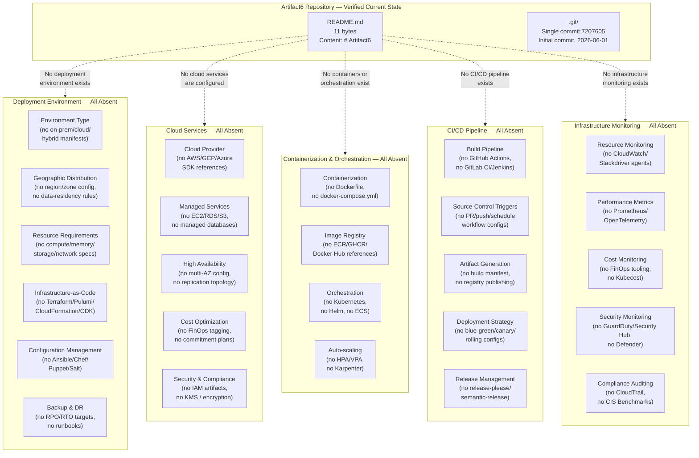
```mermaid
graph TB
    subgraph Current["Artifact6 Repository — Verified Current State"]
        README["README.md<br/>11 bytes<br/>Content: # Artifact6"]
        GitMeta[".git/<br/>Single commit 7207605<br/>Initial commit, 2026-06-01"]
    end

    subgraph DeployEnv["Deployment Environment — All Absent"]
        ENVTYPE["Environment Type<br/>(no on-prem/cloud/<br/>hybrid manifests)"]
        GEO["Geographic Distribution<br/>(no region/zone config,<br/>no data-residency rules)"]
        RES["Resource Requirements<br/>(no compute/memory/<br/>storage/network specs)"]
        IAC["Infrastructure-as-Code<br/>(no Terraform/Pulumi/<br/>CloudFormation/CDK)"]
        CFG["Configuration Management<br/>(no Ansible/Chef/<br/>Puppet/Salt)"]
        DR["Backup & DR<br/>(no RPO/RTO targets,<br/>no runbooks)"]
    end

    subgraph CloudSvc["Cloud Services — All Absent"]
        PROV["Cloud Provider<br/>(no AWS/GCP/Azure<br/>SDK references)"]
        SVC["Managed Services<br/>(no EC2/RDS/S3,<br/>no managed databases)"]
        HA["High Availability<br/>(no multi-AZ config,<br/>no replication topology)"]
        COST["Cost Optimization<br/>(no FinOps tagging,<br/>no commitment plans)"]
        SECC["Security & Compliance<br/>(no IAM artifacts,<br/>no KMS / encryption)"]
    end

    subgraph Containers["Containerization & Orchestration — All Absent"]
        DOCKER["Containerization<br/>(no Dockerfile,<br/>no docker-compose.yml)"]
        REG["Image Registry<br/>(no ECR/GHCR/<br/>Docker Hub references)"]
        K8S["Orchestration<br/>(no Kubernetes,<br/>no Helm, no ECS)"]
        SCALE["Auto-scaling<br/>(no HPA/VPA,<br/>no Karpenter)"]
    end

    subgraph CICD["CI/CD Pipeline — All Absent"]
        BUILD["Build Pipeline<br/>(no GitHub Actions,<br/>no GitLab CI/Jenkins)"]
        TRIG["Source-Control Triggers<br/>(no PR/push/schedule<br/>workflow configs)"]
        ART["Artifact Generation<br/>(no build manifest,<br/>no registry publishing)"]
        DEP["Deployment Strategy<br/>(no blue-green/canary/<br/>rolling configs)"]
        REL["Release Management<br/>(no release-please/<br/>semantic-release)"]
    end

    subgraph InfraMon["Infrastructure Monitoring — All Absent"]
        RMON["Resource Monitoring<br/>(no CloudWatch/<br/>Stackdriver agents)"]
        PMON["Performance Metrics<br/>(no Prometheus/<br/>OpenTelemetry)"]
        CMON["Cost Monitoring<br/>(no FinOps tooling,<br/>no Kubecost)"]
        SMON["Security Monitoring<br/>(no GuardDuty/Security Hub,<br/>no Defender)"]
        AUDIT["Compliance Auditing<br/>(no CloudTrail,<br/>no CIS Benchmarks)"]
    end

    README -.->|"No deployment<br/>environment exists"| DeployEnv
    README -.->|"No cloud services<br/>are configured"| CloudSvc
    README -.->|"No containers or<br/>orchestration exist"| Containers
    README -.->|"No CI/CD pipeline<br/>exists"| CICD
    README -.->|"No infrastructure<br/>monitoring exists"| InfraMon
```

The dashed edges denote the absence of any path from the repository's sole tracked content to any Infrastructure layer. Because every category mandated by the section prompt is empty, no concrete infrastructure architecture, deployment workflow, environment promotion flow, or network architecture diagram can be constructed in this revision.

## 8.11 MINIMAL BUILD AND DISTRIBUTION REQUIREMENTS

The section prompt directs that, when a "Not Applicable" determination is issued for Infrastructure Architecture, the document must "document only the minimal build and distribution requirements." This section addresses that directive.

### 8.11.1 Current State

The repository currently has **no minimal build and distribution requirements that are documentable**, because:

- **No build manifest exists.** Per Section 3.7.2, no `Makefile`, `BUILD.bazel`, `nx.json`, `turbo.json`, `package.json`, `pyproject.toml`, `pom.xml`, `build.gradle`, `Cargo.toml`, or `CMakeLists.txt` is committed.
- **No source code exists to build.** Per Section 1.2.2.2, only `README.md` and `.git/` metadata exist in the repository.
- **No distribution target exists.** Per Sections 3.7.2 and 3.7.5, no publish workflows, no registry configurations, and no artifact-storage references are committed.
- **No build environment is specified.** Per Section 3.7.1, no language-version manager files (`.nvmrc`, `.python-version`, `.tool-versions`) or dev-container manifests are committed.

The README.md file itself requires no build step — it is a plain-text Markdown document rendered natively by GitHub's web interface. It has no toolchain dependency, no compilation step, no test harness, and no distribution artifact beyond the Git object that is already replicated by every `git clone` operation.

### 8.11.2 Deferred Minimal Requirements

When the first source-code module is committed, the following minimum build and distribution posture will apply as the entry-level commitment. The table below records the deferred requirements rather than describing a current implementation.

| Requirement Domain | Baseline Commitment (Deferred) |
|---|---|
| Build manifest | A canonical build manifest (`package.json`, `pyproject.toml`, `Makefile`, etc.) must be committed concurrently with the first source-code module, exposing `build`, `test`, and `lint` entry points |
| Reproducible builds | Build inputs (compiler version, dependency lockfile, environment variables) must be pinned at first source-code commit; a language-version manager file (`.nvmrc`, `.python-version`, `.tool-versions`) must declare the toolchain |
| Distribution artifact | The form of the distribution artifact (library package, container image, binary, static site) must be declared in an ADR concurrently with the first build manifest commit |
| Artifact storage | A target registry (npm registry, PyPI, Maven Central, Docker Hub / GHCR / ECR, GitHub Releases) must be declared concurrently with the artifact-generation commitment; credentials must be referenced via secrets-manager (not hard-coded) |
| Versioning policy | A versioning scheme (SemVer 2.0.0, CalVer, ZeroVer) must be declared in the first ADR; the chosen scheme governs `git tag`, registry-publication, and changelog automation |
| Distribution license | A `LICENSE` file (and `NOTICE` where applicable) must be committed before any distribution event; without a license, redistribution rights default to the most-restrictive interpretation under copyright law |

Until those triggers fire, Section 8.11 records the empty-state baseline. The presence of `README.md` alone in the current repository is consistent with a project in the **bootstrap phase** of its lifecycle: a placeholder asserting project identity (`# Artifact6`) without any operational, build, or distribution surface.

## 8.12 STANDARD INFRASTRUCTURE PRACTICES FOR FUTURE ADOPTION

This subsection enumerates the deferred guidance that will be applied to future commits, drawn from infrastructure industry-standard postures aligned with the candidate-stack neutrality of Section 3.9.6. None of the practices below describes a current implementation; each is recorded as a commitment to govern future infrastructure-relevant artifacts when they are introduced. This subsection mirrors the precedent established in Sections 6.4.8, 6.5.8, and 6.6.8.

### 8.12.1 Baseline Practices for the First Infrastructure Commit

| Practice Domain | Baseline Practice Commitment |
|---|---|
| Infrastructure-as-Code-first principle | The first cloud-resource provisioning event must be expressed as an IaC artifact (Terraform, CloudFormation, Pulumi, CDK, or Bicep) rather than a manual console action; click-ops is prohibited from the outset |
| State management | First IaC adoption must externalize state to a remote backend with encryption-at-rest and state-locking (e.g., S3 + DynamoDB for Terraform, Cloud Storage + KMS for OpenTofu) — never `terraform.tfstate` in version control |
| Least-privilege IAM | First IAM principal definition adopts least-privilege scoping; broad managed policies (e.g., `*Administrator`) are prohibited outside emergency-access break-glass roles |
| Environment isolation | At the first second-environment introduction, separation between dev/staging/prod must be enforced at the account/project/subscription level (not merely namespace or tag) when the cloud provider supports it |
| Tag/label standard | First cloud-resource provisioning event must adopt a tag/label standard covering at minimum: `environment`, `service`, `owner`, `cost-center`, `managed-by` |
| Network defaults | First VPC/network creation must explicitly define non-default CIDRs, private subnets for compute, NAT egress with controlled egress logging, and rejection of unrestricted inbound rules |

These practices become operationally measurable only when the first infrastructure artifact is committed. Until then, no infrastructure surface exists against which to apply them.

### 8.12.2 Baseline Practices Aligned with the Candidate Technology Stack

Section 3.9 enumerates a Candidate Technology Stack (AWS, Docker, Terraform, GitHub Actions, Python, Flask, Auth0, MongoDB, LangChain, React, React Native). The table below records the basic infrastructure practices that will be applied when (and only when) each candidate is actually adopted via committed artifacts, per the Section 3.9.6 caveat that no adoption may be inferred from candidate-status.

| Candidate Domain | Baseline Infrastructure Practice (Deferred) |
|---|---|
| AWS (cloud platform) | Organizations-level account structure with separate accounts per environment; IAM least-privilege roles with permission boundaries; S3 default-encryption + public-access blocks; KMS-managed encryption keys with rotation; Security Groups / NACLs with explicit-deny defaults; GuardDuty + Security Hub + AWS Config enabled at first-account creation; CloudTrail organization trail enabled |
| Docker (containers) | Multi-stage builds separating build-time and runtime layers; non-root container users (`USER` directive); read-only root filesystems where feasible; minimal base images (Distroless, Alpine, scratch); BuildKit cache mounts for dependency layers; image vulnerability scanning (Trivy / Grype / Snyk) before push |
| Terraform (IaC) | Remote state with S3 + DynamoDB backend (or equivalent) with KMS encryption; workspaces or directory-per-environment isolation; module versioning via Git tags or Terraform Registry; pre-commit hooks running `terraform fmt`, `terraform validate`, `tflint`, `checkov`; `terraform plan` artifacts attached to PRs |
| GitHub Actions (CI/CD) | OIDC federation to AWS / GCP / Azure (no long-lived static credentials); least-privilege per-workflow `permissions:` blocks; pinning of third-party actions to commit SHAs (not floating tags); required reviews on workflows touching `secrets.` references; branch-protection requiring CI green-status before merge |
| Python / Flask (backend) | Containerized deployment via the Docker baseline above; gunicorn / uvicorn worker sizing tied to instance CPU count; structured-log emission to stdout for collection by the platform; health-check endpoints (`/healthz`, `/readyz`) consistent with Section 6.5.8.3 |
| MongoDB (database) | Managed-service preference (MongoDB Atlas) for first adoption; encryption at rest and in transit; network isolation via VPC peering or PrivateLink; automated backups with point-in-time recovery; least-privilege database-user roles per service |
| Auth0 (identity) | Tenant-per-environment separation; client-secret rotation policy; rate-limiting on token endpoints; Auth0 Logs streamed to the chosen aggregation backend |
| LangChain (AI framework) | LLM-provider credentials referenced via secrets-manager (not committed); rate-limit and cost-cap policies declared at first integration; LangSmith for trace observability |
| React / React Native (frontend) | Static-site hosting with automatic HTTPS (CloudFront, Cloud CDN, Azure Front Door); CSP headers configured at deployment time; build-output integrity via Subresource Integrity for third-party scripts |

Each entry above is conditional. Per Section 3.9.6, "no selections are final," "compatibility unverified," "version pins absent by design," and "justifications deferred." The infrastructure practices become applicable only when the corresponding candidate is adopted via a committed artifact (IaC manifest, SDK dependency, agent configuration, or ADR).

### 8.12.3 Baseline Cost-Estimation and Resource-Sizing Practice

The section prompt directs documentation of infrastructure cost estimates and resource sizing guidelines. Because no deployment surface, workload profile, or capacity target exists, no concrete cost estimate or sizing guideline can be authored against current evidence. The table below records the deferred posture that will apply once an infrastructure artifact is committed.

| Practice Element | Baseline Commitment (Deferred) |
|---|---|
| Cost estimation methodology | First infrastructure commit must include a cost-estimation artifact (e.g., Infracost output, `aws pricing calculator` export, GCP Pricing Calculator export) attached to the ADR documenting the infrastructure decision |
| Right-sizing baseline | First workload deployment must declare resource `requests` and `limits` (or instance-type selection) grounded in a load-test artifact (k6, Gatling, Locust, JMeter) — not in a guess |
| Steady-state vs. burst capacity | Cost estimates must distinguish steady-state baseline (committed-use discount eligible) from burst capacity (on-demand / Spot eligible) |
| Multi-environment cost amortization | dev / staging environments must adopt aggressive cost-controls (smaller instance types, scale-to-zero where feasible, scheduled shutdown of non-production resources) |
| Budget alerts | First cloud-account provisioning must enable budget alerts at 50%, 80%, and 100% of declared monthly budget; alerts route to the same notification channel as production-severity incidents |
| Cost review cadence | A monthly cost review cadence is committed concurrently with the first non-trivial infrastructure deployment |

Per Sections 1.2.3.3 and 5.5.5, no Performance, Reliability, or Business/financial KPIs are declared, eliminating any anchor against which cost estimates or sizing guidelines could be quantified. The cost-estimation and resource-sizing inventory contains zero current rows and will become populable at the trigger events enumerated in Section 8.14.

## 8.13 CROSS-REFERENCES TO PRIOR SECTIONS

Every absence documented in Sections 8.3 through 8.8 is anchored in the authoritative findings of prior sections of this Technical Specification. The tables below map each Section 8 topic to the prior section that authoritatively establishes its absence.

### 8.13.1 Deployment Environment Cross-Reference Map

| Section 8 Topic | Authoritative Prior Section |
|---|---|
| Environment type (on-prem/cloud/hybrid) | Section 3.5.1; Section 3.7.4 |
| Geographic distribution | Section 3.7.4 |
| Resource requirements (compute/memory/storage/network) | Section 3.7.3; Section 3.7.4; Section 5.5.5 |
| Compliance and regulatory requirements | Section 6.4.5.5 |
| Infrastructure as Code approach | Section 3.7.4 |
| Configuration management strategy | Section 3.7.4 |
| Environment promotion strategy | Section 3.5.2; Section 3.7.5 |
| Backup and disaster recovery | Sections 3.6.3, 4.4.2, and 5.5.6 |

### 8.13.2 Cloud Services Cross-Reference Map

| Section 8 Topic | Authoritative Prior Section |
|---|---|
| Cloud provider selection | Section 3.5.1; Section 3.9.2 |
| Core services and versions | Section 3.5.1; Section 3.7.4; Section 3.9.6 |
| High availability design | Section 6.1.5 |
| Cost optimization strategy | Section 6.1.4.2 |
| Security and compliance considerations | Section 3.10.1; Section 6.4 |

### 8.13.3 Containerization, Orchestration, and CI/CD Cross-Reference Map

| Section 8 Topic | Authoritative Prior Section |
|---|---|
| Container platform selection | Section 3.7.3 |
| Base image / versioning / build optimization | Section 3.7.3 |
| Image security scanning | Section 3.10.1; Section 6.6.3.4 |
| Orchestration platform selection | Section 3.7.3 |
| Cluster architecture | Section 3.7.3; Section 5.2.2 |
| Auto-scaling configuration | Section 6.1.4.2 |
| Source-control triggers and build pipeline | Section 3.7.5; Section 3.7.2 |
| Deployment strategy and rollback | Section 3.7.3; Section 3.7.5 |
| Release management | Section 3.7.5 |
| Post-deployment validation | Section 6.6.4.3 |

### 8.13.4 Infrastructure Monitoring Cross-Reference Map

| Section 8 Topic | Authoritative Prior Section |
|---|---|
| Resource monitoring approach | Section 3.5.1; Section 5.5.1 |
| Performance metrics collection | Section 5.5.1; Section 6.5.3.1 |
| Cost monitoring and optimization | Section 6.1.4.2 |
| Security monitoring | Section 3.10.1; Section 6.4 |
| Compliance auditing | Section 3.10.1; Section 6.4.5.5 |

## 8.14 FORWARD PLAN

Consistent with the section-revision-trigger pattern established in Sections 2.8, 3.11, 4.8, 5.8, 6.1.9, 6.2.10, 6.3.9, 6.4.10, 6.5.10, 6.6.10, and 7.6, the table below enumerates the repository events that would warrant revision of Section 8 in a future iteration of this Technical Specification. Each trigger maps to one or more subsections of Section 8 that would gain authoritative content.

### 8.14.1 Section Revision Triggers

The following are the primary trigger events for re-authoring this section. Each event represents a discrete repository commit (or supplied authoritative user context) that would unblock the corresponding Section 8 subsection.

| Trigger Event | Resulting Section 8 Subsection Revision |
|---|---|
| First `Dockerfile`, `Containerfile`, or container build manifest committed | 8.5 Containerization |
| First `docker-compose.yml` or local-dev compose file committed | 8.5 Containerization; 8.6 Orchestration |
| First Kubernetes manifest (`*.yaml` under `k8s/`) or Helm chart (`Chart.yaml`) committed | 8.6 Orchestration |
| First Terraform (`*.tf`), CloudFormation, Pulumi, or CDK artifact committed | 8.3 Deployment Environment (IaC); 8.4 Cloud Services |

### 8.14.2 Additional Revision Triggers

| Trigger Event | Resulting Section 8 Subsection Revision |
|---|---|
| First Ansible / Chef / Puppet / SaltStack manifest committed | 8.3 Configuration Management |
| First GitHub Actions workflow (`.github/workflows/*.yml`) committed | 8.7 CI/CD Pipeline |
| First GitLab CI / Jenkins / CircleCI / Azure Pipelines / Travis configuration committed | 8.7 CI/CD Pipeline |
| First cloud-provider SDK reference (AWS / GCP / Azure / OCI) committed | 8.4 Cloud Services |
| First `.env.example`, `.env.dev`, `.env.staging`, or `.env.prod` committed | 8.3 Environment Promotion |
| First APM agent / metrics exporter / log-aggregator configuration committed | 8.8 Infrastructure Monitoring |
| First IaC artifact with security boundaries (Security Groups, NACLs, IAM roles, KMS keys) | 8.4 Cloud Services Security; 8.8 Security Monitoring |
| First runbook, disaster-recovery plan, or backup procedure committed | 8.3 Backup and DR |
| First ADR documenting an infrastructure decision committed | All subsections of 8 (with rationale narrative) |
| First NFR document with SLAs, RPO/RTO targets, or capacity targets committed | 8.3 Resource Requirements; 8.8 Performance Metrics |
| First cost-optimization document or FinOps tagging policy committed | 8.4 Cost Optimization; 8.8 Cost Monitoring |
| First Argo Rollouts / Flagger / Spinnaker / Argo CD / Flux configuration committed | 8.7 Deployment Pipeline |
| First release-automation configuration (release-please, semantic-release, changesets) committed | 8.7 Release Management |
| First policy-as-code manifest (OPA, Sentinel, Checkov, tfsec) committed | 8.8 Compliance Auditing |
| First image-signing / SBOM-publication artifact (cosign, syft, cyclonedx) committed | 8.5 Containerization Security |
| First build manifest (`Makefile`, `package.json`, `pyproject.toml`, `Cargo.toml`) committed | 8.11 Minimal Build and Distribution Requirements |
| Authoritative user context with concrete infrastructure definitions supplied | All subsections of 8, with explicit cross-reference to supplied context |

### 8.14.3 Documentation Consistency Commitments

When any of the above triggers fires, the following consistency commitments apply to the revision of Section 8:

1. **Cross-reference integrity.** Updated findings in Section 8 must remain consistent with the corresponding updates in Sections 1.2, 3.5, 3.6, 3.7, 3.9, 3.10, 5.5, 6.1, 6.4, 6.5, and 6.6. Section 5.8.1 specifically anchors infrastructure-relevant trigger events that propagate into Section 8.
2. **Evidence-only authorship.** New cloud-provider, IaC, containerization, orchestration, CI/CD, or monitoring claims must be grounded in the committed artifact or supplied user context; speculation about "typical" infrastructure patterns for a project named Artifact6 remains prohibited per Section 2.7.1.
3. **Candidate-stack neutrality.** Adoption of AWS, Docker, Terraform, GitHub Actions, or any other infrastructure tool implied by Section 3.9's Candidate Technology Stack must be evidenced by an actual commit (manifest, ADR, or configuration file), not inferred from the candidate-stack proposal. Per Section 3.9.6, no version pin, justification, cost estimate, or resource-sizing guideline may be authored absent committed artifacts.
4. **Diagram producibility reevaluation.** The producibility status of the four diagrams required in Section 8.9 (Infrastructure Architecture, Deployment Workflow, Environment Promotion Flow, Network Architecture) must be reassessed at each revision; once producible, each diagram must be authored before Section 8 can transition from "Not Applicable" to a populated state.
5. **Cost estimate disclosure.** When cloud resources or workloads are committed, the section prompt's "Include infrastructure cost estimates" directive becomes binding; cost estimates must be grounded in pricing-calculator outputs or Infracost reports, not in extrapolation.
6. **Resource-sizing-guideline disclosure.** When workloads are committed, the section prompt's "Provide resource sizing guidelines" directive becomes binding; sizing guidelines must be grounded in load-test artifacts (k6, Gatling, Locust, JMeter) per Section 6.1.4.3.
7. **External-dependency disclosure.** When external services are integrated, the section prompt's "Document all external dependencies" directive becomes binding; all external dependencies must be enumerated in tabular form with version pins, SLA tier, and failover posture.
8. **Security-requirement consistency.** Infrastructure-security claims must remain consistent with the security posture in Section 6.4 and the security forward-looking guidance in Section 3.10.2.
9. **Scalability-requirement consistency.** Auto-scaling and capacity claims must remain consistent with the scalability evidence map in Section 6.1.4 and any NFR targets declared in subsequent commits.
10. **Maintenance-procedure disclosure.** Backup, DR, and maintenance procedures must be synchronized with Section 5.5.6 (disaster recovery) and Section 6.5.5.3 (runbooks).
11. **Monitoring-requirement consistency.** Infrastructure-monitoring claims must remain synchronized with the monitoring approach declared in Section 5.5.1 and the observability deferred guidance in Section 6.5.8.

## 8.15 SECTION VERSIONING

Consistent with the section-versioning pattern established in Sections 2.7.3, 3.11.3, 4.9, 5.9, 6.1.10, 6.2.11, 6.3.10, 6.4.11, 6.5.11, 6.6.11, and 7.7, the table below records the revision history of Section 8 against the repository state at each revision.

| Version | Date | Repository Commit | Notable State |
|---|---|---|---|
| 1.0 | 2026-06-01 | `7207605` | Empty repository; section documents the absence of all Infrastructure artifacts (deployment environment, cloud services, containerization, orchestration, CI/CD pipeline, infrastructure monitoring) and confirms "Not Applicable" determination per the section prompt's explicit directive for standalone applications and libraries that do not require deployment infrastructure. Minimal build and distribution requirements documented as deferred. Standard infrastructure practices enumerated as deferred guidance for future commits. |

## 8.16 REFERENCES

### 8.16.1 Files Examined

- `README.md` — The repository's only tracked file (11 bytes, content `# Artifact6`). Used to confirm the absence of any infrastructure-relevant artifact (Dockerfile, IaC manifest, CI/CD pipeline, cloud-provider configuration, monitoring agent configuration, runbook, or build manifest) that would otherwise underpin an Infrastructure section.

### 8.16.2 Folders Explored

- `/` (repository root, depth 0) — Contains exactly one tracked child (`README.md`) plus the `.git/` metadata directory. No subdirectories matching `infrastructure/`, `terraform/`, `cloudformation/`, `pulumi/`, `cdk/`, `k8s/`, `kubernetes/`, `helm/`, `charts/`, `docker/`, `containers/`, `ansible/`, `.github/workflows/`, `.gitlab/`, `.circleci/`, `ci/`, `cd/`, `deploy/`, `deployment/`, `ops/`, `operations/`, `runbooks/`, or any other infrastructure-related layout exist. Used to confirm the comprehensive absence of Infrastructure artifacts.

### 8.16.3 Searches Conducted

- Filesystem inspection of repository root — Confirmed only `README.md` and `.git/` metadata are present at the project root, consistent with the verified facts established in Section 1.3.3.1.
- Filesystem pattern search for infrastructure artifacts (`Dockerfile`, `docker-compose*`, `*.tf`, `Jenkinsfile`, `*.bicep`, `Chart.yaml`, `kustomization.yaml`) — Confirmed no project-level matches exist; matches found at `/usr/lib/node_modules/` are system npm packages outside the Artifact6 repository and therefore irrelevant to this section.
- Filesystem search for `.blitzyignore` files — Confirmed no `.blitzyignore` files exist anywhere in the system, consistent with the empty-repository determination.

### 8.16.4 Cross-Referenced Technical Specification Sections

- **Section 1.2.2.2 (Major System Components)** — Established that only `README.md` and `.git/` metadata exist; no deployable component is present. Anchors Section 8.1.2 (no deployable artifact precondition).
- **Section 1.2.3.3 (Success Criteria / KPIs)** ⭐ **PRIMARY SOURCE** — Established that all five KPI categories (Functional, Performance, Reliability, Adoption/usage, Business/financial) are "Not declared in repository." Anchors Sections 8.3.1 (resource requirements) and 8.12.3 (cost-estimation grounding).
- **Section 1.3.3.1 (Verified Repository Facts)** — Provided the authoritative repository state baseline (single commit `7207605`, sole file `README.md`, no subdirectories) reused in Section 8.1.1.
- **Section 2.7.1 (Evidence-Only Constraint)** — Provided the prohibition against speculating about "typical" features or technologies, which governs the "Not Applicable" determination in this section.
- **Section 2.8 (Forward Plan)** — Established the Section Revision Triggers template mirrored in Section 8.14.
- **Section 3.4 (Open Source Dependencies)** — Established that zero dependencies exist across the fifteen enumerated package managers, eliminating any infrastructure-tool dependency (Terraform providers, AWS SDK, Kubernetes client libraries).
- **Section 3.5.1 (External Service Integrations)** ⭐ **PRIMARY SOURCE** — Established that the "Cloud provider" category is "None" with "No AWS/GCP/Azure SDK references or service configurations committed." Anchors all of Section 8.4. Also established absence of CDN, observability/monitoring, and feature-flag services; anchors Section 8.8.
- **Section 3.5.2 (Service Integration Evidence Map)** — Confirmed absence of HTTP-client libraries, service credentials (`.env*`), API contract specifications, SDK configurations, webhook endpoints, and service-mesh configurations. Anchors Section 8.3.2 (environment-promotion absence).
- **Section 3.5.3 (Authentication, Authorization, and Identity)** — Confirmed absence of OAuth/OIDC, JWT, SAML, API-key management, RBAC/ABAC policies, and session management; anchors Section 8.4.3 (security posture absence).
- **Section 3.6 (Databases & Storage)** — Confirmed all storage categories "None declared"; anchors Section 8.3.1 (storage resource requirements absence) and Section 8.4.2 (managed-storage-services absence).
- **Section 3.7 (Development & Deployment)** ⭐ **PRIMARY SOURCE** — The single most authoritative source for Section 8's "Not Applicable" determination:
    - Section 3.7.1 (Development Tooling) — Anchors absence of language-version-manager files and dev-container manifests.
    - Section 3.7.2 (Build System) — Anchors absence of build manifests and artifact-publishing configurations; anchors all of Section 8.11.
    - Section 3.7.3 (Containerization and Orchestration) — Anchors all of Sections 8.5 and 8.6.
    - Section 3.7.4 (Infrastructure as Code) — Anchors Section 8.3.2 (IaC and configuration-management absence) and Section 8.4 (no IaC-driven cloud-service declarations).
    - Section 3.7.5 (CI/CD Configuration) — Explicitly states "No CI/CD pipeline configuration exists in the repository. Builds, tests, security scans, and deployments are therefore unautomated as of commit `7207605`." Anchors all of Section 8.7.
- **Section 3.9 (Candidate Technology Stack)** ⭐ **CRITICAL CONSTRAINT** — Established that AWS, Docker, Terraform, GitHub Actions, Python, Flask, Auth0, MongoDB, LangChain, React, and React Native are listed as candidates but **not adopted**. Section 3.9.6 caveats ("no selections are final," "compatibility unverified," "version pins absent by design," "justifications deferred") govern Section 8 by prohibiting authoring of any infrastructure control for candidate-only components. Section 8.12.2 draws on Section 3.9 for forward-looking deferred guidance.
- **Section 3.10 (Security Implications of (Non-)Selections)** — Section 3.10.1 confirmed that all ten security concerns (including SBOM/supply-chain attestation, CI/CD pipeline security, container-image provenance, IaC drift, and secrets-management) are "not assessable." Anchors Sections 8.5.2 (image-scanning absence), 8.7 (pipeline security absence), and 8.8.2 (security and compliance monitoring absence). Section 3.10.2 provides forward-looking security postures referenced in Section 8.12.2.
- **Section 4.4.2 (Error Handling Evidence Map)** — Confirmed no retry libraries, no alerting configurations, no error-tracking integrations, no runbooks, no disaster-recovery plans, and no incident-response playbooks committed. Anchors Sections 8.3.2 (DR absence) and 8.7.2 (post-deployment-validation absence).
- **Section 5.2.2 (Core Components Evidence Map)** — Confirmed that the Core Components Table has zero documentable rows; anchors Section 8.6 (no workload to orchestrate) and Section 8.7.2 (no deployable artifact).
- **Section 5.5.1 (Monitoring and Observability Evidence Map)** ⭐ **PRIMARY SOURCE** — Established that APM agents, metrics export, dashboards/SLOs, and health-check endpoints are all "Not documentable." Anchors Section 8.8.1.
- **Section 5.5.5 (Performance and SLA Evidence Map)** ⭐ **PRIMARY SOURCE** — Established that latency targets, throughput targets, availability/uptime SLOs, and error-budget policies are all "Not declared." Anchors Section 8.3.1 (resource-requirement absence) and Section 8.12.3 (cost-estimation grounding absence).
- **Section 5.5.6 (Disaster Recovery Evidence Map)** ⭐ **PRIMARY SOURCE** — Established that no RPO/RTO targets, no backup procedures, no runbooks or incident-response playbooks committed. Anchors Section 8.3.2 (backup and DR absence).
- **Section 5.8 (Forward Plan)** ⭐ **TRIGGER PATTERN SOURCE** — Established the section-revision-trigger pattern reused in Section 8.14, including the linkage that "First observability / APM configuration committed" and "First runbook or disaster-recovery plan committed" trigger downstream section revisions.
- **Section 6.1 (Core Services Architecture)** ⭐ **PRECEDENT** — Established the "Not Applicable" determination pattern, structural template, evidence-map subsection style, and Repository State Snapshot Mermaid diagram template that Section 8 mirrors. Section 6.1.4.2 anchors Section 8.4.3 (cost optimization absence) and Section 8.6.2 (auto-scaling absence). Section 6.1.4.3 anchors Section 8.12.3 (resource-sizing-guideline grounding absence). Section 6.1.5 anchors Section 8.4.3 (HA absence).
- **Section 6.2 (Database Design)** ⭐ **PRECEDENT** — Reinforced the "Not Applicable" determination pattern; anchors Section 8.4.2 (managed-database-services absence).
- **Section 6.3 (Integration Architecture)** ⭐ **PRECEDENT** — Reinforced the "Not Applicable" determination pattern. Section 6.3.5.3 anchors Section 8.6.1 (API gateway / ingress controller absence).
- **Section 6.4 (Security Architecture)** ⭐ **PRECEDENT** — Established the "Standard Practices for Future Adoption" subsection template (Section 6.4.8) mirrored by Section 8.12. Section 6.4.5.5 anchors Section 8.3.1 (compliance and regulatory absence) and Section 8.8.2 (compliance auditing absence). Section 6.4.7 anchors the Repository State Snapshot diagram pattern.
- **Section 6.5 (Monitoring and Observability)** ⭐ **PRECEDENT & PRIMARY SOURCE** — Most directly analogous "Not Applicable" determination (Sections 6.5 and 8 cover overlapping cross-cutting operational concerns). Section 6.5.3.1 anchors Section 8.8.1 (resource monitoring absence). Section 6.5.4.1 anchors Section 8.8.1 (synthetic-monitor absence). Section 6.5.8 provides the deferred-guidance template most directly mirrored by Section 8.12.
- **Section 6.6 (Testing Strategy)** ⭐ **PRECEDENT** — Most recent "Not Applicable" precedent. Section 6.6.3.4 anchors Section 8.5.2 (image-scanning absence), Section 8.7.1 (build-pipeline security-scanning absence), and Section 8.8.2 (security-monitoring absence). Section 6.6.4.3 anchors Section 8.7.2 (post-deployment validation absence).
- **Section 7 (User Interface Design)** ⭐ **PRECEDENT** — Most concise "Not Applicable" determination pattern; reinforces Section 8's structural fidelity. Section 7.1.3 provides the section-prompt-fidelity-constraint template mirrored in Section 8.2.

# 9. Appendices

## 9.1 ADDITIONAL TECHNICAL INFORMATION

This appendix consolidates technical information referenced incidentally across Sections 1 through 8 of this Technical Specification that did not have a dedicated primary section in which to be captured. Consistent with the **evidence-only documentation constraint** established in Section 2.7.1 and reaffirmed throughout the document, the material below is grounded exclusively in the verified repository state at commit `7207605` and in conventions explicitly declared by prior sections. No additional technologies, configurations, or artifacts are introduced here that are not already evidenced elsewhere in the specification.

### 9.1.1 Authoritative Repository State (Reaffirmation)

Per Section 1.1, Section 1.3.3.1, and Section 8.1.1, the entire substantive content of the Artifact6 repository at the time of this specification's authoring consists of a single Markdown heading inside one tracked file. The Appendices does not introduce any new repository evidence; it merely catalogs and cross-references material established by prior sections.

| Repository Fact | Verified Value | Authoritative Section(s) |
|---|---|---|
| Project name | Artifact6 | 1.1.1, 8.1.1 |
| Remote URL | `github.com/Blitzy-Multi/Artifact6` | 1.1.1 |
| Tracked content | `README.md` (11 bytes) containing `# Artifact6` | 1.1.1, 8.1.1 |
| Subdirectories | None (only `.git/` metadata present) | 1.3.3.1, 8.1.1 |
| Sole commit | `7207605` (full SHA `7207605db62e3243f097c7a231bd60a8333a2f52`) | 1.1.3, 8.1.1 |
| Commit message | "Initial commit" | 1.1.3 |
| Commit date | 2026-06-01 | 1.1.3 |
| Committer identity | `Blitzy-Multi <mmwforfinance@gmail.com>` | 1.1.3 |
| Default branch | `main` | 1.1 |

### 9.1.2 Documentation Methodology Conventions

Prior sections establish a set of recurring structural conventions that pervade this Technical Specification. These conventions are not themselves repository artifacts; they are **authoring conventions** adopted by the specification's framework to faithfully document an empty repository without fabricating content. They are catalogued here so that future revisers can preserve methodological consistency across subsequent versions.

#### 9.1.2.1 Recurring Subsection Patterns

| Convention | Purpose | Representative Section(s) |
|---|---|---|
| Section Population Status | Declares whether a section is "Empty," "Not Applicable," or "Producible" based on repository evidence | 3.1, 4.1, 5.1 |
| Evidence Map | Three-column tabular pattern: Required Element \| Evidence in Repository \| Documentable? | 3.8, 4.2–4.4, 5.2–5.5, 8.3–8.8 |
| Section-Prompt Fidelity Constraint | Enumerates prohibited authoring actions and what the section does document | 3.1.2, 5.1.2, 6.1.2, 8.2 |
| Required Diagrams Status | Two-column producibility table for Mermaid diagrams mandated by the section prompt | 4.5, 8.9 |
| Repository State Snapshot | Recurring Mermaid diagram restating verified inventory and overlaying absent categories | 1.2.2.2, 2.4.3, 3.1.3, 4.1.3, 5.1.3, 6.1.7, 6.2.8, 6.3.7, 6.4.7, 6.5.7, 6.6.7, 7.4, 8.10 |
| Cross-References to Prior Sections | Maps current section topics to authoritative prior sections to avoid restatement | 4.6, 5.6, 7.5, 8.13 |
| Forward Plan / Section Revision Triggers | Maps future commits to subsection re-authoring events | 2.8, 3.11, 4.8, 5.8, 6.x.9, 7.6, 8.14 |
| Section Versioning | Single-row table: Version 1.0 \| 2026-06-01 \| `7207605` \| empty-state note | 2.7.3, 3.11.3, 4.9, 5.9, 6.1.10, 6.2.11, 6.3.10, 6.4.11, 6.5.11, 6.6.11, 7.7, 8.15 |
| References | Lists files examined, folders explored, searches conducted, and cross-referenced sections | 3.12, 4.10, 5.10, 7.8, 8.16 |

#### 9.1.2.2 Inventory-of-Absences Authoring Style

Sections 3 through 8 each adopt an *inventory-of-absences* documentation style, in which the section explicitly enumerates what is **not** present in the repository (with traceable evidence anchors) rather than fabricating speculative content. This authoring style is the direct consequence of the evidence-only constraint declared in Section 2.7.1, which prohibits speculation about "typical" content for a project named Artifact6.

#### 9.1.2.3 Section-Prompt Fidelity Constraint

The repeating *Section-Prompt Fidelity Constraint* subsection (introduced under varying numbers in Sections 3, 5, 6, and 8) interprets the section-prompt directive to omit elements that are "not clearly applicable." Under this constraint, sections with no applicable items legitimately remain documented inventories of absences, and forward-looking guidance is presented as deferred rather than adopted.

### 9.1.3 Identifier Format Conventions

The specification uses the following identifier formats. These were introduced in Section 2 and Section 2.7.2 and are reused without modification elsewhere.

| Identifier | Format | Purpose | Introduced In |
|---|---|---|---|
| Feature ID | `F-XXX` (three-digit numeric) | Identifies a feature catalog entry | Section 2 |
| Requirement ID | `F-XXX-RQ-YYY` | Links requirement `YYY` to feature `XXX` | Section 2 |
| Assumption ID | `A-NNN` | Identifies a documentation assumption | Section 2.7.2 |
| Revision Trigger | Tabular (un-IDed) | Future commit conditions that cause subsection re-authoring | Sections 2.8, 3.11, 4.8, 5.8, 6.x.9, 7.6, 8.14 |

No feature catalog, requirement catalog, or assumption beyond `A-001`, `A-002`, and `A-003` has been recorded in the current revision because the repository state does not support the introduction of additional instances under the evidence-only constraint.

### 9.1.4 Documentation Assumptions Catalog (Consolidated Restatement)

Section 2.7.2 declares three assumptions that govern every other section of this specification. They are restated here in their entirety to provide a single reference point for future revisers and to allow consistency checks against any new repository state.

| Assumption ID | Assumption | Validity Condition |
|---|---|---|
| A-001 | The Git working tree as of commit `7207605` is the authoritative source of repository state | Holds until a subsequent commit changes the working tree |
| A-002 | No external requirements documents exist outside the repository that should govern this specification | Holds unless authoritative user context introduces such documents |
| A-003 | The empty state is intentional (project initialization phase) rather than an accidental data-loss event | Holds based on the single-commit, "Initial commit" history |

If any of these assumptions is invalidated by a future commit, new authoritative user context, or external authoritative document, every prior section that references it requires re-authoring per the revision triggers documented in Section 2.8, Section 3.11, Section 4.8, Section 5.8, the per-subsection forward plans of Section 6, Section 7.6, and Section 8.14.

### 9.1.5 Candidate Technology Stack Reference (Proposed — NOT ADOPTED)

The candidate technology stack enumerated in Section 3.9 is reproduced below for terminology completeness only. **Per Section 3.9.6, no selections are final, compatibility is unverified, version pins are absent by design, and justifications are deferred.** No element of this candidate stack has been adopted, configured, or implied by any repository artifact. This appendix entry exists solely so that readers encountering the terminology in glossary or acronym entries can locate the original (non-adoption) context.

| Domain | Candidate Component | Repository Evidence of Adoption |
|---|---|---|
| Cloud platform | AWS | None — no AWS SDK or configuration committed |
| Containerization | Docker | None — no `Dockerfile` committed |
| Infrastructure as Code | Terraform | None — no `*.tf` files committed |
| CI/CD | GitHub Actions | None — no `.github/workflows/` committed |
| Backend language | Python | None — no `*.py` files or Python manifests committed |
| Backend web framework | Flask | None — no Flask dependency declared |
| Identity provider | Auth0 | None — no Auth0 SDK or tenant configuration committed |
| Primary database | MongoDB | None — no MongoDB driver or connection string committed |
| AI / LLM framework | LangChain | None — no LangChain dependency or chain definitions committed |
| Web frontend | React with TypeScript | None — no React/TS dependencies or `*.tsx` files committed |
| CSS framework | TailwindCSS | None — no `tailwind.config.js` or PostCSS config committed |
| Mobile (cross-platform) | React Native with TypeScript | None — no React Native dependencies committed |
| iOS native | Swift | None — no `*.swift` files or `Package.swift` committed |
| Android native | Kotlin | None — no `*.kt` files or `build.gradle.kts` committed |
| macOS native | Objective-C | None — no `*.m` / `*.mm` files committed |
| Desktop cross-platform | ElectronJS | None — no Electron dependency or `main.js` committed |

Any future adoption of one or more components above requires (at minimum) an Architecture Decision Record committed to the repository plus the corresponding manifest, configuration file, or source file that implements the choice. Both artifacts are absent in the current revision.

### 9.1.6 Repository State Snapshot for the Appendices

Consistent with the snapshot pattern established in thirteen prior sections (Sections 1.2.2.2, 2.4.3, 3.1.3, 4.1.3, 5.1.3, 6.1.7, 6.2.8, 6.3.7, 6.4.7, 6.5.7, 6.6.7, 7.4, and 8.10), the diagram below restates the verified inventory and overlays the categories of artifact whose absence makes terminology entries in this appendix purely *referential* rather than *implemented*.

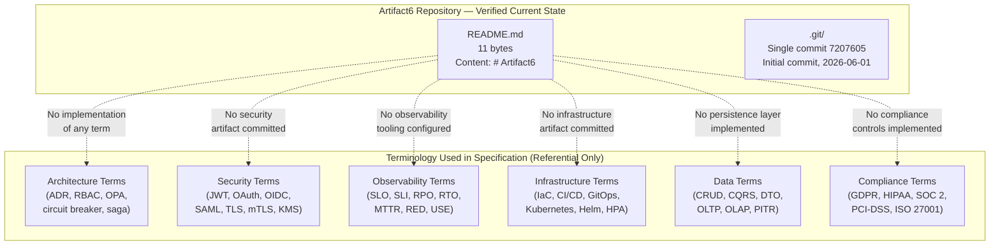
```mermaid
graph TB
    subgraph Current["Artifact6 Repository — Verified Current State"]
        README["README.md<br/>11 bytes<br/>Content: # Artifact6"]
        GitMeta[".git/<br/>Single commit 7207605<br/>Initial commit, 2026-06-01"]
    end

    subgraph TermsUsed["Terminology Used in Specification (Referential Only)"]
        ARCH["Architecture Terms<br/>(ADR, RBAC, OPA,<br/>circuit breaker, saga)"]
        SEC["Security Terms<br/>(JWT, OAuth, OIDC,<br/>SAML, TLS, mTLS, KMS)"]
        OBS["Observability Terms<br/>(SLO, SLI, RPO, RTO,<br/>MTTR, RED, USE)"]
        INFRA["Infrastructure Terms<br/>(IaC, CI/CD, GitOps,<br/>Kubernetes, Helm, HPA)"]
        DATA["Data Terms<br/>(CRUD, CQRS, DTO,<br/>OLTP, OLAP, PITR)"]
        COMP["Compliance Terms<br/>(GDPR, HIPAA, SOC 2,<br/>PCI-DSS, ISO 27001)"]
    end

    README -.->|"No implementation<br/>of any term"| ARCH
    README -.->|"No security<br/>artifact committed"| SEC
    README -.->|"No observability<br/>tooling configured"| OBS
    README -.->|"No infrastructure<br/>artifact committed"| INFRA
    README -.->|"No persistence layer<br/>implemented"| DATA
    README -.->|"No compliance<br/>controls implemented"| COMP
```

The dashed edges denote the absence of any path from the repository's sole tracked content to any concept defined in the glossary below. Glossary entries exist because the terms appear in prior sections of this specification — primarily in evidence-map tables, candidate-stack tables, and deferred-guidance subsections — not because the underlying technologies, patterns, or controls are present in the repository.

---

## 9.2 GLOSSARY

This glossary defines technical terms used within this Technical Specification. The selection criterion is strictly *internal*: every term defined below appears in Sections 1 through 8 of this document. The glossary is **not** an industry reference; it is a localized companion to the specification. Definitions follow industry-standard usage but are scoped to how the term is used in this document.

> **Important Reader Note.** Because the repository is empty of substantive artifacts (per Sections 1.1, 1.3.3.1, 2.2, 3.1, 4.1, 5.1, 6.1, 6.2, 6.3, 6.4, 6.5, 6.6, 7.1, and 8.1), the inclusion of a term below does **not** imply that the corresponding technology, pattern, or control is implemented in Artifact6. Many terms appear in the specification only within candidate-stack enumerations (Section 3.9) or deferred-guidance subsections (e.g., Section 6.4.x, Section 6.5.x, Section 8.12). Adoption of any term defined here requires committed repository artifacts that do not presently exist.

### 9.2.1 Architecture, Design, and Documentation-Methodology Terms

| Term | Definition (As Used in This Specification) |
|---|---|
| Architecture Decision Record (ADR) | A short, durable document that captures one architecturally significant decision, the context that motivated it, and the consequences of accepting it. Referenced in Sections 3.7.1, 8.4.1, 8.11.2, and 8.14.2 as a deferred deliverable; no `docs/adr/` directory exists in the repository. |
| Architecture style | The overarching pattern of organization for a system (e.g., monolithic, microservices, event-driven). Section 5 confirms that no architectural style has been declared for Artifact6. |
| Bootstrap phase | The initialization stage in which a repository contains only metadata and a placeholder (per Section 8.11.2). Artifact6 is in the bootstrap phase as of commit `7207605`. |
| Code Graph | A conceptual representation of code structure and relationships, referenced incidentally in repository-level summaries. No code graph artifacts are present in the repository. |
| Empty repository | A repository whose tracked content consists solely of a placeholder (such as a README heading) and contains no substantive engineering artifacts. The state Artifact6 is in. |
| Evidence map | The three-column tabular pattern (*Required Element*, *Evidence in Repository*, *Documentable?*) used throughout Sections 3, 4, 5, 6, 7, and 8 to anchor every documentation claim to verifiable repository content. |
| Evidence-only documentation | The governing methodology declared in Section 2.7.1: every claim must be grounded in repository evidence or authoritative user context; speculation is prohibited. |
| Forward Plan | A subsection appearing in every prior section that maps prospective repository changes to revision triggers for that section. |
| Inventory of absences | The documentation style introduced in Section 8.2 in which a section enumerates what is not present in the repository (with traceable anchors) rather than fabricating content. |
| MoSCoW prioritization | A requirements-prioritization framework (Must / Should / Could / Won't) referenced in the Section 2 requirements context. Not applied because no requirements exist. |
| Repository State Snapshot | The recurring Mermaid diagram pattern used to restate the verified repository inventory at the start or close of a section. Originated in Section 1.2.2.2 and reused in twelve subsequent sections. |
| Section-prompt fidelity | The constraint, declared explicitly in Sections 3.1.2, 5.1.2, 6.1.2, 6.2.2, 6.3.2, 6.4.2, 6.5.2, 6.6.2, 7.1.3, and 8.2, that authoring must omit elements not clearly applicable and document inventories of absences rather than fabricate content. |
| Traceability matrix | A mapping between requirements and the implementation, test, or design artifacts that satisfy them. Section 2.6 confirms an empty traceability matrix in the current revision. |
| Working tree | The set of files currently checked out from a Git repository's index. Assumption A-001 (Section 2.7.2) establishes the working tree at commit `7207605` as the authoritative source for this specification. |

### 9.2.2 Process, Workflow, and Diagram Terms

| Term | Definition (As Used in This Specification) |
|---|---|
| Flowchart | A diagram representing a workflow or process. Section 4 mandates per-feature flowcharts, all of which are marked "Not producible" in the current revision. |
| High-level system workflow | A diagram summarizing the principal pathways through a system. Marked "Not producible" in Section 4. |
| Mermaid / MermaidJS | The text-based diagramming syntax used throughout Sections 4, 5, 6, 7, and 8 of this specification. The Repository State Snapshot is the only Mermaid diagram producible in the current revision. |
| Process flowchart | A workflow diagram capturing user, system, and integration interactions. Subject matter of Section 4; not producible in the current revision. |
| Sequence diagram | A diagram showing time-ordered interactions between actors and components. Listed in Section 4 as one of five required diagram types; not producible. |
| State transition diagram | A diagram showing the states of an entity and the transitions between them. Listed in Section 4 as one of five required diagram types; not producible. |

### 9.2.3 Component, Persistence, and Integration Terms

| Term | Definition (As Used in This Specification) |
|---|---|
| AsyncAPI | A specification format for asynchronous, event-driven APIs. Referenced in Section 6.3 as deferred guidance; no AsyncAPI documents are committed. |
| Bulkhead pattern | A resilience pattern that isolates resource pools so that failures in one pool do not exhaust others. Referenced in Section 6.1 as deferred guidance. |
| Circuit breaker | A resilience pattern that interrupts calls to a failing dependency to prevent cascading failure. Referenced in Section 6.1 as deferred guidance. |
| Command Query Responsibility Segregation (CQRS) | An architectural pattern that separates read and write models. Referenced in Section 6.3 as deferred guidance. |
| Data Access Object (DAO) | An object that encapsulates the persistence-layer access pattern for a domain entity. Referenced in Section 6.3 as deferred guidance. |
| Data Transfer Object (DTO) | An object whose sole purpose is to carry data between processes or layers. Referenced in Section 6.3 as deferred guidance. |
| Dead Letter Queue (DLQ) | A queue that receives messages that cannot be processed successfully by their primary consumer. Referenced in Section 6.3 as deferred guidance. |
| Entity Relationship Diagram (ERD) | A diagram showing entities and the relationships among them. Referenced in Section 6.2; no ERD is producible in the current revision. |
| Event-driven architecture | A style in which components communicate primarily by emitting and consuming events. Referenced in Section 6.3 as deferred guidance. |
| Finite State Machine (FSM) | A computational model expressing entity lifecycle as a graph of states and transitions. Referenced in Section 6.3 as deferred guidance. |
| GraphQL Schema Definition Language (SDL) | The textual format for declaring GraphQL types, queries, mutations, and subscriptions. Referenced in Section 6.3 as deferred guidance. |
| Indexing strategies | Patterns for organizing index structures in a database engine, including B-Tree, GIN, GiST, and BRIN indexes. Referenced in Section 6.2 as deferred guidance. |
| Key-value store | A non-relational data store in which values are addressed by opaque keys. Referenced in Section 6.2 as deferred guidance. |
| Outbox pattern | A pattern that atomically writes domain events to an outbox table alongside business state, ensuring reliable downstream delivery. Referenced in Section 6.3 as deferred guidance. |
| Point-in-Time Recovery (PITR) | A backup strategy that allows database state to be restored to an arbitrary moment within a retention window. Referenced in Section 6.2 as deferred guidance. |
| Replication topology | The structural arrangement of database replicas; common topologies include active-active and active-passive. Referenced in Sections 6.2 and 8.4.3 as deferred guidance. |
| Saga pattern | A pattern that coordinates a distributed transaction as a sequence of local transactions with compensating actions. Referenced in Section 6.3 as deferred guidance. |
| Service discovery | The mechanism by which services locate each other dynamically in a distributed environment. Referenced in Section 6.1 as deferred guidance. |
| Time-Series Database (TSDB) | A database specialized for time-stamped numeric series. Referenced in Section 6.2 as deferred guidance. |

### 9.2.4 Security, Identity, and Privacy Terms

| Term | Definition (As Used in This Specification) |
|---|---|
| Attribute-Based Access Control (ABAC) | An authorization model in which access decisions are based on attributes of the subject, resource, action, and environment. Referenced in Section 6.4 as deferred guidance. |
| Break-glass / emergency-access role | A heavily audited role granting elevated privileges for emergencies. Referenced in Section 8.12.1 as deferred guidance. |
| Content Security Policy (CSP) | An HTTP-response-header mechanism that restricts the sources from which a browser may load resources. Referenced in Sections 6.4 and 8.12.2 as deferred guidance. |
| Dynamic Application Security Testing (DAST) | Security testing performed against a running application. Referenced in Sections 6.4 and 6.6 as deferred guidance. |
| HashiCorp Vault | A secrets-management product referenced in Section 6.4 as deferred guidance; no Vault references exist in the repository. |
| HTTP Strict Transport Security (HSTS) | An HTTP-response-header mechanism that instructs browsers to use HTTPS exclusively. Referenced in Section 6.4 as deferred guidance. |
| JSON Web Key Set (JWKS) | A standard JSON structure that publishes the cryptographic keys used to sign JWTs. Referenced in Section 6.4 as deferred guidance. |
| JSON Web Token (JWT) | A compact, URL-safe token format used to convey claims between parties. Referenced in Sections 3.5.3 and 6.4 as deferred guidance. |
| Key Management Service (KMS) | A managed service for creating, rotating, and using cryptographic keys. Referenced in Sections 6.4, 8.12.1, and 8.12.2 as deferred guidance. |
| Least-privilege principle | The security principle of granting subjects only the minimum permissions required. Referenced in Section 8.12.1 as deferred guidance. |
| Mutual TLS (mTLS) | A variant of TLS in which both client and server authenticate via certificates. Referenced in Section 6.4 as deferred guidance. |
| Open Policy Agent (OPA) | A general-purpose policy engine using the Rego policy language. Referenced in Sections 6.4, 8.2.1, and 8.8.2 as deferred guidance. |
| OpenID Connect (OIDC) | An identity layer built atop OAuth 2.0 used for federated authentication. Referenced in Sections 3.5.3, 6.4, and 8.12.2 as deferred guidance. |
| Personally Identifiable Information (PII) | Data that can be used to identify a natural person. Referenced in Section 6.4 as deferred guidance. |
| Policy Administration Point (PAP) | The location at which authorization policies are authored. Referenced in Section 6.4 as deferred guidance. |
| Policy Decision Point (PDP) | The component that evaluates an authorization request against policy. Referenced in Section 6.4 as deferred guidance. |
| Policy Enforcement Point (PEP) | The component that intercepts a request and consults the PDP. Referenced in Section 6.4 as deferred guidance. |
| Policy Information Point (PIP) | A source of attributes used by the PDP. Referenced in Section 6.4 as deferred guidance. |
| Policy-Based Access Control (PBAC) | An authorization model in which access is governed by formally expressed policies. Referenced in Section 6.4 as deferred guidance. |
| Rego | The policy language used by Open Policy Agent. Referenced in Section 6.4 as deferred guidance. |
| Relationship-Based Access Control (ReBAC) | An authorization model that evaluates relationships between subjects and resources. Referenced in Section 6.4 as deferred guidance. |
| Role-Based Access Control (RBAC) | An authorization model in which permissions are assigned to roles, and subjects acquire permissions through role membership. Referenced in Section 6.4 as deferred guidance. |
| Secret scanning | The automated detection of credentials inadvertently committed to source code. Referenced in Sections 6.4, 6.6.3.4, and 8.8.2 as deferred guidance. |
| Software Bill of Materials (SBOM) | A formal inventory of components included in a software artifact. Referenced in Sections 3.10.1 and 8.5.2 as deferred guidance. |
| Software Composition Analysis (SCA) | Tooling that inventories dependencies and identifies known vulnerabilities. Referenced in Sections 6.4 and 6.6 as deferred guidance. |
| Static Application Security Testing (SAST) | Security testing performed against source code or compiled artifacts without execution. Referenced in Sections 6.4 and 6.6 as deferred guidance. |
| Subresource Integrity (SRI) | A browser mechanism that verifies the integrity of fetched assets via cryptographic hashes. Referenced in Section 8.12.2 as deferred guidance. |
| Time-based One-Time Password (TOTP) | A second-factor authentication scheme that generates short-lived codes based on a shared secret and the current time. Referenced in Section 6.4 as deferred guidance. |
| Transport Layer Security (TLS) | The cryptographic protocol securing network communications. Referenced in Sections 6.4 and 8.4.3 as deferred guidance. |
| WebAuthn / FIDO2 | A W3C standard for public-key-based authentication with hardware authenticators. Referenced in Section 6.4 as deferred guidance. |

### 9.2.5 Reliability, Operations, and Observability Terms

| Term | Definition (As Used in This Specification) |
|---|---|
| Application Performance Monitoring (APM) | The continuous observation of application-level metrics, traces, and errors. Referenced in Sections 5.5.1 and 8.8 as deferred guidance. |
| Burn-rate alert | An alerting strategy that fires when the rate of error-budget consumption exceeds a threshold. Referenced in Section 6.5 as deferred guidance. |
| Disaster recovery plan | A documented plan for restoring service after a catastrophic event. Referenced in Sections 5.5.6 and 8.3.2 as deferred guidance. |
| Error budget | The complement of an SLO; the portion of unreliability that is tolerated in a measurement window. Referenced in Sections 5.5.5, 6.5, and 8.2.1 as deferred guidance. |
| Health-check endpoint | An endpoint exposed by a service to report its operational status. Referenced in Sections 6.5 and 8.12.2 as deferred guidance. |
| Incident-response playbook | A documented procedure for responding to incidents of a specific class. Referenced in Sections 4.4.2, 5.5.6, and 8.3.2 as deferred guidance. |
| Mean Time Between Failures (MTBF) | The average time between successive failures of a system. Referenced in Section 6.5 as deferred guidance. |
| Mean Time To Repair / Recover (MTTR) | The average time required to restore service after a failure. Referenced in Section 6.5 as deferred guidance. |
| OpenTelemetry | A vendor-neutral framework for telemetry instrumentation. Referenced in Section 8.8.1 as deferred guidance. |
| Real User Monitoring (RUM) | Telemetry collected from actual user sessions in production. Referenced in Section 8.8.1 as deferred guidance. |
| Recovery Point Objective (RPO) | The maximum tolerable amount of data loss measured in time. Referenced in Sections 5.5.6, 8.1.1, and 8.3.2 as deferred guidance. |
| Recovery Time Objective (RTO) | The maximum tolerable duration of service unavailability after a failure. Referenced in Sections 5.5.6, 8.1.1, and 8.3.2 as deferred guidance. |
| RED method | An observability methodology focused on Rate, Errors, and Duration of service requests. Referenced in Section 6.5 as deferred guidance. |
| Runbook | A documented operational procedure for routine and exceptional events. Referenced in Sections 4.4.2, 5.5.6, 6.5, 8.3.2, and 8.14.2 as deferred guidance. |
| Service-Level Agreement (SLA) | A contractual reliability commitment to consumers of a service. Referenced in Sections 5.5.5 and 8.12 as deferred guidance. |
| Service-Level Indicator (SLI) | A measurable signal that quantifies an aspect of service quality. Referenced in Section 6.5 as deferred guidance. |
| Service-Level Objective (SLO) | A target value or range for an SLI. Referenced in Sections 5.5.1, 5.5.5, 6.5, and 8.11 as deferred guidance. |
| Synthetic monitoring | The execution of scripted probes against a system to measure availability and performance. Referenced in Section 8.8.1 as deferred guidance. |
| USE method | An observability methodology focused on Utilization, Saturation, and Errors of system resources. Referenced in Section 6.5 as deferred guidance. |

### 9.2.6 Testing Terms

| Term | Definition (As Used in This Specification) |
|---|---|
| Code coverage | The proportion of source code exercised by an automated test suite. Referenced in Section 6.6 as deferred guidance. |
| End-to-end (E2E) tests | Tests that exercise a complete user-facing pathway through the system. Referenced in Section 6.6 as deferred guidance. |
| Integration tests | Tests that verify the interaction between two or more components. Referenced in Section 6.6 as deferred guidance. |
| Load testing tools | Tools such as k6, Gatling, Locust, and JMeter referenced in Sections 6.1.4.3 and 8.12.3 as deferred guidance. |
| Smoke tests | Lightweight tests that confirm the most critical functionality is operational. Referenced in Sections 6.6.4.3 and 8.7.2 as deferred guidance. |
| Test pyramid | A conceptual model proposing many unit tests, fewer integration tests, and a smaller number of E2E tests. Referenced in Section 6.6 as deferred guidance. |
| Unit tests | Tests that verify a single unit of behavior in isolation from collaborators. Referenced in Section 6.6 as deferred guidance. |

### 9.2.7 Infrastructure, Containerization, and DevOps Terms

| Term | Definition (As Used in This Specification) |
|---|---|
| API Gateway | A reverse-proxy component that mediates ingress to backend services. Referenced in Sections 6.3.5.3 and 8.6.1 as deferred guidance. |
| Blue-green deployment | A release strategy that maintains two parallel environments and shifts traffic atomically. Referenced in Sections 8.2.1 and 8.7.2 as deferred guidance. |
| Canary deployment | A release strategy that exposes a new version to a small fraction of traffic before broader rollout. Referenced in Sections 8.2.1 and 8.7.2 as deferred guidance. |
| Click-ops | The anti-pattern of performing infrastructure changes via console UI rather than declarative IaC. Referenced in Section 8.12.1 as deferred guidance. |
| Cluster Autoscaler | A Kubernetes controller that adjusts cluster node count based on unschedulable pods. Referenced in Section 8.6.2 as deferred guidance. |
| Container | An OS-level virtualization unit packaging an application with its dependencies. Referenced in Sections 3.7.3 and 8.5 as deferred guidance. |
| Container runtime | The software that executes containers (e.g., Docker Engine, containerd, Podman, CRI-O). Referenced in Sections 8.2.1 and 8.5.1 as deferred guidance. |
| Containerization | The packaging of applications into containers. Referenced in Sections 3.7.3 and 8.5 as deferred guidance. |
| Continuous Integration / Continuous Delivery (CI/CD) | The practice of automating build, test, and release of software. Referenced in Sections 3.7.5 and 8.7 as deferred guidance. |
| Edge deployment | A deployment strategy that locates compute close to end users at network edge locations. Referenced in Section 8.3.1 as deferred guidance. |
| FinOps | The discipline of cloud financial management. Referenced in Sections 6.1.4.2, 8.8.2, and 8.12.2 as deferred guidance. |
| GitOps | A delivery methodology in which a Git repository is the single source of truth for declarative system state. Referenced in Sections 8.2.1 and 8.7.2 as deferred guidance. |
| Horizontal Pod Autoscaler (HPA) | A Kubernetes controller that scales pod replicas based on observed metrics. Referenced in Sections 8.2.1 and 8.6.2 as deferred guidance. |
| Image registry | A storage service for container images. Referenced in Sections 8.5.1 and 8.10 as deferred guidance. |
| Infrastructure as Code (IaC) | The practice of provisioning infrastructure through declarative or imperative code. Referenced in Sections 3.7.4, 8.3.2, and 8.12.1 as deferred guidance. |
| Ingress controller | A Kubernetes component that fulfills `Ingress` resources by configuring an edge router. Referenced in Sections 6.3.5.3 and 8.6.1 as deferred guidance. |
| Multi-stage build | A Docker build technique that uses multiple `FROM` instructions to minimize final-image surface. Referenced in Sections 8.2.1 and 8.12.2 as deferred guidance. |
| Orchestration | The automated coordination of containerized workloads across hosts. Referenced in Sections 3.7.3 and 8.6 as deferred guidance. |
| Reserved Instances / Savings Plans / Committed-Use Discounts | Cloud-provider pricing programs that exchange usage commitments for discounts. Referenced in Sections 6.1.4.2 and 8.4.3 as deferred guidance. |
| Rolling update | A release strategy that replaces instances incrementally. Referenced in Section 8.7.2 as deferred guidance. |
| Service mesh | A dedicated infrastructure layer for service-to-service communication, often based on sidecar proxies. Referenced in Sections 3.7.3 and 8.6.1 as deferred guidance. |
| Spot / Preemptible instances | Discounted compute capacity that may be reclaimed by the provider with short notice. Referenced in Section 8.4.3 as deferred guidance. |
| Supply-chain Levels for Software Artifacts (SLSA) | A framework for software-supply-chain integrity. Referenced in Section 8.7.1 as deferred guidance. |
| Traffic shadowing | A release strategy that copies production traffic to a new version for validation without affecting users. Referenced in Section 8.7.2 as deferred guidance. |
| Vertical Pod Autoscaler (VPA) | A Kubernetes controller that adjusts pod resource requests. Referenced in Sections 8.2.1 and 8.6.2 as deferred guidance. |

### 9.2.8 Compliance and Regulatory Terms

| Term | Definition (As Used in This Specification) |
|---|---|
| California Consumer Privacy Act / California Privacy Rights Act (CCPA / CPRA) | Californian privacy statutes referenced in Section 6.4 as deferred guidance. |
| FedRAMP | The U.S. Federal Risk and Authorization Management Program for cloud-service security assessment. Referenced in Section 6.4 as deferred guidance. |
| General Data Protection Regulation (GDPR) | The European Union regulation governing the processing of personal data. Referenced in Sections 6.4.5.5 and 8.3.1 as deferred guidance. |
| Health Insurance Portability and Accountability Act (HIPAA) | U.S. statute governing protected health information. Referenced in Sections 6.4.5.5 and 8.3.1 as deferred guidance. |
| ISO/IEC 27001 | An international standard for information-security management systems. Referenced in Sections 6.4.5.5 and 8.3.1 as deferred guidance. |
| NIST Cybersecurity Framework (NIST CSF) | A voluntary framework published by the U.S. National Institute of Standards and Technology. Referenced in Section 6.4 as deferred guidance. |
| Payment Card Industry Data Security Standard (PCI-DSS) | The data-security standard governing the handling of payment-card data. Referenced in Sections 6.4.5.5 and 8.3.1 as deferred guidance. |
| Service Organization Control 2 (SOC 2) | The AICPA-defined audit framework for service organizations. Referenced in Sections 6.4.5.5 and 8.3.1 as deferred guidance. |
| Web Content Accessibility Guidelines (WCAG) | W3C recommendations for making web content accessible. Referenced in Section 7 as deferred guidance. |

### 9.2.9 Versioning and Release-Management Terms

| Term | Definition (As Used in This Specification) |
|---|---|
| CalVer (Calendar Versioning) | A versioning scheme in which the version reflects the release date. Referenced in Section 8.11.2 as deferred guidance. |
| Conventional Commits | A specification for commit-message format that enables automated changelog and version generation. Referenced in Section 8.7.2 as deferred guidance. |
| Lockfile | A file that pins exact resolved versions of dependencies for deterministic installs. Referenced in Section 8.11.2 as deferred guidance. |
| Semantic Versioning (SemVer 2.0.0) | A versioning scheme using `MAJOR.MINOR.PATCH` to communicate the nature of changes. Referenced in Section 8.11.2 as deferred guidance. |
| SOURCE_DATE_EPOCH | An environment-variable convention used to produce deterministic, reproducible builds. Referenced in Section 8.5.2 as deferred guidance. |
| ZeroVer | A versioning convention that holds `MAJOR` at zero to signal pre-1.0 instability. Referenced in Section 8.11.2 as deferred guidance. |

---

## 9.3 ACRONYMS

This appendix expands every acronym used in this Technical Specification. Acronyms are organized by the domain in which they primarily appear in the document. Where an acronym appears in multiple domains, it is listed under its primary domain with cross-domain notations. Acronyms appearing only inside the **candidate technology stack** (Section 3.9) are flagged accordingly to remind readers that the underlying technology is not adopted in the repository.

> **Important Reader Note.** Inclusion of an acronym below does **not** imply that the corresponding technology, framework, or control is implemented in Artifact6. Many acronyms appear in this document solely as references inside candidate-stack tables (Section 3.9) or deferred-guidance subsections (Sections 6.4, 6.5, 8.12). The repository at commit `7207605` contains only `README.md` and no implementation surface.

### 9.3.1 Architecture, Methodology, and Documentation Acronyms

| Acronym | Expansion |
|---|---|
| ADR | Architecture Decision Record |
| API | Application Programming Interface |
| BRD | Business Requirements Document |
| KPI | Key Performance Indicator |
| MoSCoW | Must have / Should have / Could have / Won't have (prioritization) |
| NFR | Non-Functional Requirement |
| PRD | Product Requirements Document |
| SDK | Software Development Kit |
| UI | User Interface |
| UX | User Experience |

### 9.3.2 Cloud Provider and Cloud-Service Acronyms (Candidate Stack — NOT ADOPTED)

The acronyms below appear primarily within the candidate-stack discussion in Section 3.9 and the standard infrastructure practices enumerated in Section 8.12. None of the underlying services is configured in the repository.

| Acronym | Expansion |
|---|---|
| ACR | Azure Container Registry |
| AKS | Azure Kubernetes Service |
| ALB | Application Load Balancer |
| AWS | Amazon Web Services |
| AZ | Availability Zone |
| CDK | Cloud Development Kit |
| CDKTF | Cloud Development Kit for Terraform |
| CDN | Content Delivery Network |
| DOKS | DigitalOcean Kubernetes Service |
| EBS | Elastic Block Store |
| EC2 | Elastic Compute Cloud |
| ECR | Elastic Container Registry |
| ECS | Elastic Container Service |
| EFS | Elastic File System |
| EKS | Elastic Kubernetes Service |
| GAR | Google Artifact Registry |
| GCE | Google Compute Engine |
| GCP | Google Cloud Platform |
| GCS | Google Cloud Storage |
| GHCR | GitHub Container Registry |
| GKE | Google Kubernetes Engine |
| IAM | Identity and Access Management |
| LKE | Linode Kubernetes Engine |
| MSK | (Amazon) Managed Streaming for Apache Kafka |
| NACL | Network Access Control List |
| OCI | Oracle Cloud Infrastructure (also: Open Container Initiative — see 9.3.4) |
| RDS | (Amazon) Relational Database Service |
| S3 | (Amazon) Simple Storage Service |
| SNS | (Amazon) Simple Notification Service |
| SQS | (Amazon) Simple Queue Service |
| VMSS | (Azure) Virtual Machine Scale Sets |
| VPC | Virtual Private Cloud |

### 9.3.3 CI/CD, IaC, and DevOps Acronyms

| Acronym | Expansion |
|---|---|
| CI/CD | Continuous Integration / Continuous Delivery |
| GitOps | Git Operations (delivery methodology with Git as source of truth) |
| IaC | Infrastructure as Code |
| OIDC | OpenID Connect (used in this context for CI-to-cloud federation; see also 9.3.5) |
| PR | Pull Request |
| SLSA | Supply-chain Levels for Software Artifacts |

### 9.3.4 Containerization and Orchestration Acronyms

| Acronym | Expansion |
|---|---|
| CRD | Custom Resource Definition (Kubernetes) |
| CRI-O | Container Runtime Interface for OCI |
| HPA | Horizontal Pod Autoscaler |
| K8s | Kubernetes |
| KEDA | Kubernetes Event-Driven Autoscaler |
| OCI | Open Container Initiative (also: Oracle Cloud Infrastructure — see 9.3.2) |
| OPA | Open Policy Agent |
| UBI | Universal Base Image |
| VPA | Vertical Pod Autoscaler |

### 9.3.5 Security and Identity Acronyms

| Acronym | Expansion |
|---|---|
| ABAC | Attribute-Based Access Control |
| CSP | Content Security Policy (browser); also Cloud Service Provider |
| CVE | Common Vulnerabilities and Exposures |
| DAST | Dynamic Application Security Testing |
| FIDO2 | Fast IDentity Online 2 |
| HSTS | HTTP Strict Transport Security |
| JWKS | JSON Web Key Set |
| JWT | JSON Web Token |
| KMS | Key Management Service |
| MFA | Multi-Factor Authentication |
| mTLS | Mutual Transport Layer Security |
| OAuth | Open Authorization |
| OIDC | OpenID Connect |
| PAP | Policy Administration Point |
| PBAC | Policy-Based Access Control |
| PDP | Policy Decision Point |
| PEP | Policy Enforcement Point |
| PII | Personally Identifiable Information |
| PIP | Policy Information Point |
| RBAC | Role-Based Access Control |
| ReBAC | Relationship-Based Access Control |
| SAML | Security Assertion Markup Language |
| SAST | Static Application Security Testing |
| SBOM | Software Bill of Materials |
| SCA | Software Composition Analysis |
| SPDX | Software Package Data Exchange |
| SRI | Subresource Integrity |
| TLS | Transport Layer Security |
| TOTP | Time-based One-Time Password |

### 9.3.6 Reliability and Observability Acronyms

| Acronym | Expansion |
|---|---|
| APM | Application Performance Monitoring |
| DLQ | Dead Letter Queue |
| DR | Disaster Recovery |
| MTBF | Mean Time Between Failures |
| MTTR | Mean Time To Repair / Recover |
| RED | Rate, Errors, Duration |
| RPO | Recovery Point Objective |
| RTO | Recovery Time Objective |
| RUM | Real User Monitoring |
| SLA | Service-Level Agreement |
| SLI | Service-Level Indicator |
| SLO | Service-Level Objective |
| USE | Utilization, Saturation, Errors |

### 9.3.7 Data, Persistence, and Integration Acronyms

| Acronym | Expansion |
|---|---|
| AMQP | Advanced Message Queuing Protocol |
| BRIN | Block Range INdex |
| CQRS | Command Query Responsibility Segregation |
| CRUD | Create, Read, Update, Delete |
| DAO | Data Access Object |
| DDL | Data Definition Language |
| DTO | Data Transfer Object |
| ERD | Entity Relationship Diagram |
| ETL | Extract, Transform, Load |
| FSM | Finite State Machine |
| GIN | Generalized Inverted Index |
| GiST | Generalized Search Tree |
| MQTT | Message Queuing Telemetry Transport |
| OLAP | Online Analytical Processing |
| OLTP | Online Transaction Processing |
| PITR | Point-In-Time Recovery |
| SDL | Schema Definition Language (GraphQL) |
| TSDB | Time-Series Database |

### 9.3.8 Compliance and Regulatory Acronyms

| Acronym | Expansion |
|---|---|
| CCPA | California Consumer Privacy Act |
| CPRA | California Privacy Rights Act |
| GDPR | General Data Protection Regulation |
| HIPAA | Health Insurance Portability and Accountability Act |
| ISO/IEC | International Organization for Standardization / International Electrotechnical Commission |
| NIST CSF | National Institute of Standards and Technology Cybersecurity Framework |
| PCI-DSS | Payment Card Industry Data Security Standard |
| SOC 2 | Service Organization Control 2 |
| WCAG | Web Content Accessibility Guidelines |

### 9.3.9 General Technology, File-Format, and Platform Acronyms

| Acronym | Expansion |
|---|---|
| ARM64 | Advanced RISC Machines (64-bit architecture) |
| CSS | Cascading Style Sheets |
| HTML | HyperText Markup Language |
| JS | JavaScript |
| JSON | JavaScript Object Notation |
| YAML | YAML Ain't Markup Language |

---

## 9.4 CROSS-REFERENCES TO PRIOR SECTIONS

Consistent with the cross-reference convention established in Sections 4.6, 5.6, 7.5, and 8.13, the table below maps Appendices topics to the authoritative sections where the original (non-derivative) determinations are recorded. The Appendices contains no new evidence; every claim here is anchored to a prior section.

### 9.4.1 Cross-References for Additional Technical Information

| Appendix Topic | Authoritative Section(s) |
|---|---|
| Repository administrative metadata | Section 1.1.1, Section 1.1.3, Section 1.3.3.1, Section 8.1.1 |
| Documentation methodology conventions | Section 2.7.1, Section 3.1.2, Section 5.1.2, Section 6.1.2, Section 8.2 |
| Identifier format conventions | Section 2 (Feature/Requirement IDs), Section 2.7.2 (Assumption IDs) |
| Documentation assumptions (A-001, A-002, A-003) | Section 2.7.2 |
| Candidate technology stack | Section 3.9 (and its caveats subsection 3.9.6) |
| Repository State Snapshot pattern origin | Section 1.2.2.2 (and twelve subsequent reuse points) |

### 9.4.2 Cross-References for Glossary Terms

| Term Category | Authoritative Section(s) |
|---|---|
| Architecture, methodology, documentation | Sections 2.7.1, 3.7.1, 5, 8.4.1, 8.11.2 |
| Process, workflow, diagrams | Sections 4.2–4.5 |
| Components, persistence, integration | Sections 6.1, 6.2, 6.3 |
| Security, identity, privacy | Sections 3.5.3, 6.4, 8.12.1, 8.12.2 |
| Reliability, operations, observability | Sections 5.5.1, 5.5.5, 5.5.6, 6.5, 8.8.1, 8.8.2 |
| Testing | Sections 6.6, 8.7.2 |
| Infrastructure, containerization, DevOps | Sections 3.7.3, 3.7.4, 3.7.5, 8.5, 8.6, 8.7, 8.12 |
| Compliance, regulatory | Sections 6.4.5.5, 8.3.1, Section 7 |
| Versioning, release management | Sections 8.5.2, 8.7.2, 8.11.2 |

### 9.4.3 Cross-References for Acronym Domains

| Acronym Domain | Authoritative Section(s) |
|---|---|
| Architecture, methodology, documentation | Sections 1.1, 2, 2.7.2, 3.7.1 |
| Cloud providers and services | Section 3.9, Section 8.4, Section 8.5, Section 8.6, Section 8.10 |
| CI/CD, IaC, DevOps | Sections 3.7.4, 3.7.5, 8.7, 8.12.2 |
| Containerization and orchestration | Sections 3.7.3, 8.2.1, 8.5, 8.6 |
| Security and identity | Sections 3.5.3, 3.10, 6.4, 8.12 |
| Reliability and observability | Sections 5.5, 6.5, 8.8 |
| Data, persistence, integration | Sections 6.2, 6.3 |
| Compliance and regulatory | Sections 6.4.5.5, 7, 8.3.1 |

---

## 9.5 SECTION VERSIONING

Consistent with the section-versioning pattern established in Sections 2.7.3, 3.11.3, 4.9, 5.9, 6.1.10, 6.2.11, 6.3.10, 6.4.11, 6.5.11, 6.6.11, 7.7, and 8.15, the table below records the revision history of Section 9 against the repository state at each revision.

| Version | Date | Repository Commit | Notable State |
|---|---|---|---|
| 1.0 | 2026-06-01 | `7207605` | Empty repository; appendix documents authoring conventions, assumption catalog, candidate-stack reaffirmation, and complete glossary and acronym inventories drawn from prior sections. All glossary and acronym entries denote terminology used elsewhere in this specification; none implies adoption of the underlying technology, pattern, or control. |

Subsequent versions of this section should be authored when material changes to the repository introduce new terminology to prior sections that does not yet appear in the glossary or acronym tables, or when a previously deferred technology, pattern, or control transitions from candidate or deferred-guidance status into adopted status (which will be evidenced by committed artifacts plus an Architecture Decision Record).

---

## 9.6 SECTION REVISION TRIGGERS

Consistent with the forward-plan pattern established in Sections 2.8, 3.11, 4.8, 5.8, 6.x.9, 7.6, and 8.14, the table below maps repository changes that warrant re-authoring of subsections of the Appendices.

| Trigger Event | Affected Subsection(s) | Required Authoring Action |
|---|---|---|
| New section, subsection, or table is added to Sections 1–8 introducing a previously undefined term | 9.2 Glossary | Add the new term with a definition scoped to its in-document usage and a cross-reference to the introducing section |
| New section, subsection, or table is added to Sections 1–8 introducing a previously undefined acronym | 9.3 Acronyms | Add the acronym to the appropriate domain table; add cross-domain notations where applicable |
| Repository commits adopt a candidate-stack component (e.g., `Dockerfile`, `*.tf`, `pyproject.toml`, or `package.json` with React) | 9.1.5 Candidate Technology Stack Reference | Move the adopted component out of the candidate-stack table; cite the relevant manifest and ADR as evidence of adoption |
| New documentation assumption is recorded in Section 2.7.2 | 9.1.4 Documentation Assumptions Catalog | Reproduce the new assumption with its validity condition |
| New recurring authoring convention is introduced in any section | 9.1.2 Documentation Methodology Conventions | Add the convention to the recurring-subsection-patterns table |
| Repository transitions out of the bootstrap phase (substantive artifacts are committed) | 9.1.1, 9.1.6, 9.2 reader notes, 9.3 reader notes | Re-evaluate every "deferred guidance" qualifier; re-classify each term as *referential* or *implemented* with citation to the committed artifact |
| Section heading numbering is restructured in Sections 1–8 | 9.4 Cross-References | Update authoritative-section anchors throughout the cross-reference tables |

---

## 9.7 REFERENCES

This appendix integrates content from prior sections of the Technical Specification and from the verified repository state. Consistent with the references-subsection pattern established in Sections 3.12, 4.10, 5.10, 7.8, and 8.16, the lists below enumerate the sources consulted during authoring.

### 9.7.1 Files Examined

- `README.md` — The sole tracked file in the Artifact6 repository at commit `7207605`. 11-byte content (`# Artifact6`) verified consistent with the citation in Section 1.1.1 and Section 8.1.1. Used as the universal anchor for repository state in this appendix.

### 9.7.2 Folders Explored

- `/` (repository root, depth 0) — Confirmed to contain only `README.md` and `.git/` metadata, with no subdirectories. Consistent with the inventory in Section 1.3.3.1 and Section 8.1.1.

### 9.7.3 Cross-Referenced Specification Sections

| Section | Use in Appendix |
|---|---|
| 1.1 EXECUTIVE SUMMARY | Repository identity, commit `7207605`, committer, 2026-06-01 commit date, 11-byte README content |
| 1.2 SYSTEM OVERVIEW | Repository State Snapshot diagram pattern origin |
| 1.3 SCOPE | Verified Repository Facts table; evidence-map methodology |
| 2.7 DOCUMENTATION CONSTRAINTS AND ASSUMPTIONS | Evidence-only constraint (2.7.1); Assumptions A-001, A-002, A-003 (2.7.2); section-versioning template (2.7.3) |
| 2.8 FORWARD PLAN | Trigger-table template adopted by 9.6 |
| 3.7 DEVELOPMENT & DEPLOYMENT | Container, IaC, CI/CD terminology origin |
| 3.9 CANDIDATE TECHNOLOGY STACK (PROPOSED, NOT YET ADOPTED) | Candidate-stack enumeration reproduced in 9.1.5; non-adoption caveats from 3.9.6 |
| 3.10 SECURITY IMPLICATIONS OF (NON-)SELECTIONS | SBOM and security-implication terminology |
| 4.5 REQUIRED DIAGRAMS STATUS | Diagram-type terminology (flowchart, sequence, state-transition, system workflow) |
| 5.5 CROSS-CUTTING CONCERNS EVIDENCE MAP | Reliability and observability terminology (RPO, RTO, SLA, SLO, APM) |
| 6.1 Core Services Architecture | Service-discovery, circuit-breaker, bulkhead terminology |
| 6.2 Database Design | Persistence and indexing terminology (CRUD, DDL, ETL, OLTP, OLAP, PITR, B-Tree, GIN, GiST, BRIN, TSDB) |
| 6.3 Integration Architecture | Integration and messaging terminology (CQRS, DTO, DAO, FSM, DLQ, AsyncAPI, GraphQL SDL, AMQP, MQTT, API Gateway) |
| 6.4 Security Architecture | Comprehensive security terminology and standard-practices template |
| 6.5 Monitoring and Observability | Observability terminology (SLI, MTTR, MTBF, error budget, burn rate, RED, USE) |
| 6.6 Testing Strategy | Testing terminology (unit, integration, E2E, smoke, code coverage, test pyramid) |
| 7.1 Applicability Determination | UI/UX and accessibility (WCAG) terminology |
| 8.1 AUTHORITATIVE STATE DECLARATION | Repository state baseline; "Not Applicable" determination |
| 8.2 SECTION-PROMPT FIDELITY CONSTRAINT | Comprehensive infrastructure-tool terminology referenced in glossary and acronyms |
| 8.5 CONTAINERIZATION EVIDENCE MAP | Container image, registry, scanning terminology |
| 8.6 ORCHESTRATION EVIDENCE MAP | Kubernetes, Helm, Kustomize, HPA, VPA, KEDA, Cluster Autoscaler terminology |
| 8.7 CI/CD PIPELINE EVIDENCE MAP | CI/CD, GitOps, SLSA, conventional commits, release tooling terminology |
| 8.8 INFRASTRUCTURE MONITORING EVIDENCE MAP | Cloud-monitoring, FinOps, compliance-monitoring terminology |
| 8.10 REPOSITORY STATE SNAPSHOT | Mermaid diagram pattern reproduced in 9.1.6 |
| 8.11 MINIMAL BUILD AND DISTRIBUTION REQUIREMENTS | Versioning terminology (SemVer, CalVer, ZeroVer, lockfile, bootstrap phase) |
| 8.12 STANDARD INFRASTRUCTURE PRACTICES FOR FUTURE ADOPTION | Comprehensive deferred-practice terminology |
| 8.13 CROSS-REFERENCES TO PRIOR SECTIONS | Cross-reference table template adopted by 9.4 |
| 8.15 SECTION VERSIONING | Section-versioning row template adopted by 9.5 |

### 9.7.4 Filesystem Searches Conducted

No new filesystem searches were conducted during the authoring of the Appendices. The repository inventory has been authoritatively established by Sections 1.3.3.1 and 8.1.1 (both of which conducted file-tree enumeration and reported the same single-file result). Re-conducting those searches would have produced duplicate evidence under Assumption A-001.

### 9.7.5 Authoring Notes

The Appendices is one of the few sections in this specification whose content is substantively *producible* against the current repository state. This is because the section documents terminology and conventions that appear *in this document itself* — and the document, unlike the repository, is rich in references to technologies, patterns, and controls. Every glossary and acronym entry above is anchored to a section in which the term or acronym appears; no industry-reference content has been introduced outside the boundaries of in-document usage. This authoring discipline aligns the Appendices with the evidence-only documentation constraint of Section 2.7.1 by treating "appearance in this specification" as the relevant evidentiary surface for terminology entries, while preserving the empty-repository framing of every prior section through the explicit reader notes in 9.2 and 9.3.